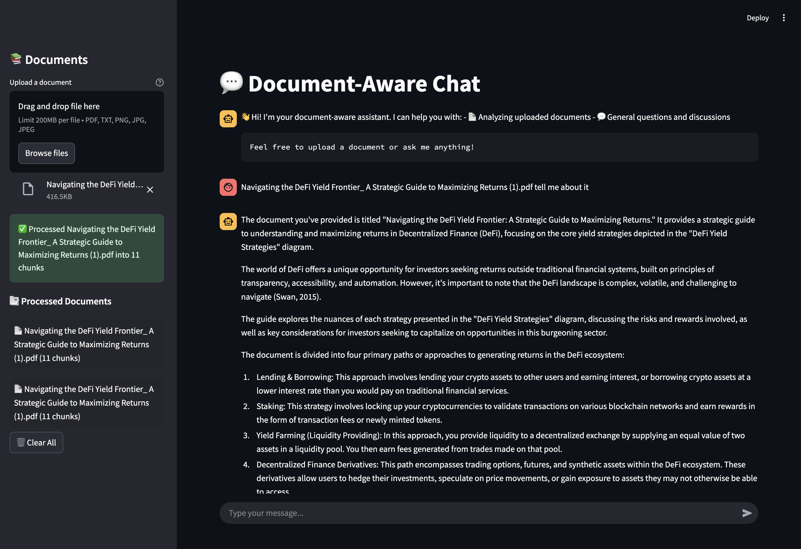
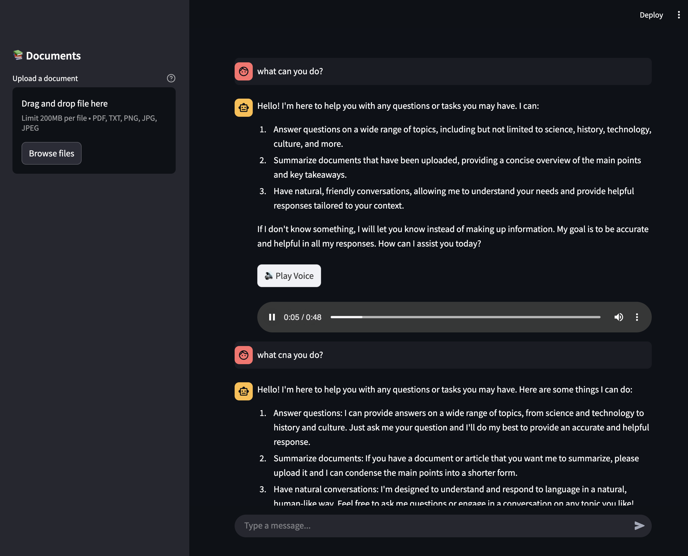
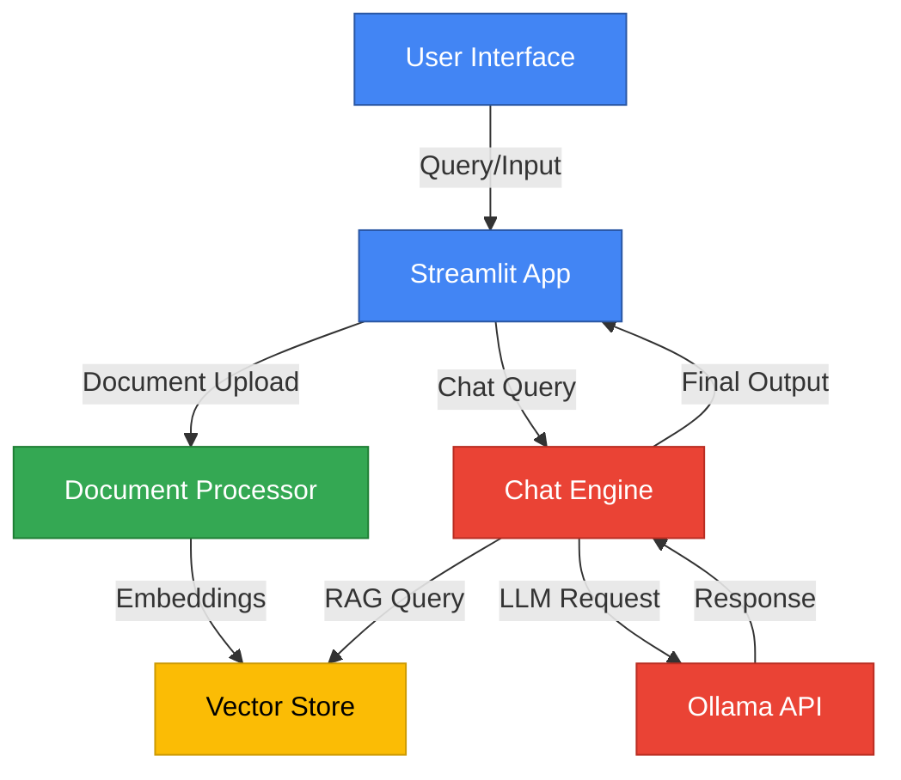
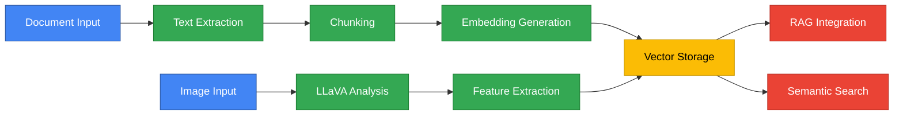
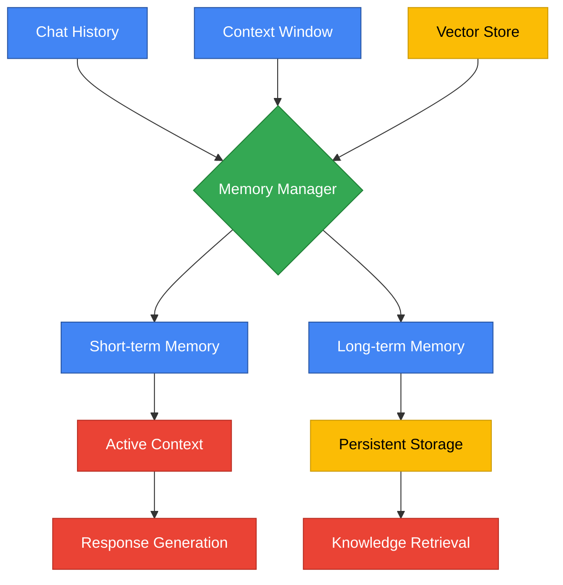
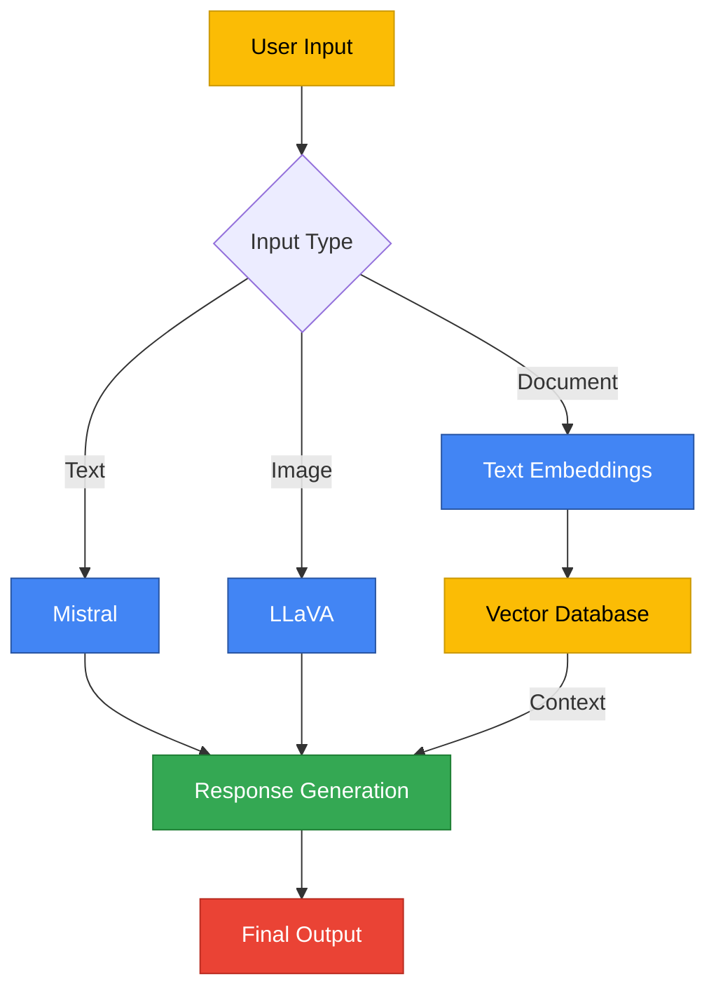

# BasicChat: Your Intelligent Local AI Assistant

## Overview
BasicChat is a privacy-focused AI assistant that runs locally using Ollama. It features RAG (Retrieval Augmented Generation), multi-modal processing, and smart tools - all through a clean Streamlit interface.





## 🌟 Key Features

### Core Capabilities
- Local LLM integration via Ollama
  - Configurable model selection (Mistral, LLaVA)
  - Streaming responses for real-time interaction
  - Memory-efficient processing
- Advanced context management
  - Long-term conversation memory
  - Dynamic context window optimization
  - Intelligent context pruning
- Multi-modal support
  - Text and document processing
  - Image analysis and understanding
  - Multiple document format support (PDF, TXT, MD)
- RAG-powered document analysis
  - Semantic search capabilities
  - Automatic document chunking
  - Efficient embedding generation
- Vector storage with ChromaDB
  - Fast similarity search
  - Persistent knowledge storage
  - Optimized index management
- Smart system features
  - Comprehensive error handling
  - Custom tool integration
  - Real-time system monitoring

## 🏗️ Architecture

### System Overview

System architecture showing the flow of data through the application's core components.

### Document Processing Pipeline

Document and image processing workflow showing how different types of inputs are processed and stored.

### Memory Management System

Memory management architecture showing how conversation context and knowledge are maintained.

### Model Interaction Flow

Model interaction diagram showing how different AI models process various types of inputs.

## 🚀 Quick Start

### Prerequisites
1. Install [Ollama](https://ollama.ai)
2. Python 3.11+
3. Git

### Required Models
```bash
ollama pull mistral        # Core language model
ollama pull nomic-embed-text   # Embedding model
ollama pull llava         # Vision model
```

### Installation
```bash
# Clone repository
git clone https://github.com/khaosans/basic-chat-template.git
cd basic-chat-template

# Set up environment
python -m venv venv
source venv/bin/activate  # Windows: .\venv\Scripts\activate

# Install dependencies
pip install -r requirements.txt

# Start the app
streamlit run app.py
```

## 🔧 Troubleshooting
- Ensure Ollama is running (`ollama serve`)
- Check model downloads (`ollama list`)
- Verify port 8501 is available

## 📝 License
MIT License - See LICENSE file for details.
