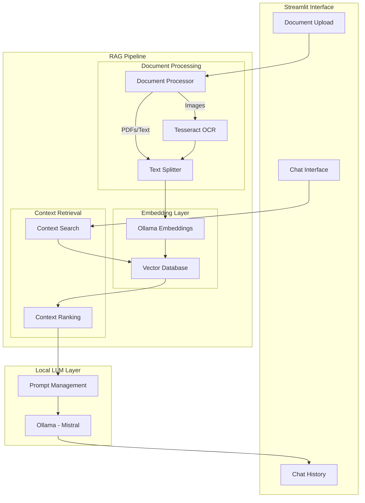
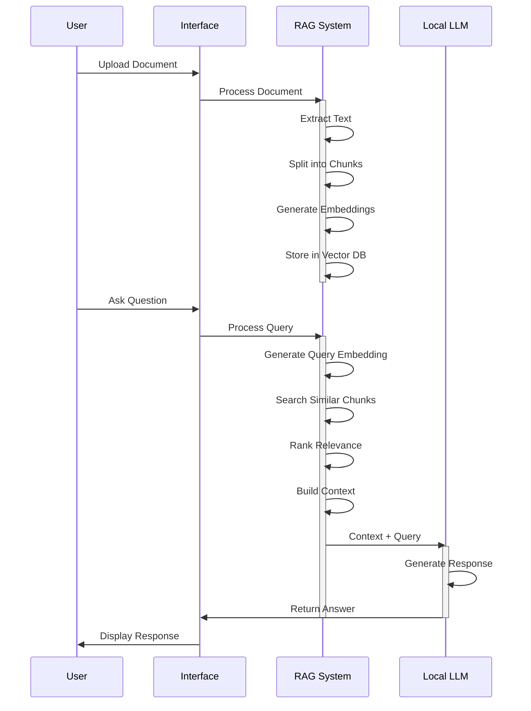

# 🤖 RAG-Enabled Local Chatbot

A Retrieval-Augmented Generation (RAG) chatbot using local LLMs and vector storage for document-aware conversations.

## 📸 Screenshots


*The chatbot analyzing a PDF about DeFi and blockchain technology, demonstrating document-aware responses*

## Key Features
- 📄 Process and understand multiple document formats
- 🔍 Retrieve relevant context from documents
- 💬 Natural conversation with document awareness
- 🏃 Fast local processing with Ollama
- 🔒 Privacy-focused (all data stays local)

## 🏗️ System Architecture



## 🔄 RAG Implementation Flow



## 🛠️ Technical Implementation

### Local Models
- **LLM**: Ollama (Mistral)
  - Local inference
  - No data leaves system
  - Customizable parameters

### RAG Components
1. **Document Processing**
   ```python
   # Text splitting configuration
   text_splitter = RecursiveCharacterTextSplitter(
       chunk_size=1000,
       chunk_overlap=200,
       length_function=len,
   )
   ```

2. **Embedding Generation**
   ```python
   embeddings = OllamaEmbeddings(
       model="nomic-embed-text",
       base_url="http://localhost:11434"
   )
   ```

3. **Vector Storage**
   ```python
   vectorstore = Chroma(
       persist_directory="./chroma_db",
       embedding_function=embeddings
   )
   ```

### Supported Formats
- 📄 PDF Documents
- 📝 Text Files
- 🖼️ Images (OCR-enabled)
- 📊 Markdown Files

## 🚀 Quick Start

1. **System Requirements**
```bash
# Core dependencies
brew install ollama
brew install tesseract
```

2. **Environment Setup**
```bash
# Initialize project
poetry install

# Run setup script
poetry run python setup.py

# Start Ollama
ollama serve
```

3. **Launch Application**
```bash
poetry run streamlit run app.py
```

## 🔧 Configuration

### Environment Variables
```env
OLLAMA_BASE_URL=http://localhost:11434
CHUNK_SIZE=1000
CHUNK_OVERLAP=200
```

### LLM Settings
```python
llm = ChatOllama(
    model="mistral",
    temperature=0.7,
    base_url="http://localhost:11434"
)
```

## 📊 Performance Considerations

1. **Memory Usage**
   - Vector DB scaling
   - Document chunk size
   - Embedding cache

2. **Processing Speed**
   - OCR optimization
   - Batch processing
   - Concurrent operations

3. **Response Quality**
   - Context window size
   - Chunk overlap
   - Relevance threshold

## 🔍 Debugging

```bash
# Check Ollama status
curl http://localhost:11434/api/version

# Verify vector store
poetry run python -c "import chromadb; print(chromadb.__version__)"

# Test OCR
poetry run python -c "import pytesseract; print(pytesseract.get_tesseract_version())"
```

## 🐛 Known Issues

1. **Image Processing**
   - OCR quality varies with image clarity
   - Large images may require preprocessing
   - PNG transparency can affect OCR

2. **Vector Storage**
   - ChromaDB requires periodic optimization
   - Large collections need index management
   - Memory usage scales with document count

## 🔒 Security

- All processing done locally
- No external API calls
- Data remains on system
- Configurable access controls

## 📚 References

- [LangChain Documentation](https://python.langchain.com/docs/get_started/introduction)
- [Ollama GitHub](https://github.com/ollama/ollama)
- [ChromaDB Documentation](https://docs.trychroma.com/)
