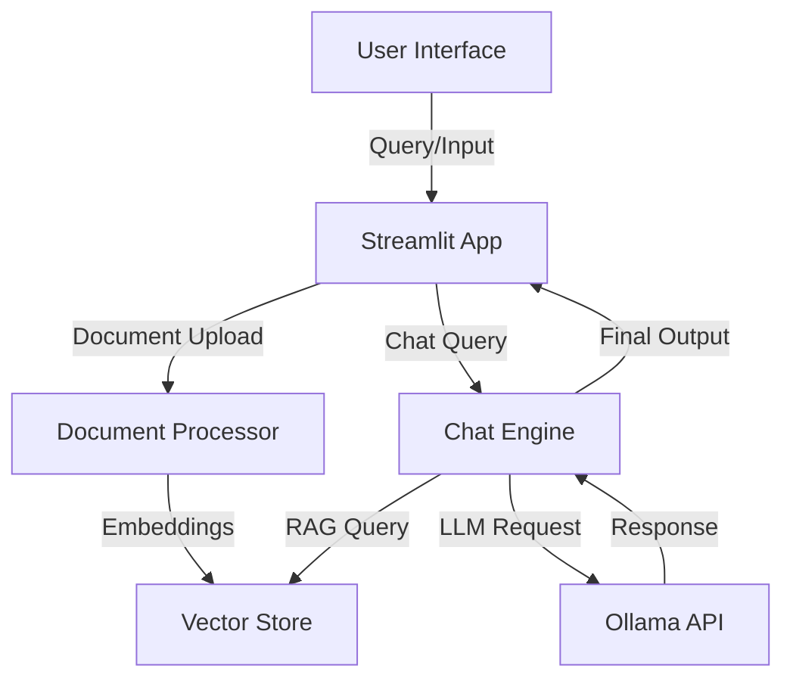
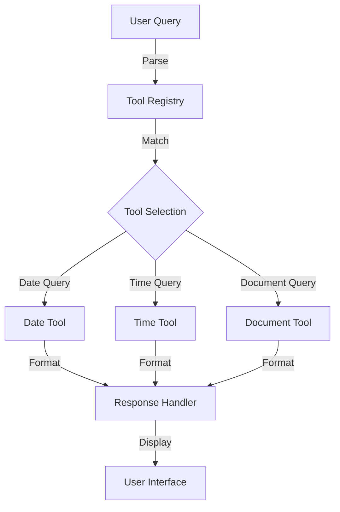

# BasicChat: Your Intelligent Local AI Assistant

## Project Overview
BasicChat is a powerful, privacy-focused AI assistant that combines local language models with advanced features like RAG (Retrieval Augmented Generation), multi-modal processing, and intelligent tools. Built on Streamlit and powered by Ollama, it offers secure offline operation while delivering sophisticated capabilities including document analysis, image processing, and context-aware conversations - all with a modern, intuitive interface.


## 🌟 Key Features

### 🤖 Core Chat Functionality
- **Local LLM Integration**: Powered by Ollama for privacy-focused, offline-capable AI interactions
- **Context-Aware Responses**: Maintains conversation history for coherent dialogue
- **Multi-Modal Support**: Handles text, documents, and images seamlessly

### 📚 Document Processing
- **PDF Processing**: Extract and analyze content from PDF documents
- **Image Analysis**: Process and understand images using LLaVA model
- **RAG Implementation**: Enhances responses with relevant document context
- **Efficient Storage**: ChromaDB for vector storage and quick retrieval

### 🛠️ Smart Tools
- **Date Tool**: Intelligent date-related queries and calculations
- **Time Tool**: Timezone-aware time operations and conversions
- **Document Tool**: Smart document summarization and analysis

### 🎯 User Experience
- **Clean Interface**: Streamlit-powered UI for intuitive interactions
- **Text-to-Speech**: Audio output with playback controls
- **Real-time Processing**: Fast response times with local processing
- **File Management**: Automatic cleanup of temporary files

## 🏗️ Architecture

### System Overview


### Tool Integration Flow


## 🚀 Getting Started

## 💻 System Requirements

### Minimum Requirements
- **CPU**: 4 cores (8 recommended for better performance)
- **RAM**: 8GB (16GB recommended)
- **Storage**: 10GB free space
- **OS**: macOS 10.15+, Ubuntu 20.04+, or Windows 10/11
- **Python**: 3.11 or higher
- **GPU**: Optional but recommended for faster processing

### Prerequisites
1. Install [Ollama](https://ollama.ai) following the official guide for your OS
2. Install Python 3.11+ from [python.org](https://python.org) or using your OS package manager
3. Install Git from [git-scm.com](https://git-scm.com)

### Required Models
Pull these models using Ollama:
```bash
# Core language model
ollama pull mistral

# Embedding model for document processing
ollama pull nomic-embed-text

# Vision model for image analysis
ollama pull llava
```

## 🚀 Installation Guide

### Using pip (Recommended)
```bash
# Clone the repository
git clone https://github.com/yourusername/basic-chat2.git
cd basic-chat2

# Create and activate virtual environment
python -m venv venv
source venv/bin/activate  # On Windows: .\venv\Scripts\activate

# Install dependencies
pip install -r requirements.txt

# Run the setup script
python setup.py
```

### Using Poetry (Alternative)
```bash
# Install Poetry if not already installed
curl -sSL https://install.python-poetry.org | python3 -

# Clone and setup
git clone https://github.com/yourusername/basic-chat2.git
cd basic-chat2
poetry install
```

### Launch the Application
```bash
streamlit run app.py
```
The application will be available at `http://localhost:8501`

## 🔧 Troubleshooting

### Common Issues

1. **Ollama Connection Error**
   ```
   Solution: Ensure Ollama is running with 'ollama serve'
   ```

2. **Model Download Issues**
   ```
   Solution: Check internet connection and retry with 'ollama pull [model]'
   ```

3. **Memory Issues**
   ```
   Solution: Close other applications or increase swap space
   ```

4. **Port Conflicts**
   ```
   Solution: Kill process using port 8501 or specify different port:
   streamlit run app.py --server.port [PORT]
   ```

## 🛣️ Roadmap

### Upcoming Features
- [ ] Multi-model switching capability
- [ ] Advanced memory management for longer conversations
- [ ] Custom tool creation interface
- [ ] Enhanced document processing with more formats
- [ ] Collaborative chat sessions
- [ ] API endpoint for headless operation

### Performance Improvements
- [ ] Optimized vector storage and retrieval
- [ ] Improved context window management
- [ ] Better prompt engineering for RAG

## 🤝 Contributing
Contributions are welcome! Please feel free to submit a Pull Request. For major changes, please open an issue first to discuss what you would like to change.

### Development Guidelines
1. Fork the repository
2. Create your feature branch
3. Commit your changes
4. Push to the branch
5. Open a Pull Request

## 📝 License
This project is licensed under the MIT License - see the LICENSE file for details.

## 🙏 Acknowledgments
- Ollama team for the amazing local LLM runtime
- Streamlit team for the powerful UI framework
- All contributors and users of this project
