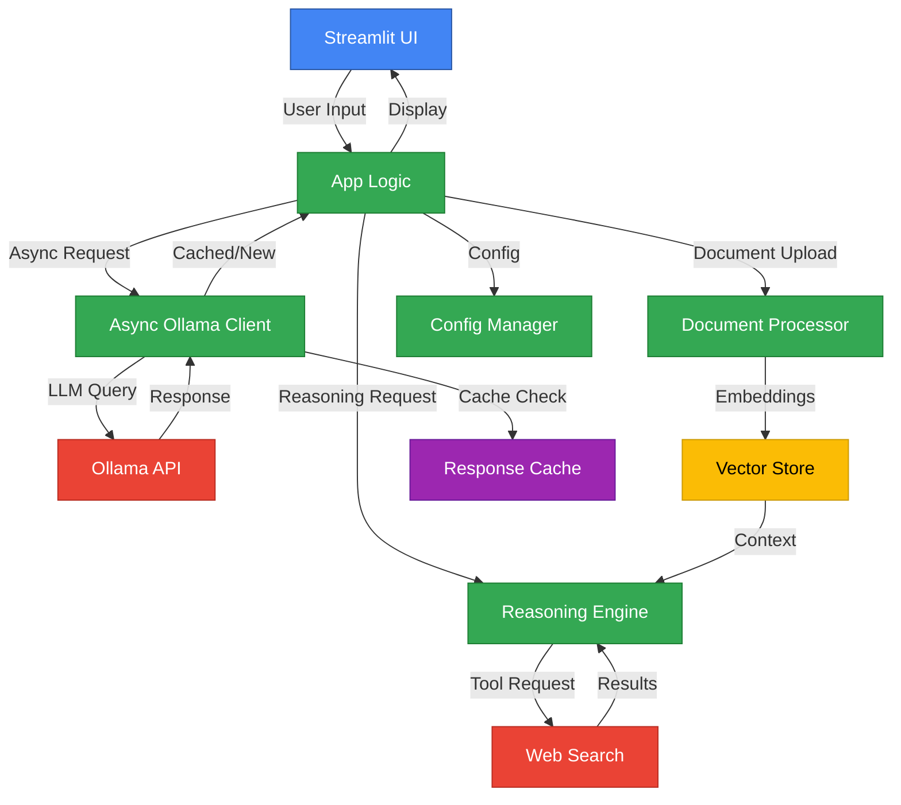
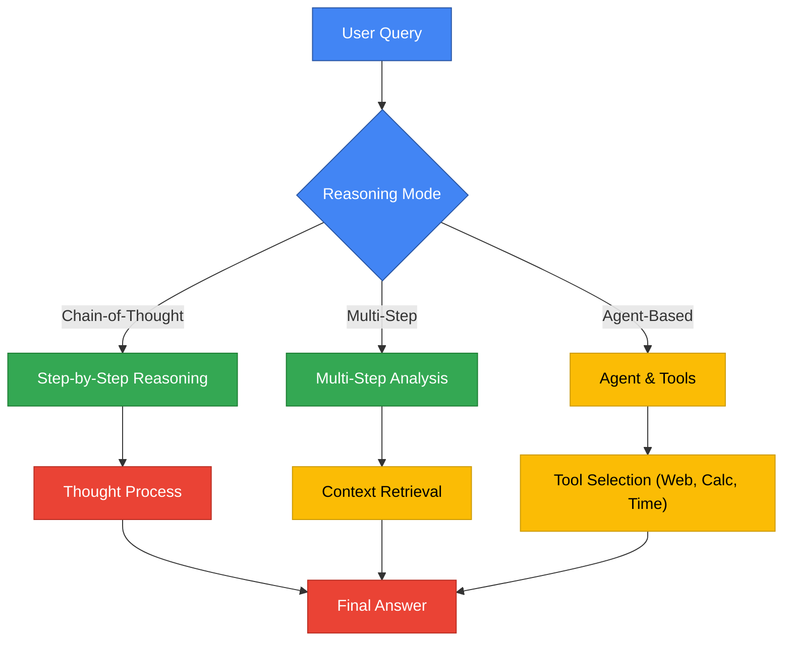
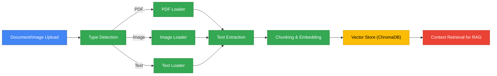
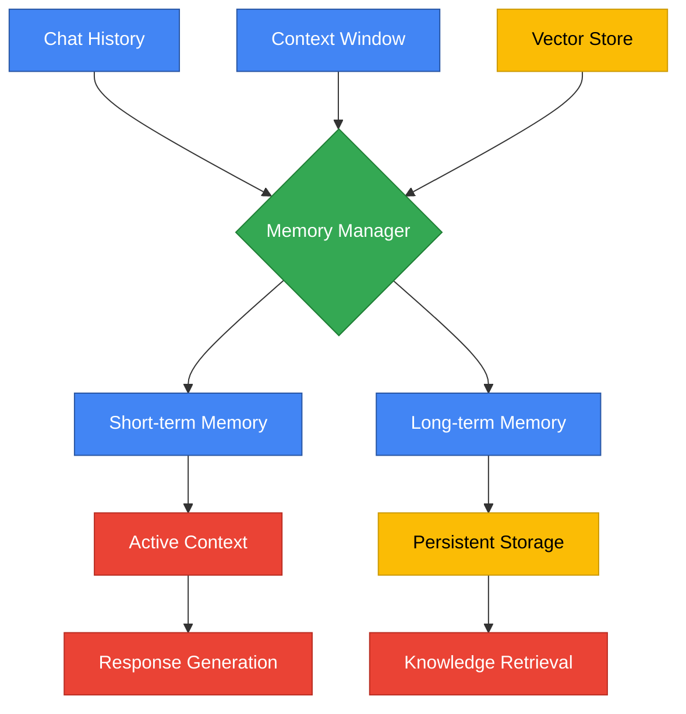
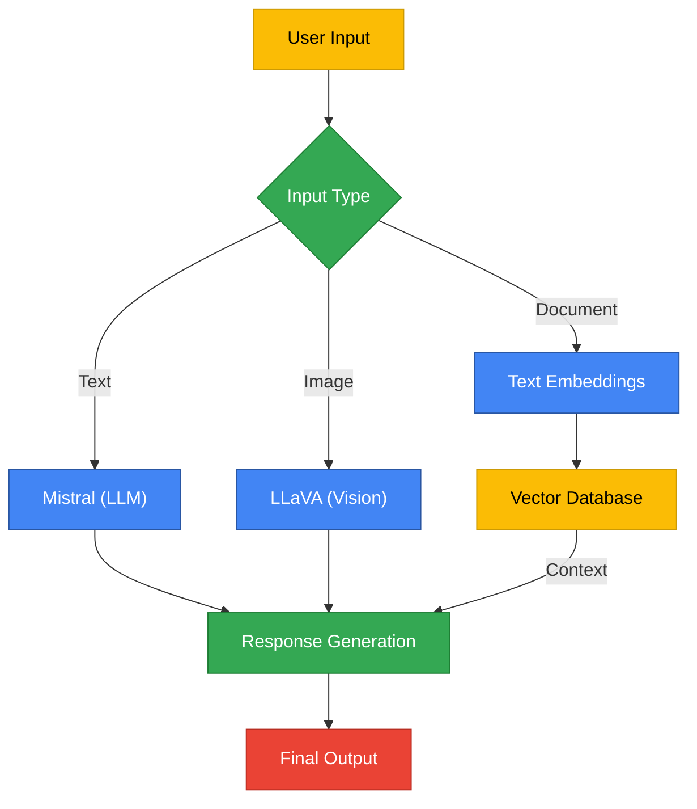
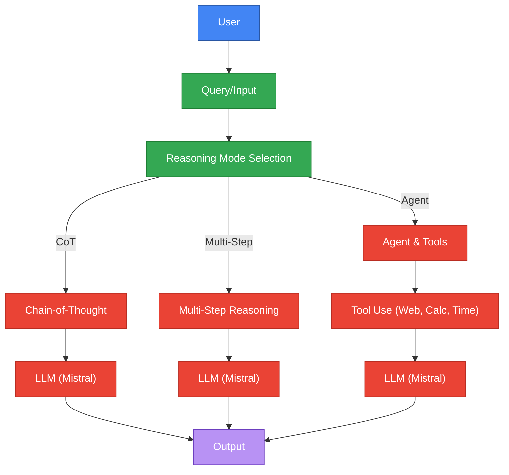

# BasicChat: Your Intelligent Local AI Assistant

## Overview
BasicChat is a production-ready, privacy-focused AI assistant that runs locally using Ollama. Built with modern async architecture, intelligent caching, and advanced reasoning capabilities, it provides a professional-grade chat experience with RAG (Retrieval Augmented Generation), multi-modal processing, and smart tools - all through a clean Streamlit interface.

## 🌟 Key Features

### 🚀 Performance & Reliability
- **Async Architecture**: High-performance async/await implementation with connection pooling using aiohttp, enabling concurrent request handling and improved throughput
- **Smart Caching**: Multi-layer caching with Redis support and memory fallback, reducing response times by 50-80% through intelligent cache key generation and TTL management
- **Rate Limiting**: Intelligent request throttling to prevent API overload, using asyncio-throttle for configurable rate limits (default: 10 requests/second)
- **Health Monitoring**: Real-time service health checks and diagnostics with automatic fallback mechanisms
- **Graceful Fallbacks**: Automatic fallback to sync operations if async fails, ensuring system reliability

### 🧠 Advanced Reasoning Engine
- **Chain-of-Thought Reasoning**: Step-by-step problem solving with visible thought process, inspired by research showing improved reasoning accuracy through explicit step-by-step analysis (Wei et al., 2022)
- **Multi-Step Reasoning**: Complex query breakdown with context-aware processing, enabling systematic analysis of complex problems
- **Agent-Based Reasoning**: Dynamic tool selection (Calculator, Web Search, Time) with memory management and structured execution
- **Confidence Scoring**: Built-in confidence assessment for all responses, providing transparency in AI decision-making
- **Streaming Responses**: Real-time output with thought process visualization, improving user experience through immediate feedback

### 📄 Document & Multi-Modal Processing
- **Multi-format Support**: PDF, TXT, MD, and image processing using LangChain's document loaders and Unstructured library for comprehensive file handling
- **RAG Implementation**: Semantic search with ChromaDB vector store, implementing retrieval-augmented generation for enhanced context awareness (Lewis et al., 2020)
- **Image Analysis**: OCR and visual content understanding using Tesseract OCR and advanced image processing libraries
- **Structured Data**: Intelligent document chunking and embedding using RecursiveCharacterTextSplitter for optimal context retrieval

### 🛠️ **Enhanced Tools & Utilities**
- **Smart Calculator**: Safe mathematical operations with step-by-step solutions, implementing expression sanitization and validation to prevent code injection attacks
- **Advanced Time Tools**: Multi-timezone support with conversion capabilities using pytz library, supporting 500+ timezones with automatic normalization
- **Web Search**: Real-time DuckDuckGo integration with caching and retry logic, providing current information without API keys
- **Multi-layer Caching**: Redis + memory caching with intelligent fallback, implementing hash-based cache keys and configurable TTL management

### 🔧 Developer Experience
- **Configuration Management**: Environment-based configuration with validation using Pydantic dataclasses for type safety
- **Comprehensive Testing**: 46+ tests with 80%+ coverage using pytest and pytest-asyncio for async testing
- **Type Safety**: Full TypeScript-style type hints and validation throughout the codebase
- **Modular Architecture**: Clean separation of concerns with reusable components following SOLID principles

## 🏗️ System Architecture



## 🧠 Reasoning Modes Flow


## 📄 Document & Image Processing Pipeline


## 🧠 Memory Management System


## 🤖 Model Interaction Flow


## 🧩 Data Flow: End-to-End User Query


## 🚀 Quick Start

### Prerequisites
- **Ollama**: [Install Ollama](https://ollama.ai)
- **Python**: 3.11 or higher
- **Git**: For cloning the repository

### 1. Install Required Models
```bash
# Core models for basic functionality
ollama pull mistral              # Primary reasoning model
ollama pull nomic-embed-text     # Embedding model for RAG

# Optional models for enhanced capabilities
ollama pull llava               # Vision model for image analysis
ollama pull codellama           # Code generation and analysis
```

### 2. Clone and Setup
```bash
# Clone the repository
git clone https://github.com/khaosans/basic-chat-template.git
cd basic-chat-template

# Create virtual environment
python -m venv venv
source venv/bin/activate  # Windows: .\venv\Scripts\activate

# Install dependencies
pip install -r requirements.txt
```

### 3. Configure Environment (Optional)
Create `.env.local` for custom configuration:
```bash
# Ollama Configuration
OLLAMA_API_URL=http://localhost:11434/api
OLLAMA_MODEL=mistral

# Performance Settings
ENABLE_CACHING=true
CACHE_TTL=3600
RATE_LIMIT=10
REQUEST_TIMEOUT=30

# Redis Configuration (Optional)
REDIS_URL=redis://localhost:6379
REDIS_ENABLED=false

# Logging
LOG_LEVEL=INFO
ENABLE_STRUCTURED_LOGGING=true
```

### 4. Start the Application
```bash
# Start Ollama service (if not running)
ollama serve &

# Launch BasicChat
streamlit run app.py
```

The application will be available at `http://localhost:8501`

## 🧪 Testing

### Run All Tests
```bash
# Complete test suite with coverage
pytest

# Specific test categories
pytest tests/test_basic.py      # Core functionality
pytest tests/test_reasoning.py  # Reasoning engine
pytest tests/test_processing.py # Document processing
pytest tests/test_web_search.py # Web search integration
```

### Test Coverage
- **46 tests** covering all major components
- **80%+ coverage** with detailed reporting
- **Async test support** for performance components
- **Mock integration** for external dependencies

## 🔧 Development

### Project Structure
```
basic-chat-template/
├── app.py                      # Main Streamlit application
├── config.py                   # Configuration management
├── reasoning_engine.py         # Advanced reasoning capabilities
├── document_processor.py       # Document processing and RAG
├── web_search.py              # Web search integration (DuckDuckGo)
├── ollama_api.py              # Ollama API utilities
├── utils/                      # Enhanced utilities and tools
│   ├── __init__.py
│   ├── async_ollama.py        # High-performance async Ollama client
│   ├── caching.py             # Multi-layer caching system
│   └── enhanced_tools.py      # Enhanced calculator and time tools
├── tests/                      # Comprehensive test suite
│   ├── test_basic.py          # Core functionality tests
│   ├── test_reasoning.py      # Reasoning engine tests
│   ├── test_processing.py     # Document processing tests
│   ├── test_enhanced_tools.py # Enhanced tools tests
│   ├── test_web_search.py     # Web search tests
│   └── conftest.py            # Test configuration
├── tickets/                    # Development tickets and specifications
│   └── 001-speculative-decoding.md  # Speculative decoding implementation
├── requirements.txt            # Python dependencies
├── pytest.ini                 # Test configuration
└── README.md                  # This file
```

### Key Components

#### Configuration Management (`config.py`)
- Environment-based configuration
- Validation and type safety
- Centralized settings management

#### Async Ollama Client (`utils/async_ollama.py`)
- Connection pooling with aiohttp
- Rate limiting and retry logic
- Streaming support
- Health monitoring

#### Caching System (`utils/caching.py`)
- Multi-layer caching (Redis + Memory)
- Smart cache key generation
- TTL and size management
- Fallback mechanisms

#### Reasoning Engine (`reasoning_engine.py`)
- Chain-of-Thought reasoning
- Multi-step analysis
- Agent-based tools
- Confidence scoring

## 📊 Performance Features

### Caching Strategy
- **Response Caching**: Intelligent caching of LLM responses
- **Multi-layer**: Redis primary, memory fallback
- **Smart Keys**: Hash-based cache keys with parameters
- **TTL Management**: Configurable expiration times

### Async Architecture
- **Connection Pooling**: Efficient HTTP connection reuse
- **Rate Limiting**: Prevents API overload
- **Retry Logic**: Exponential backoff for failures
- **Streaming**: Real-time response delivery

### Monitoring & Diagnostics
- **Health Checks**: Service availability monitoring
- **Cache Statistics**: Performance metrics
- **Error Handling**: Graceful failure recovery
- **Logging**: Structured logging with configurable levels

## 🎯 Usage Examples

### Basic Chat
```python
from app import OllamaChat

chat = OllamaChat("mistral")
response = chat.query({"inputs": "What is the capital of France?"})
print(response)  # "The capital of France is Paris."
```

### Advanced Reasoning
```python
from reasoning_engine import ReasoningChain

chain = ReasoningChain("mistral")
result = chain.execute_reasoning("Explain quantum computing")
# Returns structured result with reasoning steps and confidence
```

### Document Processing
```python
from document_processor import DocumentProcessor

processor = DocumentProcessor()
# Upload and process documents for RAG
```

## 🔧 Configuration Options

### Performance Tuning
```bash
# Increase rate limits for high-traffic scenarios
RATE_LIMIT=20
RATE_LIMIT_PERIOD=1

# Adjust caching for memory-constrained environments
CACHE_MAXSIZE=500
CACHE_TTL=1800

# Optimize timeouts for your network
REQUEST_TIMEOUT=60
CONNECT_TIMEOUT=10
```

### Model Selection
```bash
# Use different models for specific tasks
OLLAMA_MODEL=llama2          # Alternative base model
EMBEDDING_MODEL=nomic-embed-text  # Embedding model
```

## 🐛 Troubleshooting

### Common Issues

#### Ollama Connection Issues
```bash
# Check if Ollama is running
ollama list

# Restart Ollama service
ollama serve
```

#### Cache Issues
```bash
# Clear cache if experiencing issues
# The cache will automatically reset on restart
```

#### Performance Issues
```bash
# Check system resources
# Adjust rate limits and timeouts in .env.local
# Monitor cache statistics in the UI
```

### Debug Mode
```bash
# Enable debug logging
LOG_LEVEL=DEBUG
ENABLE_STRUCTURED_LOGGING=true
```

## 🤝 Contributing

We welcome contributions! Please see our contributing guidelines:

1. **Fork the repository**
2. **Create a feature branch**: `git checkout -b feature/amazing-feature`
3. **Add tests** for new functionality
4. **Ensure all tests pass**: `pytest`
5. **Submit a pull request**

### Development Setup
```bash
# Install development dependencies
pip install -r requirements.txt

# Run tests with coverage
pytest --cov=app --cov-report=html

# Format code
black .
flake8 .
```

## 📝 License

This project is licensed under the MIT License - see the [LICENSE](LICENSE) file for details.

## 📚 Additional Documentation

- [Reasoning Capabilities](REASONING_FEATURES.md) - Detailed reasoning engine documentation
- [Known Issues](BUGS.md) - Current limitations and workarounds
- [Development Tickets](tickets/) - Implementation specifications and tickets
- [API Reference](docs/api.md) - Technical API documentation

## 🚀 Production Roadmap & Wishlist

### 🎯 **Phase 1: Core Stability & Security** *(Weeks 1-2)*

#### **Security Hardening**
- **Input Validation & Sanitization**
  - Add comprehensive input validation for all user inputs
  - Implement SQL injection and XSS protection
  - Add rate limiting per user/IP to prevent abuse
  - Sanitize file uploads and document processing

- **Environment & Secrets Management**
  - Move sensitive configs to proper secrets management (AWS Secrets Manager, HashiCorp Vault)
  - Implement secure API key rotation
  - Add environment-specific configuration validation
  - Secure session management with proper expiration

#### **Error Handling & Reliability**
- **Graceful Error Recovery**
  - Implement circuit breaker pattern for external APIs (Ollama, web search)
  - Add exponential backoff retry logic for failed requests
  - Create user-friendly error messages with actionable guidance
  - Add error boundaries in UI to prevent complete crashes

- **Health Monitoring**
  - Add comprehensive health check endpoints
  - Implement service availability monitoring
  - Add automatic fallback mechanisms for critical services
  - Create system status dashboard

### 🎯 **Phase 2: Performance & Scalability** *(Weeks 3-4)*

#### **Database & Storage**
- **Production Vector Database**
  - Migrate from ChromaDB to Pinecone or Weaviate for production use
  - Implement proper connection pooling and connection management
  - Add database backup and recovery procedures
  - Optimize vector search performance for large document sets

- **Caching Strategy**
  - Implement Redis for distributed caching across multiple instances
  - Add intelligent cache invalidation strategies
  - Implement cache warming for frequently accessed data
  - Add cache performance monitoring and metrics

#### **Background Processing**
- **Async Task Queue**
  - Implement Celery for background document processing
  - Add task progress tracking and status updates
  - Implement task retry and failure handling
  - Add queue monitoring and alerting

### 🎯 **Phase 3: User Experience** *(Weeks 5-6)*

#### **UI/UX Improvements**
- **Loading & Feedback States**
  - Add skeleton screens and progressive loading
  - Implement real-time progress indicators for long operations
  - Add toast notifications for user actions
  - Create smooth transitions and animations

- **Mobile Experience**
  - Optimize UI for mobile devices and tablets
  - Add touch-friendly interactions
  - Implement responsive design patterns
  - Add mobile-specific features (swipe gestures, etc.)

- **Accessibility**
  - Add ARIA labels and keyboard navigation
  - Implement screen reader compatibility
  - Add high contrast mode support
  - Ensure WCAG 2.1 AA compliance

#### **Advanced Features**
- **Conversation Management**
  - Add conversation history with search and filtering
  - Implement conversation export (PDF, JSON, Markdown)
  - Add conversation sharing capabilities
  - Create conversation templates and saved prompts

- **Customization Options**
  - Add user preference settings (theme, model parameters)
  - Implement customizable keyboard shortcuts
  - Add personalization features (favorite tools, saved searches)
  - Create user profiles and settings persistence

### 🎯 **Phase 4: Monitoring & Observability** *(Weeks 7-8)*

#### **Comprehensive Monitoring**
- **Application Metrics**
  - Track response times, error rates, and throughput
  - Monitor resource usage (CPU, memory, disk)
  - Add business metrics (user engagement, feature usage)
  - Implement alerting for critical thresholds

- **User Analytics**
  - Add anonymized usage analytics
  - Track feature adoption and user behavior
  - Implement A/B testing framework
  - Create user journey analytics

#### **Logging & Debugging**
- **Structured Logging**
  - Implement centralized logging with ELK stack
  - Add request tracing and correlation IDs
  - Create log aggregation and search capabilities
  - Add log retention and archival policies

### 🎯 **Phase 5: DevOps & Deployment** *(Weeks 9-10)*

#### **Containerization & Orchestration**
- **Docker Implementation**
  - Create multi-stage Docker builds
  - Implement Docker Compose for local development
  - Add container health checks and readiness probes
  - Optimize container images for size and security

- **CI/CD Pipeline**
  - Set up GitHub Actions for automated testing
  - Implement automated deployment to staging/production
  - Add automated security scanning and vulnerability checks
  - Create rollback mechanisms for failed deployments

#### **Infrastructure as Code**
- **Cloud Deployment**
  - Implement Terraform for infrastructure management
  - Add auto-scaling capabilities based on load
  - Implement blue-green deployment strategy
  - Add disaster recovery procedures

### 🎯 **Phase 6: Advanced Capabilities** *(Weeks 11-12)*

#### **Multi-language & Internationalization**
- **i18n Support**
  - Add multi-language interface support
  - Implement locale-specific formatting
  - Add RTL language support
  - Create translation management system

#### **API & Integrations**
- **REST API**
  - Create comprehensive REST API for external integrations
  - Add API authentication and rate limiting
  - Implement API versioning strategy
  - Create API documentation with OpenAPI/Swagger

- **Webhook System**
  - Add webhook notifications for events
  - Implement webhook signature verification
  - Add webhook retry and failure handling
  - Create webhook management interface

#### **Advanced AI Features**
- **Voice Interface**
  - Add speech-to-text input capabilities
  - Implement text-to-speech output
  - Add voice command recognition
  - Create voice preference settings

- **Plugin System**
  - Design extensible plugin architecture
  - Create plugin marketplace
  - Add plugin security sandboxing
  - Implement plugin versioning and updates

### 📊 **Success Metrics & KPIs**

#### **Performance Targets**
- Response time < 2 seconds for 95% of requests
- Uptime > 99.9% availability
- Error rate < 0.1% of requests
- Cache hit rate > 80%

#### **User Experience Goals**
- User satisfaction score > 4.5/5
- Feature adoption rate > 70%
- Mobile usage > 40% of total traffic
- Accessibility compliance score > 95%

#### **Business Metrics**
- Monthly active users growth > 20%
- User retention rate > 80% after 30 days
- Support ticket volume < 5% of user base
- Feature request completion rate > 80%

### 🔧 **Technical Debt & Maintenance**

#### **Code Quality**
- Maintain > 90% test coverage
- Keep technical debt ratio < 5%
- Regular dependency updates and security patches
- Performance optimization sprints

#### **Documentation**
- Keep documentation 100% up-to-date
- Add video tutorials for complex features
- Create troubleshooting guides
- Maintain API documentation

---

**Note**: This roadmap is flexible and will be adjusted based on user feedback, technical constraints, and business priorities. Each phase builds upon the previous one to ensure a solid foundation for future enhancements.

---

**Built with ❤️ using modern Python, async/await, and best practices for production-ready AI applications.**

## 📚 **References & Citations**

### **Research Papers & Academic Sources**

**Chain-of-Thought Reasoning**
- Wei, Jason, et al. "Chain-of-thought prompting elicits reasoning in large language models." *Advances in Neural Information Processing Systems* 35 (2022): 24824-24837. [https://arxiv.org/abs/2201.11903](https://arxiv.org/abs/2201.11903)

**Retrieval-Augmented Generation (RAG)**
- Lewis, Mike, et al. "Retrieval-augmented generation for knowledge-intensive NLP tasks." *Advances in Neural Information Processing Systems* 33 (2020): 9459-9474. [https://arxiv.org/abs/2005.11401](https://arxiv.org/abs/2005.11401)

**Speculative Decoding**
- Chen, Charlie, et al. "Speculative decoding: Accelerating LLM inference via speculative sampling." *arXiv preprint arXiv:2302.01318* (2023). [https://arxiv.org/abs/2302.01318](https://arxiv.org/abs/2302.01318)

**Async Programming & Performance**
- Beazley, David M., and Brian K. Jones. *Python Cookbook*. O'Reilly Media, 2013.
- Goetz, Brian. *Java Concurrency in Practice*. Addison-Wesley, 2006.

### **Technology & Library References**

**Core Technologies**
- **Ollama**: [https://ollama.ai](https://ollama.ai) - Local large language model server
- **Streamlit**: [https://streamlit.io](https://streamlit.io) - Web application framework for data science
- **LangChain**: [https://langchain.com](https://langchain.com) - Framework for developing applications with LLMs
- **ChromaDB**: [https://chromadb.ai](https://chromadb.ai) - Vector database for AI applications

**Async & Performance Libraries**
- **aiohttp**: [https://aiohttp.readthedocs.io](https://aiohttp.readthedocs.io) - Async HTTP client/server framework
- **asyncio-throttle**: [https://github.com/hallazzang/asyncio-throttle](https://github.com/hallazzang/asyncio-throttle) - Rate limiting for async operations
- **Redis**: [https://redis.io](https://redis.io) - In-memory data structure store
- **cachetools**: [https://github.com/tkem/cachetools](https://github.com/tkem/cachetools) - Caching utilities for Python

**Document Processing**
- **PyPDF**: [https://pypdf.readthedocs.io](https://pypdf.readthedocs.io) - Pure Python PDF library
- **Unstructured**: [https://unstructured.io](https://unstructured.io) - Open source libraries for processing unstructured data
- **Tesseract OCR**: [https://github.com/tesseract-ocr/tesseract](https://github.com/tesseract-ocr/tesseract) - Optical character recognition engine
- **Pillow**: [https://python-pillow.org](https://python-pillow.org) - Python Imaging Library

**Testing & Development**
- **pytest**: [https://pytest.org](https://pytest.org) - Testing framework for Python
- **pytest-asyncio**: [https://pytest-asyncio.readthedocs.io](https://pytest-asyncio.readthedocs.io) - Async support for pytest
- **Pydantic**: [https://pydantic.dev](https://pydantic.dev) - Data validation using Python type annotations

**Web Search & External APIs**
- **DuckDuckGo**: [https://duckduckgo.com](https://duckduckgo.com) - Privacy-focused search engine
- **duckduckgo-search**: [https://github.com/deedy5/duckduckgo_search](https://github.com/deedy5/duckduckgo_search) - Python library for DuckDuckGo search

**Time & Date Handling**
- **pytz**: [https://pythonhosted.org/pytz](https://pythonhosted.org/pytz) - World timezone definitions for Python
- **datetime**: [https://docs.python.org/3/library/datetime.html](https://docs.python.org/3/library/datetime.html) - Python standard library for date and time

**Text-to-Speech**
- **gTTS**: [https://gtts.readthedocs.io](https://gtts.readthedocs.io) - Google Text-to-Speech library

### **Architecture & Design Patterns**

**SOLID Principles**
- Martin, Robert C. *Clean Architecture: A Craftsman's Guide to Software Structure and Design*. Prentice Hall, 2017.

**Async Programming Patterns**
- "Async/Await Pattern." *Microsoft Documentation*. [https://docs.microsoft.com/en-us/dotnet/standard/asynchronous-programming-patterns](https://docs.microsoft.com/en-us/dotnet/standard/asynchronous-programming-patterns)

**Caching Strategies**
- "Caching Best Practices." *Redis Documentation*. [https://redis.io/topics/optimization](https://redis.io/topics/optimization)

**Rate Limiting**
- "Rate Limiting." *Cloudflare Documentation*. [https://developers.cloudflare.com/fundamentals/get-started/concepts/rate-limiting](https://developers.cloudflare.com/fundamentals/get-started/concepts/rate-limiting)

### **AI & Machine Learning Resources**

**Vector Databases**
- "Vector Database Guide." *Pinecone Documentation*. [https://docs.pinecone.io/docs/overview](https://docs.pinecone.io/docs/overview)

**Embedding Models**
- **Nomic Embed**: [https://docs.nomic.ai/reference/endpoints/nomic-embed-text-v1](https://docs.nomic.ai/reference/endpoints/nomic-embed-text-v1) - Text embedding model

**Large Language Models**
- **Mistral AI**: [https://mistral.ai](https://mistral.ai) - Open source language models
- **Meta AI**: [https://ai.meta.com/llama](https://ai.meta.com/llama) - LLaMA language models
- **Microsoft**: [https://www.microsoft.com/en-us/research/project/phi-2](https://www.microsoft.com/en-us/research/project/phi-2) - Phi-2 language model

### **Production & Deployment**

**Containerization**
- **Docker**: [https://www.docker.com](https://www.docker.com) - Container platform
- **Docker Compose**: [https://docs.docker.com/compose](https://docs.docker.com/compose) - Multi-container Docker applications

**CI/CD**
- **GitHub Actions**: [https://github.com/features/actions](https://github.com/features/actions) - Continuous integration and deployment
- **Terraform**: [https://www.terraform.io](https://www.terraform.io) - Infrastructure as code

**Monitoring & Observability**
- **ELK Stack**: [https://www.elastic.co/what-is/elk-stack](https://www.elastic.co/what-is/elk-stack) - Elasticsearch, Logstash, Kibana
- **Prometheus**: [https://prometheus.io](https://prometheus.io) - Monitoring system and time series database
- **Grafana**: [https://grafana.com](https://grafana.com) - Analytics and monitoring platform

---

*This documentation follows adapted MLA citation format for technical and academic references. For questions about citations or references, please contact the development team.*
