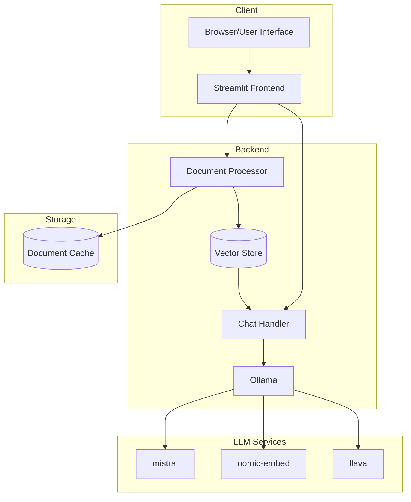
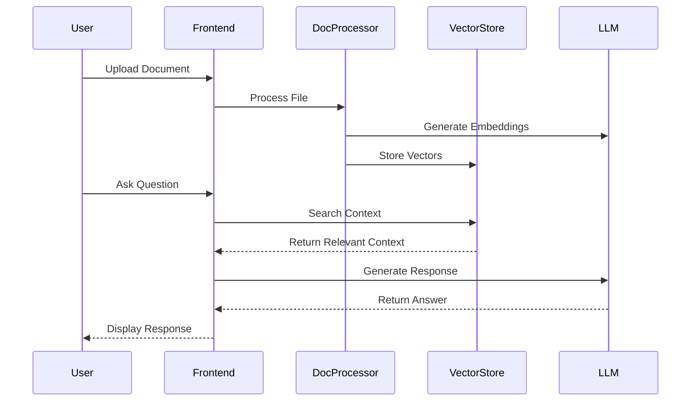

# Document-Aware Chatbot with Local LLM Integration

## Abstract
A streamlined implementation of a document-aware chatbot that leverages local Large Language Models (LLMs) through Ollama. The system integrates document processing, vector storage, and multi-modal analysis capabilities while maintaining data privacy and reducing latency through local processing.

## System Architecture

### Core Components


**Architecture Analysis:**
- **Client Layer**: Streamlit-based interface providing real-time interaction
- **Backend Processing**: Modular design separating document processing from chat handling
- **Storage Layer**: Dual-storage approach with vector embeddings and document caching
- **LLM Integration**: Task-specific model selection for optimal performance

### Data Flow and Processing


**Flow Analysis:**
- Asynchronous document processing with progress tracking
- Context-aware query processing
- Efficient vector storage and retrieval
- Real-time response streaming

## Technical Implementation

### Model Configuration
```python
CHAT_MODEL = "mistral"        # Primary chat interface
EMBEDDING_MODEL = "nomic-embed-text"  # Document vectorization
IMAGE_MODEL = "llava"         # Image analysis
```

### Key Features
1. **Document Processing**
   - PDF parsing with chunk optimization
   - Image analysis with multi-prompt understanding
   - Vector embedding for semantic search

2. **Chat Interface**
   - Stream-based response generation
   - Context-aware responses
   - Error handling with model fallbacks

3. **Storage Management**
   - Efficient vector storage with ChromaDB
   - Document caching for quick retrieval
   - Automatic cleanup and maintenance

## Performance Considerations

### Optimization Strategies
- Chunk size optimization (1000 tokens with 200 overlap)
- Rate limiting (20 requests/minute)
- Response streaming for better UX
- Local model inference reducing latency

### Resource Management
- Automatic memory cleanup
- Document version control
- Storage optimization

## Installation and Setup

### Prerequisites
- Python 3.8.1+
- Ollama server
- 8GB+ RAM recommended
- SSD storage recommended

### Quick Start
```bash
# Install dependencies
poetry install

# Pull required models
ollama pull mistral
ollama pull nomic-embed-text
ollama pull llava

# Start Ollama server
ollama serve

# Launch application
poetry run streamlit run app.py
```

## Development Guidelines

### Code Structure