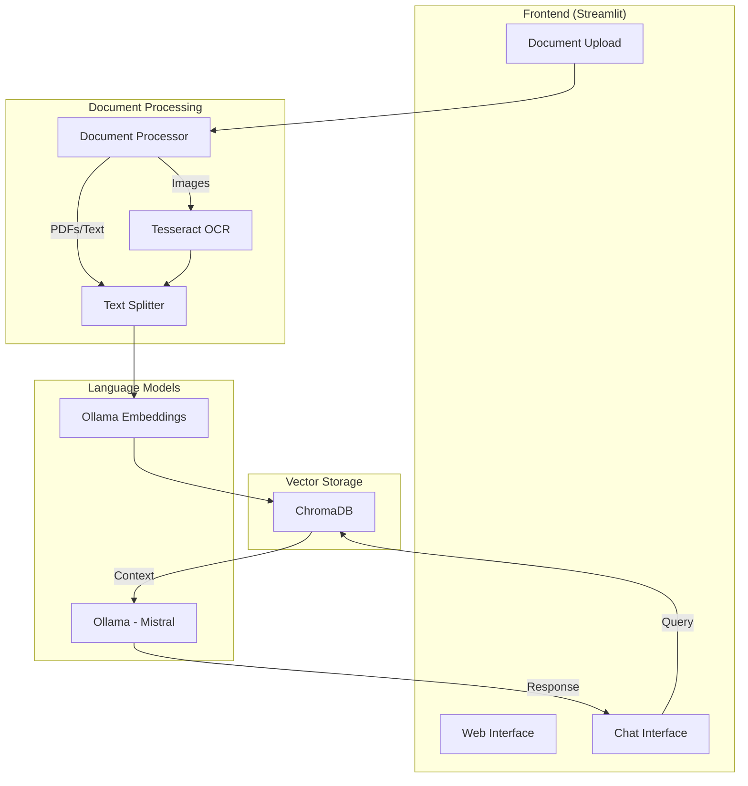
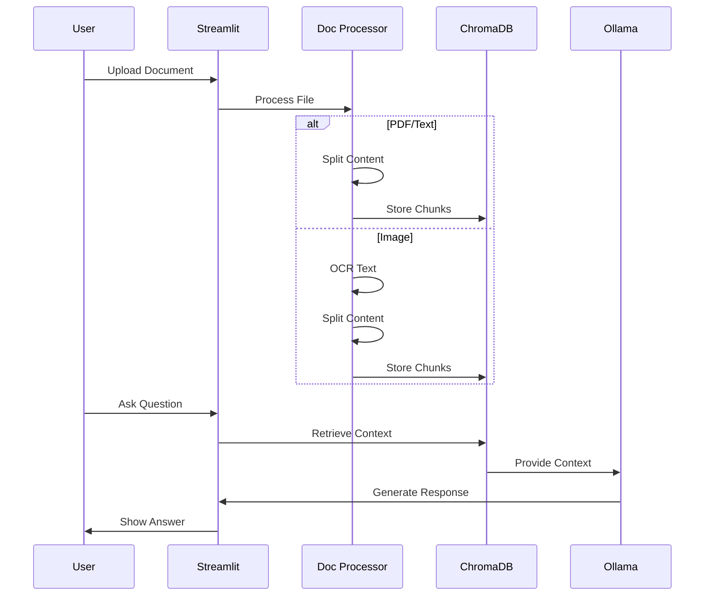

# 🤖 Document-Aware Chatbot

An AI-powered chatbot that processes documents and images using local LLM (Ollama) with RAG capabilities.

## 🏗️ Architecture



## 🔄 Document Processing Flow



## 🛠️ Technical Stack

- **Frontend**: Streamlit (^1.24.0)
- **LLM Integration**: 
  - Ollama (local LLM)
  - Model: Mistral
- **Document Processing**:
  - Text Splitting: LangChain RecursiveCharacterTextSplitter
  - PDF Processing: PyPDF
  - Image Processing: Tesseract OCR
- **Vector Storage**: ChromaDB (^0.3.0)
- **Embeddings**: Ollama Embeddings
- **Dependencies**:
  - Python >=3.8.1
  - LangChain ^0.0.330
  - ChromaDB ^0.3.0
  - Streamlit ^1.24.0

## 📝 Features

1. **Document Processing**
   - PDF documents
   - Text files
   - Images (OCR)
   - Chunk optimization for better context

2. **Chat Interface**
   - Real-time responses
   - Document-aware context
   - History tracking
   - Clear conversation option

3. **RAG Implementation**
   - Local embeddings generation
   - Semantic search
   - Context-aware responses
   - Document source tracking

## 🚀 Getting Started

1. **Prerequisites**
```bash
# Install system dependencies
brew install tesseract  # OCR support
brew install poppler   # PDF processing
```

2. **Installation**
```bash
# Install Python dependencies
poetry install

# Run setup
poetry run python setup.py

# Start application
poetry run streamlit run app.py
```

## �� Project Structure
