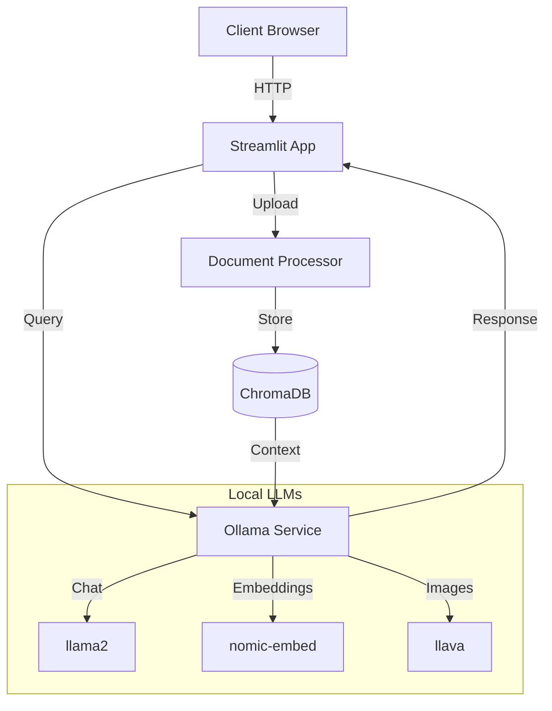
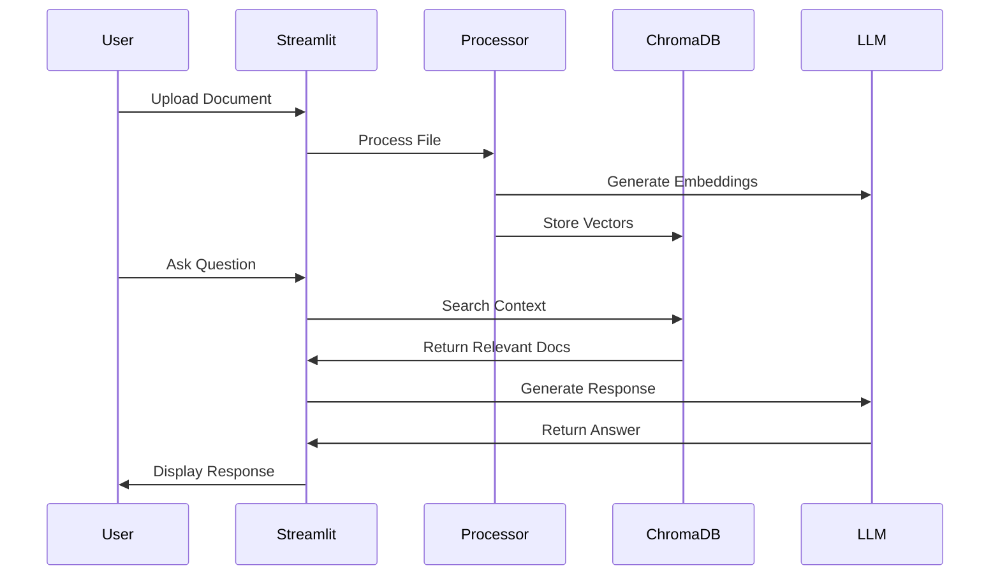
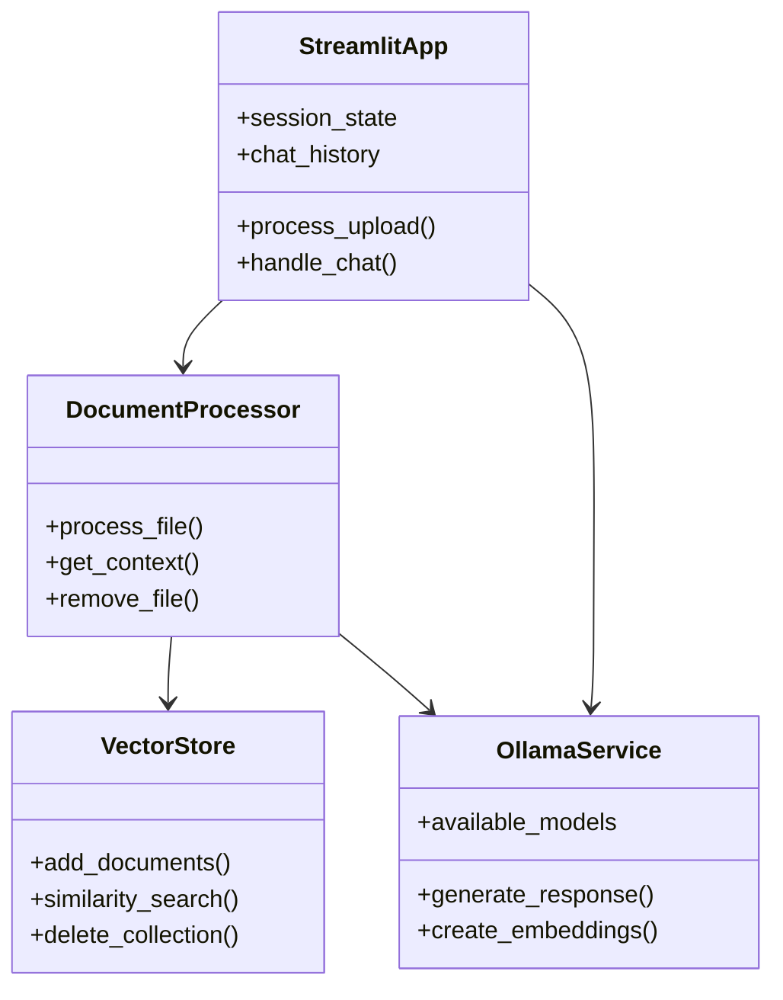

# Document-Aware Chatbot

A Streamlit-based chatbot that can understand and respond to questions about uploaded documents and images using local LLMs through Ollama.

## Architecture

### System Overview


### Document Processing Flow


### Component Architecture


## Data Flow

```ascii
User Input/Files
      │
      ▼
┌──────────────────────┐
│ Document Processing  │
│  ┌───────────────┐  │
│  │ PDF Parsing   │  │
│  │ Image Analysis│  │
│  └───────────────┘  │
└──────────────────────┘
      │
      ▼
┌──────────────────────┐
│  Vector Database    │
│  ┌───────────────┐  │
│  │ Embeddings    │  │
│  │ Search Index  │  │
│  └───────────────┘  │
└──────────────────────┘
      │
      ▼
┌──────────────────────┐
│   Chat Interface    │
│  ┌───────────────┐  │
│  │ Context Aware │  │
│  │ Responses     │  │
│  └───────────────┘  │
└──────────────────────┘
```

## Features

- 📄 Document Processing (PDF, Images)
- 💬 Interactive Chat Interface
- 🤖 Local LLM Integration via Ollama
- 📊 Document Context Awareness
- 🖼️ Image Analysis Capabilities
- 🔄 Rate Limiting Protection

## Prerequisites

- Python 3.8.1 or higher
- Poetry for dependency management
- Ollama for local LLM support

## Installation

1. Clone the repository:
```bash
git clone <repository-url>
cd <repository-name>
```

2. Install dependencies using Poetry:
```bash
poetry install
```

3. Install and start Ollama:
```bash
# Install Ollama (macOS/Linux)
curl https://ollama.ai/install.sh | sh

# Start Ollama server
ollama serve
```

4. Pull required models:
```bash
# Base chat model
ollama pull llama2

# Embedding model for document search
ollama pull nomic-embed-text

# Image analysis model
ollama pull llava
```

5. Create a `.env.local` file:
```env
# Add any environment variables here
```

## Running the Application

1. Start the Ollama server (if not already running):
```bash
ollama serve
```

2. Launch the Streamlit application:
```bash
poetry run streamlit run app.py
```

3. Open your browser and navigate to: