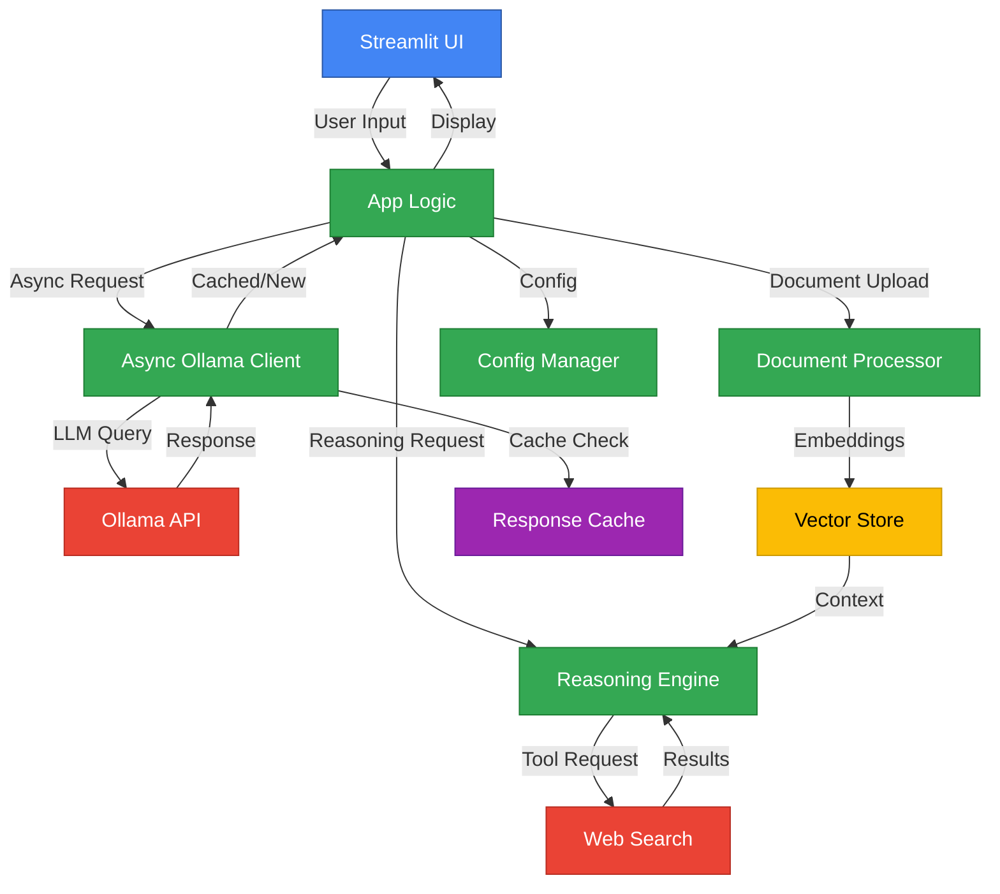
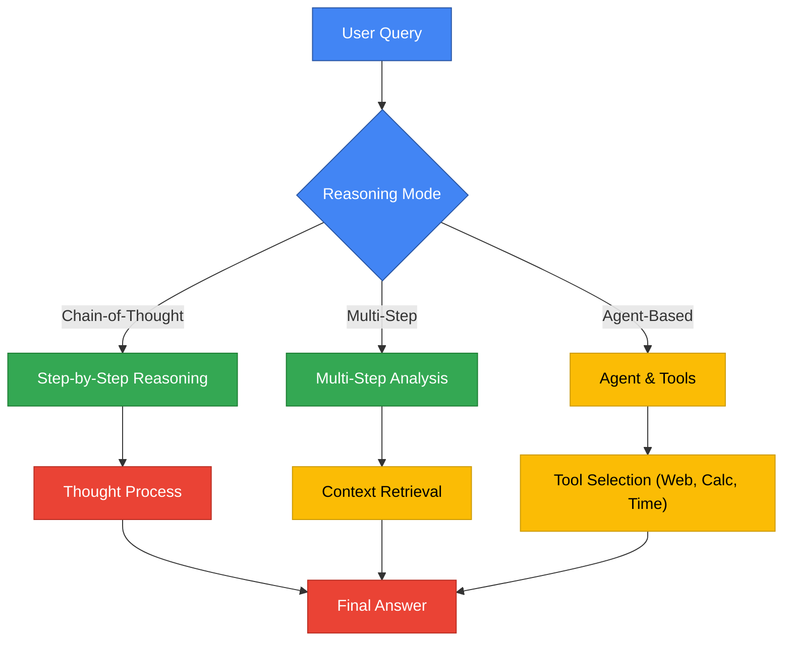
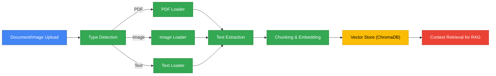
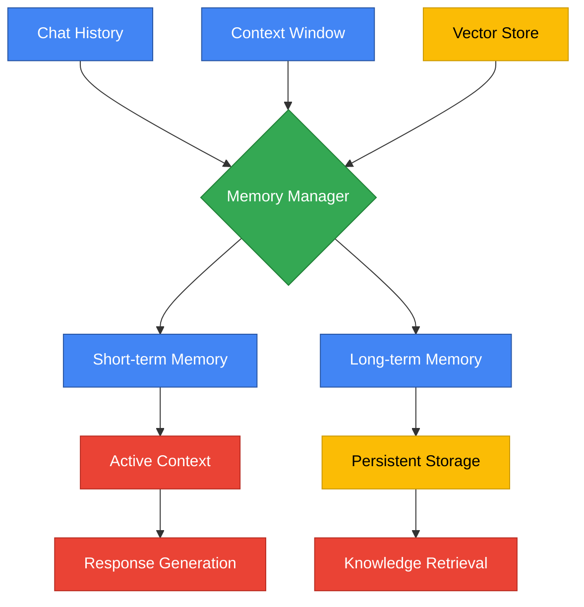
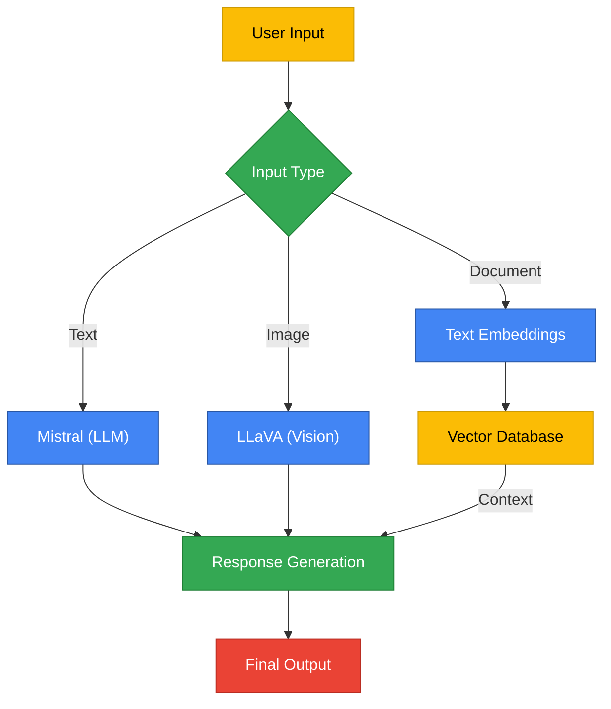
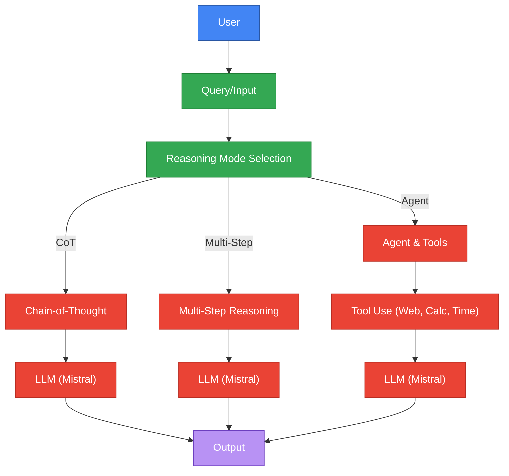

# BasicChat: Your Intelligent Local AI Assistant

## Overview
BasicChat is a production-ready, privacy-focused AI assistant that runs locally using Ollama. Built with modern async architecture, intelligent caching, and advanced reasoning capabilities, it provides a professional-grade chat experience with RAG (Retrieval Augmented Generation), multi-modal processing, and smart tools - all through a clean Streamlit interface.

## 🌟 Key Features

### 🚀 Performance & Reliability
- **Async Architecture**: High-performance async/await implementation with connection pooling
- **Smart Caching**: Multi-layer caching with Redis support and memory fallback
- **Rate Limiting**: Intelligent request throttling to prevent API overload
- **Health Monitoring**: Real-time service health checks and diagnostics
- **Graceful Fallbacks**: Automatic fallback to sync operations if async fails

### 🧠 Advanced Reasoning Engine
- **Chain-of-Thought Reasoning**: Step-by-step problem solving with visible thought process
- **Multi-Step Reasoning**: Complex query breakdown with context-aware processing
- **Agent-Based Reasoning**: Dynamic tool selection (Calculator, Web Search, Time)
- **Confidence Scoring**: Built-in confidence assessment for all responses
- **Streaming Responses**: Real-time output with thought process visualization

### 📄 Document & Multi-Modal Processing
- **Multi-format Support**: PDF, TXT, MD, and image processing
- **RAG Implementation**: Semantic search with ChromaDB vector store
- **Image Analysis**: OCR and visual content understanding
- **Structured Data**: Intelligent document chunking and embedding

### 🔧 Developer Experience
- **Configuration Management**: Environment-based configuration with validation
- **Comprehensive Testing**: 46+ tests with 80%+ coverage
- **Type Safety**: Full TypeScript-style type hints and validation
- **Modular Architecture**: Clean separation of concerns with reusable components

## 🏗️ System Architecture



## 🧠 Reasoning Modes Flow


## 📄 Document & Image Processing Pipeline


## 🧠 Memory Management System


## 🤖 Model Interaction Flow


## 🧩 Data Flow: End-to-End User Query


## 🚀 Quick Start

### Prerequisites
- **Ollama**: [Install Ollama](https://ollama.ai)
- **Python**: 3.11 or higher
- **Git**: For cloning the repository

### 1. Install Required Models
```bash
# Core models for basic functionality
ollama pull mistral              # Primary reasoning model
ollama pull nomic-embed-text     # Embedding model for RAG

# Optional models for enhanced capabilities
ollama pull llava               # Vision model for image analysis
ollama pull codellama           # Code generation and analysis
```

### 2. Clone and Setup
```bash
# Clone the repository
git clone https://github.com/khaosans/basic-chat-template.git
cd basic-chat-template

# Create virtual environment
python -m venv venv
source venv/bin/activate  # Windows: .\venv\Scripts\activate

# Install dependencies
pip install -r requirements.txt
```

### 3. Configure Environment (Optional)
Create `.env.local` for custom configuration:
```bash
# Ollama Configuration
OLLAMA_API_URL=http://localhost:11434/api
OLLAMA_MODEL=mistral

# Performance Settings
ENABLE_CACHING=true
CACHE_TTL=3600
RATE_LIMIT=10
REQUEST_TIMEOUT=30

# Redis Configuration (Optional)
REDIS_URL=redis://localhost:6379
REDIS_ENABLED=false

# Logging
LOG_LEVEL=INFO
ENABLE_STRUCTURED_LOGGING=true
```

### 4. Start the Application
```bash
# Start Ollama service (if not running)
ollama serve &

# Launch BasicChat
streamlit run app.py
```

The application will be available at `http://localhost:8501`

## 🧪 Testing

### Run All Tests
```bash
# Complete test suite with coverage
pytest

# Specific test categories
pytest tests/test_basic.py      # Core functionality
pytest tests/test_reasoning.py  # Reasoning engine
pytest tests/test_processing.py # Document processing
pytest tests/test_web_search.py # Web search integration
```

### Test Coverage
- **46 tests** covering all major components
- **80%+ coverage** with detailed reporting
- **Async test support** for performance components
- **Mock integration** for external dependencies

## 🔧 Development

### Project Structure
```
basic-chat-template/
├── app.py                    # Main Streamlit application
├── config.py                 # Configuration management
├── reasoning_engine.py       # Advanced reasoning capabilities
├── document_processor.py     # Document handling and RAG
├── web_search.py            # Web search integration
├── utils/                   # Utility modules
│   ├── async_ollama.py      # Async Ollama client
│   ├── caching.py           # Caching system
│   └── __init__.py
├── tests/                   # Comprehensive test suite
│   ├── test_basic.py        # Core functionality tests
│   ├── test_reasoning.py    # Reasoning engine tests
│   ├── test_processing.py   # Document processing tests
│   └── conftest.py          # Test configuration
├── requirements.txt         # Python dependencies
├── pytest.ini              # Test configuration
└── README.md               # This file
```

### Key Components

#### Configuration Management (`config.py`)
- Environment-based configuration
- Validation and type safety
- Centralized settings management

#### Async Ollama Client (`utils/async_ollama.py`)
- Connection pooling with aiohttp
- Rate limiting and retry logic
- Streaming support
- Health monitoring

#### Caching System (`utils/caching.py`)
- Multi-layer caching (Redis + Memory)
- Smart cache key generation
- TTL and size management
- Fallback mechanisms

#### Reasoning Engine (`reasoning_engine.py`)
- Chain-of-Thought reasoning
- Multi-step analysis
- Agent-based tools
- Confidence scoring

## 📊 Performance Features

### Caching Strategy
- **Response Caching**: Intelligent caching of LLM responses
- **Multi-layer**: Redis primary, memory fallback
- **Smart Keys**: Hash-based cache keys with parameters
- **TTL Management**: Configurable expiration times

### Async Architecture
- **Connection Pooling**: Efficient HTTP connection reuse
- **Rate Limiting**: Prevents API overload
- **Retry Logic**: Exponential backoff for failures
- **Streaming**: Real-time response delivery

### Monitoring & Diagnostics
- **Health Checks**: Service availability monitoring
- **Cache Statistics**: Performance metrics
- **Error Handling**: Graceful failure recovery
- **Logging**: Structured logging with configurable levels

## 🎯 Usage Examples

### Basic Chat
```python
from app import OllamaChat

chat = OllamaChat("mistral")
response = chat.query({"inputs": "What is the capital of France?"})
print(response)  # "The capital of France is Paris."
```

### Advanced Reasoning
```python
from reasoning_engine import ReasoningChain

chain = ReasoningChain("mistral")
result = chain.execute_reasoning("Explain quantum computing")
# Returns structured result with reasoning steps and confidence
```

### Document Processing
```python
from document_processor import DocumentProcessor

processor = DocumentProcessor()
# Upload and process documents for RAG
```

## 🔧 Configuration Options

### Performance Tuning
```bash
# Increase rate limits for high-traffic scenarios
RATE_LIMIT=20
RATE_LIMIT_PERIOD=1

# Adjust caching for memory-constrained environments
CACHE_MAXSIZE=500
CACHE_TTL=1800

# Optimize timeouts for your network
REQUEST_TIMEOUT=60
CONNECT_TIMEOUT=10
```

### Model Selection
```bash
# Use different models for specific tasks
OLLAMA_MODEL=llama2          # Alternative base model
EMBEDDING_MODEL=nomic-embed-text  # Embedding model
```

## 🐛 Troubleshooting

### Common Issues

#### Ollama Connection Issues
```bash
# Check if Ollama is running
ollama list

# Restart Ollama service
ollama serve
```

#### Cache Issues
```bash
# Clear cache if experiencing issues
# The cache will automatically reset on restart
```

#### Performance Issues
```bash
# Check system resources
# Adjust rate limits and timeouts in .env.local
# Monitor cache statistics in the UI
```

### Debug Mode
```bash
# Enable debug logging
LOG_LEVEL=DEBUG
ENABLE_STRUCTURED_LOGGING=true
```

## 🤝 Contributing

We welcome contributions! Please see our contributing guidelines:

1. **Fork the repository**
2. **Create a feature branch**: `git checkout -b feature/amazing-feature`
3. **Add tests** for new functionality
4. **Ensure all tests pass**: `pytest`
5. **Submit a pull request**

### Development Setup
```bash
# Install development dependencies
pip install -r requirements.txt

# Run tests with coverage
pytest --cov=app --cov-report=html

# Format code
black .
flake8 .
```

## 📝 License

This project is licensed under the MIT License - see the [LICENSE](LICENSE) file for details.

## 📚 Additional Documentation

- [Reasoning Capabilities](REASONING_FEATURES.md) - Detailed reasoning engine documentation
- [Known Issues](BUGS.md) - Current limitations and workarounds
- [API Reference](docs/api.md) - Technical API documentation

## 🚀 Roadmap

### Week 2: Containerization & CI/CD
- Docker containerization
- GitHub Actions CI/CD pipeline
- Automated testing and deployment

### Week 3: Monitoring & Observability
- Structured logging with ELK stack
- Metrics collection and dashboards
- Performance monitoring

### Week 4: UX Improvements
- Progressive loading and skeleton screens
- Error boundaries and graceful degradation
- Mobile responsiveness

### Week 5: Advanced Features
- Multi-user support
- Conversation persistence
- Advanced RAG capabilities

---

**Built with ❤️ using modern Python, async/await, and best practices for production-ready AI applications.**
