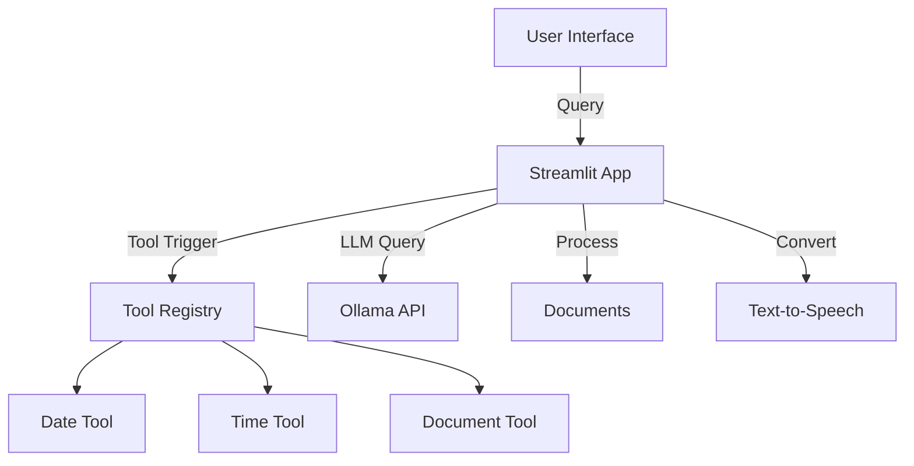

# Ollama Chatbot

## Project Overview
A Streamlit-based chatbot interface powered by Ollama with:
- Natural language conversations
- Document processing (PDFs, images)
- Built-in tools (time, date, document summary)
- Text-to-speech functionality

## Latest Features
### 🆕 Enhanced Features
- **Tool Integration**: Built-in tools for common queries
  - Date lookup
  - Time lookup (with timezone support)
  - Document summarization
- **Audio Features**: Text-to-speech with playback controls
- **Document Processing**: Support for PDFs and images
- **Clean File Management**: No temporary files left behind

## Architecture

