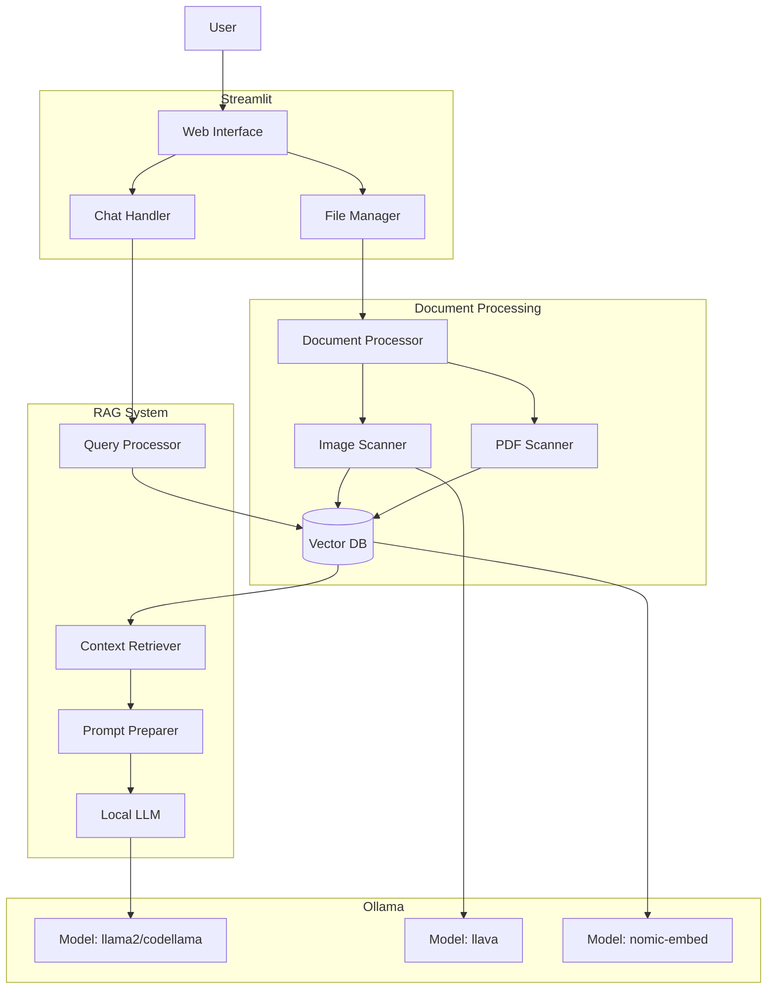
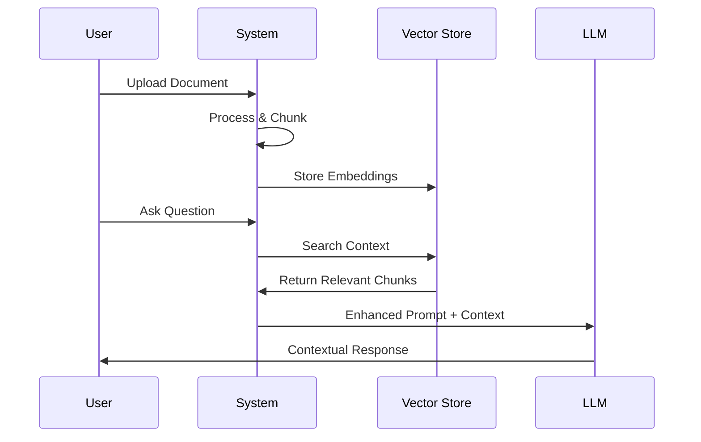
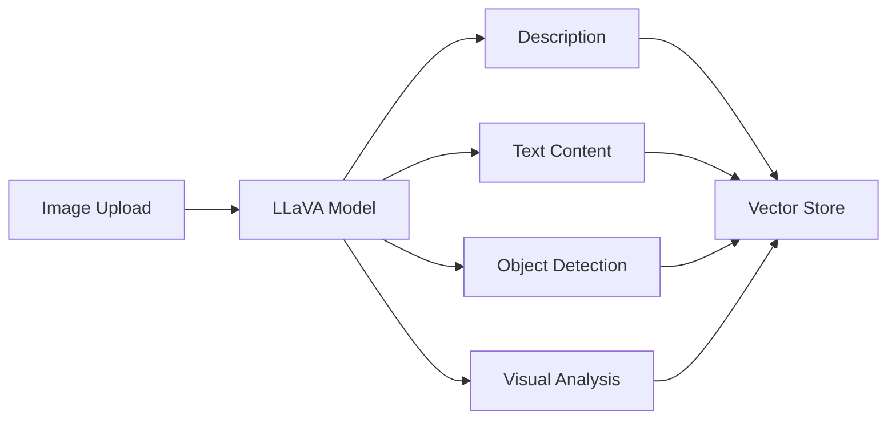
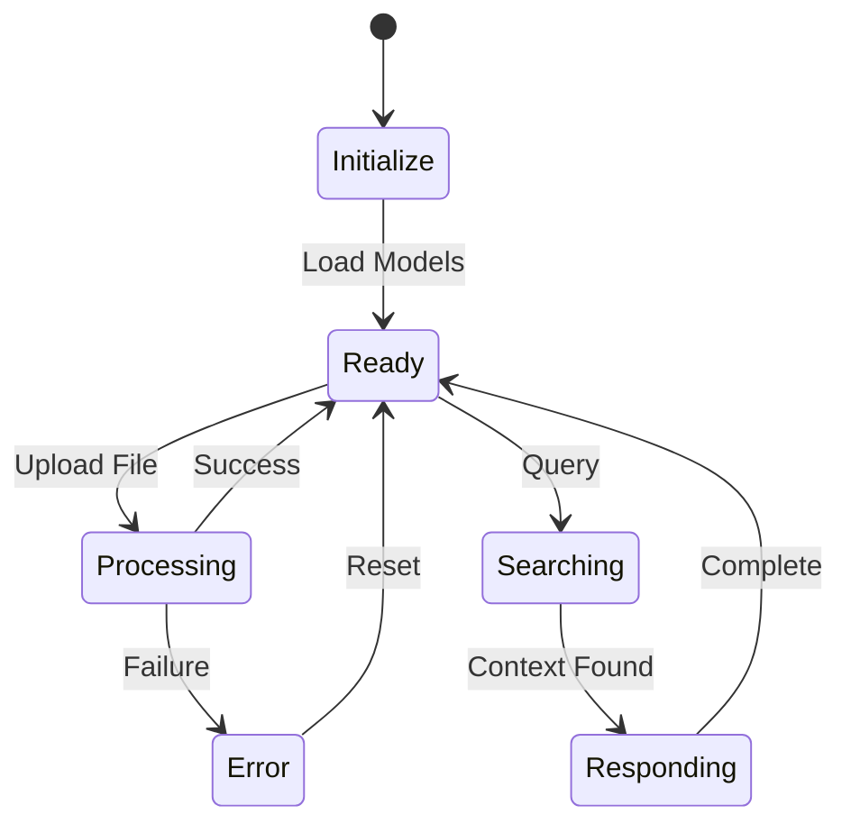

# Document-Aware Local LLM Chatbot

A locally-hosted RAG (Retrieval Augmented Generation) implementation using Ollama and LangChain.

## Core Features

- 🤖 **Local LLM Processing**: Runs entirely locally using Ollama models
- 📄 **Document Analysis**:
  - PDF document parsing and chunking
  - Image analysis using LLaVA model
  - Persistent document storage with Chroma
- 🔍 **Smart Context Retrieval**:
  - Semantic search across documents
  - Relevance scoring
  - Automatic context integration
- 💾 **Robust State Management**:
  - Automatic state recovery
  - Safe document deletion
  - Session persistence
- 🖼️ **Advanced Image Analysis**:
  - Visual content description
  - Text extraction from images
  - Object and element detection
  - Color and composition analysis

## Architecture Overview



## Technical Requirements

- Python 3.8+
- Ollama server running locally
- Required Ollama models:
  - `llama2` (or any chat model)
  - `llava` (for image processing)
  - `nomic-embed-text` (for document embeddings)

## Quick Start

1. **Install Ollama**:
   Follow instructions at [Ollama.ai](https://ollama.ai)

2. **Install Dependencies**:
   ```bash
   pip install -r requirements.txt
   ```

3. **Pull Required Models**:
   ```bash
   ollama pull llama2
   ollama pull llava
   ollama pull nomic-embed-text
   ```

4. **Run Application**:
   ```bash
   streamlit run app.py
   ```

## Usage Guide

1. **Document Management**:
   - Upload PDFs or images via sidebar
   - Monitor processing progress
   - Remove documents as needed
   - Reset all data with one click

2. **Chat Interface**:
   - Select LLM model from available options
   - Ask questions about documents
   - Request document summaries
   - Get image analysis results

3. **System Features**:
   - Rate limiting (20 requests/minute)
   - Automatic error recovery
   - Progress tracking for processing
   - Debug logging for transparency

## Implementation Details

### 1. RAG Implementation

Our RAG system works in three key phases:



#### Document Processing
- Chunking Strategy: RecursiveCharacterTextSplitter
  - Chunk size: 1000 characters
  - Overlap: 200 characters
- Embedding Model: nomic-embed-text
- Storage: ChromaDB for persistence

### 2. Multi-Modal Analysis

Image processing workflow:



### 3. State Management



## System Components

### Vector Store (ChromaDB)
- **Purpose**: Document embedding storage and retrieval
- **Features**:
  - Persistent storage
  - Similarity search
  - Metadata management
  - Automatic recovery

### Document Processor
- **Capabilities**:
  ```python
  class DocumentProcessor:
      # Key methods:
      def process_file()     # Handles uploads
      def get_relevant_context() # RAG retrieval
      def reset_state()      # State management
  ```

### LLM Integration
- **Models**:
  - Chat: llama2/codellama
  - Vision: llava
  - Embeddings: nomic-embed-text
- **Features**:
  - Streaming responses
  - Context window management
  - Error recovery
  - Rate limiting

## Performance Considerations

1. **Memory Management**
   - Chunking for efficient processing
   - Automatic garbage collection
   - State cleanup on restart

2. **Response Time**
   - Async document processing
   - Optimized context retrieval
   - Progress tracking

3. **Error Handling**
   - Automatic recovery
   - State persistence
   - User feedback

## Project Structure
```
.
├── app.py                 # Main Streamlit application
├── document_processor.py  # Document handling and storage
├── ollama_api.py         # Ollama interface
└── requirements.txt      # Dependencies
```

## Known Limitations

- Requires local Ollama installation
- Processing large PDFs may be slow
- Image analysis requires significant memory
- Limited to supported file formats (PDF, PNG, JPG)

## Error Recovery

The system includes automatic recovery for:
- Corrupted vector stores
- Failed document processing
- Connection issues
- State inconsistencies

## Future Improvements

1. **Enhanced RAG**
   - Hybrid search
   - Re-ranking
   - Dynamic context window

2. **Performance**
   - Batch processing
   - Caching