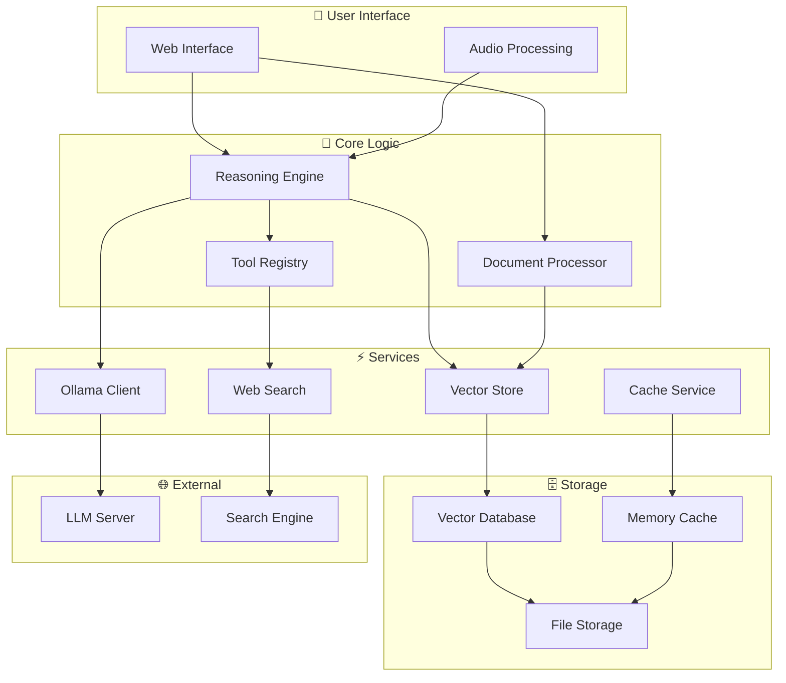

# BasicChat: Your Intelligent Local AI Assistant

<div align="center">


**🔒 Privacy-First • 🧠 Advanced Reasoning • 🔬 Deep Research • ⚡ High Performance**

[](https://python.org)
[](https://streamlit.io)
[](https://ollama.ai)
[](https://redis.io)
[](LICENSE)

*An intelligent, private AI assistant that runs entirely on your local machine*

</div>

---

## 🎥 Demo

<div align="center">


*Real-time reasoning and document analysis with local AI models*

</div>

---

## 🚀 Quick Start

> **🟢 TL;DR:**
> 1. **Install [Ollama](https://ollama.ai)** and [Python 3.11+](https://python.org)
> 2. **Clone this repo**: `git clone ... && cd basic-chat`
> 3. **Create venv**: `python -m venv venv && source venv/bin/activate`
> 4. **Install deps**: `pip install -r requirements.txt`
> 5. **Pull models**: `ollama pull mistral` and `ollama pull nomic-embed-text`
> 6. **Start app**: `./start_basicchat.sh` (recommended) or `./start_dev.sh`
> 7. **Visit**: [http://localhost:8501](http://localhost:8501) (or your chosen port)

### Prerequisites
- **Ollama** (local LLM server)
- **Python 3.11+**
- **Redis** (optional, for background tasks)
- **Git**

### Install Required Models
```bash
ollama pull mistral              # Reasoning model
ollama pull nomic-embed-text     # Embedding model for RAG
ollama pull llava                # (Optional) Vision model for images
```

### Clone & Setup
```bash
git clone https://github.com/khaosans/basic-chat-template.git
cd basic-chat-template
python -m venv venv
source venv/bin/activate
pip install -r requirements.txt
```

### Start the Application
```bash
# Start Ollama (if not running)
ollama serve &

# Start app with all services (recommended)
./start_basicchat.sh
# or for dev mode
./start_dev.sh
```

**App URLs:**
- Main App: [http://localhost:8501](http://localhost:8501)
- Task Monitor (Flower): [http://localhost:5555](http://localhost:5555)
- Redis: `localhost:6379`
- Ollama: `localhost:11434`

---

## 🌐 Streaming API & Fallback

BasicChat supports real-time streaming chat via a FastAPI backend, with robust fallback to local inference for maximum reliability and privacy.

### 🔌 Enabling Streaming API
- By default, the app uses the streaming API backend for chat.
- Control this with the `USE_API` environment variable:
  - `USE_API=true` (default): Use the API backend (WebSocket streaming, REST fallback)
  - `USE_API=false`: Use local Ollama inference only (no API required)
- Set this in your `.env.local` file:
  ```env
  USE_API=true
  API_BASE_URL=http://localhost:8080
  OLLAMA_API_URL=http://localhost:11434/api
  OLLAMA_MODEL=mistral
  ```

### 🚀 Starting the Streaming Backend
1. **Start the API backend:**
   ```sh
   ./backend/start.sh &
   ```
2. **Start the Streamlit app:**
   ```sh
   ./start_basicchat.sh &
   ```
3. **Run E2E tests:**
   ```sh
   bunx playwright test tests/e2e/specs/basic-e2e.spec.ts --project=chromium --headed
   ```

### 🔄 How Fallback Works
- If the API backend is unavailable or `USE_API=false`, BasicChat automatically falls back to local Ollama inference.
- WebSocket streaming is preferred; if it fails, REST API is used; if both fail, local inference is used.
- This ensures chat always works, even if the backend is down or misconfigured.

### 🩺 Health Checks & Troubleshooting
- **Check API health:**
  ```sh
  curl http://localhost:8080/health
  ```
- **Run all service health checks before E2E:**
  ```sh
  poetry run python scripts/e2e_health_check.py
  ```
- **If chat is not streaming:**
  - Ensure the backend is running on port 8080
  - Check `.env.local` for correct `USE_API` and `API_BASE_URL`
  - Review logs in `app.log` and backend console for errors
  - Try setting `USE_API=false` to use local inference as a workaround

---

## 🏆 Best Practices & Pro Tips

<div style="background:#e3f2fd; padding:1em; border-radius:8px; border-left:5px solid #1976d2;">

- **🟢 Always use local code for E2E and dev** (not Docker)
- **🟢 Run health checks before E2E**: `poetry run python scripts/e2e_health_check.py`
- **🟢 Use `.env.local` for secrets and config** (never commit keys)
- **🟢 Use streaming for best UX**
- **🟢 Monitor logs and Flower for background tasks**
- **🟢 Stop all Docker containers before local dev/E2E**
- **🟢 Ensure backwards compatibility for stored data**
- **🟢 Store all important keys in `.env.local`**
- **🟢 Use `bunx` for TypeScript, `poetry` for Python**
- **🟢 Prefer `0.0.0.0` over `localhost` for server hosts**
- **🟢 Check `progress.md` for always-up-to-date tips**

</div>

---

## 🛠️ Development & Testing

- **Run all tests**: `pytest -n auto`
- **E2E tests**: `bunx playwright test --reporter=list`
- **Coverage**: `pytest --cov=app --cov-report=html`
- **Pre-commit hooks**: `pre-commit run --all-files`
- **Type checking**: `mypy . --strict`
- **CI/CD**: Always starts from source, not Docker

---

## 🧩 Troubleshooting

- **Redis not running?**: `brew services start redis` or `sudo systemctl start redis`
- **Ollama not running?**: `ollama serve`
- **Port in use?**: `lsof -i :8501` then `kill -9 <PID>`
- **Permission issues?**: `chmod +x *.sh`
- **Check logs**: `tail -f basicchat.log`
- **Health check**: `poetry run python scripts/e2e_health_check.py`

---

## 🏗️ Architecture Overview

```ascii
+-------------------+      +-------------------+      +-------------------+
|   User Interface  | ---> |  Reasoning Engine | ---> |   Ollama/Tools    |
+-------------------+      +-------------------+      +-------------------+
        |                        |                            |
        v                        v                            v
+-------------------+      +-------------------+      +-------------------+
| Document Uploads  | ---> | Document Processor| ---> |  ChromaDB/Vector  |
+-------------------+      +-------------------+      +-------------------+
```

<details>
<summary>Mermaid: System Architecture</summary>


</details>

---

## 📚 Documentation & Further Reading

- [Startup Guide](STARTUP_GUIDE.md)
- [Development Guide](docs/DEVELOPMENT.md)
- [Features Overview](docs/FEATURES.md)
- [System Architecture](docs/ARCHITECTURE.md)
- [Technical Overview](docs/TECHNICAL_OVERVIEW.md)
- [Planning & Roadmap](docs/ROADMAP.md)
- [Evaluators & LLM Judge](docs/EVALUATORS.md)
- [progress.md](progress.md) — always up-to-date best practices

---

## 📝 License

This project is licensed under the MIT License - see the [LICENSE](LICENSE) file for details.

---

<div align="center">
Built with ❤️ using modern Python, async/await, and best practices for production-ready AI applications.
</div>
