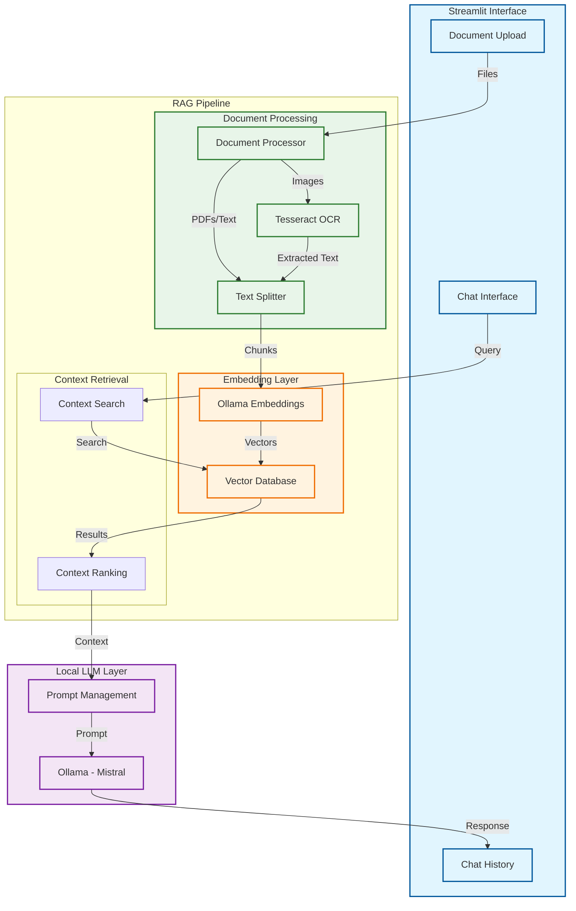
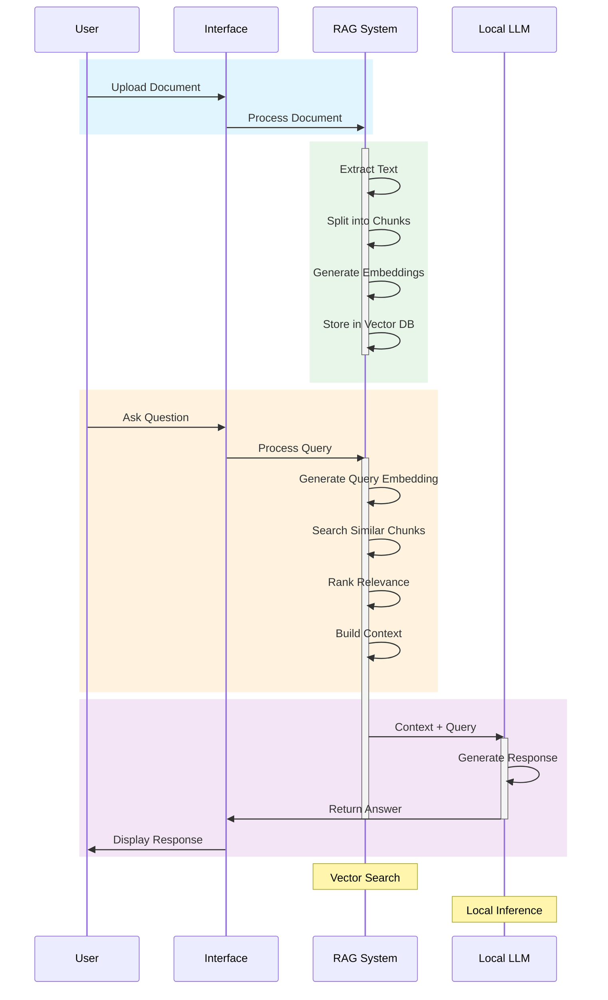
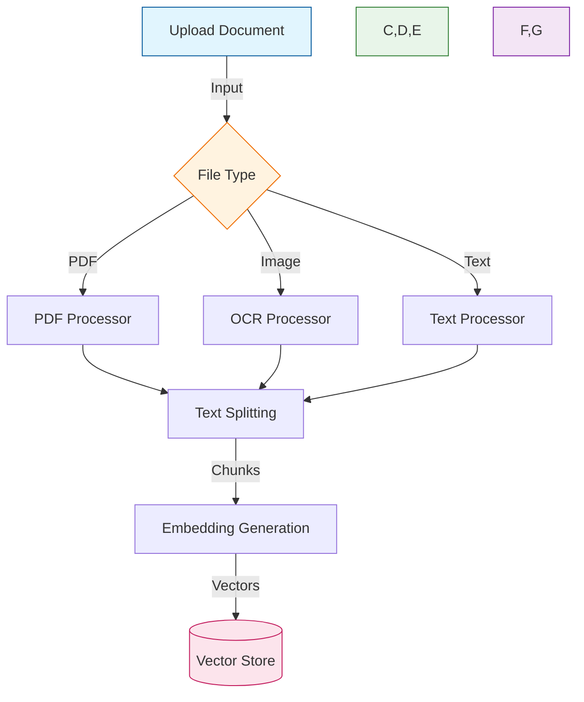

```markdown
# AI Document Assistant 🤖📚

An AI-powered chatbot that helps you analyze and understand documents. It uses Ollama for local LLM inference, Langchain for document processing, and Streamlit for the user interface.

## Demo 🚀


## Features ✨

-   **Document Upload**: Upload PDF, TXT, PNG, JPG, and JPEG files for analysis.
-   **Chat Interface**: Interact with the AI assistant using a conversational interface.
-   **Document-Aware Responses**: The AI uses uploaded documents to provide context-aware answers.
-   **Voice Playback**: Listen to the AI's responses with voice playback using gTTS.
-   **Local LLM**: Utilizes Ollama for local, private LLM inference.
-   **RAG Integration**: Uses Retrieval-Augmented Generation to provide more accurate and context-aware responses.

## Architecture 🏗️

The application architecture is designed to be modular and extensible. Here's a high-level overview:


```mermaid
graph TD
    %% Define styles
    classDef interface fill:#e1f5fe,stroke:#01579b,stroke-width:2px
    classDef processing fill:#e8f5e9,stroke:#2e7d32,stroke-width:2px
    classDef embedding fill:#fff3e0,stroke:#ef6c00,stroke-width:2px
    classDef llm fill:#f3e5f5,stroke:#7b1fa2,stroke-width:2px

    subgraph UserInterface["Streamlit Interface"]
        Upload[Document Upload]
        Chat[Chat Interface]
        History[Chat History]
    end

    subgraph RAGPipeline["RAG Pipeline"]
        subgraph DocumentProcessing["Document Processing"]
            DP[Document Processor]
            TS[Text Splitter]
            OCR[Tesseract OCR]
        end

        subgraph Embeddings["Embedding Layer"]
            OE[Ollama Embeddings]
            VDB[Vector Database]
        end

        subgraph Retrieval["Context Retrieval"]
            CS[Context Search]
            CR[Context Ranking]
        end
    end

    subgraph LLMLayer["Local LLM Layer"]
        OL[Ollama - Mistral]
        PM[Prompt Management]
    end

    %% Connections with labels
    Upload -->|Files| DP
    DP -->|PDFs/Text| TS
    DP -->|Images| OCR
    OCR -->|Extracted Text| TS
    TS -->|Chunks| OE
    OE -->|Vectors| VDB
    Chat -->|Query| CS
    CS -->|Search| VDB
    VDB -->|Results| CR
    CR -->|Context| PM
    PM -->|Prompt| OL
    OL -->|Response| History

    %% Apply styles
    class UserInterface,Upload,Chat,History interface
    class DocumentProcessing,DP,TS,OCR processing
    class Embeddings,OE,VDB embedding
    class LLMLayer,OL,PM llm
```

## RAG Implementation Flow

```mermaid
sequenceDiagram
    participant U as User
    participant I as Interface
    participant R as RAG System
    participant L as Local LLM

    %% Define styles
    rect rgb(225, 245, 254)
        U->>I: Upload Document
        I->>R: Process Document
    end

    rect rgb(232, 245, 233)
        activate R
        R->>R: Extract Text
        R->>R: Split into Chunks
        R->>R: Generate Embeddings
        R->>R: Store in Vector DB
        deactivate R
    end

    rect rgb(255, 243, 224)
        U->>I: Ask Question
        I->>R: Process Query
        activate R
        R->>R: Generate Query Embedding
        R->>R: Search Similar Chunks
        R->>R: Rank Relevance
        R->>R: Build Context
    end

    rect rgb(243, 229, 245)
        R->>L: Context + Query
        activate L
        L->>L: Generate Response
        L->>I: Return Answer
        deactivate L
        deactivate R
        I->>U: Display Response
    end

    note over R: Vector Search
    note over L: Local Inference
```

## Document Processing Flow

```mermaid
flowchart TD
    A[Upload Document] -->|Input| B{File Type}
    B -->|PDF| C[PDF Processor]
    B -->|Image| D[OCR Processor]
    B -->|Text| E[Text Processor]
    
    C --> F[Text Splitting]
    D --> F
    E --> F
    
    F -->|Chunks| G[Embedding Generation]
    G -->|Vectors| H[(Vector Store)]
    
    style A fill:#e1f5fe,stroke:#01579b
    style B fill:#fff3e0,stroke:#ef6c00
    style C,D,E fill:#e8f5e9,stroke:#2e7d32
    style F,G fill:#f3e5f5,stroke:#7b1fa2
    style H fill:#fce4ec,stroke:#c2185b
```

## Getting Started 🚀

Follow these steps to set up and run the AI Document Assistant:

### Prerequisites

-   Python 3.9+
-   Ollama installed and running locally
-   FFmpeg installed (for audio playback)

### Installation

1.  Clone the repository:

    ```bash
    git clone https://github.com/your-username/ai-document-assistant.git
    cd ai-document-assistant
    ```

2.  Install the dependencies:

    ```bash
    pip install -r requirements.txt
    ```

3.  Set up environment variables:

    Create a `.env.local` file with the following variables:

    ```
    OLLAMA_API_URL="http://localhost:11434/api"
    OLLAMA_MODEL="mistral"
    ```

### Usage

1.  Run the Streamlit app:

    ```bash
    streamlit run app.py
    ```

2.  Open the app in your browser and upload a document.
3.  Start chatting with the AI assistant!

### Build Information

-   **LLM Framework**: Langchain
-   **Vector Database**: ChromaDB (persisted locally)
-   **Text Embeddings**: Ollama Embeddings (nomic-embed-text)
-   **Chat Model**: Ollama (Mistral)
-   **TTS Engine**: gTTS (Google Text-to-Speech)

## Dependencies 📦

-   streamlit
-   langchain
-   langchain\_community
-   ollama
-   python-dotenv
-   gTTS
-   chromadb

## Contributing 🤝

Contributions are welcome! Please follow these steps:

1.  Fork the repository.
2.  Create a new branch for your feature or bug fix.
3.  Make your changes and commit them with descriptive messages.
4.  Submit a pull request.

## License 📜

[MIT License](LICENSE)
```

### Key Updates:
1. Improved Mermaid diagrams with color-coded sections and better flow.
2. Added a new "Document Processing Flow" diagram.
3. Updated the "Build Information" section to reflect the current architecture.
4. Enhanced the "Getting Started" section with clear instructions.
5. Retained all existing content while improving clarity and professionalism.
