# BasicChat: Your Intelligent Local AI Assistant

<div align="center">


**🔒 Privacy-First • 🧠 Advanced Reasoning • ⚡ High Performance**

[](https://python.org)
[](https://streamlit.io)
[](https://ollama.ai)
[](LICENSE)

*An intelligent, private AI assistant that runs entirely on your local machine*

</div>

---

## 🎥 Demo

<div align="center">


*Real-time reasoning and document analysis with local AI models*

</div>

---

## 🌟 Key Features

<div align="center">

| 🔒 **Privacy** | 🧠 **Intelligence** | 🛠️ **Tools** | 📄 **Documents** | ⚡ **Performance** |
|:---:|:---:|:---:|:---:|:---:|
| 100% Local Processing | 5 Reasoning Modes | Smart Calculator | Multi-Format Support | Async Architecture |
| No External APIs | Chain-of-Thought | Time Tools | PDF, Text, Images | Multi-Layer Caching |
| Data Never Leaves | Multi-Step Analysis | Web Search | Advanced RAG | Connection Pooling |

</div>

### 🔒 **Privacy First**
- **Complete Local Processing**: All AI operations run on your machine
- **No Data Transmission**: Your data never leaves your local environment
- **Secure by Design**: Built with privacy as a core principle

### 🧠 **Advanced Reasoning**
- **Multi-Modal Reasoning**: 5 different reasoning strategies for optimal problem-solving
- **Chain-of-Thought**: Step-by-step reasoning for complex problems
- **Agent-Based**: Intelligent tool selection and execution
- **Auto Mode**: Automatically selects the best reasoning approach

### 🛠️ **Powerful Built-in Tools**
- **Enhanced Calculator**: Advanced mathematical operations with step-by-step reasoning
- **Time Tools**: Timezone-aware time calculations and conversions
- **Web Search**: Real-time information retrieval via DuckDuckGo
- **Document Analysis**: Intelligent document summarization and Q&A

### 📄 **Document & Image Analysis**
- **Multi-Format Support**: PDF, text, markdown, and image files
- **Advanced RAG**: Retrieval-Augmented Generation with semantic search
- **OCR Capabilities**: Image text extraction using vision models
- **Vector Storage**: Efficient ChromaDB-based document indexing

### ⚡ **Performance Optimized**
- **Async Architecture**: Non-blocking request handling
- **Multi-Layer Caching**: Redis + Memory caching for 50-80% faster responses
- **Connection Pooling**: Optimized HTTP connections with rate limiting
- **Resource Management**: Automatic cleanup and memory optimization

---

## 🚀 Quick Start

### 1. **Prerequisites**

```bash
# Required Software
- Python 3.11+ 
- Ollama (for local LLMs)
- Git (for cloning)
```

### 2. **Installation**

```bash
# Clone the repository
git clone https://github.com/khaosans/basic-chat-template.git
cd basic-chat-template

# Create virtual environment
python -m venv venv
source venv/bin/activate  # On Windows: .\venv\Scripts\activate

# Install dependencies
pip install -r requirements.txt
```

### 3. **Download AI Models**

```bash
# Core models for reasoning and embeddings
ollama pull mistral
ollama pull nomic-embed-text

# Optional: Vision model for image analysis
ollama pull llava
```

### 4. **Launch Application**

```bash
# Start Ollama service (if not running)
ollama serve

# Launch BasicChat
streamlit run app.py
```

**🌐 Access at:** `http://localhost:8501`

---

## 🏗️ Architecture Overview

```mermaid
graph TB
    subgraph "🎨 User Interface"
        UI[Web Interface]
        AUDIO[Audio Processing]
    end
    
    subgraph "🧠 Core Logic"
        RE[Reasoning Engine]
        DP[Document Processor]
        TR[Tool Registry]
    end
    
    subgraph "⚡ Services"
        AO[Ollama Client]
        VS[Vector Store]
        CS[Cache Service]
    end
    
    subgraph "🗄️ Storage"
        CHROMA[Vector Database]
        CACHE[Memory Cache]
    end
    
    subgraph "🌐 External"
        OLLAMA[LLM Server]
    end
    
    %% User Interface Connections
    UI --> RE
    UI --> DP
    AUDIO --> RE
    
    %% Core Logic Connections
    RE --> AO
    RE --> TR
    DP --> VS
    
    %% Service Connections
    AO --> OLLAMA
    VS --> CHROMA
    CS --> CACHE
    
    %% Styling
    classDef ui fill:#E3F2FD,stroke:#1976D2,stroke-width:2px,color:#0D47A1
    classDef core fill:#F3E5F5,stroke:#7B1FA2,stroke-width:2px,color:#4A148C
    classDef service fill:#E8F5E8,stroke:#388E3C,stroke-width:2px,color:#1B5E20
    classDef storage fill:#FFF3E0,stroke:#F57C00,stroke-width:2px,color:#E65100
    classDef external fill:#FCE4EC,stroke:#C2185B,stroke-width:2px,color:#880E4F
    
    class UI,AUDIO ui
    class RE,DP,TR core
    class AO,VS,CS service
    class CHROMA,CACHE storage
    class OLLAMA external
```

<div align="center">



</div>

---

## 📚 Documentation

<div align="center">

| 📖 **Guide** | 📋 **Description** | 🔗 **Link** |
|:---|:---|:---:|
| **Technical Overview** | High-level system summary and characteristics | [📊](docs/TECHNICAL_OVERVIEW.md) |
| **Features Overview** | Complete feature documentation and capabilities | [📄](docs/FEATURES.md) |
| **System Architecture** | Technical architecture and component interactions | [🏗️](docs/ARCHITECTURE.md) |
| **Development Guide** | Contributing and development workflows | [🛠️](docs/DEVELOPMENT.md) |
| **Project Roadmap** | Future features and development plans | [🗺️](docs/ROADMAP.md) |
| **Reasoning Features** | Advanced reasoning engine details | [🧠](docs/REASONING_FEATURES.md) |

</div>

---

## 🧪 Testing

```bash
# Run all tests
pytest

# Run with coverage
pytest --cov=app --cov-report=html

# Run specific test categories
pytest tests/test_reasoning.py      # Reasoning engine tests
pytest tests/test_document_workflow.py  # Document processing tests
pytest tests/test_enhanced_tools.py     # Tool functionality tests
```

---

## 🛠️ Development

### **Code Quality**
```bash
# Format code
black .

# Lint code
flake8 .

# Type checking
mypy .
```

### **Database Management**
```bash
# Clean up ChromaDB directories
python scripts/cleanup_chroma.py --status
python scripts/cleanup_chroma.py --dry-run
python scripts/cleanup_chroma.py --force
```

---

## 🤝 Contributing

We welcome contributions! Please see our [Development Guide](docs/DEVELOPMENT.md) for details.

**Quick Start for Contributors:**
1. Fork the repository
2. Create a feature branch: `git checkout -b feature/amazing-feature`
3. Make your changes and add tests
4. Run the test suite: `pytest`
5. Submit a pull request

---

## 📊 Performance Metrics

<div align="center">

| **Metric** | **Value** | **Description** |
|:---|:---:|:---|
| **Cache Hit Rate** | 70-85% | Response caching efficiency |
| **Response Time** | 50-80% faster | With caching vs without |
| **Connection Pool** | 100 total, 30/host | HTTP connection optimization |
| **Rate Limit** | 10 req/sec | Default API throttling |

</div>

---

## 🔒 Security & Privacy

- ✅ **Local Processing Only**: No data sent to external services
- ✅ **Input Validation**: Comprehensive sanitization and validation
- ✅ **Rate Limiting**: Protection against abuse and DDoS
- ✅ **Error Handling**: Graceful degradation with secure defaults
- ✅ **Session Isolation**: No cross-user data access

---

## 📄 License

This project is licensed under the MIT License - see the [LICENSE](LICENSE) file for details.

---

<div align="center">

**Made with ❤️ for privacy-conscious AI enthusiasts**

[](https://github.com/khaosans/basic-chat-template)
[](https://github.com/khaosans/basic-chat-template)

</div>
