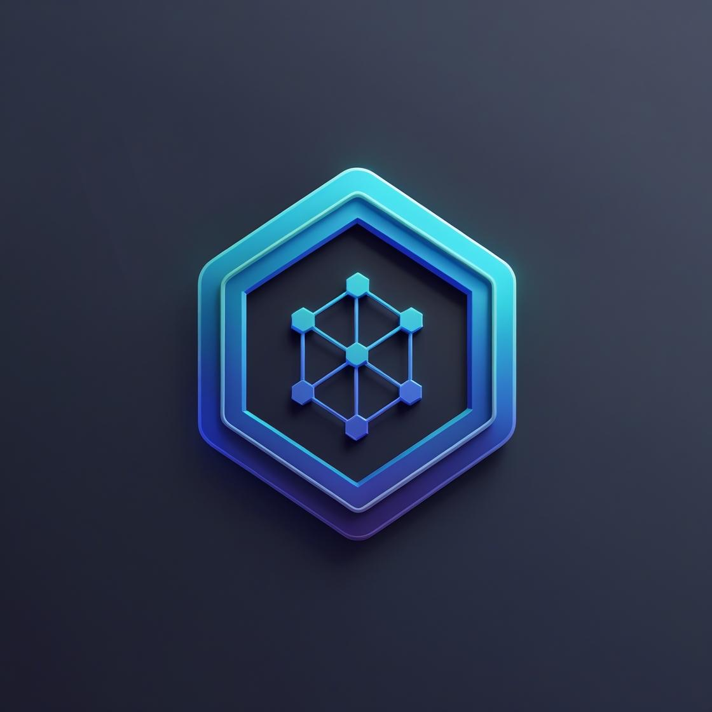

<div align="center">

[📊 Overview](docs/TECHNICAL_OVERVIEW.md) | [📄 Features](docs/FEATURES.md) | [🏗️ Architecture](docs/ARCHITECTURE.md) | [🛠️ Development](docs/DEVELOPMENT.md) | [🗺️ Roadmap](docs/ROADMAP.md) | [🧠 Reasoning](docs/REASONING_FEATURES.md) | [⚖️ LLM Judge](docs/EVALUATORS.md) | [🚦 CI Optimization](docs/CI_OPTIMIZATION.md) | [🔗 GitHub Models](docs/GITHUB_MODELS_INTEGRATION.md) | [🧪 Testing](docs/TESTING.md)

---

# BasicChat: Your Intelligent Local AI Assistant



**🔒 Privacy-First • 🧠 Advanced Reasoning • 🔬 Deep Research • ⚡ High Performance**

[](https://python.org)
[](https://streamlit.io)
[](https://ollama.ai)
[](https://redis.io)
[](LICENSE)

*An intelligent, private AI assistant that runs entirely on your local machine.*

*Experience real-time reasoning and document analysis with local AI models.*

</div>

---

## 🌟 Key Features

<div align="center">

| 🔒 **Privacy** | 🧠 **Intelligence** | 🔬 **Research** | 🛠️ **Tools** | 📄 **Documents** | ⚡ **Performance** |
|:---:|:---:|:---:|:---:|:---:|:---:|
| 100% Local Processing | 5 Reasoning Modes | Deep Research Mode | Smart Calculator | Multi-Format Support | Async Architecture |
| No External APIs | Chain-of-Thought | Multi-Source Analysis | Time Tools | PDF, Text, Images | Multi-Layer Caching |
| Data Never Leaves | Multi-Step Analysis | Academic Rigor | Web Search | Advanced RAG | Connection Pooling |

</div>

### 🔒 Privacy First

- **Local Processing**: All AI operations are executed on your machine.
- **No Data Transmission**: Your data remains within your local environment.
- **Secure by Design**: Privacy is a core principle.

### 🧠 Advanced Reasoning

- **Multi-Modal Reasoning**: Five strategies for optimal problem-solving.
- **Chain-of-Thought**: Step-by-step reasoning for complex issues.
- **Agent-Based**: Intelligent tool selection and execution.
- **Auto Mode**: Automatically selects the best reasoning approach.

### 🔬 Deep Research Mode

- **Comprehensive Research**: Multi-source analysis with academic rigor.
- **Intuitive Interface**: Clean, user-friendly research mode.
- **Rich Results**: Summaries, key findings, detailed analysis, and sources.
- **Background Processing**: Long-running tasks with progress tracking.
- **Source Citations**: Proper attribution and links to sources.

### 🛠️ Built-in Tools

- **Enhanced Calculator**: Advanced operations with step-by-step reasoning.
- **Time Tools**: Timezone-aware calculations and conversions.
- **Web Search**: Real-time information retrieval.
- **Document Analysis**: Summarization and Q&A.

### 📄 Document & Image Analysis

- **Multi-Format Support**: PDF, text, markdown, and images.
- **Advanced RAG**: Retrieval-Augmented Generation with semantic search.
- **OCR Capabilities**: Text extraction from images.
- **Vector Storage**: Efficient document indexing.

### ⚡ Performance Optimized

- **Async Architecture**: Non-blocking request handling.
- **Multi-Layer Caching**: Faster responses with Redis and memory caching.
- **Connection Pooling**: Optimized HTTP connections.
- **Resource Management**: Automatic cleanup and memory optimization.

---

## 🎥 Demo

<div align="center">


</div>

---

## 🚀 Quick Start

### Prerequisites

- Python 3.11+ 
- Ollama (for local LLMs)
- Redis (for background tasks)
- Git (for cloning)

### Installation

```bash
# 1. Clone the repository
git clone https://github.com/khaosans/basic-chat.git
cd basic-chat

# 2. (Recommended) Create a virtual environment
python -m venv venv
source venv/bin/activate  # On Windows: .\\venv\\Scripts\\activate

# 3. Install dependencies
pip install -r requirements.txt

# 4. Download required models
ollama pull mistral
ollama pull nomic-embed-text
ollama pull llava  # Optional: for image processing

# 5. (Optional) Start Redis for background tasks
docker-compose up -d redis
```

---

## ⚡ Usage

```bash
# Start the application (with background tasks and Redis)
./start_basicchat.sh

# Or for development (with hot reload, Celery, Redis, Flower)
./start_dev.sh
```

- Access the app at: `http://localhost:8501`
- Flower dashboard (task monitoring): `http://localhost:5555`

---

## 🗑️ Database Cleanup

To manage ChromaDB vector storage and avoid disk bloat:

```bash
# Check ChromaDB status
python scripts/cleanup_chroma.py --status

# Clean up old directories (older than 24 hours)
python scripts/cleanup_chroma.py --age 24

# Force cleanup
python scripts/cleanup_chroma.py --force
```

---

## 🧪 Testing

```bash
# Run all tests
pytest

# Run with coverage
pytest --cov=app --cov-report=html --cov-report=term

# Run integration tests
pytest tests/integration/
```

---

## 🏗️ System Architecture

See [docs/ARCHITECTURE.md](docs/ARCHITECTURE.md) for detailed diagrams, narratives, and technology stack.

---

## 🛠️ Configuration

- Copy `.env.local.example` to `.env.local` and adjust as needed.
- See [docs/DEVELOPMENT.md](docs/DEVELOPMENT.md) for environment variables and advanced config.

---

## 🧠 Reasoning Modes & Tools

- Chain-of-Thought, Multi-Step, Agent-Based, Auto, Standard
- Enhanced Calculator, Time Tools, Web Search, Document Analysis
- See [docs/REASONING_FEATURES.md](docs/REASONING_FEATURES.md) and [docs/FEATURES.md](docs/FEATURES.md) for details and usage examples.

---

## 🚦 Troubleshooting

- **Ollama not running:** Ensure `ollama` is started and models are pulled.
- **Redis errors:** Start Redis with Docker or your system package manager.
- **ChromaDB issues:** Use the cleanup script above.
- **See:** [docs/DEVELOPMENT.md](docs/DEVELOPMENT.md#troubleshooting)

---

## 📝 Citation

If you use this project in your research, please cite:

```bibtex
@software{basicchat2024,
  author = {Souriya Khaosanga},
  title = {BasicChat: Local AI Assistant},
  year = {2024},
  url = {https://github.com/khaosans/basic-chat}
}
```

---
