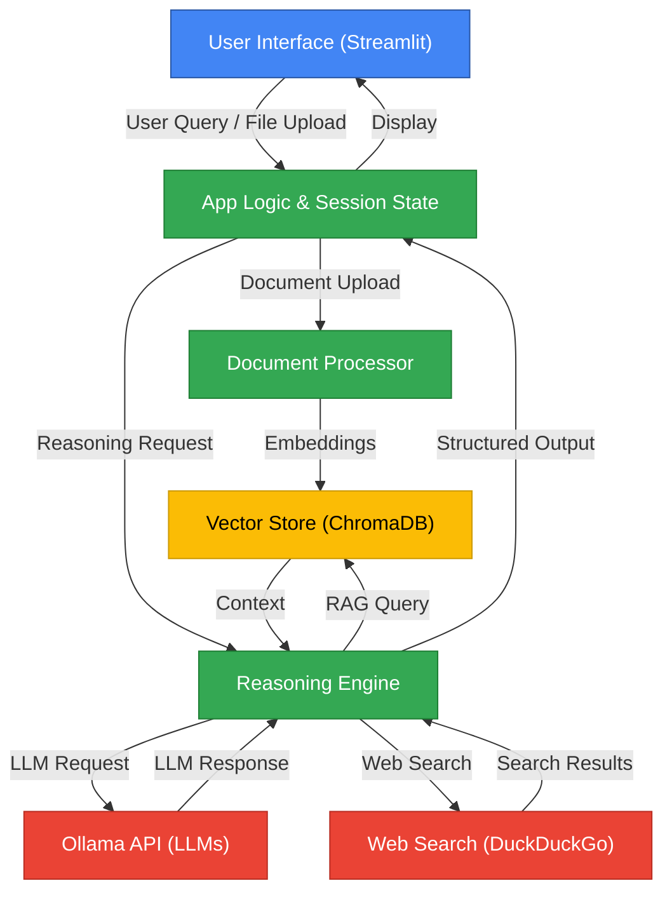

# BasicChat: Your Intelligent Local AI Assistant

## Overview
BasicChat is a privacy-focused AI assistant that runs locally using Ollama. It features advanced reasoning capabilities, RAG (Retrieval Augmented Generation), multi-modal processing, and smart tools - all through a clean Streamlit interface.


## 🌟 Key Features

### Core Capabilities
- Local LLM integration via Ollama
  - Configurable model selection (Mistral as default)
  - Multiple reasoning modes (Chain-of-Thought, Multi-Step, Agent-Based)
  - Streaming responses with thought process visualization
  - Memory-efficient processing

### Advanced Reasoning
- Chain-of-Thought reasoning
  - Step-by-step problem solving
  - Visible reasoning process
  - Confidence scoring
- Multi-Step reasoning
  - Complex query breakdown
  - Context-aware processing
  - Document-based reasoning
- Agent-Based reasoning
  - Tool integration (Calculator, Time, Web Search)
  - Dynamic tool selection
  - Real-time web search capability

### Document Processing
- Multi-format support
  - PDF, TXT, MD file processing
  - Image analysis capabilities
  - Structured data handling
- RAG implementation
  - Semantic search
  - Context retrieval
  - Dynamic knowledge integration

## 🏗️ System Architecture


## 🧠 Reasoning Modes Flow


## 📄 Document & Image Processing Pipeline


## 🧠 Memory Management System


## 🤖 Model Interaction Flow


## 🧩 Data Flow: End-to-End User Query


## 🚀 Quick Start

### Prerequisites
1. Install [Ollama](https://ollama.ai)
2. Python 3.11+
3. Git

### Required Models
```bash
# Install core models
ollama pull mistral        # Primary reasoning model
ollama pull nomic-embed-text   # Embedding model

# Optional models for specific tasks
ollama pull llava         # Vision model (optional)
ollama pull codellama    # Code tasks (optional)
```

### Installation
```bash
# Clone repository
git clone https://github.com/khaosans/basic-chat-template.git
cd basic-chat-template

# Set up environment
python -m venv venv
source venv/bin/activate  # Windows: .\venv\Scripts\activate

# Install dependencies
pip install -r requirements.txt

# Start the app
streamlit run app.py
```

## 🧪 Testing
The project includes comprehensive tests for all components:

```bash
# Run all tests
pytest

# Run specific test categories
pytest tests/test_reasoning.py  # Test reasoning capabilities
pytest tests/test_processing.py # Test document processing
pytest tests/test_web_search.py # Test web search functionality
```

## 🔧 Development

### Project Structure
```
basic-chat-template/
├── app.py                 # Main Streamlit application
├── reasoning_engine.py    # Reasoning capabilities
├── document_processor.py  # Document handling
├── web_search.py         # Web search integration
├── ollama_api.py         # Ollama API interface
├── tests/                # Test suite
└── assets/              # Images and resources
```

### Adding New Features
1. Follow the existing module structure
2. Add appropriate tests
3. Update documentation
4. Ensure all tests pass

## 📝 License
MIT License - See LICENSE file for details.

## 🤝 Contributing
Contributions are welcome! Please read our contributing guidelines and submit pull requests to our GitHub repository.

## 🐛 Troubleshooting
- Ensure Ollama is running (`ollama serve`)
- Check model downloads (`ollama list`)
- Verify port 8501 is available
- Check logs for detailed error messages

## 📚 Documentation
- [Reasoning Capabilities](REASONING_FEATURES.md)
- [Known Issues](BUGS.md)
- [License](LICENSE)
