# 🏗️ BasicChat System Architecture

> **Comprehensive technical architecture documentation for BasicChat's modular, scalable design**

## 📋 Table of Contents

- [System Overview](#system-overview)
- [Architecture Layers](#architecture-layers)
- [Core Components](#core-components)
- [Data Flow](#data-flow)
- [Performance Architecture](#performance-architecture)
- [Security & Privacy](#security--privacy)
- [Scalability Considerations](#scalability-considerations)
- [Technology Stack](#technology-stack)
- [References](#references)

---

## 🎯 System Overview

BasicChat is built on a **layered microservices architecture** that prioritizes modularity, performance, and privacy. The system is designed to run entirely locally while maintaining enterprise-grade capabilities.

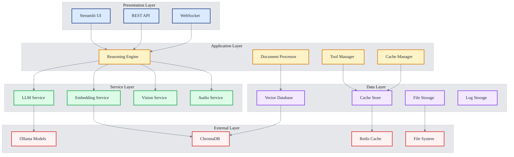

---

## 🏛️ Architecture Layers

### **1. Presentation Layer**

The presentation layer handles all user interactions and provides multiple interfaces for accessing BasicChat's capabilities.

**Components:**
- **Streamlit UI**: Primary web interface with real-time updates
- **REST API**: Programmatic access for integrations
- **WebSocket**: Real-time communication for streaming responses

### **2. Application Layer**

The application layer contains the core business logic and orchestrates interactions between services.

**Components:**
- **Reasoning Engine**: Multi-modal reasoning with 5 different modes
- **Document Processor**: Advanced RAG pipeline with intelligent chunking
- **Tool Manager**: Plugin architecture for extensible functionality
- **Cache Manager**: Multi-layer caching for performance optimization

### **3. Service Layer**

The service layer provides specialized services for different types of AI processing.

**Components:**
- **LLM Service**: Language model interactions and management
- **Embedding Service**: Vector embeddings for semantic search
- **Vision Service**: Image processing and analysis
- **Audio Service**: Speech-to-text and text-to-speech capabilities

### **4. Data Layer**

The data layer manages all data persistence and retrieval operations.

**Components:**
- **Vector Database**: ChromaDB for semantic search and document storage
- **Cache Store**: Redis for high-performance caching
- **File Storage**: Local file system for document and media storage
- **Log Storage**: Structured logging for monitoring and debugging

### **5. External Layer**

The external layer interfaces with external systems and services.

**Components:**
- **Ollama Models**: Local LLM inference engine
- **ChromaDB**: Vector database for embeddings
- **Redis**: In-memory cache for performance
- **File System**: Local storage for all data

---

## 🔧 Core Components

### **Reasoning Engine**

The reasoning engine is the heart of BasicChat, providing multiple reasoning modes for different use cases.

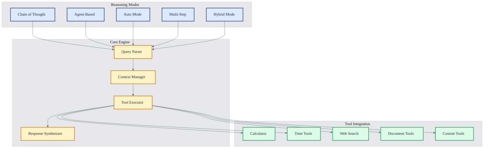

**Features:**
- **5 Reasoning Modes**: Chain-of-Thought, Agent-Based, Auto, Multi-Step, Hybrid
- **Tool Integration**: Seamless integration with built-in and custom tools
- **Context Management**: Intelligent context handling for complex conversations
- **Response Synthesis**: High-quality response generation with confidence scoring

### **Document Processor**

The document processor provides advanced RAG capabilities with intelligent document handling.

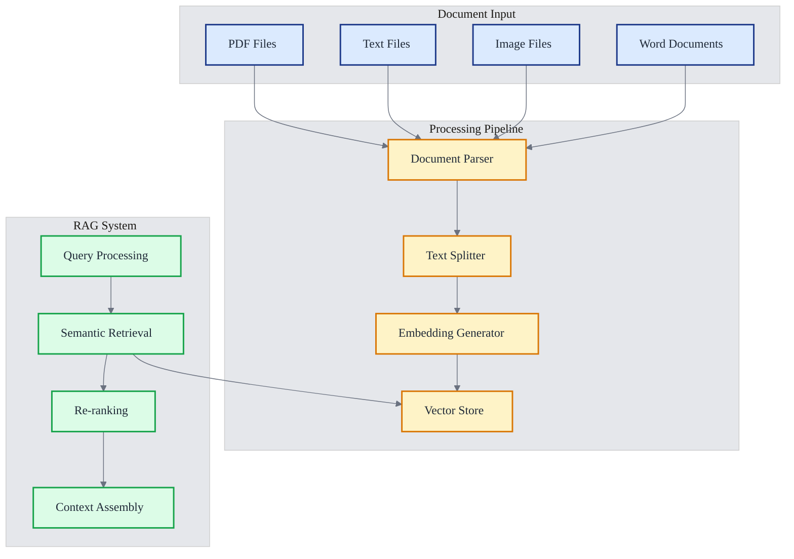

**Features:**
- **Multi-Format Support**: PDF, TXT, Images, Word documents
- **Intelligent Chunking**: Semantic-aware text splitting
- **Advanced RAG**: Multi-stage retrieval with re-ranking
- **Vector Storage**: ChromaDB integration for efficient search

### **Async Ollama Client**

The async Ollama client provides high-performance, non-blocking communication with local LLMs.

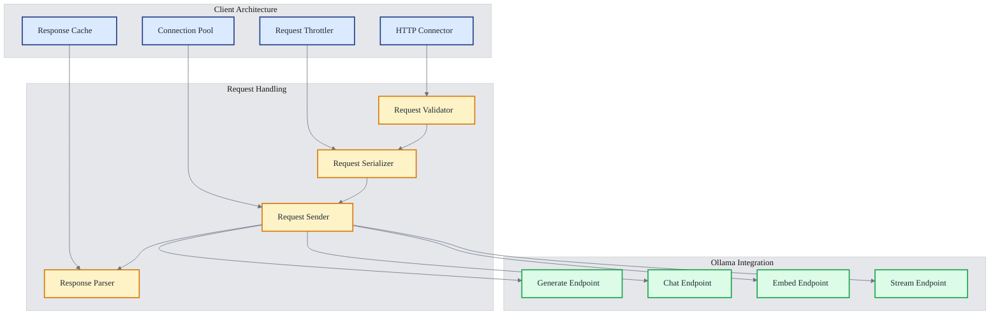

**Features:**
- **Async Processing**: Non-blocking request handling
- **Connection Pooling**: Efficient resource management
- **Request Throttling**: Rate limiting for stability
- **Response Caching**: Performance optimization
- **Streaming Support**: Real-time response streaming

### **Tool Registry**

The tool registry manages the extensible plugin architecture for BasicChat.

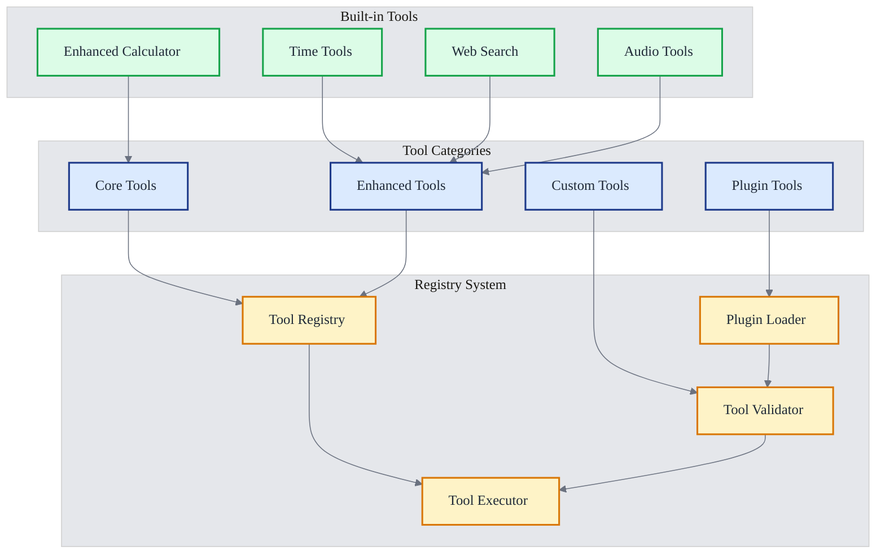

**Features:**
- **Plugin Architecture**: Extensible tool system
- **Built-in Tools**: Enhanced calculator, time tools, web search
- **Custom Tools**: User-defined tool creation
- **Tool Validation**: Safety and compatibility checking

---

## 🔄 Data Flow

### **Standard Query Flow**

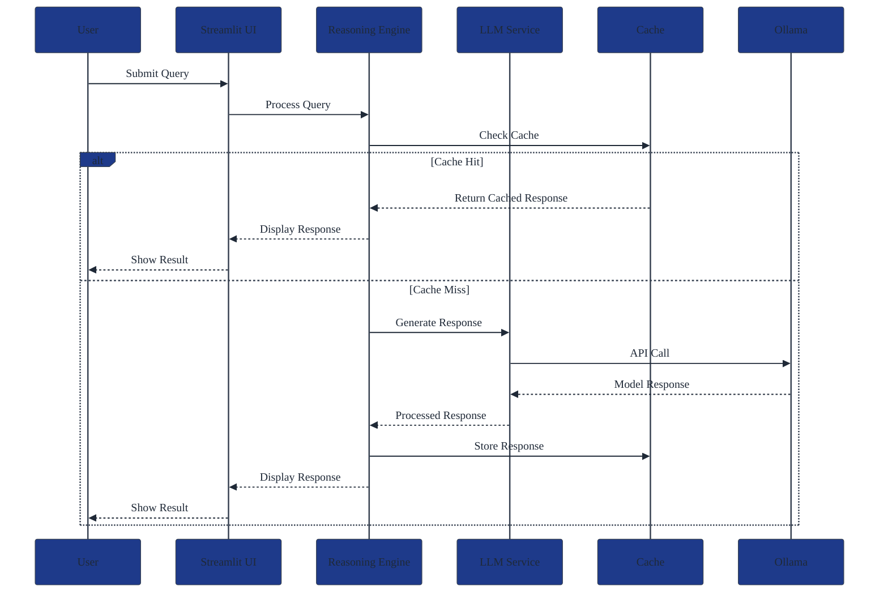

### **Document Analysis Flow**

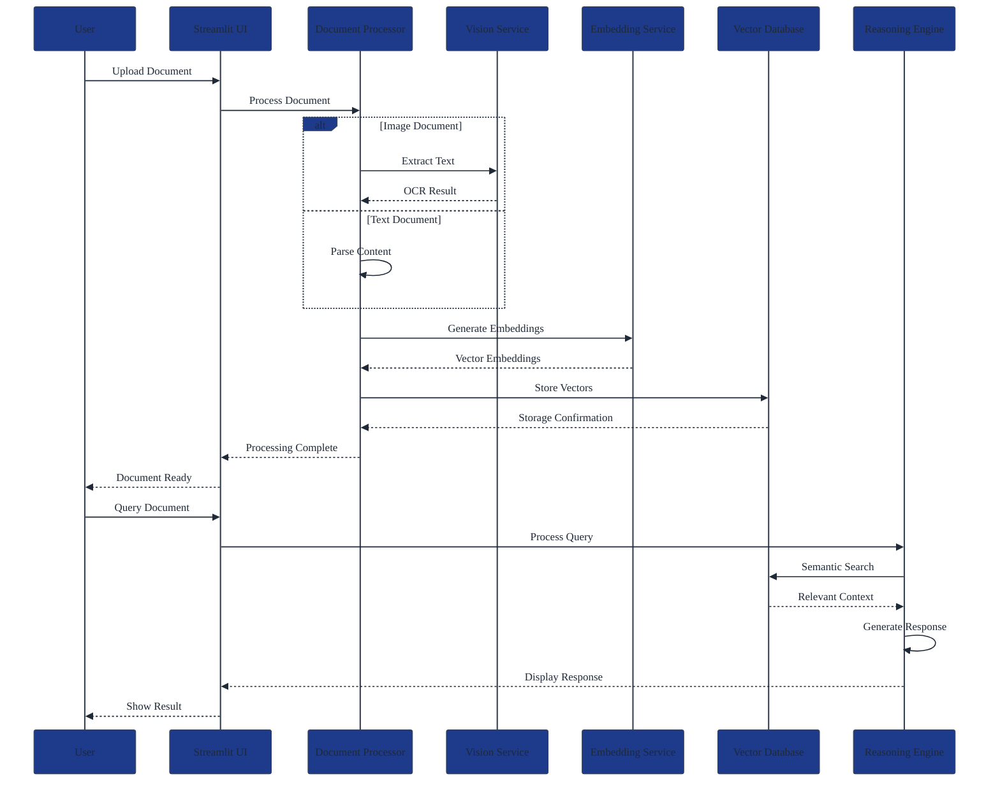

---

## ⚡ Performance Architecture

### **Caching Strategy**

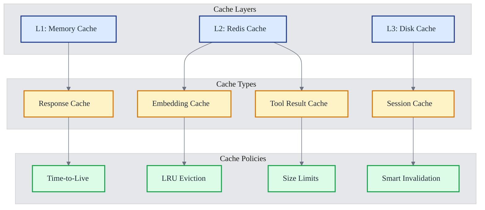

**Performance Features:**
- **Multi-Layer Caching**: L1 (Memory), L2 (Redis), L3 (Disk)
- **Smart Invalidation**: Context-aware cache management
- **Connection Pooling**: Efficient resource utilization
- **Async Processing**: Non-blocking operations
- **Response Streaming**: Real-time output generation

### **Async Architecture**

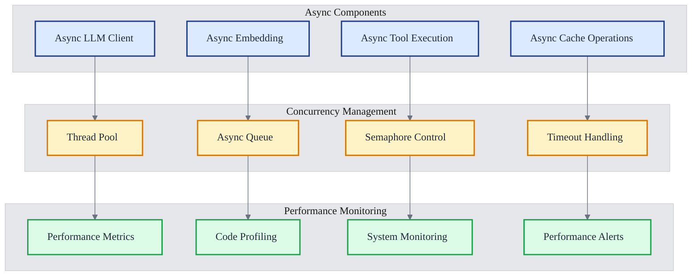

---

## 🔒 Security & Privacy

### **Privacy Architecture**

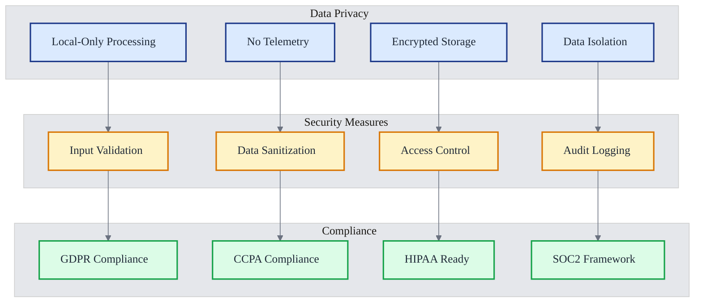

**Security Features:**
- **Local-Only Processing**: No data leaves the user's system
- **No Telemetry**: Complete privacy with no tracking
- **Encrypted Storage**: All data encrypted at rest
- **Input Validation**: Comprehensive input sanitization
- **Access Control**: Role-based access management
- **Audit Logging**: Complete audit trail for compliance

### **Data Flow Security**

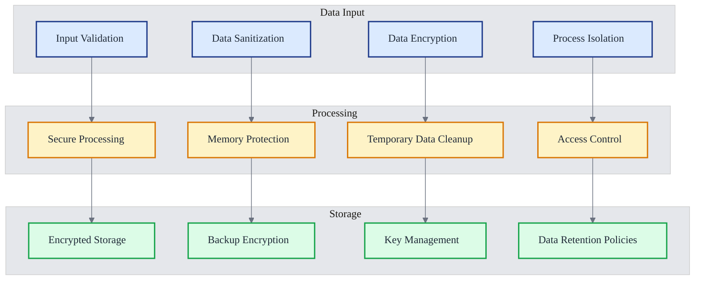

---

## 📈 Scalability Considerations

### **Horizontal Scaling**

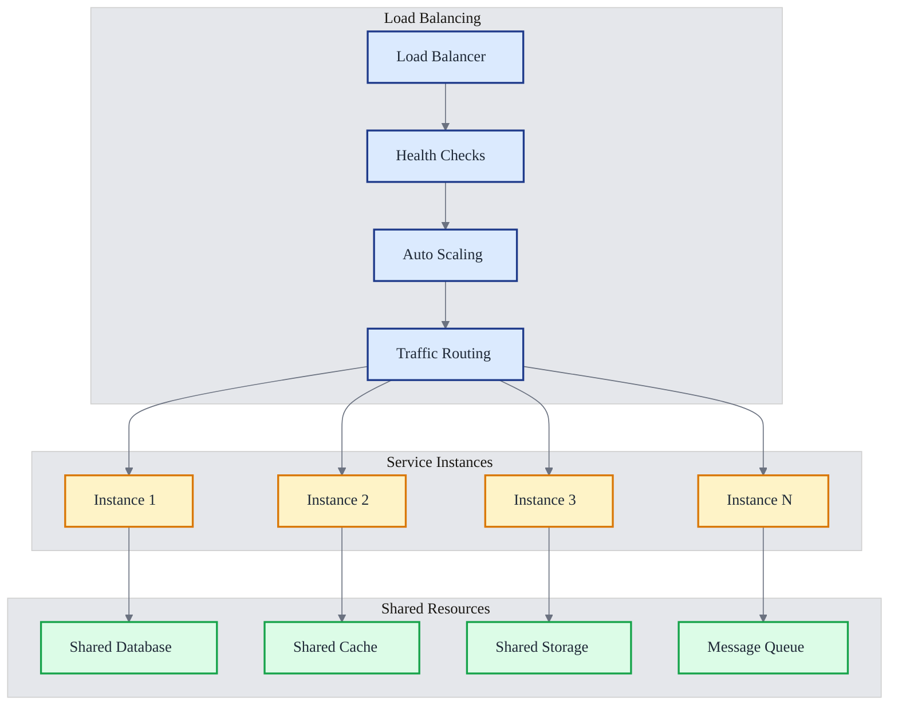

**Scaling Features:**
- **Microservices Architecture**: Independent service scaling
- **Load Balancing**: Intelligent traffic distribution
- **Auto Scaling**: Automatic resource management
- **Shared Resources**: Efficient resource utilization
- **Message Queues**: Asynchronous processing

### **Vertical Scaling**

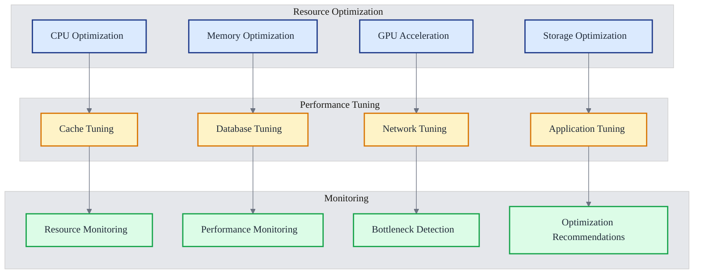

---

## 🛠️ Technology Stack

### **Core Technologies**

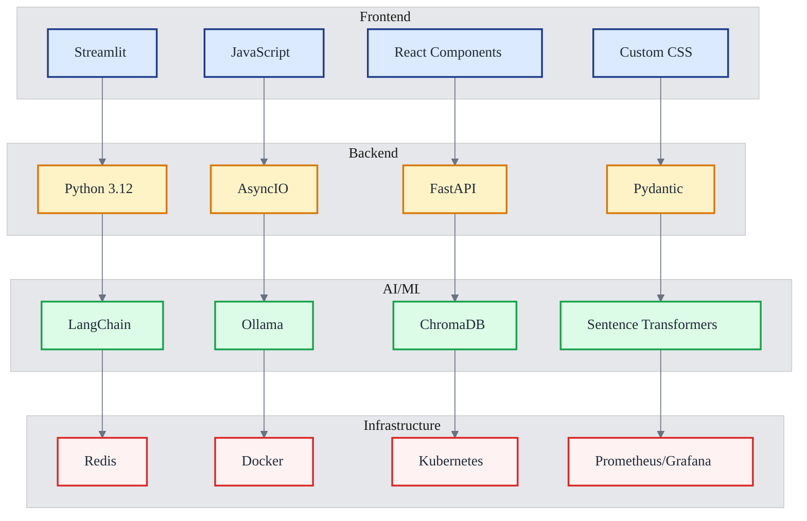

### **Key Libraries**

| **Category** | **Library** | **Version** | **Purpose** |
|:---|:---|:---:|:---|
| **Web Framework** | Streamlit | ≥1.28.0 | User interface |
| **AI Framework** | LangChain | ≥0.1.0 | AI orchestration |
| **Vector Database** | ChromaDB | 1.0.13 | Semantic search |
| **LLM Engine** | Ollama | Latest | Local LLM inference |
| **Caching** | Redis | ≥4.5.0 | High-performance cache |
| **Async Processing** | AsyncIO | Built-in | Asynchronous operations |
| **Data Validation** | Pydantic | ≥2.0.0 | Data validation |
| **Embeddings** | Sentence Transformers | ≥2.2.0 | Text embeddings |

---

## 📚 References

1. **Mermaid Documentation**: Knut Sveidqvist et al. *Mermaid: Markdown-inspired diagramming and charting tool*. GitHub, 2024. Available: https://mermaid.js.org/

2. **System Architecture Patterns**: Fowler, Martin. *Patterns of Enterprise Application Architecture*. Addison-Wesley, 2002.

3. **Microservices Architecture**: Newman, Sam. *Building Microservices: Designing Fine-Grained Systems*. O'Reilly Media, 2021.

4. **AI System Design**: Hulten, Geoff. *Building Intelligent Systems: A Guide to Machine Learning Engineering*. Apress, 2018.

5. **Privacy by Design**: Cavoukian, Ann. *Privacy by Design: The 7 Foundational Principles*. Information and Privacy Commissioner of Ontario, 2009.

6. **Performance Engineering**: Gregg, Brendan. *Systems Performance: Enterprise and the Cloud*. Prentice Hall, 2013.

---

*This architecture document provides a comprehensive overview of BasicChat's technical design. For implementation details, see the individual component documentation and codebase.*

[← Back to README](../README.md) | [Features →](FEATURES.md) | [Development →](DEVELOPMENT.md) | [Roadmap →](ROADMAP.md) 