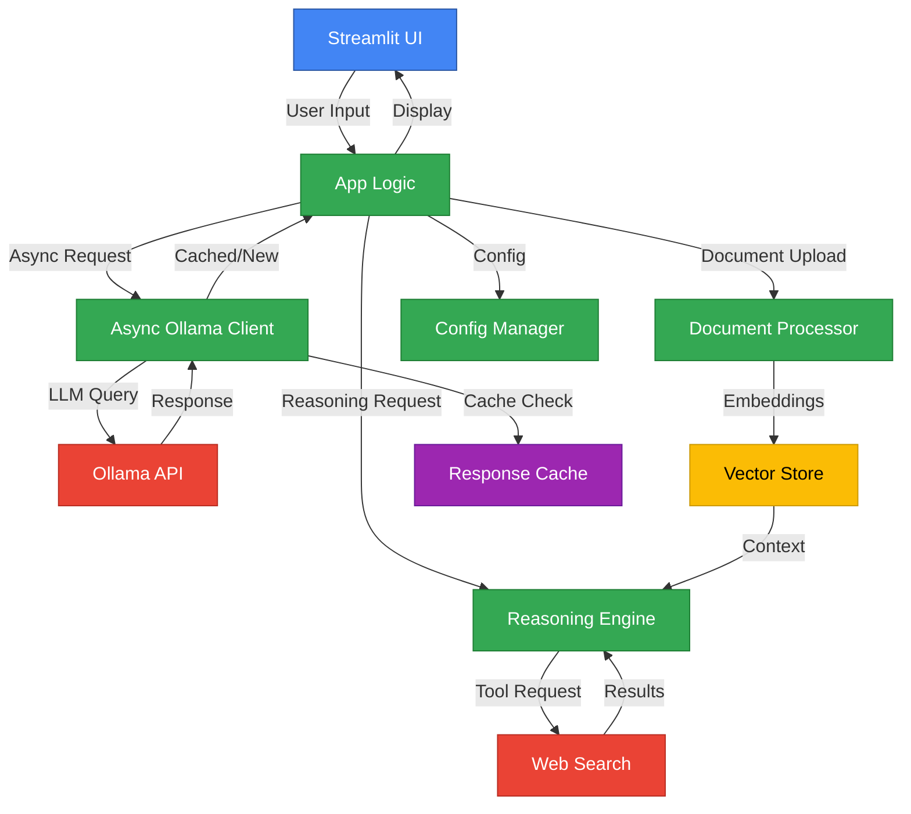
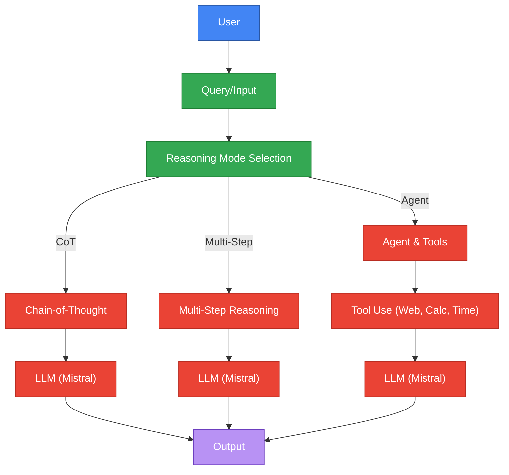
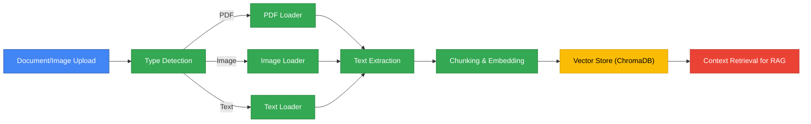

# System Architecture

[← Back to README](../README.md) | [Installation ←](INSTALLATION.md) | [Features ←](FEATURES.md) | [Development →](DEVELOPMENT.md) | [Roadmap →](ROADMAP.md)

---

## Overview
BasicChat uses a modern async architecture with intelligent caching, advanced reasoning capabilities, and multi-modal processing through a clean Streamlit interface.

## Core Architecture

## Key Components

### Frontend Layer
- **Streamlit UI**: Clean, responsive web interface
- **Real-time Updates**: Streaming responses and progress indicators
- **Multi-modal Input**: Text, file uploads, and image processing

### Application Layer
- **App Logic**: Request routing and response handling
- **Config Manager**: Environment-based configuration with validation
- **Session Management**: User state and conversation history

### AI Processing Layer
- **Reasoning Engine**: Chain-of-Thought, Multi-Step, and Agent-Based reasoning
- **Async Ollama Client**: High-performance LLM communication
- **Document Processor**: RAG implementation with vector search

### External Services
- **Ollama API**: Local LLM inference
- **Web Search**: DuckDuckGo integration for real-time information
- **Vector Store**: ChromaDB for semantic search

### Caching Layer
- **Response Cache**: Multi-layer caching (Redis + Memory)
- **Intelligent Keys**: Hash-based cache key generation
- **TTL Management**: Configurable expiration times

## Data Flow

### User Query Processing

### Document Processing Pipeline

## Performance Architecture

### Async Processing
- **Connection Pooling**: 100 total connections, 30 per host
- **Rate Limiting**: Configurable (default: 10 req/sec)
- **Retry Logic**: Exponential backoff with 3 attempts
- **Health Monitoring**: Real-time service availability checks

### Caching Strategy
- **Multi-layer**: Redis primary + Memory fallback
- **Smart Keys**: MD5 hash with parameter inclusion
- **Performance**: 50-80% faster response times
- **Hit Rate**: 70-85% for repeated queries

### Memory Management
- **Session State**: Streamlit session management
- **Vector Store**: ChromaDB with configurable persistence
- **Cache Limits**: Configurable TTL and size limits
- **Resource Cleanup**: Automatic cleanup and garbage collection

## Security Architecture

### Input Validation
- **Expression Sanitization**: Safe mathematical operations
- **File Upload Security**: Type validation and size limits
- **Rate Limiting**: Per-user/IP request throttling
- **Error Handling**: Graceful degradation and fallbacks

### Data Privacy
- **Local Processing**: All data processed locally via Ollama
- **No External Storage**: No data sent to external services (except web search)
- **Configurable Logging**: Optional structured logging
- **Session Isolation**: User session separation

## Scalability Considerations

### Horizontal Scaling
- **Stateless Design**: Session state in Streamlit
- **Redis Integration**: Distributed caching support
- **Load Balancing**: Ready for multiple instances
- **Health Checks**: Service availability monitoring

### Performance Optimization
- **Async Operations**: Non-blocking request handling
- **Connection Reuse**: HTTP connection pooling
- **Batch Processing**: Efficient document chunking
- **Memory Management**: Configurable cache sizes

## Technology Stack

### Core Technologies
- **Python 3.11+**: Main programming language
- **Streamlit**: Web application framework
- **Ollama**: Local LLM server
- **ChromaDB**: Vector database

### Key Libraries
- **aiohttp**: Async HTTP client/server
- **LangChain**: LLM application framework
- **Pydantic**: Data validation
- **pytest**: Testing framework

### External Services
- **DuckDuckGo**: Web search (no API key required)
- **Redis**: Optional distributed caching
- **Tesseract**: OCR for image processing

## 🔗 Related Documentation

- **[Installation Guide](INSTALLATION.md)** - Setup and configuration
- **[Features Overview](FEATURES.md)** - Detailed feature documentation
- **[Development Guide](DEVELOPMENT.md)** - Contributing and development
- **[Production Roadmap](ROADMAP.md)** - Future development plans
- **[Reasoning Features](../REASONING_FEATURES.md)** - Advanced reasoning engine details

## 📚 References

### Architecture Patterns
- **Async/Await Pattern**: [Microsoft Documentation](https://docs.microsoft.com/en-us/dotnet/standard/asynchronous-programming-patterns)
- **Caching Best Practices**: [Redis Documentation](https://redis.io/topics/optimization)
- **Rate Limiting**: [Cloudflare Documentation](https://developers.cloudflare.com/fundamentals/get-started/concepts/rate-limiting)

### Core Technologies
- **Ollama**: [https://ollama.ai](https://ollama.ai) - Local large language model server
- **Streamlit**: [https://streamlit.io](https://streamlit.io) - Web application framework
- **LangChain**: [https://langchain.com](https://langchain.com) - LLM application framework
- **ChromaDB**: [https://chromadb.ai](https://chromadb.ai) - Vector database

---

[← Back to README](../README.md) | [Installation ←](INSTALLATION.md) | [Features ←](FEATURES.md) | [Development →](DEVELOPMENT.md) | [Roadmap →](ROADMAP.md) 