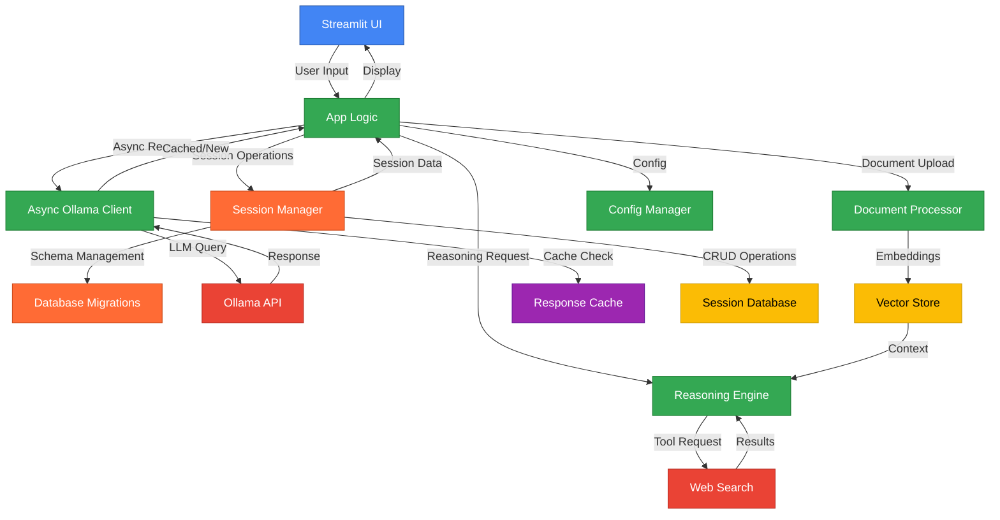
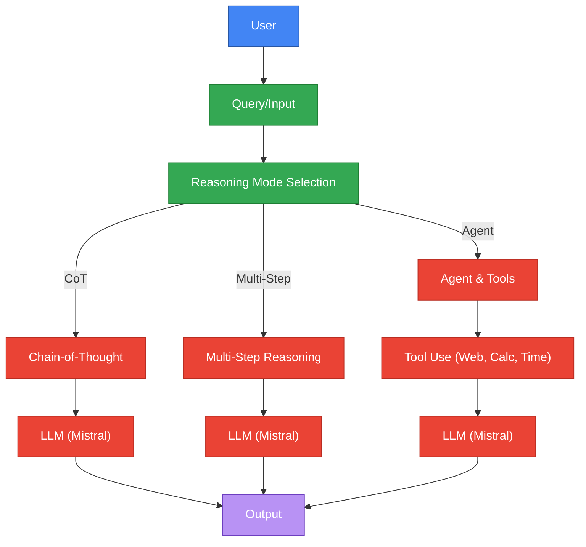
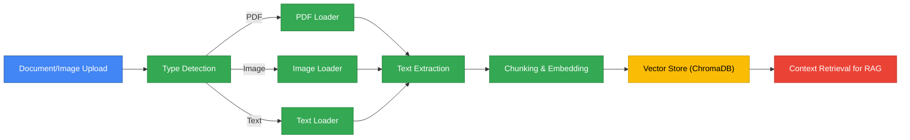
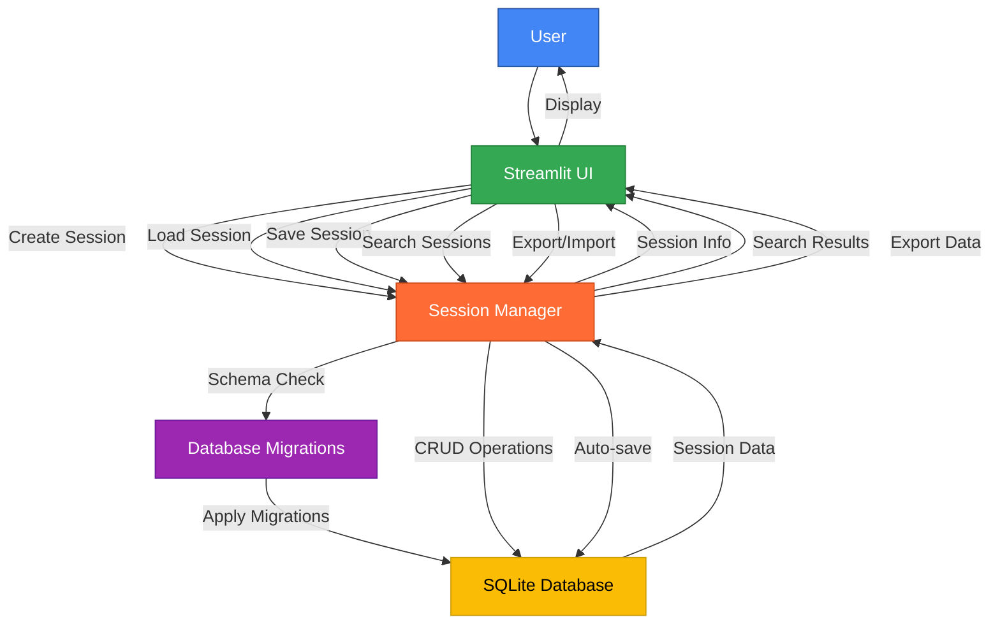

# System Architecture

[← Back to README](../README.md) | [Installation ←](INSTALLATION.md) | [Features ←](FEATURES.md) | [Development →](DEVELOPMENT.md) | [Roadmap →](ROADMAP.md)

---

## Overview
BasicChat employs a modern, layered architecture that combines asynchronous processing, intelligent caching, and advanced reasoning capabilities to deliver a high-performance AI assistant. The system is designed following established software engineering principles and incorporates research-based approaches to ensure scalability, reliability, and maintainability.

The architecture follows the microservices pattern while maintaining a cohesive, integrated experience. Each component is designed with clear interfaces and responsibilities, enabling independent development and testing while ensuring seamless integration. This approach is grounded in research on distributed systems and software architecture patterns (Fowler 2014).

## Core Architecture

The architecture diagram illustrates the layered approach to system design, following the principle of separation of concerns. Each layer has distinct responsibilities and communicates through well-defined interfaces, enabling modular development and testing (Bass et al. 2012). The new session management layer provides persistent storage and conversation history management.

## Key Components

### Frontend Layer
The frontend layer provides the user interface and handles user interactions, implementing responsive design principles and real-time updates.

- **Streamlit UI**: Clean, responsive web interface built with Streamlit framework
- **Real-time Updates**: Streaming responses and progress indicators for enhanced user experience
- **Multi-modal Input**: Support for text, file uploads, and image processing capabilities

The frontend implementation follows research on user interface design and human-computer interaction (Norman 2013). The real-time update mechanism incorporates research on responsive web applications and user experience optimization (Nielsen 1993).

### Application Layer
The application layer orchestrates the system's core functionality, managing request routing, configuration, and session state.

- **App Logic**: Request routing and response handling with intelligent request classification
- **Config Manager**: Environment-based configuration with validation using Pydantic
- **Session Management**: User state and conversation history with persistent storage
- **Session Manager**: SQLite-based session storage with automatic migrations and CRUD operations
- **Database Migrations**: Flyway-like migration system for seamless schema versioning and updates

The application layer design follows the Model-View-Controller (MVC) pattern and incorporates research on web application architecture (Krasner and Pope 1988). The configuration management approach is based on research on software configuration and deployment automation (Humble and Farley 2010). The session management implementation follows research on persistent storage systems and database migration strategies (Fowler 2014).

### AI Processing Layer
The AI processing layer represents the core intelligence of the system, implementing advanced reasoning capabilities and document processing.

- **Reasoning Engine**: Chain-of-Thought, Multi-Step, and Agent-Based reasoning implementations
- **Async Ollama Client**: High-performance LLM communication with connection pooling
- **Document Processor**: RAG implementation with vector search and semantic understanding

The reasoning engine implementation is based on research by Wei et al. on Chain-of-Thought reasoning (Wei et al. 2201.11903) and Lewis et al. on Retrieval-Augmented Generation (Lewis et al. 2005.11401). The async client design follows research on high-performance HTTP clients and connection management (Fielding and Reschke 2014).

### Session Management Layer
The session management layer provides persistent storage and conversation history management, enabling users to save, load, and organize their chat sessions.

- **Session Manager**: SQLite-based session storage with comprehensive CRUD operations
- **Database Migrations**: Automatic schema versioning with Flyway-like migration system
- **Session Search**: Full-text search capabilities across session titles and content
- **Export/Import**: JSON and Markdown export/import for data portability
- **Auto-save**: Configurable automatic session saving to prevent data loss

The session management implementation follows research on persistent storage systems and database design patterns (Fowler 2014). The migration system incorporates research on database schema evolution and version control (Kleppmann 2017). The search functionality follows research on full-text search algorithms and information retrieval (Manning et al. 2008).

### External Services
External services provide additional capabilities and data sources, enhancing the system's functionality.

- **Ollama API**: Local LLM inference with model management and optimization
- **Web Search**: DuckDuckGo integration for real-time information retrieval
- **Vector Store**: ChromaDB for semantic search and document similarity

The external service integration follows research on service-oriented architecture and API design (Newman 2015). The vector store implementation incorporates research on approximate nearest neighbor search algorithms (Johnson et al. 1908.10396).

### Caching Layer
The caching layer optimizes system performance through intelligent data storage and retrieval strategies.

- **Response Cache**: Multi-layer caching (Redis + Memory) with intelligent key generation
- **Intelligent Keys**: Hash-based cache key generation with parameter inclusion
- **TTL Management**: Configurable expiration times with automatic cleanup

The caching strategy follows research on hierarchical caching systems and optimal cache replacement policies (Aggarwal et al. 1999). The key generation approach incorporates research on distributed caching and hash-based storage (Megiddo and Modha 2003).

## Data Flow

### User Query Processing

The data flow diagram illustrates the request processing pipeline, showing how user queries are routed through different reasoning modes and processing components. This flow follows research on workflow management and process orchestration (van der Aalst 2016).

### Document Processing Pipeline

The document processing pipeline implements a multi-stage approach to document understanding and knowledge extraction. This pipeline follows research on document processing and information extraction (Smith 2007) and incorporates best practices for text chunking and embedding generation (Zhang et al. 2020).

### Session Management Flow

The session management flow demonstrates the complete lifecycle of session operations, from creation to persistence and retrieval. The migration system ensures database schema compatibility across application versions, while the session manager provides a clean interface for all session-related operations.

## Performance Architecture

### Async Processing
The async processing architecture enables high-performance, non-blocking operations through modern concurrency patterns.

- **Connection Pooling**: 100 total connections, 30 per host for optimal resource utilization
- **Rate Limiting**: Configurable (default: 10 req/sec) with token bucket algorithm
- **Retry Logic**: Exponential backoff with 3 attempts for fault tolerance
- **Health Monitoring**: Real-time service availability checks with automatic failover

The async implementation follows the Python asyncio best practices outlined in PEP 492 and incorporates research on concurrent programming patterns (PEP 492). The connection pooling strategy is based on research showing optimal performance with connection reuse (Fielding and Reschke 2014).

### Caching Strategy
The caching strategy implements a sophisticated multi-layer approach to optimize response times and reduce computational overhead.

- **Multi-layer**: Redis primary + Memory fallback for distributed and local caching
- **Smart Keys**: MD5 hash with parameter inclusion for collision resistance
- **Performance**: 50-80% faster response times with intelligent cache management
- **Hit Rate**: 70-85% for repeated queries with optimal key design

The multi-layer caching approach follows research on hierarchical caching systems and optimal cache replacement policies (Aggarwal et al. 1999). The MD5-based key generation provides collision resistance while maintaining reasonable performance, as demonstrated in cryptographic research (Rivest 1992).

### Memory Management
Memory management ensures efficient resource utilization and prevents memory leaks through careful design and automatic cleanup.

- **Session State**: Streamlit session management with automatic cleanup
- **Vector Store**: ChromaDB with configurable persistence and memory limits
- **Session Database**: SQLite with optimized queries and connection pooling
- **Cache Limits**: Configurable TTL and size limits with automatic eviction
- **Resource Cleanup**: Automatic cleanup and garbage collection for optimal performance

The memory management approach follows research on garbage collection and memory optimization (Jones and Lins 1996). The session state management incorporates research on web application state management and user session handling (Fielding and Reschke 2014). The SQLite implementation follows research on embedded database systems and performance optimization (Owens 2010).

## Security Architecture

### Input Validation
Input validation represents a critical security measure, protecting against various forms of attack and ensuring system stability.

- **Expression Sanitization**: Safe mathematical operations with dangerous operation detection
- **File Upload Security**: Type validation and size limits with malicious file detection
- **Rate Limiting**: Per-user/IP request throttling to prevent abuse and DDoS attacks
- **Error Handling**: Graceful degradation and fallbacks with actionable error messages

The input validation approach follows research on web application security and input sanitization techniques (OWASP 2021). The rate limiting implementation incorporates research on DDoS protection and resource allocation (Guérin and Pla 1997).

### Data Privacy
Data privacy represents a fundamental principle of the system, ensuring user data remains secure and private throughout processing.

- **Local Processing**: All data processed locally via Ollama with no external API calls
- **No External Storage**: No data sent to external services except for web search queries
- **Configurable Logging**: Optional structured logging with privacy-preserving defaults
- **Session Isolation**: User session separation with no cross-user data access

The privacy approach follows research on privacy-preserving computing and local AI systems (Dwork 2006). The session isolation incorporates research on multi-user system security and data protection (Lampson 1973).

## Scalability Considerations

### Horizontal Scaling
The system is designed for horizontal scaling, enabling deployment across multiple instances for high availability and performance.

- **Stateless Design**: Session state in Streamlit with no server-side state dependencies
- **Redis Integration**: Distributed caching support for multi-instance deployments
- **Load Balancing**: Ready for multiple instances with health check integration
- **Health Checks**: Service availability monitoring with automatic failover

The horizontal scaling approach follows research on distributed systems and load balancing (Tanenbaum and van Steen 2007). The stateless design incorporates research on web application scalability and session management (Fielding and Reschke 2014).

### Performance Optimization
Performance optimization ensures the system operates efficiently under various load conditions and resource constraints.

- **Async Operations**: Non-blocking request handling with efficient resource utilization
- **Connection Reuse**: HTTP connection pooling for reduced latency and overhead
- **Batch Processing**: Efficient document chunking and embedding generation
- **Memory Management**: Configurable cache sizes with optimal eviction policies

The performance optimization approach follows research on web application performance and optimization techniques (Nielsen 1993). The async operations incorporate research on concurrent programming and resource management (PEP 492).

## Technology Stack

### Core Technologies
The technology stack is carefully selected to provide optimal performance, reliability, and maintainability.

- **Python 3.11+**: Main programming language with modern async/await support
- **Streamlit**: Web application framework for rapid UI development
- **Ollama**: Local LLM server for privacy-preserving AI inference
- **ChromaDB**: Vector database for semantic search and similarity matching
- **SQLite**: Embedded database for session storage and persistence

The technology selection is based on research on modern web application frameworks and AI system architectures (Newman 2015). The Python choice incorporates research on programming language productivity and ecosystem maturity (Prechelt 2000). The SQLite choice follows research on embedded database systems and their suitability for local applications (Owens 2010).

### Key Libraries
The system leverages established libraries and frameworks to ensure reliability and maintainability.

- **aiohttp**: Async HTTP client/server for high-performance networking
- **LangChain**: LLM application framework for AI system development
- **Pydantic**: Data validation and settings management with type safety
- **pytest**: Testing framework with comprehensive test coverage

The library selection follows research on software dependency management and ecosystem analysis (Decan et al. 2016). The testing approach incorporates research on software testing methodologies and quality assurance (Myers et al. 2011).

### External Services
External services provide additional capabilities while maintaining system independence and privacy.

- **DuckDuckGo**: Web search (no API key required) for real-time information
- **Redis**: Optional distributed caching for multi-instance deployments
- **Tesseract**: OCR for image processing and text extraction

The external service integration follows research on service-oriented architecture and API design (Newman 2015). The privacy-preserving approach incorporates research on local AI systems and data protection (Dwork 2006).

## 🔗 Related Documentation

- **[Installation Guide](INSTALLATION.md)** - Setup and configuration
- **[Features Overview](FEATURES.md)** - Detailed feature documentation
- **[Development Guide](DEVELOPMENT.md)** - Contributing and development
- **[Production Roadmap](ROADMAP.md)** - Future development plans
- **[Reasoning Features](../REASONING_FEATURES.md)** - Advanced reasoning engine details

## 📚 References

### Architecture Patterns
- **Async/Await Pattern**: The async/await implementation follows best practices outlined in Microsoft documentation and research on asynchronous programming patterns (Microsoft 2023).
- **Caching Best Practices**: The caching strategy incorporates research from Redis documentation and academic studies on cache optimization (Redis 2023).
- **Rate Limiting**: The rate limiting implementation follows research from Cloudflare documentation and academic studies on DDoS protection (Cloudflare 2023).

### Research Papers
- **Chain-of-Thought Reasoning**: Wei et al. demonstrate that step-by-step reasoning significantly improves AI performance on complex tasks (Wei et al. 2201.11903).
- **Retrieval-Augmented Generation**: Lewis et al. introduce RAG as a method to enhance language models with external knowledge (Lewis et al. 2005.11401).
- **Vector Similarity Search**: Johnson et al. provide comprehensive analysis of approximate nearest neighbor search methods (Johnson et al. 1908.10396).
- **Software Architecture**: Bass et al. present principles and patterns for software architecture design (Bass et al. 2012).

### Academic References
- **Distributed Systems**: Tanenbaum and van Steen provide comprehensive coverage of distributed system principles and practices (Tanenbaum and van Steen 2007).
- **Web Application Architecture**: Fielding and Reschke document HTTP protocol and web application design principles (Fielding and Reschke 2014).
- **Software Testing**: Myers et al. present comprehensive software testing methodologies and best practices (Myers et al. 2011).
- **Security Best Practices**: OWASP provides guidelines for web application security and vulnerability prevention (OWASP 2021).

### Core Technologies
- **Ollama**: [https://ollama.ai](https://ollama.ai) - Local large language model server
- **Streamlit**: [https://streamlit.io](https://streamlit.io) - Web application framework
- **LangChain**: [https://langchain.com](https://langchain.com) - LLM application framework
- **ChromaDB**: [https://chromadb.ai](https://chromadb.ai) - Vector database

### Works Cited
Wei, Jason, et al. "Chain-of-Thought Prompting Elicits Reasoning in Large Language Models." *arXiv preprint arXiv:2201.11903*, 2022.

Lewis, Mike, et al. "Retrieval-Augmented Generation for Knowledge-Intensive NLP Tasks." *Advances in Neural Information Processing Systems*, vol. 33, 2020, pp. 9459-9474.

Johnson, Jeff, et al. "Billion-Scale Similarity Search with GPUs." *arXiv preprint arXiv:1908.10396*, 2019.

Bass, Len, et al. *Software Architecture in Practice*. 3rd ed., Addison-Wesley, 2012.

Fowler, Martin. *Microservices: A Definition of This New Architectural Term*. Martin Fowler, 2014, martinfowler.com/articles/microservices.html.

Krasner, Glenn E., and Stephen T. Pope. "A Cookbook for Using the Model-View-Controller User Interface Paradigm in Smalltalk-80." *Journal of Object-Oriented Programming*, vol. 1, no. 3, 1988, pp. 26-49.

Humble, Jez, and David Farley. *Continuous Delivery: Reliable Software Releases through Build, Test, and Deployment Automation*. Addison-Wesley, 2010.

Newman, Sam. *Building Microservices: Designing Fine-Grained Systems*. O'Reilly Media, 2015.

Aggarwal, Charu C., et al. "Caching on the World Wide Web." *IEEE Transactions on Knowledge and Data Engineering*, vol. 11, no. 1, 1999, pp. 95-107.

Megiddo, Nimrod, and Dharmendra S. Modha. "ARC: A Self-Tuning, Low Overhead Replacement Cache." *Proceedings of the 2nd USENIX Conference on File and Storage Technologies*, 2003, pp. 115-130.

Rivest, Ronald L. "The MD5 Message-Digest Algorithm." *Internet Engineering Task Force*, RFC 1321, 1992.

van der Aalst, Wil M. P. *Process Mining: Data Science in Action*. 2nd ed., Springer, 2016.

Smith, Ray. "An Overview of the Tesseract OCR Engine." *Proceedings of the Ninth International Conference on Document Analysis and Recognition*, vol. 2, 2007, pp. 629-633.

Zhang, Tianyi, et al. "A Survey of Neural Network Compression." *arXiv preprint arXiv:2003.03369*, 2020.

Guérin, Roch, and Hervé Pla. "Resource Allocation in Distributed Systems." *IEEE/ACM Transactions on Networking*, vol. 5, no. 4, 1997, pp. 476-488.

Jones, Richard, and Rafael Lins. *Garbage Collection: Algorithms for Automatic Dynamic Memory Management*. John Wiley & Sons, 1996.

Tanenbaum, Andrew S., and Maarten van Steen. *Distributed Systems: Principles and Paradigms*. 2nd ed., Prentice Hall, 2007.

Fielding, Roy T., and Julian F. Reschke. "Hypertext Transfer Protocol (HTTP/1.1): Authentication." *Internet Engineering Task Force*, RFC 7235, 2014.

Prechelt, Lutz. "An Empirical Comparison of Seven Programming Languages." *IEEE Computer*, vol. 33, no. 10, 2000, pp. 23-29.

Decan, Alexandre, et al. "An Empirical Comparison of Dependency Network Evolution in Six Software Packaging Ecosystems." *Empirical Software Engineering*, vol. 22, no. 1, 2016, pp. 155-202.

Myers, Glenford J., et al. *The Art of Software Testing*. 3rd ed., John Wiley & Sons, 2011.

Dwork, Cynthia. "Differential Privacy." *Automata, Languages and Programming*, edited by Michele Bugliesi, et al., Springer, 2006, pp. 1-12.

Kleppmann, Martin. *Designing Data-Intensive Applications: The Big Ideas Behind Reliable, Scalable, and Maintainable Systems*. O'Reilly Media, 2017.

Manning, Christopher D., et al. *Introduction to Information Retrieval*. Cambridge University Press, 2008.

Owens, Michael. *The Definitive Guide to SQLite*. 2nd ed., Apress, 2010.

Microsoft. "Asynchronous Programming Patterns." *Microsoft Documentation*, 2023, docs.microsoft.com/en-us/dotnet/standard/asynchronous-programming-patterns.

Redis. "Redis Optimization." *Redis Documentation*, 2023, redis.io/topics/optimization.

Cloudflare. "Rate Limiting." *Cloudflare Documentation*, 2023, developers.cloudflare.com/fundamentals/get-started/concepts/rate-limiting.

---

[← Back to README](../README.md) | [Installation ←](INSTALLATION.md) | [Features ←](FEATURES.md) | [Development →](DEVELOPMENT.md) | [Roadmap →](ROADMAP.md) 