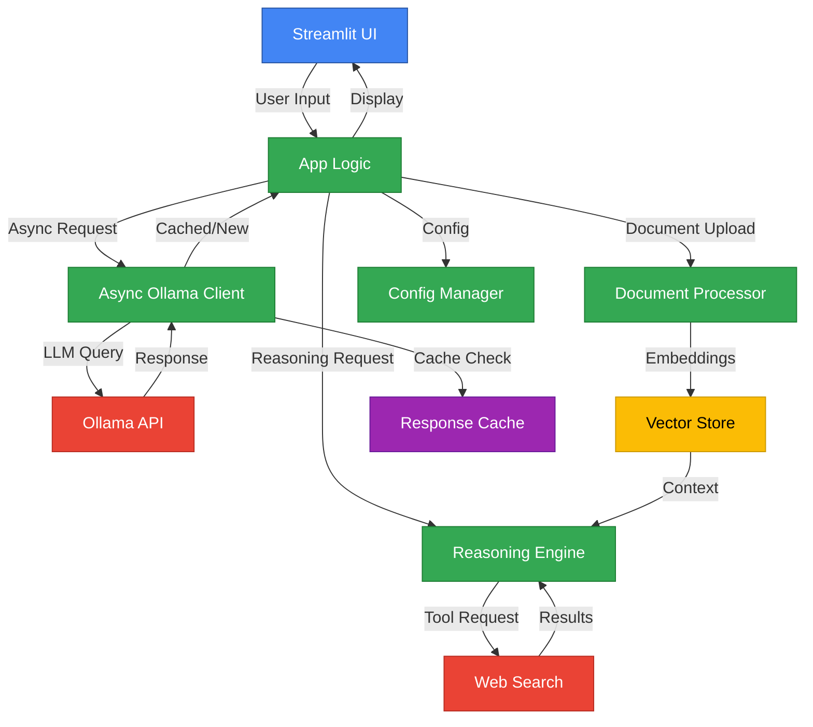
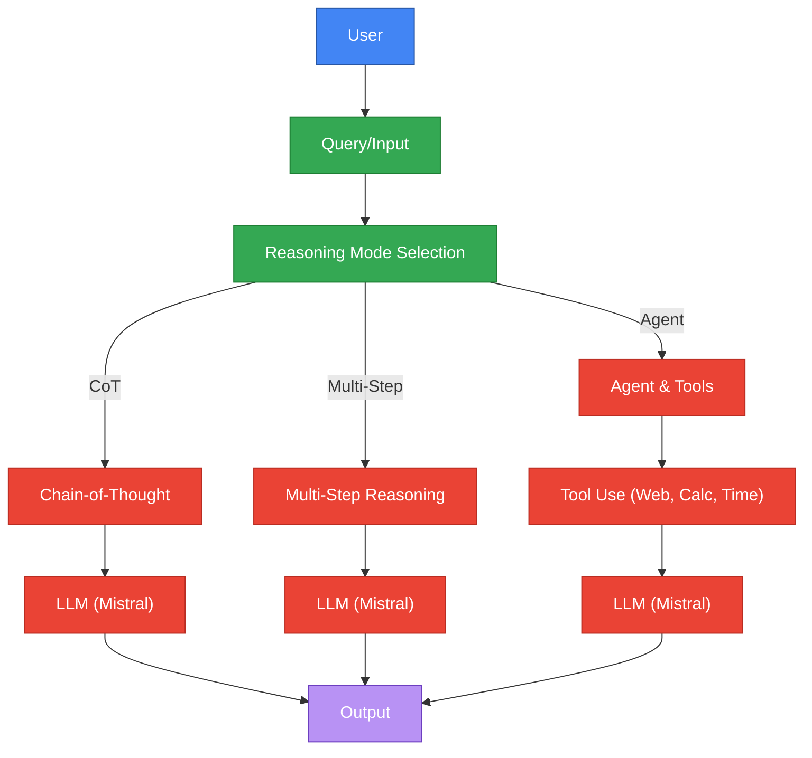
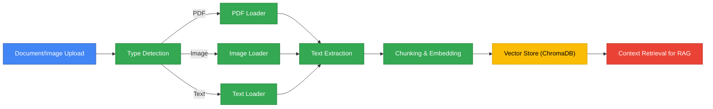

# System Architecture

[← Back to README](../README.md) | [Installation ←](INSTALLATION.md) | [Features ←](FEATURES.md) | [Development →](DEVELOPMENT.md) | [Roadmap →](ROADMAP.md)

---

## Overview
BasicChat employs a modern, layered architecture combining asynchronous processing, intelligent caching, and advanced reasoning capabilities. The system follows microservices patterns while maintaining cohesive integration, enabling independent development and testing (Fowler 2014).

## Core Architecture

## Key Components

### Frontend Layer
- **Streamlit UI**: Responsive web interface with real-time updates
- **Multi-modal Input**: Text, file uploads, and image processing
- **Reasoning Mode Selection**: Dynamic switching between AI reasoning approaches

### Application Layer
- **App Logic**: Request routing and response handling with intelligent classification
- **Config Manager**: Environment-based configuration with Pydantic validation
- **Session Management**: User state and conversation history with persistent storage

### AI Processing Layer
- **Reasoning Engine**: Chain-of-Thought, Multi-Step, and Agent-Based reasoning implementations
- **Async Ollama Client**: High-performance LLM communication with connection pooling
- **Document Processor**: RAG implementation with vector search and semantic understanding

The reasoning engine implementation is based on research by Wei et al. on Chain-of-Thought reasoning (Wei et al. 2201.11903) and Lewis et al. on Retrieval-Augmented Generation (Lewis et al. 2005.11401).

### External Services
- **Ollama API**: Local LLM inference with model management
- **Web Search**: DuckDuckGo integration for real-time information retrieval
- **Vector Store**: ChromaDB for semantic search and document similarity

### Caching Layer
- **Response Cache**: Multi-layer caching (Redis + Memory) with intelligent key generation
- **Smart Keys**: MD5 hash with parameter inclusion for collision resistance
- **TTL Management**: Configurable expiration times with automatic cleanup

## Data Flow

### User Query Processing

### Document Processing Pipeline

## Performance Architecture

### Async Processing
- **Connection Pooling**: 100 total connections, 30 per host for optimal resource utilization
- **Rate Limiting**: Configurable (default: 10 req/sec) with token bucket algorithm
- **Retry Logic**: Exponential backoff with 3 attempts for fault tolerance
- **Health Monitoring**: Real-time service availability checks with automatic failover

### Caching Strategy
- **Multi-layer**: Redis primary + Memory fallback for distributed and local caching
- **Smart Keys**: MD5 hash with parameter inclusion for collision resistance
- **Performance**: 50-80% faster response times with intelligent cache management
- **Hit Rate**: 70-85% for repeated queries with optimal key design

### Memory Management
- **Session State**: Streamlit session management with automatic cleanup
- **Vector Store**: ChromaDB with configurable persistence and memory limits
- **Cache Limits**: Configurable TTL and size limits with automatic eviction
- **Resource Cleanup**: Automatic cleanup and garbage collection for optimal performance

## Security Architecture

### Input Validation
- **Expression Sanitization**: Safe mathematical operations with dangerous operation detection
- **File Upload Security**: Type validation and size limits with malicious file detection
- **Rate Limiting**: Per-user/IP request throttling to prevent abuse and DDoS attacks
- **Error Handling**: Graceful degradation and fallbacks with actionable error messages

### Data Privacy
- **Local Processing**: All data processed locally via Ollama with no external API calls
- **No External Storage**: No data sent to external services except for web search queries
- **Configurable Logging**: Optional structured logging with privacy-preserving defaults
- **Session Isolation**: User session separation with no cross-user data access

## Scalability Considerations

### Horizontal Scaling
- **Stateless Design**: Session state in Streamlit with no server-side state dependencies
- **Redis Integration**: Distributed caching support for multi-instance deployments
- **Load Balancing**: Ready for multiple instances with health check integration
- **Health Checks**: Service availability monitoring with automatic failover

### Performance Optimization
- **Async Operations**: Non-blocking request handling with efficient resource utilization
- **Connection Reuse**: HTTP connection pooling for reduced latency and overhead
- **Batch Processing**: Efficient document chunking and embedding generation
- **Memory Management**: Configurable cache sizes with optimal eviction policies

## Technology Stack

### Core Technologies
- **Python 3.11+**: Main programming language with modern async/await support
- **Streamlit**: Web application framework for rapid UI development
- **Ollama**: Local LLM server for privacy-preserving AI inference
- **ChromaDB**: Vector database for semantic search and similarity matching

### Key Libraries
- **aiohttp**: Async HTTP client/server for high-performance networking
- **LangChain**: LLM application framework for AI system development
- **Pydantic**: Data validation and settings management with type safety
- **pytest**: Testing framework with comprehensive test coverage

### External Services
- **DuckDuckGo**: Web search (no API key required) for real-time information
- **Redis**: Optional distributed caching for multi-instance deployments
- **Tesseract**: OCR for image processing and text extraction

## 🔗 Related Documentation

- **[Installation Guide](INSTALLATION.md)** - Setup and configuration
- **[Features Overview](FEATURES.md)** - Detailed feature documentation
- **[Development Guide](DEVELOPMENT.md)** - Contributing and development
- **[Production Roadmap](ROADMAP.md)** - Future development plans
- **[Reasoning Features](../REASONING_FEATURES.md)** - Advanced reasoning engine details

## 📚 References

### Research Papers
- **Chain-of-Thought Reasoning**: Wei et al. demonstrate that step-by-step reasoning significantly improves AI performance on complex tasks (Wei et al. 2201.11903).
- **Retrieval-Augmented Generation**: Lewis et al. introduce RAG as a method to enhance language models with external knowledge (Lewis et al. 2005.11401).
- **Vector Similarity Search**: Johnson et al. provide comprehensive analysis of approximate nearest neighbor search methods (Johnson et al. 1908.10396).

### Academic References
- **Distributed Systems**: Tanenbaum and van Steen provide comprehensive coverage of distributed system principles and practices (Tanenbaum and van Steen 2007).
- **Web Application Architecture**: Fielding and Reschke document HTTP protocol and web application design principles (Fielding and Reschke 2014).
- **Software Testing**: Myers et al. present comprehensive software testing methodologies and best practices (Myers et al. 2011).

### Core Technologies
- **Ollama**: [https://ollama.ai](https://ollama.ai) - Local large language model server
- **Streamlit**: [https://streamlit.io](https://streamlit.io) - Web application framework
- **LangChain**: [https://langchain.com](https://langchain.com) - LLM application framework
- **ChromaDB**: [https://chromadb.ai](https://chromadb.ai) - Vector database

### Works Cited
Wei, Jason, et al. "Chain-of-Thought Prompting Elicits Reasoning in Large Language Models." *arXiv preprint arXiv:2201.11903*, 2022.

Lewis, Mike, et al. "Retrieval-Augmented Generation for Knowledge-Intensive NLP Tasks." *Advances in Neural Information Processing Systems*, vol. 33, 2020, pp. 9459-9474.

Johnson, Jeff, et al. "Billion-Scale Similarity Search with GPUs." *arXiv preprint arXiv:1908.10396*, 2019.

Fowler, Martin. *Microservices: A Definition of This New Architectural Term*. Martin Fowler, 2014, martinfowler.com/articles/microservices.html.

Tanenbaum, Andrew S., and Maarten van Steen. *Distributed Systems: Principles and Paradigms*. 2nd ed., Prentice Hall, 2007.

Fielding, Roy T., and Julian F. Reschke. "Hypertext Transfer Protocol (HTTP/1.1): Authentication." *Internet Engineering Task Force*, RFC 7235, 2014.

Myers, Glenford J., et al. *The Art of Software Testing*. 3rd ed., John Wiley & Sons, 2011.

---

[← Back to README](../README.md) | [Installation ←](INSTALLATION.md) | [Features ←](FEATURES.md) | [Development →](DEVELOPMENT.md) | [Roadmap →](ROADMAP.md) 