```mermaid
graph TB
    subgraph "🔒 Privacy Controls"
        LOCAL[Local Processing Only]
        NO_EXTERNAL[No External APIs]
        ENCRYPT[Encrypted Storage]
        CLEANUP[Auto Cleanup]
    end
    
    subgraph "🛡️ Security Measures"
        VALIDATION[Input Validation]
        SANITIZATION[Expression Sanitization]
        RATE_LIMIT[Rate Limiting]
        ERROR_HANDLING[Error Handling]
    end
    
    subgraph "📊 Data Flow"
        USER[User Input]
        PROCESS[Local Processing]
        STORE[Local Storage]
        CLEAN[Auto Cleanup]
    end
    
    USER --> VALIDATION
    VALIDATION --> SANITIZATION
    SANITIZATION --> PROCESS
    
    PROCESS --> LOCAL
    PROCESS --> NO_EXTERNAL
    
    PROCESS --> STORE
    STORE --> ENCRYPT
    STORE --> CLEANUP
    CLEANUP --> CLEAN
```

```mermaid
graph TB
    subgraph "🐍 Backend"
        PYTHON[Python 3.11+]
        STREAMLIT[Streamlit]
        LANGCHAIN[LangChain]
        PYDANTIC[Pydantic]
    end
    
    subgraph "🤖 AI/ML"
        OLLAMA[Ollama]
        CHROMA[ChromaDB]
        EMBEDDINGS[Text Embeddings]
        VISION[Vision Models]
    end
    
    subgraph "⚡ Performance"
        AIOHTTP[aiohttp]
        REDIS[Redis]
        CACHETOOLS[cachetools]
        THROTTLE[asyncio-throttle]
    end
    
    subgraph "🛠️ Tools"
        DUCKDUCKGO[DuckDuckGo Search]
        GTTS[gTTS]
        PILLOW[Pillow]
        PYTZ[pytz]
    end
    
    PYTHON --> STREAMLIT
    PYTHON --> LANGCHAIN
    PYTHON --> PYDANTIC
    
    LANGCHAIN --> OLLAMA
    LANGCHAIN --> CHROMA
    LANGCHAIN --> EMBEDDINGS
    LANGCHAIN --> VISION
    
    STREAMLIT --> AIOHTTP
    STREAMLIT --> REDIS
    STREAMLIT --> CACHETOOLS
    STREAMLIT --> THROTTLE
    
    LANGCHAIN --> DUCKDUCKGO
    STREAMLIT --> GTTS
    STREAMLIT --> PILLOW
    STREAMLIT --> PYTZ
```

```mermaid
graph TB
    subgraph "🔄 Load Balancer"
        LB[Load Balancer]
    end
    
    subgraph "🖥️ Application Instances"
        INST1[Instance 1]
        INST2[Instance 2]
        INST3[Instance 3]
    end
    
    subgraph "🗄️ Shared Services"
        REDIS_SHARED[Redis Cluster]
        CHROMA_SHARED[ChromaDB Cluster]
    end
    
    subgraph "🔍 Health Checks"
        HEALTH[Health Monitor]
        FAILOVER[Auto Failover]
    end
    
    LB --> INST1
    LB --> INST2
    LB --> INST3
    
    INST1 --> REDIS_SHARED
    INST2 --> REDIS_SHARED
    INST3 --> REDIS_SHARED
    
    INST1 --> CHROMA_SHARED
    INST2 --> CHROMA_SHARED
    INST3 --> CHROMA_SHARED
    
    HEALTH --> INST1
    HEALTH --> INST2
    HEALTH --> INST3
    
    HEALTH --> FAILOVER
    FAILOVER --> LB
```

# System Architecture

This document provides a comprehensive overview of BasicChat's technical architecture, including component interactions, data flows, and system design principles.

[← Back to README](../README.md)

---

## 🏗️ High-Level Architecture

BasicChat follows a **layered microservices architecture** with clear separation of concerns, enabling scalability, maintainability, and testability. The system is built around a **reasoning engine** that orchestrates multiple specialized components.

```mermaid
graph TB
    subgraph "🎨 User Interface"
        UI[Web Interface]
        AUDIO[Audio Processing]
    end
    
    subgraph "🧠 Core Logic"
        RE[Reasoning Engine]
        DP[Document Processor]
        TR[Tool Registry]
    end
    
    subgraph "⚡ Services"
        AO[Ollama Client]
        VS[Vector Store]
        CS[Cache Service]
        WS[Web Search]
    end
    
    subgraph "🗄️ Storage"
        CHROMA[Vector Database]
        CACHE[Memory Cache]
        FILES[File Storage]
    end
    
    subgraph "🌐 External"
        OLLAMA[LLM Server]
        DDG[Search Engine]
    end
    
    %% User Interface Connections
    UI --> RE
    UI --> DP
    AUDIO --> RE
    
    %% Core Logic Connections
    RE --> AO
    RE --> VS
    RE --> TR
    DP --> VS
    TR --> WS
    
    %% Service Connections
    AO --> OLLAMA
    VS --> CHROMA
    CS --> CACHE
    WS --> DDG
    
    %% Storage Connections
    CHROMA --> FILES
    CACHE --> FILES
    
    %% Styling
    classDef ui fill:#E3F2FD,stroke:#1976D2,stroke-width:2px,color:#0D47A1
    classDef core fill:#F3E5F5,stroke:#7B1FA2,stroke-width:2px,color:#4A148C
    classDef service fill:#E8F5E8,stroke:#388E3C,stroke-width:2px,color:#1B5E20
    classDef storage fill:#FFF3E0,stroke:#F57C00,stroke-width:2px,color:#E65100
    classDef external fill:#FCE4EC,stroke:#C2185B,stroke-width:2px,color:#880E4F
    
    class UI,AUDIO ui
    class RE,DP,TR core
    class AO,VS,CS,WS service
    class CHROMA,CACHE,FILES storage
    class OLLAMA,DDG external
```

## 🧩 Core Components

### 1. **Reasoning Engine** (`reasoning_engine.py`)
The central orchestrator that manages different reasoning strategies and coordinates tool usage.

**Key Responsibilities:**
- **Multi-Modal Reasoning**: Supports 5 reasoning modes (Auto, Standard, Chain-of-Thought, Multi-Step, Agent-Based)
- **Tool Orchestration**: Intelligently selects and executes appropriate tools
- **Context Management**: Integrates document context with user queries
- **Response Synthesis**: Combines multiple sources into coherent answers

**Architecture Pattern:** Strategy Pattern with Factory Method

### 2. **Document Processor** (`document_processor.py`)
Manages the complete document lifecycle with advanced RAG capabilities.

**Key Features:**
- **Multi-Format Support**: PDF, text, markdown, images (OCR)
- **Intelligent Chunking**: Recursive character splitting with overlap
- **Vector Embeddings**: Local embedding generation with Ollama
- **Semantic Search**: ChromaDB-based similarity search
- **Memory Management**: Automatic cleanup and resource optimization

```mermaid
graph LR
    subgraph "📄 Document Processing"
        UPLOAD[File Upload]
        EXTRACT[Text Extraction]
        CHUNK[Text Chunking]
        EMBED[Vector Embedding]
        STORE[Vector Storage]
        SEARCH[Semantic Search]
    end
    
    subgraph "🖼️ Image Processing"
        IMG[Image Upload]
        OCR[Vision Model OCR]
        DESC[Description Generation]
    end
    
    UPLOAD --> EXTRACT
    EXTRACT --> CHUNK
    CHUNK --> EMBED
    EMBED --> STORE
    STORE --> SEARCH
    
    IMG --> OCR
    OCR --> DESC
    DESC --> CHUNK
    
    classDef pipeline fill:#E3F2FD,stroke:#1976D2,stroke-width:2px,color:#0D47A1
    classDef image fill:#E8F5E8,stroke:#388E3C,stroke-width:2px,color:#1B5E20
    
    class UPLOAD,EXTRACT,CHUNK,EMBED,STORE,SEARCH pipeline
    class IMG,OCR,DESC image
```

### 3. **Async Ollama Client** (`utils/async_ollama.py`)
High-performance client for Ollama API with advanced connection management.

**Performance Features:**
- **Connection Pooling**: 100 total connections, 30 per host
- **Rate Limiting**: Token bucket algorithm (10 req/sec default)
- **Retry Logic**: Exponential backoff with 3 attempts
- **Streaming Support**: Real-time response streaming
- **Health Monitoring**: Automatic service availability checks

### 4. **Tool Registry** (`utils/enhanced_tools.py`)
Extensible tool system providing specialized capabilities.

**Available Tools:**
- **Enhanced Calculator**: Advanced mathematical operations with step-by-step reasoning
- **Time Tools**: Timezone-aware time calculations and conversions
- **Web Search**: Real-time information retrieval via DuckDuckGo
- **Document Summary**: Intelligent document summarization

```mermaid
graph TD
    subgraph "🛠️ Tool Registry"
        TR[Tool Registry]
        CALC[Enhanced Calculator]
        TIME[Time Tools]
        WEB[Web Search]
        DOC[Document Summary]
    end
    
    subgraph "🔧 Tool Capabilities"
        MATH[Mathematical Operations]
        TZ[Timezone Conversions]
        SEARCH[Real-time Search]
        SUMMARY[Document Analysis]
    end
    
    TR --> CALC
    TR --> TIME
    TR --> WEB
    TR --> DOC
    
    CALC --> MATH
    TIME --> TZ
    WEB --> SEARCH
    DOC --> SUMMARY
```

## 🔄 Data Flow Architecture

### Standard Query Processing

### Document Analysis (RAG) Flow

## 🚀 Performance Architecture

### Caching Strategy

### Async Processing Pipeline

```mermaid
graph LR
    subgraph "⚡ Async Processing"
        REQ[Request Queue]
        WORKER1[Worker 1]
        WORKER2[Worker 2]
        WORKER3[Worker 3]
        RESP[Response Queue]
    end
    
    subgraph "🔧 Connection Pool"
        POOL[Connection Pool]
        LIMITER[Rate Limiter]
        RETRY[Retry Logic]
    end
    
    REQ --> WORKER1
    REQ --> WORKER2
    REQ --> WORKER3
    
    WORKER1 --> POOL
    WORKER2 --> POOL
    WORKER3 --> POOL
    
    POOL --> LIMITER
    LIMITER --> RETRY
    RETRY --> RESP
```

## 🔒 Security & Privacy Architecture

### Data Privacy Model

## 🏗️ Technology Stack

### Core Technologies

## 📈 Scalability Considerations

### Horizontal Scaling

## 🔗 Related Documentation

- **[Features Overview](FEATURES.md)** - Detailed feature documentation
- **[Development Guide](DEVELOPMENT.md)** - Contributing and development workflows
- **[Roadmap](ROADMAP.md)** - Future development plans
- **[Reasoning Features](../REASONING_FEATURES.md)** - Advanced reasoning engine details

## 📚 References

### Core Technologies
- **Ollama**: [https://ollama.ai](https://ollama.ai) - Local large language model server
- **Streamlit**: [https://streamlit.io](https://streamlit.io) - Web application framework
- **LangChain**: [https://langchain.com](https://langchain.com) - LLM application framework
- **ChromaDB**: [https://chromadb.ai](https://chromadb.ai) - Vector database

### Research Papers
- **Chain-of-Thought Reasoning**: Wei et al. "Chain-of-Thought Prompting Elicits Reasoning in Large Language Models." *arXiv preprint arXiv:2201.11903*, 2022.
- **Retrieval-Augmented Generation**: Lewis et al. "Retrieval-Augmented Generation for Knowledge-Intensive NLP Tasks." *Advances in Neural Information Processing Systems*, vol. 33, 2020, pp. 9459-9474.
- **Vector Similarity Search**: Johnson et al. "Billion-Scale Similarity Search with GPUs." *arXiv preprint arXiv:1908.10396*, 2019.

---

[← Back to README](../README.md) | [Features →](FEATURES.md) | [Development →](DEVELOPMENT.md) | [Roadmap →](ROADMAP.md) 