[🏠 Documentation Home](../README.md#documentation)

---

# System Architecture

> **TL;DR:** BasicChat uses a layered microservices architecture for privacy, modularity, and scalability—ensuring all AI processing is local and secure.

---

## 🏗️ High-Level Architecture

BasicChat follows a **layered microservices architecture** with clear separation of concerns, enabling scalability, maintainability, and testability. The system is built around a **reasoning engine** that orchestrates multiple specialized components.

```mermaid
graph TB
    subgraph "🎨 User Interface"
        UI[Web Interface]
        AUDIO[Audio Processing]
    end
    
    subgraph "🧠 Core Logic"
        RE[Reasoning Engine]
        DP[Document Processor]
        TR[Tool Registry]
    end
    
    subgraph "⚡ Services"
        AO[Ollama Client]
        VS[Vector Store]
        CS[Cache Service]
        WS[Web Search]
    end
    
    subgraph "🗄️ Storage"
        CHROMA[Vector Database]
        CACHE[Memory Cache]
        FILES[File Storage]
    end
    
    subgraph "🌐 External"
        OLLAMA[LLM Server]
        DDG[Search Engine]
    end
    
    %% User Interface Connections
    UI --> RE
    UI --> DP
    AUDIO --> RE
    
    %% Core Logic Connections
    RE --> AO
    RE --> VS
    RE --> TR
    DP --> VS
    TR --> WS
    
    %% Service Connections
    AO --> OLLAMA
    VS --> CHROMA
    CS --> CACHE
    WS --> DDG
    
    %% Storage Connections
    CHROMA --> FILES
    CACHE --> FILES
    
    %% Styling
    classDef ui fill:#E3F2FD,stroke:#1976D2,stroke-width:2px,color:#0D47A1
    classDef core fill:#F3E5F5,stroke:#7B1FA2,stroke-width:2px,color:#4A148C
    classDef service fill:#E8F5E8,stroke:#388E3C,stroke-width:2px,color:#1B5E20
    classDef storage fill:#FFF3E0,stroke:#F57C00,stroke-width:2px,color:#E65100
    classDef external fill:#FCE4EC,stroke:#C2185B,stroke-width:2px,color:#880E4F
    
    class UI,AUDIO ui
    class RE,DP,TR core
    class AO,VS,CS,WS service
    class CHROMA,CACHE,FILES storage
    class OLLAMA,DDG external
```

**Diagram Narrative: System Architecture Overview**

This diagram illustrates how user input flows through each architectural layer, ensuring privacy and modularity. It separates the user interface, core logic, services, storage, and external integrations to clarify responsibilities and enhance security. All processing is local-first, following best practices for privacy and extensibility (Wei et al.).

## 🧩 Core Components

### **1. Reasoning Engine** (`reasoning_engine.py`)

The central orchestrator that manages different reasoning strategies and coordinates tool usage.

**Key Responsibilities:**
- **Multi-Modal Reasoning**: Supports 5 reasoning modes (Auto, Standard, Chain-of-Thought, Multi-Step, Agent-Based)
- **Tool Orchestration**: Intelligently selects and executes appropriate tools
- **Context Management**: Integrates document context with user queries
- **Response Synthesis**: Combines multiple sources into coherent answers

**Architecture Pattern:** Strategy Pattern with Factory Method

**Design Decision Rationale:**
The Strategy Pattern was chosen for the reasoning engine to enable easy addition of new reasoning modes without modifying existing code. This pattern provides excellent extensibility while maintaining clean separation of concerns. The Factory Method ensures proper initialization of reasoning strategies based on user selection or automatic detection, allowing the system to evolve with new AI research and user requirements. This design supports the Open/Closed Principle, making the system open for extension but closed for modification (Martin).

**Performance Considerations:**
- Strategy selection overhead: <1ms through cached strategy instances
- Context switching: Optimized through shared context objects
- Memory usage: Lazy loading of reasoning strategies reduces initial memory footprint
- Caching: Strategy results are cached to avoid redundant computations

**Diagram Narrative: Reasoning Engine Class Structure**

This class diagram explains the flexible, extensible design of the reasoning engine, where the main orchestrator delegates to agent, chain, multi-step, or auto classes. The use of the Strategy pattern allows for easy addition of new reasoning modes, supporting future extensibility (Wei et al.).

### **2. Document Processor** (`document_processor.py`)

Manages the complete document lifecycle with advanced RAG capabilities.

**Key Features:**
- **Multi-Format Support**: PDF, text, markdown, images (OCR)
- **Intelligent Chunking**: Recursive character splitting with overlap
- **Vector Embeddings**: Local embedding generation with Ollama
- **Semantic Search**: ChromaDB-based similarity search
- **Memory Management**: Automatic cleanup and resource optimization

```mermaid
graph LR
    subgraph "📄 Document Processing"
        UPLOAD[File Upload]
        EXTRACT[Text Extraction]
        CHUNK[Text Chunking]
        EMBED[Vector Embedding]
        STORE[Vector Storage]
        SEARCH[Semantic Search]
    end
    
    subgraph "🖼️ Image Processing"
        IMG[Image Upload]
        OCR[Vision Model OCR]
        DESC[Description Generation]
    end
    
    UPLOAD --> EXTRACT
    EXTRACT --> CHUNK
    CHUNK --> EMBED
    EMBED --> STORE
    STORE --> SEARCH
    
    IMG --> OCR
    OCR --> DESC
    DESC --> CHUNK
    
    classDef pipeline fill:#E3F2FD,stroke:#1976D2,stroke-width:2px,color:#0D47A1
    classDef image fill:#E8F5E8,stroke:#388E3C,stroke-width:2px,color:#1B5E20
    
    class UPLOAD,EXTRACT,CHUNK,EMBED,STORE,SEARCH pipeline
    class IMG,OCR,DESC image
```

**Advanced Chunking Strategy:**
The document processor implements a sophisticated chunking algorithm that balances semantic coherence with retrieval efficiency. The recursive character splitter uses a hierarchical approach that first attempts to split on natural boundaries (paragraphs, sentences), then falls back to character-based splitting when necessary. The 200-character overlap is carefully tuned to maintain context continuity while minimizing storage overhead. This approach provides optimal retrieval accuracy for documents ranging from short articles to lengthy research papers (Lewis et al.).

**Embedding Optimization:**
Vector embeddings are generated using the nomic-embed-text model, which provides excellent semantic understanding while maintaining reasonable computational requirements. The system implements batch processing for embedding generation, reducing processing time by 40-60% for large documents. Embeddings are cached with configurable TTL to avoid redundant computation, and the system supports incremental updates when documents are modified.

**Diagram Narrative: Document Processing Pipeline**

This diagram shows how documents and images are processed for retrieval-augmented generation (RAG). Text and images are extracted, chunked, embedded, and stored for semantic search, with a dual pipeline ensuring both formats are handled efficiently (Lewis et al.).

### **3. Async Ollama Client** (`utils/async_ollama.py`)

High-performance client for Ollama API with advanced connection management.

**Performance Features:**
- **Connection Pooling**: 100 total connections, 30 per host
- **Rate Limiting**: Token bucket algorithm (10 req/sec default)
- **Retry Logic**: Exponential backoff with 3 attempts
- **Streaming Support**: Real-time response streaming
- **Health Monitoring**: Automatic service availability checks

**Connection Pool Architecture:**
The connection pool is designed to handle high-concurrency scenarios while preventing resource exhaustion. The per-host limit of 30 connections prevents any single Ollama instance from being overwhelmed, while the global limit of 100 connections ensures the system can handle multiple Ollama servers efficiently. Connection reuse is optimized through keepalive settings that maintain connections for 30 seconds, reducing connection establishment overhead by 70-80%. The pool implements intelligent connection selection to distribute load evenly across available connections (Beazley & Jones).

**Rate Limiting Implementation:**
Rate limiting uses a token bucket algorithm that provides fair access while allowing burst requests when capacity is available. The default rate of 10 requests per second is configurable based on Ollama server capacity and application requirements. The system includes jitter in rate limiting to prevent thundering herd problems when multiple clients connect simultaneously. This approach ensures stable performance under varying load conditions while preventing server overload.

**Diagram Narrative: Async Ollama Client Request Flow**

This sequence diagram visualizes high-performance request handling, where connection pooling, rate limiting, and caching optimize LLM calls. The client checks the pool, rate, and cache before making a request or returning a cached result, ensuring efficient and reliable interactions.

### **4. Tool Registry** (`utils/enhanced_tools.py`)

Extensible tool system providing specialized capabilities.

**Available Tools:**
- **Enhanced Calculator**: Advanced mathematical operations with step-by-step reasoning
- **Time Tools**: Timezone-aware time calculations and conversions
- **Web Search**: Real-time information retrieval via DuckDuckGo
- **Document Summary**: Intelligent document summarization

```mermaid
graph TD
    subgraph "🛠️ Tool Registry"
        TR[Tool Registry]
        CALC[Enhanced Calculator]
        TIME[Time Tools]
        WEB[Web Search]
        DOC[Document Summary]
    end
    
    subgraph "🔧 Tool Capabilities"
        MATH[Mathematical Operations]
        TZ[Timezone Conversions]
        SEARCH[Real-time Search]
        SUMMARY[Document Analysis]
    end
    
    TR --> CALC
    TR --> TIME
    TR --> WEB
    TR --> DOC
    
    CALC --> MATH
    TIME --> TZ
    WEB --> SEARCH
    DOC --> SUMMARY
```

**Diagram Narrative: Tool Registry Architecture**

This diagram shows how tools are organized for extensibility, with a central registry managing calculators, time, web, and document tools. Tools are registered and called via a unified interface, making it easy to add new capabilities as the system evolves.

## 🔄 Data Flow Architecture

### **Standard Query Processing**

**Diagram Narrative: Standard Query Processing Flow**

This sequence diagram demonstrates the end-to-end flow for user queries, showing how the UI, engine, tools, LLM, and cache interact to answer questions. Queries are processed, cached, and routed through tools or LLMs as needed, then results are returned to the user.

**Cache Strategy Details:**
The caching system implements a multi-layered approach that optimizes for both performance and memory usage. Cache keys are generated using MD5 hashing of query parameters, model settings, and context information, ensuring unique identification while maintaining reasonable key sizes. The system uses a least-recently-used (LRU) eviction policy with configurable size limits to prevent memory exhaustion. Cache TTL is set to 1 hour by default but can be adjusted based on information freshness requirements and storage constraints.

**Error Handling and Fallbacks:**
The system implements comprehensive error handling with graceful degradation strategies. When primary components fail, the system automatically falls back to alternative approaches while maintaining user experience. For example, if the main reasoning engine fails, the system can fall back to a simplified response generation approach. Error messages are logged with sufficient detail for debugging while providing user-friendly notifications that don't expose internal system details.

### **Document Analysis (RAG) Flow**

**Diagram Narrative: Document Analysis RAG Flow**

This diagram explains how document context is used to answer questions by processing, embedding, and searching documents for relevant information. The RAG approach combines retrieval and LLM reasoning to provide grounded, context-aware answers (Lewis et al.).

## 🚀 Performance Architecture

### **Caching Strategy**

**Diagram Narrative: Multi-Layer Caching Strategy**

This diagram summarizes the caching strategy for speed and efficiency, layering memory, Redis, and disk caches to optimize performance. Query keys are checked in each layer, and hit rates are tracked to ensure fast, reliable responses.

**Cache Performance Optimization:**
The multi-layer caching strategy is designed to maximize hit rates while minimizing latency. The L1 memory cache provides the fastest access for recent queries, while the L2 Redis cache offers persistence and sharing across multiple application instances. The L3 disk cache provides long-term storage for expensive computations. Cache invalidation is handled through TTL-based expiration and manual invalidation for specific query patterns. The system monitors cache performance metrics to automatically adjust cache sizes and TTL values for optimal performance.

**Cache Key Design:**
Cache keys are designed to balance uniqueness with efficiency. The system uses a hierarchical key structure that includes query hash, model parameters, and context information. This approach ensures that similar queries with different parameters are cached separately while maintaining reasonable key sizes. The key generation process is optimized to minimize computational overhead while providing sufficient uniqueness for accurate cache lookups.

### **Background Task System**

BasicChat uses a robust background task system to handle long-running operations (complex reasoning, deep research, large document processing) without blocking the user interface. This system is built on Celery, Redis, and Flower for distributed task management and monitoring.

**How it works:**
- The Streamlit UI submits long-running tasks to a Redis-backed queue.
- Celery workers (for reasoning, deep research, and document processing) pick up tasks and update their status/progress in Redis.
- The UI polls Redis for task status and displays progress, results, and controls (cancel, cleanup).
- Flower provides a real-time dashboard for monitoring, retrying, or revoking tasks.

**Task Types:**
- **Reasoning Tasks**: Complex reasoning operations using different modes (Chain-of-Thought, Multi-Step, etc.)
- **Deep Research Tasks**: Comprehensive research with multiple sources, web search, and academic analysis
- **Document Tasks**: Large document processing, analysis, and vectorization

This design keeps the UI responsive, supports horizontal scaling, and enables robust monitoring and management of background operations.

See the [README](../README.md#long-running-tasks--background-processing) and [Development Guide](DEVELOPMENT.md#running-with-background-tasks) for usage details.

## 🔒 Security & Privacy Architecture

### **Data Privacy Model**

```mermaid
graph TB
    subgraph "🔒 Privacy Controls"
        LOCAL[Local Processing Only]
        NO_EXTERNAL[No External APIs]
        ENCRYPT[Encrypted Storage]
        CLEANUP[Auto Cleanup]
    end
    
    subgraph "🛡️ Security Measures"
        VALIDATION[Input Validation]
        SANITIZATION[Expression Sanitization]
        RATE_LIMIT[Rate Limiting]
        ERROR_HANDLING[Error Handling]
    end
    
    subgraph "📊 Data Flow"
        USER[User Input]
        PROCESS[Local Processing]
        STORE[Local Storage]
        CLEAN[Auto Cleanup]
    end
    
    USER --> VALIDATION
    VALIDATION --> SANITIZATION
    SANITIZATION --> PROCESS
    
    PROCESS --> LOCAL
    PROCESS --> NO_EXTERNAL
    
    PROCESS --> STORE
    STORE --> ENCRYPT
    STORE --> CLEANUP
    CLEANUP --> CLEAN
```

**Diagram Narrative: Data Privacy and Security Model**

This diagram clarifies how data is protected at every stage, with local processing, validation, encryption, and cleanup ensuring privacy. Data flows through secure, local-only layers, following OWASP recommendations for robust security.

## 🏗️ Technology Stack

### **Core Technologies**

```mermaid
graph TB
    subgraph "🐍 Backend"
        PYTHON[Python 3.11+]
        STREAMLIT[Streamlit]
        LANGCHAIN[LangChain]
        PYDANTIC[Pydantic]
    end
    
    subgraph "🤖 AI/ML"
        OLLAMA[Ollama]
        CHROMA[ChromaDB]
        EMBEDDINGS[Text Embeddings]
        VISION[Vision Models]
    end
    
    subgraph "⚡ Performance"
        AIOHTTP[aiohttp]
        REDIS[Redis]
        CACHETOOLS[cachetools]
        THROTTLE[asyncio-throttle]
    end
    
    subgraph "🛠️ Tools"
        DUCKDUCKGO[DuckDuckGo Search]
        GTTS[gTTS]
        PILLOW[Pillow]
        PYTZ[pytz]
    end
    
    PYTHON --> STREAMLIT
    PYTHON --> LANGCHAIN
    PYTHON --> PYDANTIC
    
    LANGCHAIN --> OLLAMA
    LANGCHAIN --> CHROMA
    LANGCHAIN --> EMBEDDINGS
    LANGCHAIN --> VISION
    
    STREAMLIT --> AIOHTTP
    STREAMLIT --> REDIS
    STREAMLIT --> CACHETOOLS
    STREAMLIT --> THROTTLE
    
    LANGCHAIN --> DUCKDUCKGO
    STREAMLIT --> GTTS
    STREAMLIT --> PILLOW
    STREAMLIT --> PYTZ
```

**Diagram Narrative: Technology Stack Architecture**

This diagram presents the main technologies and their roles, showing how Python, Streamlit, LangChain, ChromaDB, Ollama, and supporting tools are layered for privacy, performance, and extensibility. Each technology is integrated to support the system's goals and future growth.

## 📈 Scalability Considerations

### **Horizontal Scaling**

```mermaid
graph TB
    subgraph "🔄 Load Balancer"
        LB[Load Balancer]
    end
    
    subgraph "🖥️ Application Instances"
        INST1[Instance 1]
        INST2[Instance 2]
        INST3[Instance 3]
    end
    
    subgraph "🗄️ Shared Services"
        REDIS_SHARED[Redis Cluster]
        CHROMA_SHARED[ChromaDB Cluster]
    end
    
    subgraph "🔍 Health Checks"
        HEALTH[Health Monitor]
        FAILOVER[Auto Failover]
    end
    
    LB --> INST1
    LB --> INST2
    LB --> INST3
    
    INST1 --> REDIS_SHARED
    INST2 --> REDIS_SHARED
    INST3 --> REDIS_SHARED
    
    INST1 --> CHROMA_SHARED
    INST2 --> CHROMA_SHARED
    INST3 --> CHROMA_SHARED
    
    HEALTH --> INST1
    HEALTH --> INST2
    HEALTH --> INST3
    
    HEALTH --> FAILOVER
    FAILOVER --> LB
```

**Diagram Narrative: Horizontal Scaling Architecture**

This diagram explains how the system scales to support more users, with a load balancer, multiple app instances, and shared services providing redundancy and reliability. Stateless design and clustering enable seamless horizontal scaling for enterprise use.

## 🔗 Related Documentation

- **[Features Overview](FEATURES.md)** - Detailed feature documentation
- **[Development Guide](DEVELOPMENT.md)** - Contributing and development workflows
- **[Roadmap](ROADMAP.md)** - Future development plans
- **[Reasoning Features](REASONING_FEATURES.md)** - Advanced reasoning engine details

---

[🏠 Documentation Home](../README.md#documentation)

_For the latest navigation and all documentation links, see the [README Documentation Index](../README.md#documentation)._
