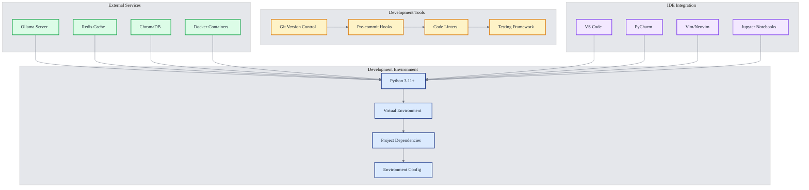
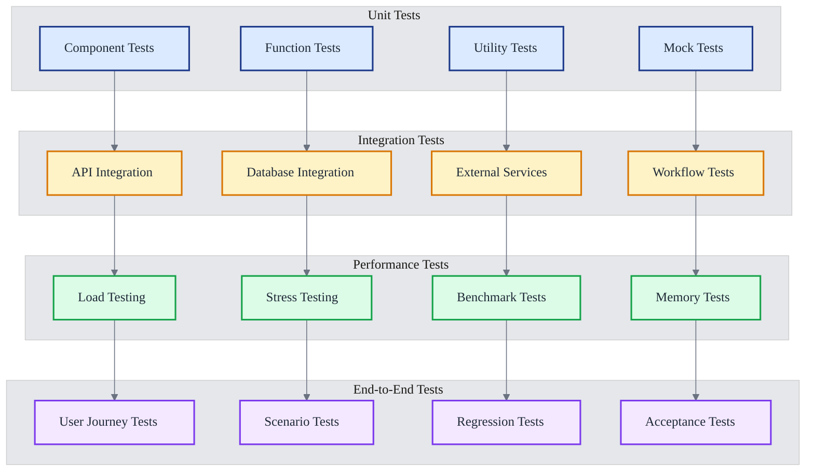
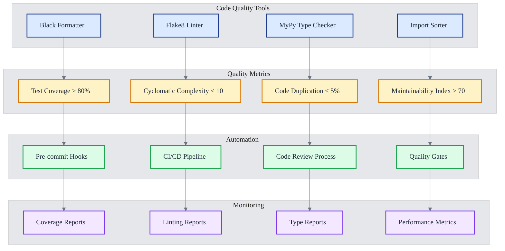
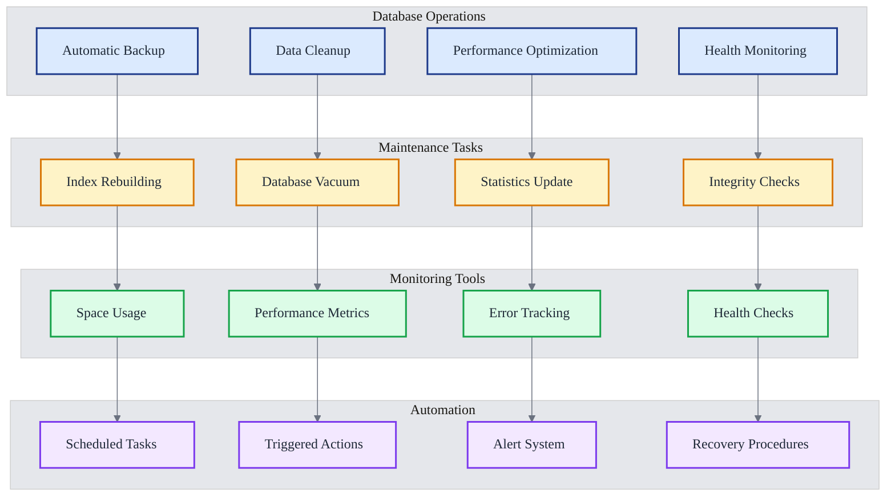
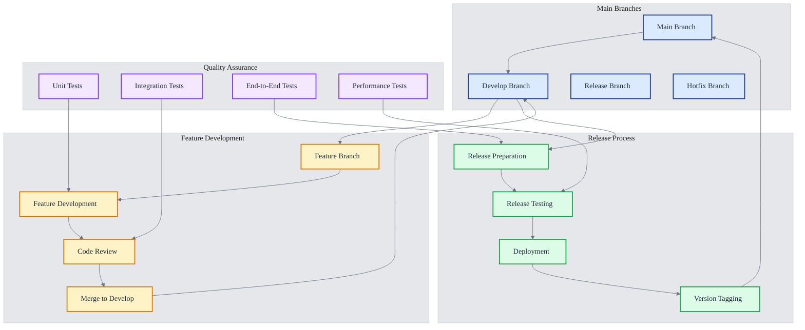
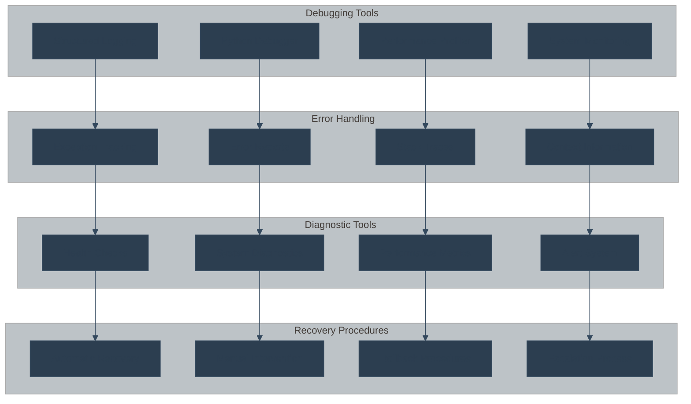
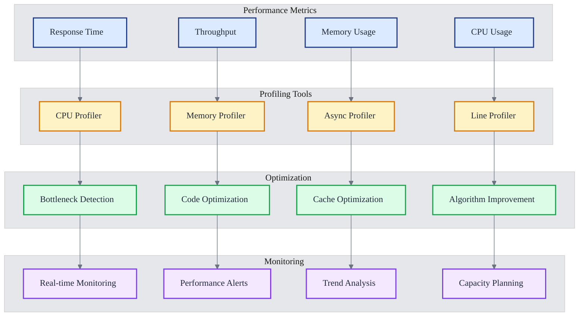
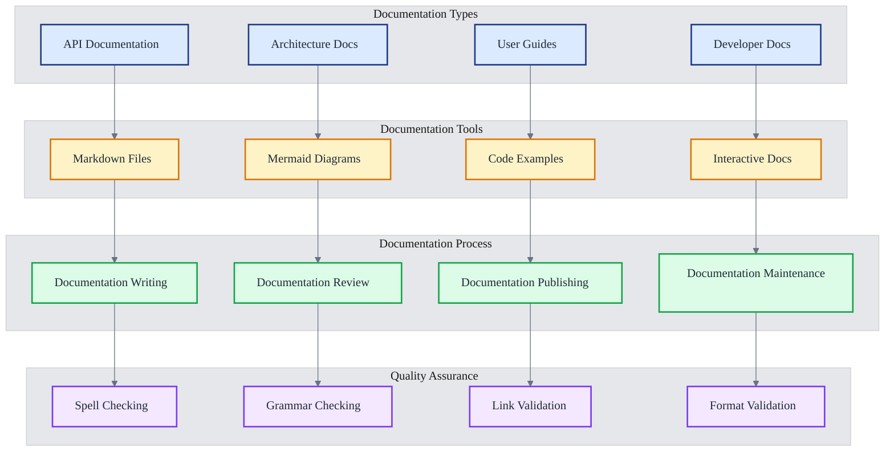

# 🛠️ BasicChat Development Guide

> **Comprehensive development guide for contributing to BasicChat's open-source AI assistant**

## 📋 Table of Contents

- [Environment Setup](#environment-setup)
- [Testing Framework](#testing-framework)
- [Code Quality Standards](#code-quality-standards)
- [Database Management](#database-management)
- [Development Workflows](#development-workflows)
- [Debugging & Troubleshooting](#debugging--troubleshooting)
- [Performance Profiling](#performance-profiling)
- [Documentation Standards](#documentation-standards)

---

## 🚀 Environment Setup

### **Prerequisites**

Before setting up the development environment, ensure you have the following installed:

- **Python 3.11+**: Core runtime environment
- **Git**: Version control system
- **Docker** (optional): Containerized development
- **Ollama**: Local LLM server
- **Redis** (optional): Caching layer

### **Initial Setup**

```bash
# Clone the repository
git clone https://github.com/your-username/basic-chat-template.git
cd basic-chat-template

# Create virtual environment
python -m venv venv
source venv/bin/activate  # On Windows: venv\Scripts\activate

# Install dependencies
pip install -r requirements.txt

# Install development dependencies
pip install -r requirements-dev.txt

# Set up pre-commit hooks
pre-commit install
```

### **Environment Configuration**

Create a `.env` file in the project root:

```env
# Ollama Configuration
OLLAMA_BASE_URL=http://localhost:11434
OLLAMA_MODEL=llama2:7b

# Database Configuration
CHROMA_DB_PATH=./chroma_db
REDIS_URL=redis://localhost:6379

# Performance Settings
MAX_CONCURRENT_REQUESTS=10
CACHE_TTL=3600

# Development Settings
DEBUG=True
LOG_LEVEL=DEBUG
```

### **Development Tools Setup**



---

## 🧪 Testing Framework

### **Test Structure**

BasicChat uses a comprehensive testing framework with multiple test categories:

```
tests/
├── conftest.py              # Test configuration and fixtures
├── test_app.py              # Main application tests
├── test_basic.py            # Basic functionality tests
├── test_reasoning.py        # Reasoning engine tests
├── test_document_processing.py  # Document processing tests
├── test_enhanced_tools.py   # Tool functionality tests
├── test_enhanced_reasoning.py   # Advanced reasoning tests
├── test_enhanced_audio.py   # Audio processing tests
├── test_voice.py            # Voice functionality tests
├── test_web_search.py       # Web search tests
├── test_upload.py           # File upload tests
└── test_document_workflow.py    # End-to-end workflow tests
```

### **Test Categories**



### **Running Tests**

```bash
# Run all tests
python -m pytest

# Run specific test file
python -m pytest tests/test_reasoning.py

# Run tests with coverage
python -m pytest --cov=app --cov-report=html

# Run tests in parallel
python -m pytest -n auto

# Run only unit tests
python -m pytest -m "not integration"

# Run only integration tests
python -m pytest -m "integration"

# Run tests with verbose output
python -m pytest -v

# Run tests and stop on first failure
python -m pytest -x
```

### **Test Configuration**

The `pytest.ini` file configures the testing environment:

```ini
[tool:pytest]
testpaths = tests
python_files = test_*.py
python_classes = Test*
python_functions = test_*
addopts = 
    -v 
    --cov=app 
    --cov=utils 
    --cov=config 
    --cov=reasoning_engine 
    --cov=web_search 
    --cov=document_processor 
    --cov-report=html 
    --cov-report=term-missing
    --cov-fail-under=80
    --asyncio-mode=auto
    --strict-markers
markers =
    slow: marks tests as slow (deselect with '-m "not slow"')
    integration: marks tests as integration tests
    unit: marks tests as unit tests
    async: marks tests as async tests
filterwarnings =
    ignore::DeprecationWarning
    ignore::PendingDeprecationWarning
```

---

## 📏 Code Quality Standards

### **Code Formatting**

BasicChat uses **Black** for code formatting with a 100-character line width:

```bash
# Format all Python files
black . --line-length 100

# Check formatting without making changes
black . --check --line-length 100

# Format specific file
black app.py --line-length 100
```

### **Linting**

**Flake8** is used for code linting with strict configuration:

```bash
# Run flake8 linting
flake8 . --max-line-length=100 --extend-ignore=E203,W503

# Run on specific directory
flake8 app/ --max-line-length=100

# Generate linting report
flake8 . --max-line-length=100 --format=html --htmldir=flake8-report
```

### **Type Checking**

**MyPy** provides static type checking:

```bash
# Run type checking
mypy . --ignore-missing-imports

# Check specific module
mypy app.py --ignore-missing-imports

# Generate type coverage report
mypy . --ignore-missing-imports --html-report mypy-report
```

### **Pre-commit Hooks**

Automated code quality checks using pre-commit:

```yaml
# .pre-commit-config.yaml
repos:
  - repo: https://github.com/psf/black
    rev: 23.3.0
    hooks:
      - id: black
        args: [--line-length=100]
  
  - repo: https://github.com/pycqa/flake8
    rev: 6.0.0
    hooks:
      - id: flake8
        args: [--max-line-length=100, --extend-ignore=E203,W503]
  
  - repo: https://github.com/pre-commit/mirrors-mypy
    rev: v1.3.0
    hooks:
      - id: mypy
        args: [--ignore-missing-imports]
  
  - repo: https://github.com/pycqa/isort
    rev: 5.12.0
    hooks:
      - id: isort
        args: [--profile=black, --line-length=100]
```

### **Quality Metrics**



---

## 🗄️ Database Management

### **ChromaDB Management**

ChromaDB is used for vector storage and semantic search. The system includes comprehensive management tools.

### **Cleanup Utilities**

The `scripts/cleanup_chroma.py` script provides database maintenance:

```bash
# Check database status
python scripts/cleanup_chroma.py --status

# Preview cleanup operations (dry run)
python scripts/cleanup_chroma.py --dry-run

# Clean up old directories (24+ hours)
python scripts/cleanup_chroma.py --age 24

# Force complete cleanup
python scripts/cleanup_chroma.py --force

# Clean specific directory
python scripts/cleanup_chroma.py --path ./chroma_db_123456
```

### **Database Monitoring**



### **Database Configuration**

ChromaDB configuration in `config.py`:

```python
# ChromaDB Configuration
CHROMA_DB_PATH = os.getenv("CHROMA_DB_PATH", "./chroma_db")
CHROMA_COLLECTION_NAME = os.getenv("CHROMA_COLLECTION_NAME", "documents")
CHROMA_DISTANCE_FUNCTION = os.getenv("CHROMA_DISTANCE_FUNCTION", "cosine")

# Vector Database Settings
EMBEDDING_MODEL = os.getenv("EMBEDDING_MODEL", "llama2:7b")
CHUNK_SIZE = int(os.getenv("CHUNK_SIZE", "1000"))
CHUNK_OVERLAP = int(os.getenv("CHUNK_OVERLAP", "200"))
```

---

## 🔄 Development Workflows

### **Git Workflow**

BasicChat follows a feature branch workflow:



### **Branch Naming Convention**

```bash
# Feature branches
feature/add-web-search-integration
feature/enhance-reasoning-engine
feature/improve-document-processing

# Bug fix branches
fix/memory-leak-in-cache
fix/typo-in-error-message
fix/async-request-timeout

# Hotfix branches
hotfix/critical-security-vulnerability
hotfix/database-connection-issue
hotfix/performance-regression

# Release branches
release/v2.1.0
release/v2.2.0
```

### **Commit Message Convention**

Follow the [Conventional Commits](https://www.conventionalcommits.org/) specification:

```bash
# Feature commits
feat: add web search integration
feat(reasoning): implement chain-of-thought reasoning
feat(ui): add dark mode support

# Bug fix commits
fix: resolve memory leak in cache system
fix(auth): correct token validation logic
fix(api): handle null response from external service

# Documentation commits
docs: update API documentation
docs(readme): add installation instructions
docs(architecture): add system diagram

# Performance commits
perf: optimize database queries
perf(cache): improve cache hit ratio
perf(ui): reduce bundle size

# Refactor commits
refactor: extract common utility functions
refactor(reasoning): simplify mode selection logic
refactor(tests): improve test organization
```

### **Pull Request Process**

1. **Create Feature Branch**: `git checkout -b feature/your-feature-name`
2. **Make Changes**: Implement your feature with tests
3. **Run Tests**: Ensure all tests pass
4. **Code Quality**: Run linting and formatting
5. **Create PR**: Submit pull request with detailed description
6. **Code Review**: Address reviewer feedback
7. **Merge**: Merge after approval and CI/CD success

---

## 🐛 Debugging & Troubleshooting

### **Common Issues**

#### **Ollama Connection Issues**

```bash
# Check Ollama service status
curl http://localhost:11434/api/tags

# Verify model availability
ollama list

# Test model response
ollama run llama2:7b "Hello, world!"
```

#### **ChromaDB Issues**

```bash
# Check ChromaDB status
python -c "import chromadb; print('ChromaDB available')"

# Verify database path
ls -la ./chroma_db_*

# Test database connection
python scripts/test_chroma_connection.py
```

#### **Redis Connection Issues**

```bash
# Check Redis service
redis-cli ping

# Test Redis connection
python -c "import redis; r = redis.Redis(); print(r.ping())"
```

### **Debugging Tools**



### **Logging Configuration**

```python
# config.py
import structlog

# Structured logging configuration
structlog.configure(
    processors=[
        structlog.stdlib.filter_by_level,
        structlog.stdlib.add_logger_name,
        structlog.stdlib.add_log_level,
        structlog.stdlib.PositionalArgumentsFormatter(),
        structlog.processors.TimeStamper(fmt="iso"),
        structlog.processors.StackInfoRenderer(),
        structlog.processors.format_exc_info,
        structlog.processors.UnicodeDecoder(),
        structlog.processors.JSONRenderer()
    ],
    context_class=dict,
    logger_factory=structlog.stdlib.LoggerFactory(),
    wrapper_class=structlog.stdlib.BoundLogger,
    cache_logger_on_first_use=True,
)
```

---

## 📊 Performance Profiling

### **Profiling Tools**

```bash
# CPU profiling with cProfile
python -m cProfile -o profile.stats app.py

# Memory profiling with memory_profiler
python -m memory_profiler app.py

# Line-by-line profiling
python -m line_profiler app.py

# Async profiling
python -m asyncio_profiler app.py
```

### **Performance Metrics**



### **Performance Benchmarks**

```python
# benchmarks/performance_test.py
import time
import asyncio
from app import reasoning_engine

async def benchmark_reasoning():
    """Benchmark reasoning engine performance"""
    start_time = time.time()
    
    # Test different reasoning modes
    modes = ['auto', 'standard', 'chain_of_thought', 'multi_step', 'agent']
    
    for mode in modes:
        start = time.time()
        result = await reasoning_engine.run(
            query="What is the capital of France?",
            mode=mode
        )
        end = time.time()
        print(f"{mode}: {end - start:.3f}s")
    
    total_time = time.time() - start_time
    print(f"Total benchmark time: {total_time:.3f}s")
```

---

## 📚 Documentation Standards

### **Documentation Structure**



### **Documentation Guidelines**

1. **Code Comments**: Use clear, concise comments explaining complex logic
2. **Docstrings**: Follow Google-style docstrings for all functions and classes
3. **README Files**: Maintain comprehensive README files for each module
4. **API Documentation**: Document all public APIs with examples
5. **Architecture Diagrams**: Use Mermaid diagrams for system architecture
6. **Change Logs**: Maintain detailed change logs for each release

### **Documentation Tools**

```bash
# Generate API documentation
pydoc-markdown

# Validate markdown files
markdownlint docs/

# Check for broken links
markdown-link-check docs/

# Generate documentation site
mkdocs build
```

---

## 📚 References

1. **Mermaid Documentation**: Knut Sveidqvist et al. *Mermaid: Markdown-inspired diagramming and charting tool*. GitHub, 2024. Available: https://mermaid.js.org/

2. **Python Development**: van Rossum, Guido. *The Python Language Reference*. Python Software Foundation, 2023.

3. **Testing Best Practices**: Meszaros, Gerard. *xUnit Test Patterns: Refactoring Test Code*. Addison-Wesley, 2007.

4. **Code Quality**: Martin, Robert C. *Clean Code: A Handbook of Agile Software Craftsmanship*. Prentice Hall, 2008.

5. **Git Workflow**: Chacon, Scott and Straub, Ben. *Pro Git*. Apress, 2014.

6. **Performance Engineering**: Gregg, Brendan. *Systems Performance: Enterprise and the Cloud*. Prentice Hall, 2013.

---

*This development guide provides comprehensive information for contributing to BasicChat. For additional resources, see the [Architecture Documentation](ARCHITECTURE.md) and [Features Overview](FEATURES.md).*

[← Back to README](../README.md) | [Architecture →](ARCHITECTURE.md) | [Features →](FEATURES.md) | [Roadmap →](ROADMAP.md) 