# Development Guide

This guide provides comprehensive instructions for developers contributing to BasicChat, including environment setup, testing, code quality, and project management workflows.

[← Back to README](../README.md)

---

## 🚀 Development Environment Setup

### **Prerequisites**

<div align="center">

| **Requirement** | **Version** | **Purpose** | **Installation** |
|:---|:---|:---|:---|
| **Python** | 3.11+ | Core runtime | [python.org](https://python.org) |
| **Git** | Latest | Version control | [git-scm.com](https://git-scm.com) |
| **Ollama** | Latest | Local LLM server | [ollama.ai](https://ollama.ai) |
| **Redis** | 6.0+ | Optional caching | [redis.io](https://redis.io) |

</div>

### **Initial Setup**

```bash
# 1. Clone the repository
git clone https://github.com/khaosans/basic-chat-template.git
cd basic-chat-template

# 2. Create virtual environment
python -m venv venv
source venv/bin/activate  # On Windows: .\venv\Scripts\activate

# 3. Install dependencies
pip install -r requirements.txt

# 4. Install development dependencies
pip install pytest pytest-asyncio pytest-cov black flake8 mypy

# 5. Download required models
ollama pull mistral
ollama pull nomic-embed-text
ollama pull llava  # Optional: for image processing
```

### **Environment Configuration**

Create a `.env.local` file for local development:

```bash
# Ollama Configuration
OLLAMA_API_URL=http://localhost:11434/api
DEFAULT_MODEL=mistral
VISION_MODEL=llava
EMBEDDING_MODEL=nomic-embed-text

# Performance Configuration
ENABLE_CACHING=true
CACHE_TTL=3600
REQUEST_TIMEOUT=30
MAX_RETRIES=3
RATE_LIMIT=10

# Redis Configuration (Optional)
REDIS_ENABLED=false
REDIS_URL=redis://localhost:6379

# Logging Configuration
LOG_LEVEL=INFO
ENABLE_STRUCTURED_LOGGING=true
```

---

## 🧪 Testing Framework

### **Test Structure**

```mermaid
graph TB
    subgraph "🧪 Test Categories"
        UNIT[Unit Tests]
        INTEGRATION[Integration Tests]
        ASYNC[Async Tests]
        E2E[End-to-End Tests]
    end
    
    subgraph "📁 Test Files"
        BASIC[test_basic.py]
        REASONING[test_reasoning.py]
        DOCS[test_document_workflow.py]
        TOOLS[test_enhanced_tools.py]
        AUDIO[test_voice.py]
        WEB[test_web_search.py]
    end
    
    subgraph "🔧 Test Tools"
        PYTEST[pytest]
        COV[pytest-cov]
        ASYNC[pytest-asyncio]
        MOCK[unittest.mock]
    end
    
    UNIT --> BASIC
    UNIT --> REASONING
    UNIT --> TOOLS
    
    INTEGRATION --> DOCS
    INTEGRATION --> AUDIO
    INTEGRATION --> WEB
    
    ASYNC --> REASONING
    ASYNC --> WEB
    
    E2E --> DOCS
    E2E --> AUDIO
    
    PYTEST --> UNIT
    PYTEST --> INTEGRATION
    PYTEST --> ASYNC
    PYTEST --> E2E
    
    COV --> PYTEST
    ASYNC --> PYTEST
    MOCK --> PYTEST
```



**Diagram Narrative: Testing Framework Structure**

This diagram illustrates the comprehensive testing framework that organizes tests by category (unit, integration, async, end-to-end) and maps them to specific test files and tools. The framework provides 80%+ test coverage through systematic testing of core logic, document processing, tools, and async operations, ensuring code quality and reliability. Use this structure to understand test organization, run specific test categories, and maintain comprehensive coverage as the codebase evolves.

### **Running Tests**

```bash
# Run all tests
pytest

# Run with coverage report
pytest --cov=app --cov-report=html --cov-report=term

# Run specific test categories
pytest tests/test_basic.py                    # Basic functionality
pytest tests/test_reasoning.py                # Reasoning engine
pytest tests/test_document_workflow.py        # Document processing
pytest tests/test_enhanced_tools.py           # Tool functionality
pytest tests/test_voice.py                    # Audio features
pytest tests/test_web_search.py               # Web search integration

# Run async tests only
pytest tests/ -m "asyncio"

# Run with verbose output
pytest -v

# Run with parallel execution
pytest -n auto

# Run tests matching pattern
pytest -k "calculator"                        # Tests with "calculator" in name
pytest -k "not slow"                          # Exclude slow tests
```

### **Test Coverage**

<div align="center">

| **Component** | **Coverage Target** | **Current Status** | **Test Files** |
|:---|:---:|:---:|:---|
| **Core Logic** | 90%+ | ✅ | `test_basic.py`, `test_reasoning.py` |
| **Document Processing** | 85%+ | ✅ | `test_document_workflow.py` |
| **Tools** | 80%+ | ✅ | `test_enhanced_tools.py` |
| **Async Operations** | 75%+ | ✅ | `test_voice.py`, `test_web_search.py` |
| **Integration** | 70%+ | ✅ | All integration tests |

</div>

### **Writing Tests**

**Example Unit Test:**
```python
import pytest
from utils.enhanced_tools import EnhancedCalculator

class TestEnhancedCalculator:
    def test_basic_arithmetic(self):
        calc = EnhancedCalculator()
        result = calc.calculate("2 + 3 * 4")
        assert result.success
        assert result.result == 14
    
    def test_trigonometric_functions(self):
        calc = EnhancedCalculator()
        result = calc.calculate("sin(pi/2)")
        assert result.success
        assert abs(result.result - 1.0) < 0.001
    
    def test_error_handling(self):
        calc = EnhancedCalculator()
        result = calc.calculate("invalid_expression")
        assert not result.success
        assert "error" in result.error.lower()
```

**Example Async Test:**
```python
import pytest
import asyncio
from utils.async_ollama import AsyncOllamaClient

@pytest.mark.asyncio
class TestAsyncOllamaClient:
    async def test_health_check(self):
        client = AsyncOllamaClient()
        is_healthy = await client.health_check()
        assert isinstance(is_healthy, bool)
        await client.close()
    
    async def test_query_async(self):
        client = AsyncOllamaClient()
        response = await client.query_async({
            "inputs": "Hello, world!",
            "system": "You are a helpful assistant."
        })
        assert response is not None
        await client.close()
```

---

## ✨ Code Quality Standards

### **Code Formatting**

```bash
# Format code with Black
black .

# Check formatting without changes
black --check .

# Format specific files
black app.py reasoning_engine.py
```

**Black Configuration** (pyproject.toml):
```toml
[tool.black]
line-length = 100
target-version = ['py311']
include = '\.pyi?$'
extend-exclude = '''
/(
  # directories
  \.eggs
  | \.git
  | \.hg
  | \.mypy_cache
  | \.tox
  | \.venv
  | build
  | dist
)/
'''
```

### **Linting with Flake8**

```bash
# Run flake8 linting
flake8 .

# Run with specific configuration
flake8 --max-line-length=100 --ignore=E203,W503 .

# Generate report
flake8 --format=html --htmldir=flake8-report .
```

**Flake8 Configuration** (.flake8):
```ini
[flake8]
max-line-length = 100
ignore = E203, W503, E501
exclude = 
    .git,
    __pycache__,
    .venv,
    venv,
    build,
    dist,
    *.egg-info
```

### **Type Checking with MyPy**

```bash
# Run type checking
mypy .

# Run with strict mode
mypy --strict .

# Generate HTML report
mypy --html-report mypy-report .
```

**MyPy Configuration** (mypy.ini):
```ini
[mypy]
python_version = 3.11
warn_return_any = True
warn_unused_configs = True
disallow_untyped_defs = True
disallow_incomplete_defs = True
check_untyped_defs = True
disallow_untyped_decorators = True
no_implicit_optional = True
warn_redundant_casts = True
warn_unused_ignores = True
warn_no_return = True
warn_unreachable = True
strict_equality = True

[mypy.plugins.pydantic.*]
init_forbid_extra = True
init_typed = True
warn_required_dynamic_aliases = True
warn_untyped_fields = True
```

### **Pre-commit Hooks**

Create `.pre-commit-config.yaml`:
```yaml
repos:
  - repo: https://github.com/psf/black
    rev: 23.3.0
    hooks:
      - id: black
        language_version: python3.11
        args: [--line-length=100]
  
  - repo: https://github.com/pycqa/flake8
    rev: 6.0.0
    hooks:
      - id: flake8
        args: [--max-line-length=100, --ignore=E203,W503]
  
  - repo: https://github.com/pre-commit/mirrors-mypy
    rev: v1.3.0
    hooks:
      - id: mypy
        additional_dependencies: [types-requests, types-PyYAML]
  
  - repo: https://github.com/pycqa/isort
    rev: 5.12.0
    hooks:
      - id: isort
        args: [--profile=black, --line-length=100]
```

Install and run:
```bash
# Install pre-commit
pip install pre-commit

# Install hooks
pre-commit install

# Run on all files
pre-commit run --all-files
```

---

## 🗄️ Database Management

### **ChromaDB Cleanup Utilities**

```mermaid
graph TB
    subgraph "🧹 Cleanup Operations"
        STATUS[Status Check]
        DRY_RUN[Dry Run]
        AGE_CLEANUP[Age-based Cleanup]
        FORCE_CLEANUP[Force Cleanup]
    end
    
    subgraph "📊 Database Info"
        DIRECTORIES[ChromaDB Directories]
        SIZES[Directory Sizes]
        AGES[Directory Ages]
        FILES[File Counts]
    end
    
    subgraph "🔧 Script Options"
        --status[--status]
        --dry-run[--dry-run]
        --age[--age HOURS]
        --force[--force]
    end
    
    STATUS --> DIRECTORIES
    STATUS --> SIZES
    STATUS --> AGES
    STATUS --> FILES
    
    DRY_RUN --> STATUS
    AGE_CLEANUP --> STATUS
    FORCE_CLEANUP --> STATUS
    
    --status --> STATUS
    --dry-run --> DRY_RUN
    --age --> AGE_CLEANUP
    --force --> FORCE_CLEANUP
```

**Diagram Narrative: Database Cleanup Operations**

This diagram shows the ChromaDB cleanup utility architecture that provides status checking, dry-run capabilities, age-based cleanup, and force cleanup operations. The comprehensive management approach enables efficient database maintenance through configurable cleanup strategies while providing safety through dry-run previews and status monitoring. Use these tools regularly to manage database size, prevent storage issues, and maintain optimal system performance through automated cleanup processes.

### **Database Management Commands**

```bash
# Check database status
python scripts/cleanup_chroma.py --status

# Preview cleanup operations (safe)
python scripts/cleanup_chroma.py --dry-run

# Clean up directories older than 24 hours
python scripts/cleanup_chroma.py --age 24

# Force complete cleanup (⚠️ destructive)
python scripts/cleanup_chroma.py --force

# Clean up specific age ranges
python scripts/cleanup_chroma.py --age 1    # 1+ hours old
python scripts/cleanup_chroma.py --age 168  # 1 week+ old
```

### **Database Monitoring**

```python
# Example: Monitor database health
from document_processor import DocumentProcessor

def check_database_health():
    processor = DocumentProcessor()
    
    # Check processed files
    files = processor.get_processed_files()
    print(f"Processed files: {len(files)}")
    
    # Check available documents
    docs = processor.get_available_documents()
    print(f"Available documents: {len(docs)}")
    
    # Get database directories
    from document_processor import DocumentProcessor
    directories = DocumentProcessor.get_chroma_directories()
    print(f"Database directories: {len(directories)}")
    
    return {
        'files': len(files),
        'documents': len(docs),
        'directories': len(directories)
    }
```

---

## 🔧 Development Workflows

### **Feature Development**

```mermaid
graph LR
    subgraph "🔄 Development Cycle"
        FEATURE[Feature Branch]
        DEVELOP[Development]
        TEST[Testing]
        REVIEW[Code Review]
        MERGE[Merge to Main]
    end
    
    subgraph "🧪 Quality Gates"
        UNIT_TESTS[Unit Tests]
        INTEGRATION[Integration Tests]
        LINTING[Linting]
        TYPE_CHECK[Type Checking]
    end
    
    FEATURE --> DEVELOP
    DEVELOP --> TEST
    TEST --> REVIEW
    REVIEW --> MERGE
    
    TEST --> UNIT_TESTS
    TEST --> INTEGRATION
    REVIEW --> LINTING
    REVIEW --> TYPE_CHECK
    
    UNIT_TESTS --> REVIEW
    INTEGRATION --> REVIEW
    LINTING --> REVIEW
    TYPE_CHECK --> REVIEW
```



**Diagram Narrative: Development Workflow**

This diagram illustrates the complete development cycle from feature branching through testing, review, and merge, with quality gates ensuring code quality at each stage. The workflow integrates unit tests, integration tests, linting, and type checking as mandatory quality gates, ensuring that only high-quality code reaches production. Follow this workflow for all feature development to maintain code quality, enable effective collaboration, and ensure reliable deployments.

### **Git Workflow**

```bash
# 1. Create feature branch
git checkout -b feature/amazing-feature

# 2. Make changes and commit
git add .
git commit -m "feat: add amazing feature

- Implement new functionality
- Add comprehensive tests
- Update documentation"

# 3. Push and create PR
git push origin feature/amazing-feature

# 4. After review, merge to main
git checkout main
git pull origin main
git merge feature/amazing-feature
git push origin main

# 5. Clean up
git branch -d feature/amazing-feature
```

### **Commit Message Convention**

Follow [Conventional Commits](https://www.conventionalcommits.org/):

```bash
# Format: <type>[optional scope]: <description>

# Examples:
git commit -m "feat: add advanced calculator with step-by-step reasoning"
git commit -m "fix(reasoning): resolve chain-of-thought parsing issue"
git commit -m "docs(architecture): update system diagrams with Mermaid"
git commit -m "test(tools): add comprehensive calculator test suite"
git commit -m "refactor(caching): optimize multi-layer cache implementation"
```

**Commit Types:**
- `feat`: New feature
- `fix`: Bug fix
- `docs`: Documentation changes
- `style`: Code style changes
- `refactor`: Code refactoring
- `test`: Test additions/changes
- `chore`: Maintenance tasks

---

## 🐛 Debugging & Troubleshooting

### **Common Issues**

<div align="center">

| **Issue** | **Symptoms** | **Solution** |
|:---|:---|:---|
| **Ollama Connection** | Connection refused errors | Check `ollama serve` is running |
| **Model Not Found** | Model loading errors | Run `ollama pull <model_name>` |
| **ChromaDB Conflicts** | Database errors | Use cleanup script: `python scripts/cleanup_chroma.py --force` |
| **Memory Issues** | Out of memory errors | Increase system memory or reduce batch sizes |
| **Async Timeouts** | Request timeouts | Increase `REQUEST_TIMEOUT` in config |

</div>

### **Debug Mode**

```python
# Enable debug logging
import logging
logging.basicConfig(level=logging.DEBUG)

# Enable async debug mode
import asyncio
asyncio.get_event_loop().set_debug(True)

# Enable Streamlit debug
import streamlit as st
st.set_option('deprecation.showPyplotGlobalUse', False)
```

### **Performance Profiling**

```python
# Profile function performance
import cProfile
import pstats

def profile_function(func, *args, **kwargs):
    profiler = cProfile.Profile()
    profiler.enable()
    result = func(*args, **kwargs)
    profiler.disable()
    
    stats = pstats.Stats(profiler)
    stats.sort_stats('cumulative')
    stats.print_stats(10)  # Top 10 functions
    
    return result

# Usage
profile_function(your_function, arg1, arg2)
```

---

## 📚 Documentation Standards

### **Code Documentation**

```python
def enhanced_calculate(expression: str) -> CalculationResult:
    """
    Perform enhanced mathematical calculations with step-by-step reasoning.
    
    Args:
        expression (str): Mathematical expression to evaluate
        
    Returns:
        CalculationResult: Object containing result, steps, and metadata
        
    Raises:
        ValueError: If expression is invalid or unsafe
        ZeroDivisionError: If division by zero is attempted
        
    Example:
        >>> result = enhanced_calculate("2 + 3 * 4")
        >>> print(result.result)
        14
        >>> print(result.steps)
        ['2 + 3 * 4', '2 + 12', '14']
    """
    # Implementation here
    pass
```

### **Architecture Documentation**

- Use **Mermaid diagrams** for visual documentation
- Include **sequence diagrams** for complex flows
- Document **design patterns** and architectural decisions
- Provide **performance characteristics** and trade-offs

### **API Documentation**

```python
@dataclass
class ReasoningResult:
    """
    Result from reasoning operations with comprehensive metadata.
    
    Attributes:
        content (str): Final answer/conclusion
        reasoning_steps (List[str]): Step-by-step thought process
        confidence (float): Confidence score (0.0 to 1.0)
        sources (List[str]): Information sources used
        reasoning_mode (str): Which reasoning mode was used
        execution_time (float): Time taken for reasoning
        success (bool): Whether operation was successful
        error (Optional[str]): Error message if failed
    """
    content: str
    reasoning_steps: List[str]
    confidence: float
    sources: List[str]
    reasoning_mode: str
    execution_time: float = 0.0
    success: bool = True
    error: Optional[str] = None
```

---

## 🔗 Related Documentation

- **[System Architecture](ARCHITECTURE.md)** - Technical architecture and component interactions
- **[Features Overview](FEATURES.md)** - Complete feature documentation
- **[Project Roadmap](ROADMAP.md)** - Future features and development plans
- **[Reasoning Features](REASONING_FEATURES.md)** - Advanced reasoning engine details

---

[← Back to README](../README.md) | [Architecture →](ARCHITECTURE.md) | [Features →](FEATURES.md) | [Roadmap →](ROADMAP.md) 