# Development Guide

This guide provides comprehensive instructions for developers contributing to BasicChat, including environment setup, testing, code quality, and project management workflows.

[← Back to README](../README.md)

---

## 🚀 Development Environment Setup

### **Prerequisites**

<div align="center">

| **Requirement** | **Version** | **Purpose** | **Installation** |
|:---|:---|:---|:---|
| **Python** | 3.11+ | Core runtime | [python.org](https://python.org) |
| **Git** | Latest | Version control | [git-scm.com](https://git-scm.com) |
| **Ollama** | Latest | Local LLM server | [ollama.ai](https://ollama.ai) |
| **Redis** | 6.0+ | Optional caching | [redis.io](https://redis.io) |

</div>

### **Initial Setup**

```bash
# 1. Clone the repository
git clone https://github.com/khaosans/basic-chat.git
cd basic-chat

# 2. Create virtual environment
python -m venv venv
source venv/bin/activate  # On Windows: .\venv\Scripts\activate

# 3. Install dependencies
pip install -r requirements.txt

# 4. Install development dependencies
pip install pytest pytest-asyncio pytest-cov black flake8 mypy

# 5. Download required models
ollama pull mistral
ollama pull nomic-embed-text
ollama pull llava  # Optional: for image processing
```

### **Environment Configuration**

Create a `.env.local` file for local development:

```bash
# Ollama Configuration
OLLAMA_API_URL=http://localhost:11434/api
DEFAULT_MODEL=mistral
VISION_MODEL=llava
EMBEDDING_MODEL=nomic-embed-text

# Performance Configuration
ENABLE_CACHING=true
CACHE_TTL=3600
REQUEST_TIMEOUT=30
MAX_RETRIES=3
RATE_LIMIT=10

# Redis Configuration (Optional)
REDIS_ENABLED=false
REDIS_URL=redis://localhost:6379

# Logging Configuration
LOG_LEVEL=INFO
ENABLE_STRUCTURED_LOGGING=true
```

---

## 🧪 Testing Framework

### **Test Structure**

```mermaid
graph TB
    subgraph "🧪 Test Categories"
        UNIT[Unit Tests]
        INTEGRATION[Integration Tests]
        ASYNC[Async Tests]
        E2E[End-to-End Tests]
    end
    
    subgraph "📁 Test Files"
        BASIC[test_basic.py]
        REASONING[test_reasoning.py]
        DOCS[test_document_workflow.py]
        TOOLS[test_enhanced_tools.py]
        AUDIO[test_voice.py]
        WEB[test_web_search.py]
    end
    
    subgraph "🔧 Test Tools"
        PYTEST[pytest]
        COV[pytest-cov]
        ASYNC[pytest-asyncio]
        MOCK[unittest.mock]
    end
    
    UNIT --> BASIC
    UNIT --> REASONING
    UNIT --> TOOLS
    
    INTEGRATION --> DOCS
    INTEGRATION --> AUDIO
    INTEGRATION --> WEB
    
    ASYNC --> REASONING
    ASYNC --> WEB
    
    E2E --> DOCS
    E2E --> AUDIO
    
    PYTEST --> UNIT
    PYTEST --> INTEGRATION
    PYTEST --> ASYNC
    PYTEST --> E2E
    
    COV --> PYTEST
    ASYNC --> PYTEST
    MOCK --> PYTEST
```



**Testing Strategy and Best Practices:**
The testing framework is designed to provide comprehensive coverage while maintaining fast execution times. Unit tests focus on individual components and functions, ensuring that each piece works correctly in isolation. Integration tests verify that components work together properly, while async tests ensure that concurrent operations function correctly. End-to-end tests validate complete user workflows from start to finish. The framework uses pytest fixtures to share common setup code and reduce test duplication, while coverage reporting helps identify untested code paths (Beazley & Jones).

**Test Organization Principles:**
- **Unit Tests**: Test individual functions and classes in isolation
- **Integration Tests**: Verify component interactions and data flow
- **Async Tests**: Ensure concurrent operations work correctly
- **End-to-End Tests**: Validate complete user workflows
- **Performance Tests**: Measure response times and resource usage

**Coverage Targets and Quality Gates:**
The project maintains strict coverage requirements to ensure code quality and reliability. Core logic components require 90%+ coverage due to their critical nature, while document processing and tools require 85%+ and 80%+ respectively. These targets are enforced through CI/CD pipelines that block merges if coverage drops below thresholds. The coverage reporting includes both line coverage and branch coverage to ensure comprehensive testing of all code paths.

### **Running Tests**

```bash
# Run all tests
pytest

# Run with coverage report
pytest --cov=app --cov-report=html --cov-report=term

# Run specific test categories
pytest tests/test_basic.py                    # Basic functionality
pytest tests/test_reasoning.py                # Reasoning engine
pytest tests/test_document_workflow.py        # Document processing
pytest tests/test_enhanced_tools.py           # Tool functionality
pytest tests/test_voice.py                    # Audio features
pytest tests/test_web_search.py               # Web search integration

# Run async tests only
pytest tests/ -m "asyncio"

# Run with verbose output
pytest -v

# Run with parallel execution
pytest -n auto

# Run tests matching pattern
pytest -k "calculator"                        # Tests with "calculator" in name
pytest -k "not slow"                          # Exclude slow tests
```

### **Test Coverage**

<div align="center">

| **Component** | **Coverage Target** | **Current Status** | **Test Files** |
|:---|:---:|:---:|:---|
| **Core Logic** | 90%+ | ✅ | `test_basic.py`, `test_reasoning.py` |
| **Document Processing** | 85%+ | ✅ | `test_document_workflow.py` |
| **Tools** | 80%+ | ✅ | `test_enhanced_tools.py` |
| **Async Operations** | 75%+ | ✅ | `test_voice.py`, `test_web_search.py` |
| **Integration** | 70%+ | ✅ | All integration tests |

</div>

### **Writing Tests**

**Example Unit Test:**
```python
import pytest
from utils.enhanced_tools import EnhancedCalculator

class TestEnhancedCalculator:
    def test_basic_arithmetic(self):
        calc = EnhancedCalculator()
        result = calc.calculate("2 + 3 * 4")
        assert result.success
        assert result.result == 14
    
    def test_trigonometric_functions(self):
        calc = EnhancedCalculator()
        result = calc.calculate("sin(pi/2)")
        assert result.success
        assert abs(result.result - 1.0) < 0.001
    
    def test_error_handling(self):
        calc = EnhancedCalculator()
        result = calc.calculate("invalid_expression")
        assert not result.success
        assert "error" in result.error.lower()
```

**Example Async Test:**
```python
import pytest
import asyncio
from utils.async_ollama import AsyncOllamaClient

@pytest.mark.asyncio
class TestAsyncOllamaClient:
    async def test_health_check(self):
        client = AsyncOllamaClient()
        is_healthy = await client.health_check()
        assert isinstance(is_healthy, bool)
        await client.close()
    
    async def test_query_async(self):
        client = AsyncOllamaClient()
        response = await client.query_async({
            "inputs": "Hello, world!",
            "system": "You are a helpful assistant."
        })
        assert response is not None
        await client.close()
```

---

## ✨ Code Quality Standards

### **Code Formatting**

```bash
# Format code with Black
black .

# Check formatting without changes
black --check .

# Format specific files
black app.py reasoning_engine.py
```

**Black Configuration** (pyproject.toml):
```toml
[tool.black]
line-length = 100
target-version = ['py311']
include = '\.pyi?$'
extend-exclude = '''
/(
  # directories
  \.eggs
  | \.git
  | \.hg
  | \.mypy_cache
  | \.tox
  | \.venv
  | build
  | dist
)/
'''
```

### **Linting with Flake8**

```bash
# Run flake8 linting
flake8 .

# Run with specific configuration
flake8 --max-line-length=100 --ignore=E203,W503 .

# Generate report
flake8 --format=html --htmldir=flake8-report .
```

**Flake8 Configuration** (.flake8):
```ini
[flake8]
max-line-length = 100
ignore = E203, W503, E501
exclude = 
    .git,
    __pycache__,
    .venv,
    venv,
    build,
    dist,
    *.egg-info
```

### **Type Checking with MyPy**

```bash
# Run type checking
mypy .

# Run with strict mode
mypy --strict .

# Generate HTML report
mypy --html-report mypy-report .
```

**MyPy Configuration** (mypy.ini):
```ini
[mypy]
python_version = 3.11
warn_return_any = True
warn_unused_configs = True
disallow_untyped_defs = True
disallow_incomplete_defs = True
check_untyped_defs = True
disallow_untyped_decorators = True
no_implicit_optional = True
warn_redundant_casts = True
warn_unused_ignores = True
warn_no_return = True
warn_unreachable = True
strict_equality = True

[mypy.plugins.pydantic.*]
init_forbid_extra = True
init_typed = True
warn_required_dynamic_aliases = True
warn_untyped_fields = True
```

### **Pre-commit Hooks**

Create `.pre-commit-config.yaml`:
```yaml
repos:
  - repo: https://github.com/psf/black
    rev: 23.3.0
    hooks:
      - id: black
        language_version: python3.11
        args: [--line-length=100]
  
  - repo: https://github.com/pycqa/flake8
    rev: 6.0.0
    hooks:
      - id: flake8
        args: [--max-line-length=100, --ignore=E203,W503]
  
  - repo: https://github.com/pre-commit/mirrors-mypy
    rev: v1.3.0
    hooks:
      - id: mypy
        additional_dependencies: [types-requests, types-PyYAML]
  
  - repo: https://github.com/pycqa/isort
    rev: 5.12.0
    hooks:
      - id: isort
        args: [--profile=black, --line-length=100]
```

Install and run:
```bash
# Install pre-commit
pip install pre-commit

# Install hooks
pre-commit install

# Run on all files
pre-commit run --all-files
```

**Code Quality Enforcement:**
The project uses a comprehensive code quality pipeline that enforces consistent standards across all contributions. Black formatting ensures consistent code style, while Flake8 linting catches potential issues and enforces best practices. MyPy type checking provides static analysis to catch type-related errors before runtime. Pre-commit hooks automatically run these tools on every commit, ensuring that code quality standards are maintained consistently (Martin).

**Configuration Rationale:**
The 100-character line length was chosen to balance readability with modern display capabilities, while the strict MyPy configuration ensures type safety throughout the codebase. The Flake8 configuration excludes common false positives while maintaining strict error checking for actual issues. These settings are optimized for the project's Python 3.11+ requirement and modern development practices.

**Performance Impact:**
The code quality tools are optimized for speed to minimize development friction. Black formatting typically completes in <1 second for most files, while Flake8 linting completes in 2-3 seconds for the entire codebase. MyPy type checking is the most time-consuming operation, taking 5-10 seconds, but provides significant value in catching type-related bugs early in development.

---

## 🗄️ Database Management

### **ChromaDB Cleanup Utilities**


**Database Maintenance Strategy:**
The ChromaDB cleanup utility provides comprehensive database management capabilities to prevent storage issues and maintain optimal performance. The status reporting feature helps developers understand database usage patterns and identify potential issues before they become problems. The dry-run mode allows safe exploration of cleanup operations without making changes, while age-based cleanup provides automated maintenance for development environments.

**Performance Considerations:**
Database cleanup operations are designed to be non-blocking and efficient. The status check completes in <1 second even for large databases, while cleanup operations are optimized to minimize impact on running applications. The utility uses efficient file system operations and implements progress reporting for long-running operations. Age-based cleanup is particularly useful for development environments where databases can accumulate quickly during testing and experimentation.

**Best Practices for Database Management:**
- Run status checks regularly to monitor database health
- Use dry-run mode before performing cleanup operations
- Set up automated cleanup for development environments
- Monitor disk usage and implement alerts for storage thresholds
- Backup important data before performing force cleanup operations

### **Database Management Commands**

```bash
# Check database status
python scripts/cleanup_chroma.py --status

# Preview cleanup operations (safe)
python scripts/cleanup_chroma.py --dry-run

# Clean up directories older than 24 hours
python scripts/cleanup_chroma.py --age 24

# Force complete cleanup (⚠️ destructive)
python scripts/cleanup_chroma.py --force

# Clean up specific age ranges
python scripts/cleanup_chroma.py --age 1    # 1+ hours old
python scripts/cleanup_chroma.py --age 168  # 1 week+ old
```

### **Database Monitoring**

```python
# Example: Monitor database health
from document_processor import DocumentProcessor

def check_database_health():
    processor = DocumentProcessor()
    
    # Check processed files
    files = processor.get_processed_files()
    print(f"Processed files: {len(files)}")
    
    # Check available documents
    docs = processor.get_available_documents()
    print(f"Available documents: {len(docs)}")
    
    # Get database directories
    from document_processor import DocumentProcessor
    directories = DocumentProcessor.get_chroma_directories()
    print(f"Database directories: {len(directories)}")
    
    return {
        'files': len(files),
        'documents': len(docs),
        'directories': len(directories)
    }
```

---

## 🔧 Development Workflows

### **Feature Development**

```mermaid
graph LR
    subgraph "🔄 Development Cycle"
        FEATURE[Feature Branch]
        DEVELOP[Development]
        TEST[Testing]
        REVIEW[Code Review]
        MERGE[Merge to Main]
    end
    
    subgraph "🧪 Quality Gates"
        UNIT_TESTS[Unit Tests]
        INTEGRATION[Integration Tests]
        LINTING[Linting]
        TYPE_CHECK[Type Checking]
    end
    
    FEATURE --> DEVELOP
    DEVELOP --> TEST
    TEST --> REVIEW
    REVIEW --> MERGE
    
    TEST --> UNIT_TESTS
    TEST --> INTEGRATION
    REVIEW --> LINTING
    REVIEW --> TYPE_CHECK
    
    UNIT_TESTS --> REVIEW
    INTEGRATION --> REVIEW
    LINTING --> REVIEW
    TYPE_CHECK --> REVIEW
```



**Development Workflow:**
The development workflow ensures code quality and collaboration through systematic processes. Feature development follows a structured approach with clear quality gates at each stage. The workflow integrates automated testing, code review, and quality checks to maintain high standards while enabling rapid development cycles.

### **Git Workflow**

```bash
# 1. Create feature branch
git checkout -b feature/amazing-feature

# 2. Make changes and commit
git add .
git commit -m "feat: add amazing feature

- Implement new functionality
- Add comprehensive tests
- Update documentation"

# 3. Push and create PR
git push origin feature/amazing-feature

# 4. After review, merge to main
git checkout main
git pull origin main
git merge feature/amazing-feature
git push origin main

# 5. Clean up
git branch -d feature/amazing-feature
```

### **Commit Message Convention**

Follow [Conventional Commits](https://www.conventionalcommits.org/):

```bash
# Format: <type>[optional scope]: <description>

# Examples:
git commit -m "feat: add advanced calculator with step-by-step reasoning"
git commit -m "fix(reasoning): resolve chain-of-thought parsing issue"
git commit -m "docs(architecture): update system diagrams with Mermaid"
git commit -m "test(tools): add comprehensive calculator test suite"
git commit -m "refactor(caching): optimize multi-layer cache implementation"
```

**Commit Types:**
- `feat`: New feature
- `fix`: Bug fix
- `docs`: Documentation changes
- `style`: Code style changes
- `refactor`: Code refactoring
- `test`: Test additions/changes
- `chore`: Maintenance tasks

---

## 🐛 Debugging & Troubleshooting

### **Common Issues**

<div align="center">

| **Issue** | **Symptoms** | **Solution** |
|:---|:---|:---|
| **Ollama Connection** | Connection refused errors | Check `ollama serve` is running |
| **Model Not Found** | Model loading errors | Run `ollama pull <model_name>` |
| **ChromaDB Conflicts** | Database errors | Use cleanup script: `python scripts/cleanup_chroma.py --force` |
| **Memory Issues** | Out of memory errors | Increase system memory or reduce batch sizes |
| **Async Timeouts** | Request timeouts | Increase `REQUEST_TIMEOUT` in config |

</div>

### **Debug Mode**

```python
# Enable debug logging
import logging
logging.basicConfig(level=logging.DEBUG)

# Enable async debug mode
import asyncio
asyncio.get_event_loop().set_debug(True)

# Enable Streamlit debug
import streamlit as st
st.set_option('deprecation.showPyplotGlobalUse', False)
```

### **Performance Profiling**

```python
# Profile function performance
import cProfile
import pstats

def profile_function(func, *args, **kwargs):
    profiler = cProfile.Profile()
    profiler.enable()
    result = func(*args, **kwargs)
    profiler.disable()
    
    stats = pstats.Stats(profiler)
    stats.sort_stats('cumulative')
    stats.print_stats(10)  # Top 10 functions
    
    return result

# Usage
profile_function(your_function, arg1, arg2)
```

**Debug Mode Configuration:**
Debug mode provides comprehensive logging and monitoring capabilities to help developers identify and resolve issues quickly. The logging configuration provides detailed information about system operations, while async debug mode helps identify concurrency issues. Streamlit debug mode provides additional information about the web interface and helps identify UI-related problems.

**Performance Profiling:**
The performance profiling utilities help identify bottlenecks and optimize system performance. The cProfile integration provides detailed timing information for function calls, while the pstats module provides analysis tools to identify the most time-consuming operations. This information is invaluable for optimizing critical code paths and improving overall system performance.

**Common Issue Resolution:**
The troubleshooting guide provides solutions for the most common issues that developers encounter. Each issue includes specific symptoms, root causes, and step-by-step resolution procedures. The guide is regularly updated based on community feedback and new issue patterns that emerge during development.

---

## 📚 Documentation Standards

### **Code Documentation**

```python
def enhanced_calculate(expression: str) -> CalculationResult:
    """
    Perform enhanced mathematical calculations with step-by-step reasoning.
    
    Args:
        expression (str): Mathematical expression to evaluate
        
    Returns:
        CalculationResult: Object containing result, steps, and metadata
        
    Raises:
        ValueError: If expression is invalid or unsafe
        ZeroDivisionError: If division by zero is attempted
        
    Example:
        >>> result = enhanced_calculate("2 + 3 * 4")
        >>> print(result.result)
        14
        >>> print(result.steps)
        ['2 + 3 * 4', '2 + 12', '14']
    """
    # Implementation here
    pass
```

### **Architecture Documentation**

- Use **Mermaid diagrams** for visual documentation
- Include **sequence diagrams** for complex flows
- Document **design patterns** and architectural decisions
- Provide **performance characteristics** and trade-offs

### **API Documentation**

```python
@dataclass
class ReasoningResult:
    """
    Result from reasoning operations with comprehensive metadata.
    
    Attributes:
        content (str): Final answer/conclusion
        reasoning_steps (List[str]): Step-by-step thought process
        confidence (float): Confidence score (0.0 to 1.0)
        sources (List[str]): Information sources used
        reasoning_mode (str): Which reasoning mode was used
        execution_time (float): Time taken for reasoning
        success (bool): Whether operation was successful
        error (Optional[str]): Error message if failed
    """
    content: str
    reasoning_steps: List[str]
    confidence: float
    sources: List[str]
    reasoning_mode: str
    execution_time: float = 0.0
    success: bool = True
    error: Optional[str] = None
```

---

## 🔗 Related Documentation

- **[System Architecture](ARCHITECTURE.md)** - Technical architecture and component interactions
- **[Features Overview](FEATURES.md)** - Complete feature documentation
- **[Project Roadmap](ROADMAP.md)** - Future features and development plans
- **[Reasoning Features](REASONING_FEATURES.md)** - Advanced reasoning engine details

---

[← Back to README](../README.md) | [Architecture →](ARCHITECTURE.md) | [Features →](FEATURES.md) | [Roadmap →](ROADMAP.md) 

---

## ⏳ Running with Background Tasks

BasicChat supports background processing for long-running tasks (complex queries, large document processing) using Celery, Redis, and Flower. This enables a responsive UI and robust task management.

### **Development Startup**

To launch all services (Redis, Celery workers, Flower, Streamlit app) for local development:

```bash
./start_dev.sh
```

Or with Docker Compose:

```bash
docker-compose up --build
```

- **Main App:** http://localhost:8501
- **Task Monitor (Flower):** http://localhost:5555
- **Redis:** localhost:6379

### **Task Management in the UI**
- View task progress, status, and results in the chat and sidebar
- Cancel running tasks or clean up completed/failed tasks from the sidebar
- Monitor task metrics (active, completed, failed, cancelled)

### **Monitoring & Debugging**
- Use Flower (http://localhost:5555) to monitor, retry, or revoke tasks in real time
- Check logs for Celery worker output and errors
- Redis must be running for background tasks to work

### **Troubleshooting**
- **Redis not running:** Start Redis manually or via the dev script
- **Celery worker not processing tasks:** Check worker logs for errors, ensure Redis is reachable
- **Flower not showing tasks:** Ensure workers are running and connected to the same Redis instance
- **Fallback mode:** If Redis/Celery are unavailable, tasks run in-process (for dev/testing only)

See the [README](../README.md#long-running-tasks--background-processing) and [Architecture](ARCHITECTURE.md#background-task-system) for more details. 