# BasicChat Documentation

This document provides a consolidated overview of the BasicChat application, including its architecture, features, and technical specifications.

## Architecture

BasicChat uses a layered microservices architecture that prioritizes privacy, performance, and extensibility. The system operates entirely locally while providing enterprise-grade AI capabilities.

```mermaid
graph TB
    subgraph "🎨 User Interface"
        UI[Web Interface]
        AUDIO[Audio Processing]
    end
    
    subgraph "🧠 Core Logic"
        RE[Reasoning Engine]
        DP[Document Processor]
        TR[Tool Registry]
    end
    
    subgraph "⚡ Services"
        AO[Ollama Client]
        VS[Vector Store]
        CS[Cache Service]
        WS[Web Search]
    end
    
    subgraph "🗄️ Storage"
        CHROMA[Vector Database]
        CACHE[Memory Cache]
        FILES[File Storage]
    end
    
    subgraph "🌐 External"
        OLLAMA[LLM Server]
        DDG[Search Engine]
    end
    
    %% User Interface Connections
    UI --> RE
    UI --> DP
    AUDIO --> RE
    
    %% Core Logic Connections
    RE --> AO
    RE --> TR
    DP --> VS
    
    %% Service Connections
    AO --> OLLAMA
    VS --> CHROMA
    CS --> CACHE
    WS --> DDG
    
    %% Storage Connections
    CHROMA --> FILES
    CACHE --> FILES
    
    classDef ui fill:#E3F2FD,stroke:#1976D2,stroke-width:2px,color:#0D47A1
    classDef core fill:#F3E5F5,stroke:#7B1FA2,stroke-width:2px,color:#4A148C
    classDef service fill:#E8F5E8,stroke:#388E3C,stroke-width:2px,color:#1B5E20
    classDef storage fill:#FFF3E0,stroke:#F57C00,stroke-width:2px,color:#E65100
    classDef external fill:#FCE4EC,stroke:#C2185B,stroke-width:2px,color:#880E4F
    
    class UI,AUDIO ui
    class RE,DP,TR core
    class AO,VS,CS,WS service
    class CHROMA,CACHE,FILES storage
    class OLLAMA,DDG external
```

**Diagram 1: System Architecture Overview**
This diagram illustrates the layered microservices architecture, showing the separation of concerns between the user interface, core logic, services, storage, and external integrations.

## Features

BasicChat's features are designed to provide a private, powerful, and user-friendly AI assistant.

### Reasoning Engine

The reasoning engine is the core of BasicChat, orchestrating various reasoning strategies and tools to provide accurate and well-explained answers.

**Diagram 2: Reasoning Engine Architecture**
This diagram shows how the reasoning engine processes user queries through various reasoning modes, utilizes a tool layer, and produces a structured output with the final answer, reasoning steps, and a confidence score.

### Document Processing

BasicChat can process and analyze documents, using a Retrieval-Augmented Generation (RAG) pipeline to provide answers based on the document's content.

```mermaid
graph LR
    subgraph "📄 Document Processing"
        UPLOAD[File Upload]
        EXTRACT[Text Extraction]
        CHUNK[Text Chunking]
        EMBED[Vector Embedding]
        STORE[Vector Storage]
        SEARCH[Semantic Search]
    end
    
    subgraph "🖼️ Image Processing"
        IMG[Image Upload]
        OCR[Vision Model OCR]
        DESC[Description Generation]
    end
    
    UPLOAD --> EXTRACT
    EXTRACT --> CHUNK
    CHUNK --> EMBED
    EMBED --> STORE
    STORE --> SEARCH
    
    IMG --> OCR
    OCR --> DESC
    DESC --> CHUNK
    
    classDef pipeline fill:#E3F2FD,stroke:#1976D2,stroke-width:2px,color:#0D47A1
    classDef image fill:#E8F5E8,stroke:#388E3C,stroke-width:2px,color:#1B5E20
    
    class UPLOAD,EXTRACT,CHUNK,EMBED,STORE,SEARCH pipeline
    class IMG,OCR,DESC image
```

**Diagram 3: Document Processing Pipeline**
This diagram shows how documents and images are processed for Retrieval-Augmented Generation (RAG). Text and images are extracted, chunked, embedded, and stored for semantic search.

## Development

This section outlines the development and testing processes for BasicChat.

### Testing

The project includes a comprehensive test suite. Tests are organized by feature and can be run using `pytest`.

### CI/CD

The CI/CD pipeline is configured to run tests automatically on pushes and pull requests. It uses GitHub Actions to build, test, and evaluate the codebase.

**Diagram 4: CI/CD Workflow**
This diagram shows the CI/CD pipeline, which includes running tests and an LLM Judge for quality assurance before merging code.

## References

- **Wei, Jason, et al.** "Chain-of-Thought Prompting Elicits Reasoning in Large Language Models." *arXiv preprint arXiv:2201.11903*, 2022.
- **Lewis, Mike, et al.** "Retrieval-Augmented Generation for Knowledge-Intensive NLP Tasks." *Advances in Neural Information Processing Systems*, vol. 33, 2020, pp. 9459-9474.
- **Johnson, Jeff, Matthijs Douze, and Hervé Jégou.** "Billion-Scale Similarity Search with GPUs." *IEEE Transactions on Big Data*, vol. 7, no. 3, 2019, pp. 535-547.
