[🏠 Documentation Home](../README.md#documentation)

---

# LLM Judge Evaluator

> **TL;DR:** Automated code and project evaluation using local or cloud LLMs—integrated with CI for actionable, cost-effective quality checks.

---

## Overview

The LLM Judge Evaluator uses the built-in Ollama setup to assess code quality, test coverage, documentation, architecture, security, and performance of the codebase. It runs as a separate job in the CI pipeline after unit tests pass.

---

## LLM Judge Evaluation Flow (OpenAI)

> **Note:** This section was merged from the former `LLM_JUDGE_FLOW.md` for unified documentation.

### Overview

The LLM Judge evaluation system can also use OpenAI's cost-effective models to assess code quality, test coverage, documentation, and overall project health. This provides automated quality assurance for the codebase.

#### Current Setup

- **Default Model:** `gpt-3.5-turbo`
- **Cost:** ~$0.0015 per 1K input tokens
- **Quality:** Good for code evaluation
- **Speed:** Fast response times

#### Configuration

The evaluation can be configured via GitHub Actions variables:

```yaml
OPENAI_MODEL: gpt-3.5-turbo  # Default: cheapest chat model
LLM_JUDGE_THRESHOLD: 7.0     # Default: minimum passing score
```

#### Available Models

| Model | Cost per 1K tokens | Quality | Speed | Max Tokens |
|-------|-------------------|---------|-------|------------|
| `gpt-3.5-turbo` | $0.0015 | Good | Fast | 4,096 |
| `gpt-3.5-turbo-16k` | $0.003 | Good | Fast | 16,384 |
| `gpt-4-turbo` | $0.01 | Excellent | Fast | 128,000 |
| `gpt-4` | $0.03 | Excellent | Medium | 8,192 |

#### Workflow Integration

- **Main branch pushes:** Full evaluation
- **PRs from same repo:** Quick evaluation
- **External PRs:** Skipped for security

#### Quick Mode

For faster CI runs, the evaluator supports a `--quick` flag that:
- Focuses on critical files only
- Skips detailed test coverage analysis
- Provides faster feedback
- Reduces API costs

#### Evaluation Criteria

The LLM Judge evaluates the following aspects (1-10 scale):
1. **Code Quality**: Structure, naming, complexity, Python best practices
2. **Test Coverage**: Comprehensiveness, quality, effectiveness
3. **Documentation**: README quality, inline docs, project documentation
4. **Architecture**: Design patterns, modularity, scalability
5. **Security**: Potential vulnerabilities, security best practices
6. **Performance**: Code efficiency, optimization opportunities

#### Results

Results are saved to `llm_judge_results.json` and uploaded as GitHub Actions artifacts (30-day retention).

#### Cost Optimization

- **Quick Mode:** Reduces token usage by 60-80%
- **Cheap Model:** Uses `gpt-3.5-turbo` by default
- **Smart Triggering:** Only runs on relevant changes
- **Parallel Execution:** Doesn't block other CI jobs

#### Setup Requirements

- `OPENAI_API_KEY` in GitHub secrets
- Optional: `OPENAI_MODEL`, `LLM_JUDGE_THRESHOLD` as repo variables

#### Testing

- Local: `python scripts/test_openai_evaluation.py` or `python evaluators/check_llm_judge_openai.py --quick`
- CI: Runs on main branch pushes and same-repo PRs

#### Troubleshooting

- **Missing API Key:** Set `OPENAI_API_KEY` in GitHub secrets
- **Model Not Found:** Check model name in config
- **Timeout:** Increase timeout or use quick mode
- **JSON Parse Error:** Model response format issues

#### Future Enhancements

- Support for other LLM providers
- Custom evaluation criteria
- Historical trend analysis
- Integration with code review tools
- Automated fix suggestions

---

## Files

- `evaluators/check_llm_judge.py` - Main evaluator script
- `evaluators/evaluator.config.json` - Configuration file with thresholds and settings
- `evaluators/check_llm_judge_github.py` - GitHub Models API evaluator
- `evaluators/check_llm_judge_openai.py` - OpenAI API evaluator

## Configuration

### Environment Variables

- `OLLAMA_API_URL` (optional): Ollama API URL (default: http://localhost:11434/api)
- `OLLAMA_MODEL` (optional): Ollama model to use (default: mistral)
- `LLM_JUDGE_THRESHOLD` (optional): Minimum score required (default: 7.0)

### GitHub Variables (Optional)

You can set these as repository variables for easier management:
- `OLLAMA_API_URL`: Ollama API URL
- `OLLAMA_MODEL`: Ollama model to use (e.g., mistral, llama2, codellama)
- `LLM_JUDGE_THRESHOLD`: Minimum score threshold

## Usage

### Local Development

```bash
# Set your Ollama configuration (optional, uses defaults)
export OLLAMA_API_URL="http://localhost:11434/api"
export OLLAMA_MODEL="mistral"

# Run the evaluator
python evaluators/check_llm_judge.py
```

### CI/CD Pipeline

The evaluator runs automatically in GitHub Actions after tests pass. It only runs on:
- Pushes to the main branch
- Pull requests from the same repository (for security)

The CI automatically:
- Installs Ollama
- Pulls the specified model
- Runs the evaluation

## Evaluation Criteria

The evaluator assesses the following categories:

1. **Code Quality** (1-10): Code structure, naming conventions, complexity, Python best practices
2. **Test Coverage** (1-10): Test comprehensiveness, quality, and effectiveness
3. **Documentation** (1-10): README quality, inline documentation, project docs
4. **Architecture** (1-10): Design patterns, modularity, scalability
5. **Security** (1-10): Security vulnerabilities and best practices
6. **Performance** (1-10): Code efficiency and optimization opportunities

## Output

The evaluator generates:
- Console output with detailed scores and recommendations
- `llm_judge_results.json` file with complete evaluation data
- GitHub Actions artifact with results for historical tracking

## Security Considerations

- Only runs on trusted repositories (same-repo PRs)
- Uses local Ollama instance in CI
- No external API keys required
- Only metadata and statistics are evaluated

## Customization

You can customize the evaluation by modifying:
- `evaluators/evaluator.config.json` for thresholds and weights
- The evaluation prompt in `evaluators/check_llm_judge.py`
- The categories and criteria being assessed

## Troubleshooting

### Common Issues

1. **Ollama Not Running**: Ensure Ollama is installed and running locally
2. **Model Not Found**: Pull the required model with `ollama pull <model-name>`
3. **Low Scores**: Review the recommendations and improve code quality
4. **API Failures**: Check Ollama service status and model availability
5. **Timeout Issues**: Increase timeout values in the config if needed

### Debug Mode

For debugging, you can run with verbose output:
```bash
export LLM_JUDGE_DEBUG=1
python evaluators/check_llm_judge.py
```

## Best Practices

1. **Start with a lower threshold** (e.g., 6.0) and gradually increase
2. **Review recommendations** regularly and implement improvements
3. **Use appropriate models** - consider using CodeLlama for code-specific evaluations
4. **Use caching** - GitHub Actions caches dependencies to speed up runs
5. **Set appropriate timeouts** for your codebase size

## Integration

The evaluator integrates seamlessly with:
- GitHub Actions CI/CD
- Existing test suites
- Code coverage tools
- Documentation systems
- Built-in Ollama setup

## Related Documentation

- [CI Optimization](CI_OPTIMIZATION.md) - CI/CD pipeline optimization details
- [GitHub Models Integration](GITHUB_MODELS_INTEGRATION.md) - GitHub Models API integration
- [Testing Strategy](TESTING_STRATEGY.md) - Testing approach and methodology

## Support

For issues or questions:
1. Check the GitHub Actions logs
2. Review the `llm_judge_results.json` output
3. Verify Ollama is running and the model is available
4. Check the configuration in `evaluators/evaluator.config.json`

---

# 🚦 Deterministic Performance Regression Test

## Overview

To ensure that updates do not introduce performance regressions, we have added a deterministic performance regression test to CI. This test measures the time and memory usage of the LLM Judge evaluation and fails the build if thresholds are exceeded.

- **Time threshold:** Default 30 seconds (configurable)
- **Memory threshold:** Default 600MB (configurable)
- **Artifact:** `performance_metrics.json` (for historical tracking)

## How It Works

The test wraps the LLM Judge evaluation and records:
- Total elapsed time
- Peak memory usage

If either metric exceeds the threshold, the test fails and CI blocks the merge.

### CI Integration

- Runs after the LLM Judge job in `.github/workflows/verify.yml`
- Uploads `performance_metrics.json` as an artifact
- Thresholds can be tuned via environment variables

## What It Catches

- Model upgrades that increase load time or memory
- Code changes that slow down evaluation or leak memory
- Dependency updates that impact performance

## Diagrams

### 1. Performance Regression Test Flow

```mermaid
graph TD
    A[Code Change] --> B[LLM Judge Runs]
    B --> C[Performance Test Measures]
    C --> D{Within Thresholds?}
    D -->|Yes| E[✅ Pass - No Regression]
    D -->|No| F[❌ Fail - Regression Detected]
    F --> G[CI Blocks Merge]
```



### 2. Quality + Performance Gate

```mermaid
graph LR
    A[Code Change] --> B[LLM Judge: Quality Assessment]
    A --> C[Performance Test: Speed/Memory]
    B --> D[Quality Score]
    C --> E[Performance Metrics]
    D --> F[Overall CI Status]
    E --> F
    F --> G{Both Pass?}
    G -->|Yes| H[✅ Merge Allowed]
    G -->|No| I[❌ Blocked]
```



## Example Output

```json
{
  "elapsed_seconds": 23.12,
  "memory_mb": 448.0,
  "threshold_seconds": 30.0,
  "threshold_mb": 600.0,
  "status": "PASS"
}
```

## How to Tune

You can adjust thresholds in CI or locally:

```bash
export PERF_TIME_THRESHOLD="20.0"  # 20s max
export PERF_MEM_THRESHOLD="400.0"  # 400MB max
```

## File Reference
- `scripts/test_performance_regression.py`: The test script
- `.github/workflows/verify.yml`: CI integration
- `performance_metrics.json`: Output artifact

---

[🏠 Documentation Home](../README.md#documentation)

_For the latest navigation and all documentation links, see the [README Documentation Index](../README.md#documentation)._
