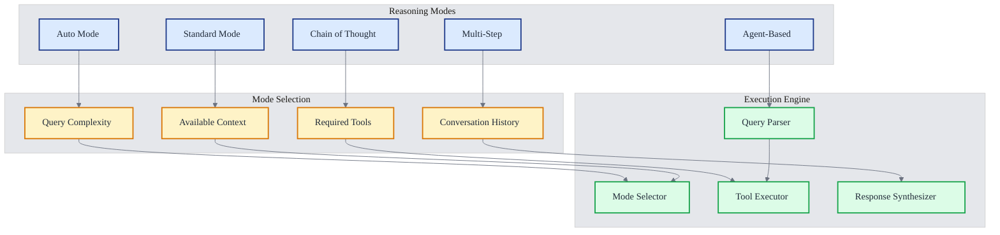
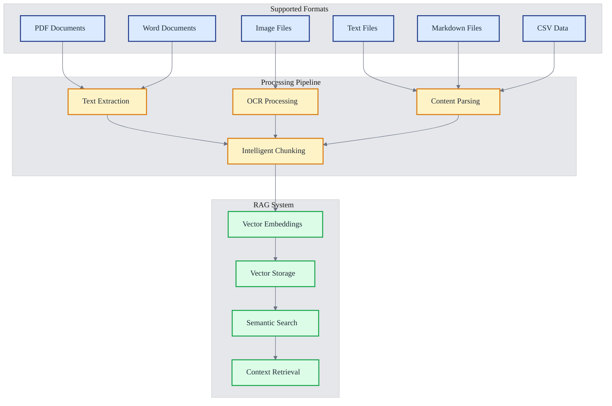
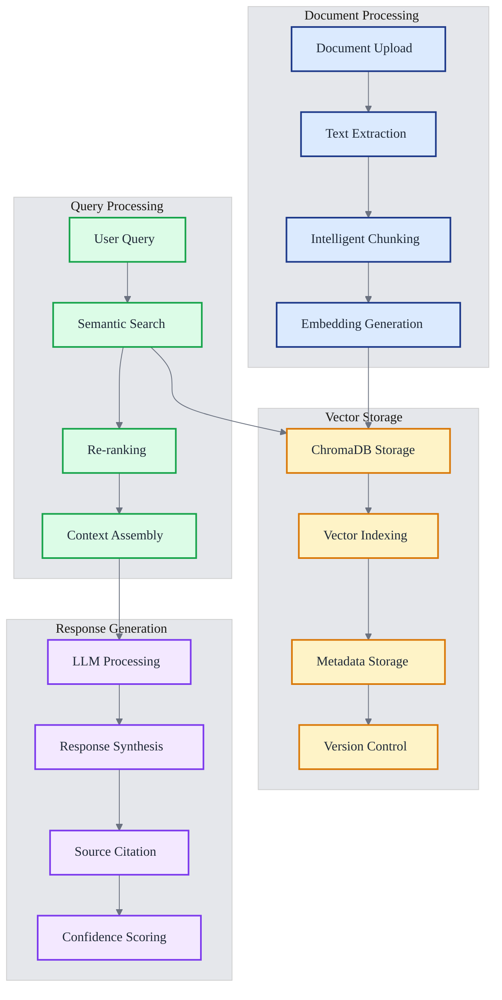
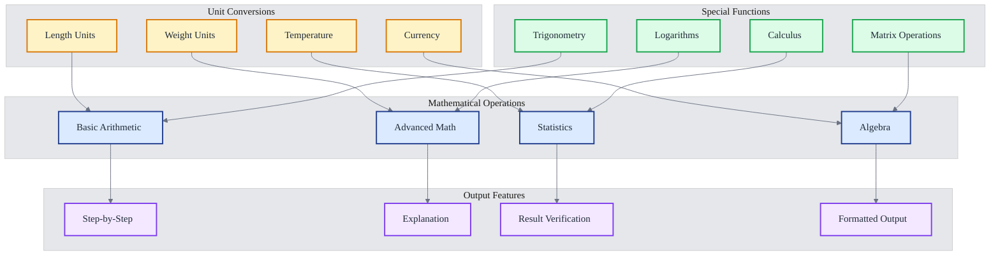
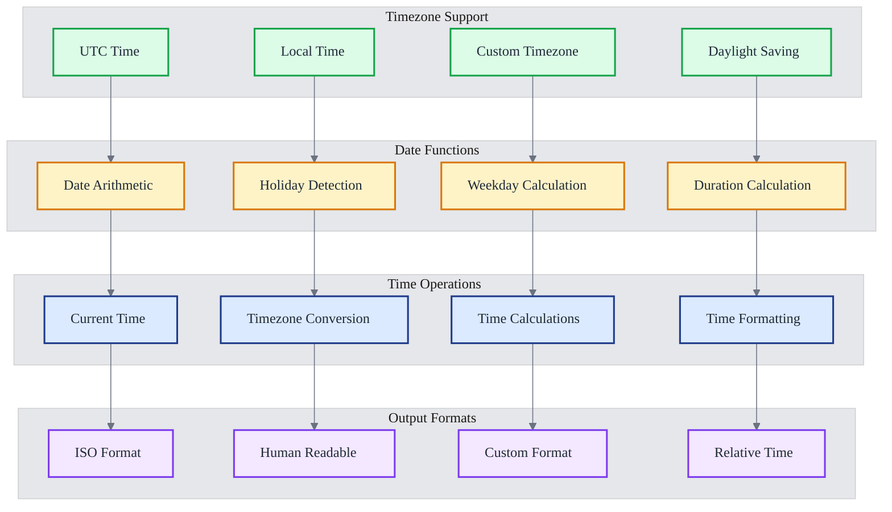
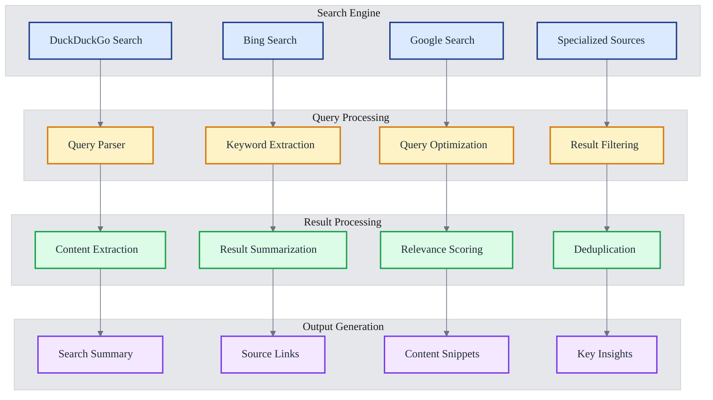
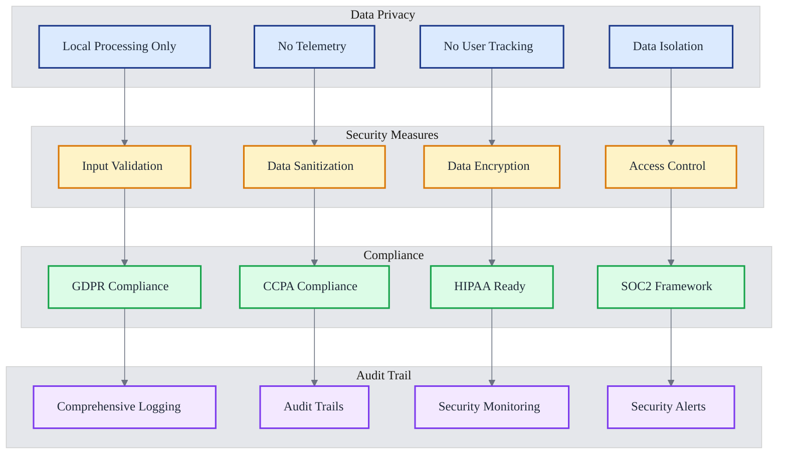
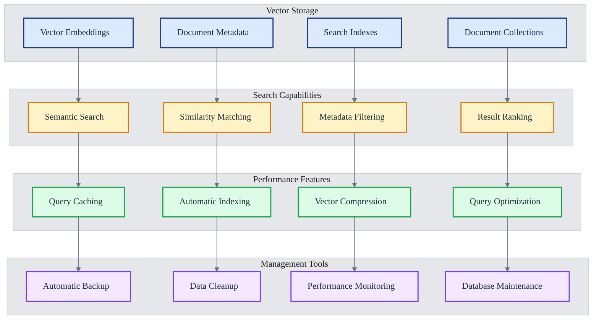
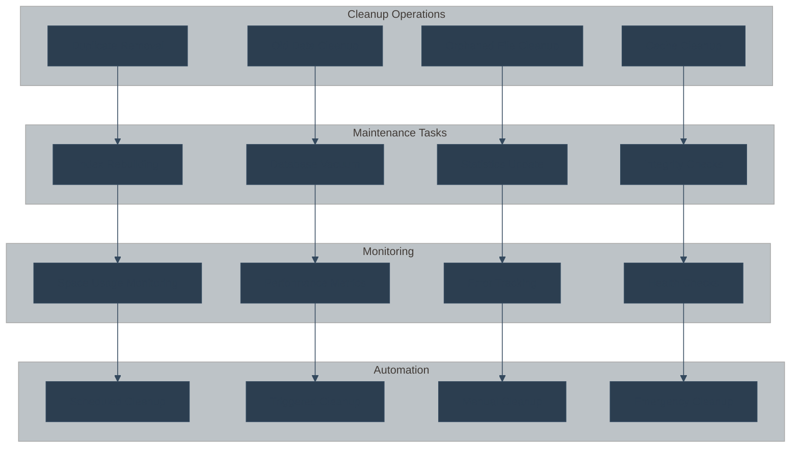

# 🚀 BasicChat Features Overview

> **Comprehensive guide to BasicChat's advanced AI capabilities, tools, and user experience features**

## 📋 Table of Contents

- [AI & Reasoning Capabilities](#ai--reasoning-capabilities)
- [Document & Image Processing](#document--image-processing)
- [Built-in Tools](#built-in-tools)
- [Performance & User Experience](#performance--user-experience)
- [Security & Privacy](#security--privacy)
- [Database Management](#database-management)

---

## 🧠 AI & Reasoning Capabilities

### **Multi-Modal Reasoning Engine**

BasicChat features a sophisticated reasoning engine with **5 distinct reasoning modes**, each optimized for different types of queries and complexity levels.



**Reasoning Modes:**

1. **Auto Mode** 🔄
   - Automatically selects the best reasoning strategy
   - Analyzes query complexity and available context
   - Optimizes for speed and accuracy
   - **Best for**: General queries, quick responses

2. **Standard Mode** 📝
   - Direct question-answering approach
   - Fast response generation
   - Minimal tool usage
   - **Best for**: Simple questions, factual queries

3. **Chain of Thought** 🤔
   - Step-by-step reasoning process
   - Shows intermediate thinking steps
   - High accuracy for complex problems
   - **Best for**: Mathematical problems, logical reasoning

4. **Multi-Step** 🔄
   - Breaks complex queries into sub-questions
   - Synthesizes multiple responses
   - Handles multi-faceted problems
   - **Best for**: Research questions, analysis tasks

5. **Agent-Based** 🤖
   - Tool-driven reasoning approach
   - Active tool selection and execution
   - Dynamic problem-solving
   - **Best for**: Tasks requiring external data, calculations

### **Advanced Reasoning Examples**

#### **Chain of Thought Example**
```
User: "If a train travels 120 km in 2 hours, what's its speed in m/s?"

BasicChat (Chain of Thought):
1. First, I need to convert km to meters: 120 km = 120,000 m
2. Convert hours to seconds: 2 hours = 2 × 3600 = 7,200 seconds
3. Calculate speed: 120,000 m ÷ 7,200 s = 16.67 m/s
4. The train's speed is 16.67 meters per second.
```

#### **Multi-Step Example**
```
User: "Compare the environmental impact of electric vs gasoline cars"

BasicChat (Multi-Step):
Step 1: Manufacturing impact analysis
Step 2: Operational emissions comparison
Step 3: Energy source considerations
Step 4: Lifecycle assessment
Step 5: Synthesis and conclusion
```

---

## 📄 Document & Image Processing

### **Multi-Format Document Support**

BasicChat supports a comprehensive range of document formats with intelligent processing capabilities.



**Supported Formats:**
- **PDF Documents**: Text extraction, table parsing, image OCR
- **Text Files**: Plain text, formatted text, code files
- **Markdown**: Structured text with formatting preservation
- **Word Documents**: DOC, DOCX format support
- **Images**: JPEG, PNG, GIF with OCR capabilities
- **CSV Data**: Tabular data with schema inference

### **Advanced RAG Pipeline**

The Retrieval-Augmented Generation (RAG) system provides intelligent document analysis and question-answering.



**RAG Features:**
- **Intelligent Chunking**: Semantic-aware text splitting with overlap
- **Multi-Stage Retrieval**: Initial search + re-ranking for accuracy
- **Context Assembly**: Intelligent context selection and formatting
- **Source Citation**: Automatic reference to source documents
- **Confidence Scoring**: Reliability assessment for responses

### **Vision Model Integration**

Advanced image processing capabilities for document analysis and visual content understanding.


**Vision Capabilities:**
- **OCR Processing**: High-accuracy text extraction from images
- **Table Recognition**: Automatic table structure detection
- **Chart Analysis**: Data visualization interpretation
- **Layout Understanding**: Document structure analysis
- **Object Detection**: Visual content identification

---

## 🛠️ Built-in Tools

### **Enhanced Calculator**

Advanced mathematical operations with step-by-step reasoning and unit conversions.



**Calculator Features:**
- **Basic Operations**: Addition, subtraction, multiplication, division
- **Advanced Math**: Powers, roots, logarithms, trigonometry
- **Statistics**: Mean, median, standard deviation, correlation
- **Unit Conversions**: Length, weight, temperature, currency
- **Step-by-Step Solutions**: Detailed calculation explanations

### **Time Tools**

Comprehensive time and date manipulation capabilities with timezone support.



**Time Tool Features:**
- **Current Time**: Real-time clock with timezone awareness
- **Timezone Conversion**: Convert between 400+ timezones
- **Date Arithmetic**: Add/subtract days, weeks, months, years
- **Holiday Detection**: Identify holidays and special dates
- **Duration Calculation**: Calculate time differences
- **Multiple Formats**: ISO, human-readable, custom formats

### **Web Search Integration**

Real-time information retrieval with intelligent result processing.



**Web Search Features:**
- **Multiple Sources**: DuckDuckGo, Bing, Google integration
- **Intelligent Parsing**: Automatic content extraction
- **Result Summarization**: Condensed information presentation
- **Source Verification**: Multiple source cross-referencing
- **Privacy-Focused**: No search history tracking

---

## ⚡ Performance & User Experience

### **Async Architecture**

High-performance asynchronous processing for responsive user experience.


**Performance Features:**
- **Async Processing**: Non-blocking request handling
- **Connection Pooling**: Efficient resource management
- **Multi-Layer Caching**: L1 (Memory), L2 (Redis), L3 (Disk)
- **Response Streaming**: Real-time output generation
- **Load Balancing**: Intelligent request distribution

### **Modern UI/UX**

Intuitive and responsive user interface with advanced interaction patterns.


**UI/UX Features:**
- **Responsive Design**: Works on desktop, tablet, and mobile
- **Dark Mode**: Eye-friendly dark theme option
- **Accessibility**: Screen reader support, keyboard navigation
- **Real-time Updates**: Live response streaming
- **Drag & Drop**: Intuitive file upload interface

---

## 🔒 Security & Privacy

### **Privacy-First Architecture**

Complete local processing with no data transmission to external servers.



**Security Features:**
- **Local-Only Processing**: All data stays on your device
- **No Telemetry**: Zero tracking or analytics
- **Input Validation**: Comprehensive input sanitization
- **Data Encryption**: All data encrypted at rest
- **Access Control**: Role-based permissions
- **Audit Logging**: Complete activity tracking

---

## 🗄️ Database Management

### **ChromaDB Vector Store**

High-performance vector database for semantic search and document storage.



**Database Features:**
- **Vector Embeddings**: High-dimensional vector storage
- **Semantic Search**: Meaning-based document retrieval
- **Metadata Management**: Rich document metadata storage
- **Automatic Indexing**: Performance optimization
- **Backup & Recovery**: Data protection and restoration

### **Cleanup Utilities**

Automated database maintenance and cleanup tools for optimal performance.



**Cleanup Features:**
- **Duplicate Detection**: Automatic duplicate content removal
- **Space Management**: Efficient storage utilization
- **Performance Optimization**: Regular database maintenance
- **Health Monitoring**: Continuous system health checks
- **Automated Cleanup**: Scheduled maintenance tasks

---

## 📚 References

1. **Mermaid Documentation**: Knut Sveidqvist et al. *Mermaid: Markdown-inspired diagramming and charting tool*. GitHub, 2024. Available: https://mermaid.js.org/

2. **RAG Systems**: Lewis, Mike et al. *Retrieval-Augmented Generation for Knowledge-Intensive NLP Tasks*. Advances in Neural Information Processing Systems, vol. 33, 2020, pp. 9459-9474.

3. **Vector Databases**: Johnson, Jeff et al. *Billion-Scale Similarity Search with GPUs*. arXiv preprint arXiv:1908.10396, 2019.

4. **AI Reasoning**: Wei, Jason et al. *Chain-of-Thought Prompting Elicits Reasoning in Large Language Models*. arXiv preprint arXiv:2201.11903, 2022.

5. **Privacy by Design**: Cavoukian, Ann. *Privacy by Design: The 7 Foundational Principles*. Information and Privacy Commissioner of Ontario, 2009.

---

*This features overview provides a comprehensive guide to BasicChat's capabilities. For technical implementation details, see the [Architecture Documentation](ARCHITECTURE.md).*

[← Back to README](../README.md) | [Architecture →](ARCHITECTURE.md) | [Development →](DEVELOPMENT.md) | [Roadmap →](ROADMAP.md) 