# Features Overview

This document provides a comprehensive overview of BasicChat's capabilities, organized by functional areas with detailed explanations and usage examples.

[← Back to README](../README.md)

---

## 🧠 AI & Reasoning Capabilities

### **Multi-Modal Reasoning Engine**

BasicChat features a sophisticated reasoning engine that can adapt its approach based on query complexity and requirements.

<div align="center">

| **Mode** | **Best For** | **Characteristics** | **Example Use Cases** |
|:---|:---|:---|:---|
| **Auto** | General queries | Automatic mode selection | Any question type |
| **Standard** | Simple Q&A | Direct, concise answers | Factual questions |
| **Chain-of-Thought** | Complex problems | Step-by-step reasoning | Math problems, logic puzzles |
| **Multi-Step** | Multi-part queries | Breaking down into sub-questions | Research questions |
| **Agent-Based** | Tool usage | Intelligent tool selection | Calculations, web searches |

</div>

#### **Chain-of-Thought Reasoning**

```mermaid
graph LR
    subgraph "🧠 Chain-of-Thought Process"
        Q[User Question]
        T1[Thought 1]
        T2[Thought 2]
        T3[Thought 3]
        A[Final Answer]
    end
    
    Q --> T1
    T1 --> T2
    T2 --> T3
    T3 --> A
    
    style Q fill:#E3F2FD
    style A fill:#E8F5E8
    style T1,T2,T3 fill:#FFF3E0
```


**Example:**
```
User: "If I have 5 apples and give 2 to my friend, then buy 3 more, how many do I have?"

Chain-of-Thought:
1. Start with 5 apples
2. Give away 2: 5 - 2 = 3 apples
3. Buy 3 more: 3 + 3 = 6 apples
4. Final answer: 6 apples
```

#### **Multi-Step Reasoning**

```mermaid
graph TB
    subgraph "🔄 Multi-Step Process"
        Q[Original Question]
        SQ1[Sub-Question 1]
        SQ2[Sub-Question 2]
        SQ3[Sub-Question 3]
        SYNTH[Synthesize Answers]
        FINAL[Final Answer]
    end
    
    Q --> SQ1
    Q --> SQ2
    Q --> SQ3
    
    SQ1 --> SYNTH
    SQ2 --> SYNTH
    SQ3 --> SYNTH
    SYNTH --> FINAL
```


### **Local & Private Processing**

- **🔒 Complete Privacy**: All processing happens on your local machine
- **🌐 No External APIs**: Except for optional web search queries
- **📊 No Data Collection**: No telemetry or usage tracking
- **🔐 Secure by Design**: Built with privacy as a core principle

---

## 📄 Document & Image Processing (RAG)

### **Multi-Format Document Support**

<div align="center">

| **Format** | **Processing Method** | **Features** | **Use Cases** |
|:---|:---|:---|:---|
| **PDF** | Text extraction | Multi-page support | Research papers, reports |
| **Text (.txt)** | Direct processing | UTF-8 encoding | Notes, articles |
| **Markdown (.md)** | Structured parsing | Format preservation | Documentation, blogs |
| **Images (.png, .jpg)** | OCR + Vision analysis | Text + visual content | Screenshots, diagrams |

</div>

### **Advanced RAG Pipeline**


### **Intelligent Text Chunking**

- **Recursive Splitting**: Maintains semantic coherence
- **Overlap Strategy**: 200-character overlap for context continuity
- **Size Optimization**: 1000-character chunks for optimal retrieval
- **Metadata Preservation**: Source tracking and chunk relationships

### **Vision Model Integration**

```mermaid
graph TB
    subgraph "🖼️ Image Processing"
        IMG[Image Upload]
        ENCODE[Base64 Encoding]
        VISION[Vision Model Analysis]
        DESC[Description Generation]
        TEXT[Text Extraction]
    end
    
    IMG --> ENCODE
    ENCODE --> VISION
    VISION --> DESC
    VISION --> TEXT
    DESC --> CHUNK
    TEXT --> CHUNK
```



**Capabilities:**
- **Text Recognition**: OCR for text within images
- **Visual Analysis**: Understanding of diagrams and charts
- **Context Awareness**: Integration with document processing pipeline
- **Multi-Modal Search**: Combined text and visual content search

---

## 🛠️ Built-in Tools

### **Enhanced Calculator**

Advanced mathematical operations with step-by-step reasoning and safety features.

<div align="center">

| **Category** | **Operations** | **Examples** |
|:---|:---|:---|
| **Basic Math** | +, -, *, /, ^ | `2 + 3 * 4`, `10^2` |
| **Trigonometry** | sin, cos, tan, asin, acos, atan | `sin(pi/2)`, `cos(45°)` |
| **Logarithms** | log, ln, log10 | `log(100, 10)`, `ln(e)` |
| **Advanced** | sqrt, factorial, gcd, lcm | `sqrt(16)`, `factorial(5)` |

</div>

**Safety Features:**
- ✅ **Expression Validation**: Prevents dangerous operations
- ✅ **Error Handling**: Graceful failure with helpful messages
- ✅ **Step-by-Step**: Shows calculation process
- ✅ **Type Safety**: Handles various input formats

### **Time Tools**

Comprehensive time management with full timezone support.

```mermaid
graph TD
    subgraph "🕐 Time Tool Capabilities"
        CURRENT[Get Current Time]
        CONVERT[Time Conversion]
        DIFF[Time Difference]
        INFO[Time Information]
    end
    
    subgraph "🌍 Timezone Support"
        UTC[UTC]
        EST[EST/PST]
        GMT[GMT]
        JST[JST]
        CUSTOM[Custom Timezones]
    end
    
    CURRENT --> UTC
    CURRENT --> EST
    CURRENT --> GMT
    CURRENT --> JST
    CURRENT --> CUSTOM
    
    CONVERT --> UTC
    CONVERT --> EST
    CONVERT --> GMT
    CONVERT --> JST
    CONVERT --> CUSTOM
    
    DIFF --> UTC
    INFO --> UTC
```



**Features:**
- **Timezone Conversion**: Convert between any timezones
- **Time Difference**: Calculate duration between times
- **Business Logic**: Business day detection
- **Format Flexibility**: Multiple input/output formats

### **Web Search Integration**

Real-time information retrieval powered by DuckDuckGo.


**Capabilities:**
- **Real-time Results**: Current information and news
- **No API Key**: Privacy-preserving search
- **Smart Caching**: Reduces redundant requests
- **Result Formatting**: Clean, readable output

---

## ⚡ Performance & User Experience

### **Async Architecture**


### **Multi-Layer Caching Strategy**

<div align="center">

| **Layer** | **Storage** | **Speed** | **Use Case** |
|:---|:---|:---|:---|
| **L1** | Memory | Fastest | Recent queries |
| **L2** | Redis | Fast | Distributed caching |
| **L3** | Disk | Slowest | Long-term storage |

</div>

**Cache Features:**
- **Smart Keys**: MD5 hash with parameter inclusion
- **TTL Management**: Configurable time-to-live
- **Size Limits**: Automatic eviction policies
- **Hit Optimization**: 70-85% hit rate for repeated queries

### **Connection Pooling**

```mermaid
graph LR
    subgraph "🔗 Connection Management"
        POOL[Connection Pool]
        LIMITER[Rate Limiter]
        RETRY[Retry Logic]
        HEALTH[Health Checks]
    end
    
    subgraph "⚙️ Configuration"
        TOTAL[100 Total Connections]
        HOST[30 per Host]
        TIMEOUT[30s Keepalive]
        DNS[300s DNS Cache]
    end
    
    POOL --> TOTAL
    POOL --> HOST
    POOL --> TIMEOUT
    POOL --> DNS
    
    LIMITER --> POOL
    RETRY --> POOL
    HEALTH --> POOL
```



### **Modern UI/UX**

- **🎨 Clean Interface**: Intuitive Streamlit-based design
- **📱 Responsive**: Works on desktop and mobile
- **🎵 Audio Support**: Text-to-speech capabilities
- **📊 Real-time Updates**: Live response streaming
- **🔧 Easy Configuration**: Model and parameter selection

---

## 🔒 Security & Privacy Features

### **Data Privacy Model**


### **Security Features**

- **Input Validation**: Comprehensive sanitization of all inputs
- **Expression Safety**: Safe mathematical operation evaluation
- **File Upload Security**: Type validation and size limits
- **Rate Limiting**: Protection against abuse and DDoS
- **Error Handling**: Graceful degradation with secure defaults

---

## 🗄️ Database Management

### **ChromaDB Vector Store**

```mermaid
graph TB
    subgraph "🗄️ Vector Database"
        CHROMA[ChromaDB]
        EMBEDDINGS[Vector Embeddings]
        SEARCH[Semantic Search]
        PERSIST[Persistence]
    end
    
    subgraph "🧹 Management Tools"
        CLEANUP[Cleanup Script]
        STATUS[Status Monitoring]
        BACKUP[Backup/Restore]
        OPTIMIZE[Optimization]
    end
    
    CHROMA --> EMBEDDINGS
    CHROMA --> SEARCH
    CHROMA --> PERSIST
    
    CLEANUP --> CHROMA
    STATUS --> CHROMA
    BACKUP --> CHROMA
    OPTIMIZE --> CHROMA
```



### **Database Utilities**

**Cleanup Script Features:**
- **Status Reporting**: View all ChromaDB directories
- **Dry Run Mode**: Preview cleanup operations
- **Age-based Cleanup**: Remove old directories
- **Force Cleanup**: Complete database reset

**Usage Examples:**
```bash
# Check database status
python scripts/cleanup_chroma.py --status

# Preview cleanup (dry run)
python scripts/cleanup_chroma.py --dry-run

# Clean up old directories (24+ hours)
python scripts/cleanup_chroma.py --age 24

# Force complete cleanup
python scripts/cleanup_chroma.py --force
```

---

## 🔗 Related Documentation

- **[System Architecture](ARCHITECTURE.md)** - Technical architecture and component interactions
- **[Development Guide](DEVELOPMENT.md)** - Contributing and development workflows
- **[Project Roadmap](ROADMAP.md)** - Future features and development plans
- **[Reasoning Features](../REASONING_FEATURES.md)** - Advanced reasoning engine details

---

[← Back to README](../README.md) | [Architecture →](ARCHITECTURE.md) | [Development →](DEVELOPMENT.md) | [Roadmap →](ROADMAP.md) 