# Features Overview

This document provides a comprehensive overview of BasicChat's capabilities, organized by functional areas with detailed explanations and usage examples.

[← Back to README](../README.md)

---

## 🧠 AI & Reasoning Capabilities

### **Multi-Modal Reasoning Engine**

BasicChat features a sophisticated reasoning engine that can adapt its approach based on query complexity and requirements.

<div align="center">

| **Mode** | **Best For** | **Characteristics** | **Example Use Cases** |
|:---|:---|:---|:---|
| **Auto** | General queries | Automatic mode selection | Any question type |
| **Standard** | Simple Q&A | Direct, concise answers | Factual questions |
| **Chain-of-Thought** | Complex problems | Step-by-step reasoning | Math problems, logic puzzles |
| **Multi-Step** | Multi-part queries | Breaking down into sub-questions | Research questions |
| **Agent-Based** | Tool usage | Intelligent tool selection | Calculations, web searches |

</div>

#### **Chain-of-Thought Reasoning**

```mermaid
graph LR
    subgraph "🧠 Chain-of-Thought Process"
        Q[User Question]
        T1[Thought 1]
        T2[Thought 2]
        T3[Thought 3]
        A[Final Answer]
    end
    
    Q --> T1
    T1 --> T2
    T2 --> T3
    T3 --> A
    
    classDef question fill:#E3F2FD,stroke:#1976D2,stroke-width:2px,color:#0D47A1
    classDef thoughts fill:#FFF3E0,stroke:#F57C00,stroke-width:2px,color:#E65100
    classDef answer fill:#E8F5E8,stroke:#388E3C,stroke-width:2px,color:#1B5E20
    
    class Q question
    class T1,T2,T3 thoughts
    class A answer
```

<div align="center">



</div>

**Diagram Narrative: Chain-of-Thought Reasoning Process**

This diagram illustrates how complex queries are solved through sequential logical steps, showing the progression from user question through three thought stages to final answer. The chain-of-thought approach improves reasoning accuracy by making the AI's thought process explicit and verifiable, following the methodology established by Wei et al. (2022). Use this mode for analytical questions, mathematical problems, and logic puzzles where step-by-step reasoning enhances understanding.

**Example:**
```
User: "If I have 5 apples and give 2 to my friend, then buy 3 more, how many do I have?"

Chain-of-Thought:
1. Start with 5 apples
2. Give away 2: 5 - 2 = 3 apples
3. Buy 3 more: 3 + 3 = 6 apples
4. Final answer: 6 apples
```

#### **Multi-Step Reasoning**

```mermaid
graph TB
    subgraph "🔄 Multi-Step Process"
        Q[Original Question]
        SQ1[Sub-Question 1]
        SQ2[Sub-Question 2]
        SQ3[Sub-Question 3]
        SYNTH[Synthesize Answers]
        FINAL[Final Answer]
    end
    
    Q --> SQ1
    Q --> SQ2
    Q --> SQ3
    
    SQ1 --> SYNTH
    SQ2 --> SYNTH
    SQ3 --> SYNTH
    SYNTH --> FINAL
    
    classDef question fill:#E3F2FD,stroke:#1976D2,stroke-width:2px,color:#0D47A1
    classDef subquestions fill:#F3E5F5,stroke:#7B1FA2,stroke-width:2px,color:#4A148C
    classDef synthesis fill:#E8F5E8,stroke:#388E3C,stroke-width:2px,color:#1B5E20
    classDef final fill:#FFF3E0,stroke:#F57C00,stroke-width:2px,color:#E65100
    
    class Q question
    class SQ1,SQ2,SQ3 subquestions
    class SYNTH synthesis
    class FINAL final
```

<div align="center">



</div>

**Diagram Narrative: Multi-Step Reasoning Process**

This diagram demonstrates how complex queries are decomposed into parallel sub-questions that are processed independently and then synthesized into comprehensive answers. The multi-step approach enables thorough analysis by addressing multiple aspects simultaneously, then integrating results for complete understanding. This method is particularly effective for research questions, comparative analysis, and complex topics requiring systematic exploration.

### **Local & Private Processing**

- **🔒 Complete Privacy**: All processing happens on your local machine
- **🌐 No External APIs**: Except for optional web search queries
- **📊 No Data Collection**: No telemetry or usage tracking
- **🔐 Secure by Design**: Built with privacy as a core principle

---

## 📄 Document & Image Processing (RAG)

### **Multi-Format Document Support**

<div align="center">

| **Format** | **Processing Method** | **Features** | **Use Cases** |
|:---|:---|:---|:---|
| **PDF** | Text extraction | Multi-page support | Research papers, reports |
| **Text (.txt)** | Direct processing | UTF-8 encoding | Notes, articles |
| **Markdown (.md)** | Structured parsing | Format preservation | Documentation, blogs |
| **Images (.png, .jpg)** | OCR + Vision analysis | Text + visual content | Screenshots, diagrams |

</div>

### **Advanced RAG Pipeline**

```mermaid
graph LR
    subgraph "📄 Document Processing"
        UPLOAD[File Upload]
        EXTRACT[Text Extraction]
        CHUNK[Intelligent Chunking]
        EMBED[Vector Embeddings]
        STORE[Vector Storage]
    end
    
    subgraph "🔍 Retrieval & Generation"
        QUERY[User Query]
        SEARCH[Semantic Search]
        RETRIEVE[Retrieve Context]
        GENERATE[Generate Answer]
        RESPONSE[Final Response]
    end
    
    UPLOAD --> EXTRACT
    EXTRACT --> CHUNK
    CHUNK --> EMBED
    EMBED --> STORE
    
    QUERY --> SEARCH
    SEARCH --> STORE
    STORE --> RETRIEVE
    RETRIEVE --> GENERATE
    GENERATE --> RESPONSE
    
    classDef processing fill:#E3F2FD,stroke:#1976D2,stroke-width:2px,color:#0D47A1
    classDef retrieval fill:#E8F5E8,stroke:#388E3C,stroke-width:2px,color:#1B5E20
    
    class UPLOAD,EXTRACT,CHUNK,EMBED,STORE processing
    class QUERY,SEARCH,RETRIEVE,GENERATE,RESPONSE retrieval
```

<div align="center">



</div>

**Diagram Narrative: Advanced RAG Pipeline**

This diagram shows the retrieval-augmented generation pipeline where documents are processed through extraction, chunking, embedding, and storage phases, then retrieved for contextual answer generation. The RAG approach combines the reliability of document-based information with the flexibility of LLM reasoning, providing accurate answers grounded in specific source material (Lewis et al.). Optimize chunk sizes and embedding parameters based on your document types for optimal retrieval accuracy.

### **Intelligent Text Chunking**

- **Recursive Splitting**: Maintains semantic coherence
- **Overlap Strategy**: 200-character overlap for context continuity
- **Size Optimization**: 1000-character chunks for optimal retrieval
- **Metadata Preservation**: Source tracking and chunk relationships

### **Vision Model Integration**

```mermaid
graph TB
    subgraph "🖼️ Image Processing"
        IMG[Image Upload]
        ENCODE[Base64 Encoding]
        VISION[Vision Model Analysis]
        DESC[Description Generation]
        TEXT[Text Extraction]
    end
    
    IMG --> ENCODE
    ENCODE --> VISION
    VISION --> DESC
    VISION --> TEXT
    DESC --> CHUNK
    TEXT --> CHUNK
```



**Diagram Narrative: Vision Model Integration**

This diagram illustrates how images are processed through vision models to extract both textual and visual information, enabling comprehensive understanding of image content for RAG applications. The dual-output approach combines OCR capabilities with visual description generation, ensuring complete content analysis regardless of image type. Ensure the vision model (llava) is properly installed and configured for optimal image processing performance and accuracy.

**Capabilities:**
- **Text Recognition**: OCR for text within images
- **Visual Analysis**: Understanding of diagrams and charts
- **Context Awareness**: Integration with document processing pipeline
- **Multi-Modal Search**: Combined text and visual content search

---

## 🛠️ Built-in Tools

### **Enhanced Calculator**

Advanced mathematical operations with step-by-step reasoning and safety features.

<div align="center">

| **Category** | **Operations** | **Examples** |
|:---|:---|:---|
| **Basic Math** | +, -, *, /, ^ | `2 + 3 * 4`, `10^2` |
| **Trigonometry** | sin, cos, tan, asin, acos, atan | `sin(pi/2)`, `cos(45°)` |
| **Logarithms** | log, ln, log10 | `log(100, 10)`, `ln(e)` |
| **Advanced** | sqrt, factorial, gcd, lcm | `sqrt(16)`, `factorial(5)` |

</div>

**Safety Features:**
- ✅ **Expression Validation**: Prevents dangerous operations
- ✅ **Error Handling**: Graceful failure with helpful messages
- ✅ **Step-by-Step**: Shows calculation process
- ✅ **Type Safety**: Handles various input formats

### **Time Tools**

Comprehensive time management with full timezone support.

```mermaid
graph TD
    subgraph "🕐 Time Tool Capabilities"
        CURRENT[Get Current Time]
        CONVERT[Time Conversion]
        DIFF[Time Difference]
        INFO[Time Information]
    end
    
    subgraph "🌍 Timezone Support"
        UTC[UTC]
        EST[EST/PST]
        GMT[GMT]
        JST[JST]
        CUSTOM[Custom Timezones]
    end
    
    CURRENT --> UTC
    CURRENT --> EST
    CURRENT --> GMT
    CURRENT --> JST
    CURRENT --> CUSTOM
    
    CONVERT --> UTC
    CONVERT --> EST
    CONVERT --> GMT
    CONVERT --> JST
    CONVERT --> CUSTOM
    
    DIFF --> UTC
    INFO --> UTC
```



**Diagram Narrative: Time Tool Capabilities**

This diagram shows the comprehensive time management capabilities across multiple timezone systems, with each function supporting global time operations. The time tools provide conversion, difference calculation, and information access for any timezone, using the pytz library for accurate timezone handling. Use these tools for scheduling, timezone conversions, and duration calculations, ensuring proper timezone specification for accurate results.

**Features:**
- **Timezone Conversion**: Convert between any timezones
- **Time Difference**: Calculate duration between times
- **Business Logic**: Business day detection
- **Format Flexibility**: Multiple input/output formats

### **Web Search Integration**

Real-time information retrieval powered by DuckDuckGo.


**Diagram Narrative: Web Search Integration Flow**

This diagram demonstrates how web search is integrated with intelligent caching to optimize performance while maintaining access to current information. The caching strategy provides 70-85% hit rates for repeated queries while ensuring fresh results when needed, balancing performance with information currency. Monitor cache hit rates and adjust TTL settings based on your information freshness requirements and search patterns.

**Capabilities:**
- **Real-time Results**: Current information and news
- **No API Key**: Privacy-preserving search
- **Smart Caching**: Reduces redundant requests
- **Result Formatting**: Clean, readable output

---

## ⚡ Performance & User Experience

### **Async Architecture**


**Diagram Narrative: Async Architecture Performance**

This diagram summarizes the performance optimization strategy through async processing, connection pooling, and multi-layer caching, showing how each feature contributes to measurable improvements. The multi-faceted approach provides 50-80% faster response times and 10x throughput improvement while maintaining system reliability and user experience quality. Tune configuration parameters based on your usage patterns and server capacity for optimal performance.

### **Multi-Layer Caching Strategy**

<div align="center">

| **Layer** | **Storage** | **Speed** | **Use Case** |
|:---|:---|:---|:---|
| **L1** | Memory | Fastest | Recent queries |
| **L2** | Redis | Fast | Distributed caching |
| **L3** | Disk | Slowest | Long-term storage |

</div>

**Cache Features:**
- **Smart Keys**: MD5 hash with parameter inclusion
- **TTL Management**: Configurable time-to-live
- **Size Limits**: Automatic eviction policies
- **Hit Optimization**: 70-85% hit rate for repeated queries

### **Connection Pooling**

```mermaid
graph LR
    subgraph "🔗 Connection Management"
        POOL[Connection Pool]
        LIMITER[Rate Limiter]
        RETRY[Retry Logic]
        HEALTH[Health Checks]
    end
    
    subgraph "⚙️ Configuration"
        TOTAL[100 Total Connections]
        HOST[30 per Host]
        TIMEOUT[30s Keepalive]
        DNS[300s DNS Cache]
    end
    
    POOL --> TOTAL
    POOL --> HOST
    POOL --> TIMEOUT
    POOL --> DNS
    
    LIMITER --> POOL
    RETRY --> POOL
    HEALTH --> POOL
```



**Diagram Narrative: Connection Pooling Architecture**

This diagram illustrates the connection management strategy for optimizing network performance and reliability through pooling, rate limiting, and retry mechanisms. The comprehensive approach provides 10x throughput improvement while maintaining reliability through health monitoring and retry logic, with configurable parameters balancing speed and stability. Adjust connection pool settings based on your server capacity and expected load to optimize performance and resource utilization.

### **Modern UI/UX**

- **🎨 Clean Interface**: Intuitive Streamlit-based design
- **📱 Responsive**: Works on desktop and mobile
- **🎵 Audio Support**: Text-to-speech capabilities
- **📊 Real-time Updates**: Live response streaming
- **🔧 Easy Configuration**: Model and parameter selection

---

## 🔒 Security & Privacy Features

### **Data Privacy Model**


**Diagram Narrative: Data Privacy and Security Model**

This diagram clarifies how data is protected at every stage through local processing, validation, encryption, and automatic cleanup, ensuring complete data sovereignty. The privacy-first design follows OWASP recommendations for robust security while maintaining system functionality and user experience. Regularly review and update security configurations, monitor for potential vulnerabilities, and ensure encryption keys are properly managed for optimal security posture.

### **Security Features**

- **Input Validation**: Comprehensive sanitization of all inputs
- **Expression Safety**: Safe mathematical operation evaluation
- **File Upload Security**: Type validation and size limits
- **Rate Limiting**: Protection against abuse and DDoS
- **Error Handling**: Graceful degradation with secure defaults

---

## 🗄️ Database Management

### **ChromaDB Vector Store**

```mermaid
graph TB
    subgraph "🗄️ Vector Database"
        CHROMA[ChromaDB]
        EMBEDDINGS[Vector Embeddings]
        SEARCH[Semantic Search]
        PERSIST[Persistence]
    end
    
    subgraph "🧹 Management Tools"
        CLEANUP[Cleanup Script]
        STATUS[Status Monitoring]
        BACKUP[Backup/Restore]
        OPTIMIZE[Optimization]
    end
    
    CHROMA --> EMBEDDINGS
    CHROMA --> SEARCH
    CHROMA --> PERSIST
    
    CLEANUP --> CHROMA
    STATUS --> CHROMA
    BACKUP --> CHROMA
    OPTIMIZE --> CHROMA
```



**Diagram Narrative: ChromaDB Vector Store Management**

This diagram shows how vector storage and management tools work together to provide efficient document retrieval and storage capabilities. The comprehensive management approach ensures reliable vector database operations while providing tools for maintenance, monitoring, and optimization through cleanup scripts, backup systems, and health checks. Use the cleanup script regularly to manage database size, monitor status for health issues, and perform backups to ensure data integrity and system reliability.

### **Database Utilities**

**Cleanup Script Features:**
- **Status Reporting**: View all ChromaDB directories
- **Dry Run Mode**: Preview cleanup operations
- **Age-based Cleanup**: Remove old directories
- **Force Cleanup**: Complete database reset

**Usage Examples:**
```bash
# Check database status
python scripts/cleanup_chroma.py --status

# Preview cleanup (dry run)
python scripts/cleanup_chroma.py --dry-run

# Clean up old directories (24+ hours)
python scripts/cleanup_chroma.py --age 24

# Force complete cleanup
python scripts/cleanup_chroma.py --force
```

---

## 🔗 Related Documentation

- **[System Architecture](ARCHITECTURE.md)** - Technical architecture and component interactions
- **[Development Guide](DEVELOPMENT.md)** - Contributing and development workflows
- **[Project Roadmap](ROADMAP.md)** - Future features and development plans
- **[Reasoning Features](REASONING_FEATURES.md)** - Advanced reasoning engine details

---

[← Back to README](../README.md) | [Architecture →](ARCHITECTURE.md) | [Development →](DEVELOPMENT.md) | [Roadmap →](ROADMAP.md) 