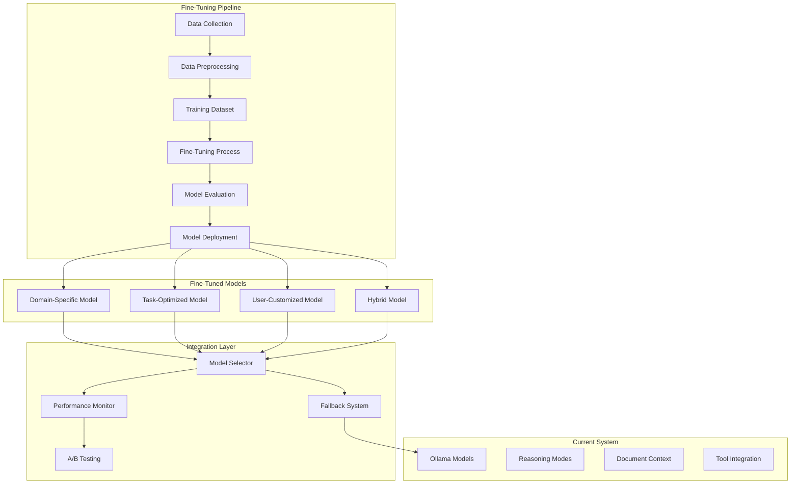

# Fine-Tuning Integration Analysis

[← Back to Documentation](../README.md#documentation) | [Architecture →](ARCHITECTURE.md)

---

## Overview

This document analyzes the integration of fine-tuning capabilities into our AI chat application. Fine-tuning allows us to customize our language models for specific use cases, improving performance on domain-specific tasks and user interaction patterns.

## Current Architecture Assessment

### Existing LLM Integration

Our current system uses Ollama with multiple reasoning modes:
- **Standard Reasoning**: Direct question-answer
- **Chain-of-Thought**: Step-by-step reasoning
- **Multi-Step**: Query decomposition
- **Agent-Based**: Tool-using reasoning
- **Auto Selection**: Dynamic mode selection

### Fine-Tuning Opportunities



## Fine-Tuning Use Cases

### 1. Domain-Specific Fine-Tuning

#### Programming Assistant Specialization
**Target**: Improve code-related responses and reasoning

**Training Data Sources**:
- GitHub repositories and code snippets
- Programming documentation
- Code review conversations
- Debugging sessions
- Best practices guides

**Expected Improvements**:
- Better code generation quality
- More accurate debugging suggestions
- Improved code explanation clarity
- Enhanced refactoring recommendations

#### Technical Documentation Assistant
**Target**: Optimize for technical writing and documentation

**Training Data Sources**:
- Technical documentation
- API documentation
- README files
- Architecture diagrams descriptions
- Code comments

**Expected Improvements**:
- Better documentation generation
- Improved technical writing style
- Enhanced code commenting
- More structured explanations

### 2. Task-Specific Fine-Tuning

#### Reasoning Mode Optimization
**Target**: Optimize each reasoning mode for its specific task

**Chain-of-Thought Optimization**:
```python
# Training examples for CoT reasoning
{
    "input": "Explain how to implement a binary search tree",
    "output": "Let me think through this step by step:\n1. First, I need to understand what a BST is...\n2. The key properties are...\n3. Implementation requires...\n\nFinal Answer: Here's how to implement a BST..."
}
```

**Multi-Step Reasoning Optimization**:
```python
# Training examples for multi-step reasoning
{
    "input": "Design a scalable microservices architecture",
    "output": "Let me break this down:\n\nSub-questions:\n1. What are the core services needed?\n2. How should services communicate?\n3. What's the data strategy?\n4. How to handle deployment?\n\nSynthesis: Based on the analysis..."
}
```

#### Tool Usage Optimization
**Target**: Improve agent-based reasoning with tools

**Training Data**:
- Tool selection patterns
- Tool execution sequences
- Error handling strategies
- Tool combination logic

### 3. User-Customized Fine-Tuning

#### Personal Assistant Adaptation
**Target**: Adapt to individual user preferences and patterns

**Personalization Factors**:
- Communication style preferences
- Technical expertise level
- Preferred reasoning depth
- Response format preferences
- Domain interests

#### Team/Organization Customization
**Target**: Adapt to organizational needs and standards

**Customization Areas**:
- Coding standards and conventions
- Documentation requirements
- Security practices
- Performance requirements
- Testing strategies

## Technical Implementation

### 1. Data Collection Pipeline

```python
@dataclass
class TrainingExample:
    """Represents a training example for fine-tuning"""
    input_text: str
    output_text: str
    reasoning_mode: str
    context: Optional[str] = None
    user_feedback: Optional[float] = None
    metadata: Dict[str, Any] = None

class DataCollector:
    """Collects and processes training data from user interactions"""
    
    def __init__(self):
        self.interaction_log = []
        self.quality_metrics = {}
    
    def log_interaction(self, 
                       user_input: str, 
                       model_output: str, 
                       reasoning_mode: str,
                       context: str = None,
                       user_feedback: float = None):
        """Log user interaction for potential training data"""
        example = TrainingExample(
            input_text=user_input,
            output_text=model_output,
            reasoning_mode=reasoning_mode,
            context=context,
            user_feedback=user_feedback
        )
        self.interaction_log.append(example)
    
    def filter_high_quality_examples(self, 
                                   min_feedback_score: float = 4.0,
                                   min_response_length: int = 50) -> List[TrainingExample]:
        """Filter examples based on quality criteria"""
        return [
            example for example in self.interaction_log
            if (example.user_feedback and example.user_feedback >= min_feedback_score) or
               len(example.output_text) >= min_response_length
        ]
    
    def generate_training_dataset(self) -> List[Dict[str, str]]:
        """Generate training dataset in required format"""
        high_quality_examples = self.filter_high_quality_examples()
        
        dataset = []
        for example in high_quality_examples:
            # Format for different fine-tuning approaches
            dataset.append({
                "messages": [
                    {"role": "system", "content": self._get_system_prompt(example.reasoning_mode)},
                    {"role": "user", "content": example.input_text},
                    {"role": "assistant", "content": example.output_text}
                ]
            })
        
        return dataset
```

### 2. Fine-Tuning Pipeline

```python
class FineTuningPipeline:
    """Manages the fine-tuning process"""
    
    def __init__(self, base_model: str = "mistral"):
        self.base_model = base_model
        self.training_config = self._get_default_config()
    
    def prepare_training_data(self, 
                            examples: List[TrainingExample],
                            validation_split: float = 0.1) -> Tuple[List, List]:
        """Prepare training and validation datasets"""
        # Shuffle and split data
        random.shuffle(examples)
        split_idx = int(len(examples) * (1 - validation_split))
        
        train_data = examples[:split_idx]
        val_data = examples[split_idx:]
        
        return train_data, val_data
    
    def fine_tune_model(self, 
                       training_data: List[TrainingExample],
                       model_name: str,
                       epochs: int = 3,
                       learning_rate: float = 2e-5) -> str:
        """Execute fine-tuning process"""
        
        # Prepare datasets
        train_dataset, val_dataset = self.prepare_training_data(training_data)
        
        # Configure training parameters
        training_args = TrainingArguments(
            output_dir=f"./models/{model_name}",
            num_train_epochs=epochs,
            per_device_train_batch_size=4,
            per_device_eval_batch_size=4,
            learning_rate=learning_rate,
            warmup_steps=500,
            weight_decay=0.01,
            logging_dir=f"./logs/{model_name}",
            logging_steps=10,
            evaluation_strategy="steps",
            eval_steps=100,
            save_steps=1000,
            load_best_model_at_end=True,
        )
        
        # Execute fine-tuning
        trainer = Trainer(
            model=self.model,
            args=training_args,
            train_dataset=train_dataset,
            eval_dataset=val_dataset,
        )
        
        trainer.train()
        
        # Save the fine-tuned model
        model_path = f"./models/{model_name}/final"
        trainer.save_model(model_path)
        
        return model_path
```

### 3. Model Integration

```python
class FineTunedModelManager:
    """Manages fine-tuned models and their integration"""
    
    def __init__(self):
        self.models = {}
        self.model_metadata = {}
        self.performance_metrics = {}
    
    def register_model(self, 
                      model_name: str, 
                      model_path: str, 
                      model_type: str,
                      metadata: Dict[str, Any]):
        """Register a fine-tuned model"""
        self.models[model_name] = model_path
        self.model_metadata[model_name] = {
            "type": model_type,
            "created_at": datetime.now().isoformat(),
            **metadata
        }
    
    def select_model(self, 
                    query: str, 
                    reasoning_mode: str,
                    context: str = None) -> str:
        """Select the most appropriate model for the query"""
        
        # Simple rule-based selection (can be enhanced with ML)
        if "code" in query.lower() or "programming" in query.lower():
            return self._get_best_model("programming")
        elif reasoning_mode == "Chain-of-Thought":
            return self._get_best_model("reasoning")
        elif reasoning_mode == "Agent":
            return self._get_best_model("agent")
        else:
            return "base_model"  # Fallback to base model
    
    def evaluate_model_performance(self, 
                                 model_name: str, 
                                 test_queries: List[str]) -> Dict[str, float]:
        """Evaluate model performance on test queries"""
        # Implementation for model evaluation
        pass
```

### 4. A/B Testing Framework

```python
class ModelABTesting:
    """A/B testing framework for fine-tuned models"""
    
    def __init__(self):
        self.experiments = {}
        self.results = {}
    
    def create_experiment(self, 
                         experiment_name: str,
                         model_a: str,
                         model_b: str,
                         traffic_split: float = 0.5) -> str:
        """Create a new A/B testing experiment"""
        
        experiment_id = f"exp_{len(self.experiments)}"
        self.experiments[experiment_id] = {
            "name": experiment_name,
            "model_a": model_a,
            "model_b": model_b,
            "traffic_split": traffic_split,
            "start_time": datetime.now(),
            "status": "active"
        }
        
        return experiment_id
    
    def select_model_for_query(self, 
                              experiment_id: str, 
                              user_id: str) -> str:
        """Select model based on A/B test configuration"""
        
        experiment = self.experiments[experiment_id]
        
        # Deterministic assignment based on user ID
        user_hash = hash(user_id) % 100
        if user_hash < experiment["traffic_split"] * 100:
            return experiment["model_a"]
        else:
            return experiment["model_b"]
    
    def log_result(self, 
                  experiment_id: str,
                  user_id: str,
                  model_used: str,
                  user_feedback: float,
                  response_time: float):
        """Log experiment results"""
        
        if experiment_id not in self.results:
            self.results[experiment_id] = []
        
        self.results[experiment_id].append({
            "user_id": user_id,
            "model_used": model_used,
            "user_feedback": user_feedback,
            "response_time": response_time,
            "timestamp": datetime.now().isoformat()
        })
```

## Integration Strategy

### Phase 1: Data Collection (Weeks 1-2)

1. **Implement Data Collection**
   - Add interaction logging to existing system
   - Collect user feedback mechanisms
   - Store high-quality interactions

2. **Data Quality Assessment**
   - Analyze interaction patterns
   - Identify high-quality examples
   - Establish data quality metrics

### Phase 2: Initial Fine-Tuning (Weeks 3-4)

1. **Domain-Specific Model**
   - Fine-tune for programming assistance
   - Focus on code-related queries
   - Validate improvements

2. **Reasoning Mode Optimization**
   - Optimize Chain-of-Thought reasoning
   - Improve Multi-Step decomposition
   - Enhance Agent-based responses

### Phase 3: Advanced Integration (Weeks 5-6)

1. **Model Selection System**
   - Implement intelligent model selection
   - Add fallback mechanisms
   - Performance monitoring

2. **A/B Testing**
   - Deploy A/B testing framework
   - Compare fine-tuned vs base models
   - Measure performance improvements

### Phase 4: Continuous Improvement (Ongoing)

1. **Iterative Refinement**
   - Collect ongoing feedback
   - Retrain models periodically
   - Optimize based on usage patterns

2. **Personalization**
   - User-specific fine-tuning
   - Team/organization customization
   - Adaptive learning

## Technical Requirements

### Infrastructure

```yaml
# docker-compose.finetuning.yml
version: '3.8'
services:
  fine-tuning:
    build: ./fine-tuning
    volumes:
      - ./models:/app/models
      - ./data:/app/data
      - ./logs:/app/logs
    environment:
      - BASE_MODEL=mistral
      - TRAINING_DEVICE=cuda
      - MAX_MEMORY=16GB
    deploy:
      resources:
        reservations:
          devices:
            - driver: nvidia
              count: 1
              capabilities: [gpu]

  model-registry:
    image: registry:2
    ports:
      - "5000:5000"
    volumes:
      - ./models:/var/lib/registry

  monitoring:
    image: prom/prometheus
    ports:
      - "9090:9090"
    volumes:
      - ./monitoring:/etc/prometheus
```

### Dependencies

```python
# requirements.finetuning.txt
torch>=2.0.0
transformers>=4.30.0
datasets>=2.12.0
accelerate>=0.20.0
peft>=0.4.0
trl>=0.4.7
wandb>=0.15.0
tensorboard>=2.13.0
```

## Performance Metrics

### 1. Response Quality Metrics

```python
def calculate_response_quality(response: str, query: str, context: str) -> Dict[str, float]:
    """Calculate comprehensive response quality metrics"""
    
    return {
        "relevance": calculate_relevance_score(response, query),
        "completeness": calculate_completeness_score(response, query),
        "accuracy": calculate_accuracy_score(response, context),
        "clarity": calculate_clarity_score(response),
        "helpfulness": calculate_helpfulness_score(response, query)
    }
```

### 2. Model Performance Metrics

- **Response Time**: Average time to generate response
- **Token Efficiency**: Tokens used per response
- **User Satisfaction**: Feedback scores
- **Task Success Rate**: Percentage of successful completions
- **Reasoning Quality**: Quality of reasoning steps

### 3. Business Metrics

- **User Engagement**: Time spent in conversations
- **Task Completion**: Successful task completion rate
- **User Retention**: Return user rate
- **Support Reduction**: Decrease in support requests

## Cost Analysis

### Training Costs

1. **Infrastructure Costs**
   - GPU compute time: ~$2-5/hour
   - Storage: ~$0.02/GB/month
   - Data processing: ~$0.10/GB

2. **Model Storage**
   - Fine-tuned model size: ~7-14GB
   - Storage cost: ~$0.14-0.28/month

3. **Inference Costs**
   - Local inference: Minimal additional cost
   - Cloud inference: ~$0.001-0.01 per request

### ROI Projections

**Conservative Estimate**:
- Training cost: $500-1000 per model
- Monthly operational cost: $50-100
- Expected improvement: 15-25% in response quality
- User satisfaction increase: 20-30%

**Optimistic Estimate**:
- Training cost: $1000-2000 per model
- Monthly operational cost: $100-200
- Expected improvement: 25-40% in response quality
- User satisfaction increase: 30-50%

## Risk Assessment

### Technical Risks

1. **Model Degradation**
   - Risk: Fine-tuning may reduce general capabilities
   - Mitigation: Careful dataset curation and evaluation

2. **Overfitting**
   - Risk: Model becomes too specific to training data
   - Mitigation: Regular validation and diverse training data

3. **Performance Regression**
   - Risk: Slower inference or higher resource usage
   - Mitigation: Performance benchmarking and optimization

### Operational Risks

1. **Data Privacy**
   - Risk: Sensitive information in training data
   - Mitigation: Data anonymization and privacy controls

2. **Model Bias**
   - Risk: Amplification of existing biases
   - Mitigation: Bias detection and mitigation strategies

3. **Maintenance Overhead**
   - Risk: Increased complexity and maintenance burden
   - Mitigation: Automated pipelines and monitoring

## Conclusion

Fine-tuning integration offers significant potential for improving our AI chat application's performance and user experience. The modular architecture of our current system provides an excellent foundation for implementing fine-tuning capabilities.

**Key Benefits**:
1. **Improved Response Quality**: Domain-specific optimization
2. **Better User Experience**: Personalized interactions
3. **Reduced Latency**: Optimized for specific tasks
4. **Competitive Advantage**: Customized AI capabilities

**Implementation Priority**:
1. Start with domain-specific fine-tuning for programming assistance
2. Implement data collection and quality assessment
3. Deploy A/B testing framework for validation
4. Gradually expand to other domains and use cases

**Success Metrics**:
- 20%+ improvement in response quality scores
- 15%+ reduction in response time
- 25%+ increase in user satisfaction
- 30%+ improvement in task completion rates

The investment in fine-tuning infrastructure will provide long-term benefits through improved AI capabilities and enhanced user experience. 

[← Back to Documentation](../README.md#documentation) | [Architecture →](ARCHITECTURE.md)
