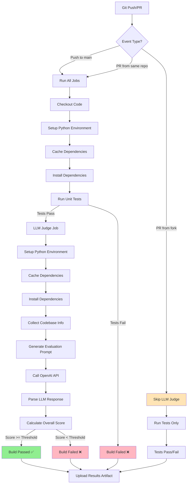
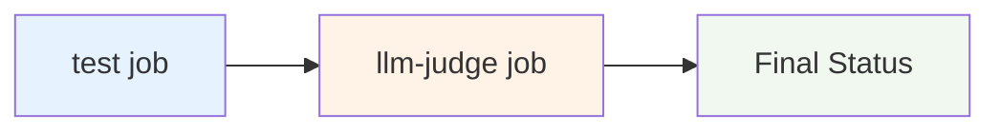
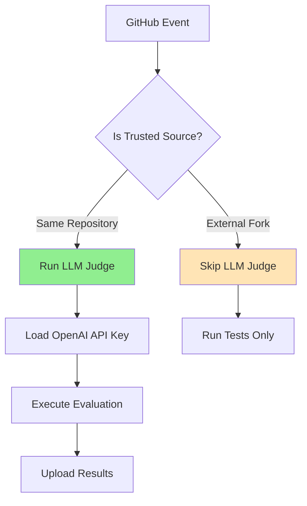
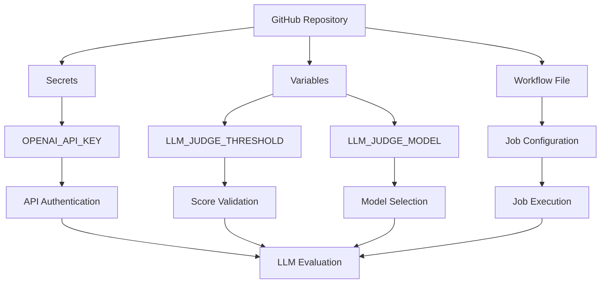

# LLM Judge Integration Flow

This document describes the integration of the LLM Judge Evaluator into the GitHub Actions CI/CD pipeline.

## Build Flow Diagram

## Job Dependencies

## Security Flow

## Configuration Flow

## Key Features

### 1. **Separate Stage/Job**
- LLM Judge runs as a separate job after unit tests
- Isolated failures for better debugging
- Independent caching and dependencies

### 2. **Fail Fast**
- Exits with code 1 if score < threshold
- Immediate feedback on quality issues
- Prevents low-quality code from merging

### 3. **Security First**
- Only runs on trusted repositories
- API key stored as GitHub secret
- No code content sent to OpenAI

### 4. **Performance Optimized**
- Cached dependencies for faster runs
- Configurable timeouts
- Retry logic for API failures

### 5. **Observability**
- Detailed console output
- JSON results artifact
- Historical tracking of scores

## Environment Variables

| Variable | Required | Default | Description |
|----------|----------|---------|-------------|
| `OPENAI_API_KEY` | Yes | - | OpenAI API key for evaluation |
| `LLM_JUDGE_THRESHOLD` | No | 7.0 | Minimum acceptable score |
| `LLM_JUDGE_MODEL` | No | gpt-4 | OpenAI model to use |

## Evaluation Categories

| Category | Weight | Description |
|----------|--------|-------------|
| Code Quality | 1.0 | Structure, naming, Python best practices |
| Test Coverage | 1.0 | Test comprehensiveness and quality |
| Documentation | 0.8 | README, inline docs, project docs |
| Architecture | 1.0 | Design patterns, modularity, scalability |
| Security | 0.9 | Vulnerabilities and security practices |
| Performance | 0.7 | Code efficiency and optimization |

## Best Practices

1. **Start Conservative**: Begin with a lower threshold (6.0-7.0)
2. **Monitor Costs**: Track OpenAI API usage
3. **Review Regularly**: Implement recommendations from evaluations
4. **Gradual Improvement**: Increase threshold as code quality improves
5. **Document Changes**: Keep track of what improvements were made

## Troubleshooting

### Common Issues

1. **API Key Missing**
   - Ensure `OPENAI_API_KEY` is set in GitHub secrets
   - Check secret name spelling

2. **Low Scores**
   - Review the detailed recommendations
   - Focus on highest-impact improvements first
   - Consider lowering threshold temporarily

3. **API Failures**
   - Check OpenAI API quota and billing
   - Verify network connectivity
   - Review API rate limits

4. **Timeout Issues**
   - Increase timeout values in configuration
   - Optimize codebase analysis
   - Consider using faster models for large codebases 