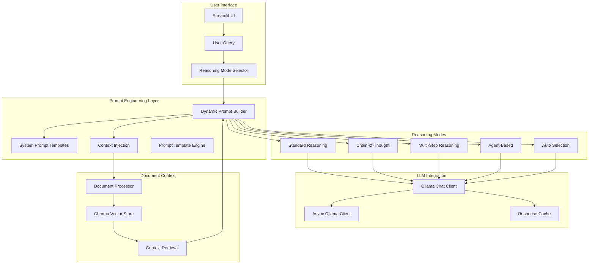

# Prompt Engineering Analysis

## Overview

This document analyzes the prompt engineering patterns and strategies implemented in our AI chat application. Our system uses multiple reasoning modes, each with distinct prompt engineering approaches optimized for different use cases.

## Architecture Overview



## Current Prompt Engineering Patterns

### 1. System Prompt Architecture

Our application uses a centralized system prompt defined in `app.py`:

```python
SYSTEM_PROMPT = """
You are a helpful and knowledgeable AI assistant with advanced reasoning capabilities. You can:
1. Answer questions about a wide range of topics using logical reasoning
2. Summarize documents that have been uploaded with detailed analysis
3. Have natural, friendly conversations with enhanced understanding
4. Break down complex problems into manageable steps
5. Provide well-reasoned explanations for your answers

Please be concise, accurate, and helpful in your responses. 
If you don't know something, just say so instead of making up information.
Always show your reasoning process when appropriate.
"""
```

**Analysis:**
- ✅ Clear role definition and capabilities
- ✅ Explicit instruction for reasoning process
- ✅ Honesty directive (admit when unsure)
- ✅ Conciseness requirement
- 🔄 Could benefit from more specific task instructions

### 2. Reasoning Mode-Specific Prompts

#### Standard Reasoning
```python
prompt = f"""
Context: {context}

Question: {query}

Please provide a clear, direct answer to the question above. 
If context is provided, use it to inform your response.
If no context is available, use your general knowledge.

Answer:
"""
```

**Pattern Analysis:**
- Simple, direct instruction
- Context-aware response generation
- Fallback to general knowledge
- Minimal prompt engineering overhead

#### Chain-of-Thought Reasoning
```python
improved_prompt = f"""
You are a helpful AI assistant. Use chain-of-thought reasoning to answer the following question.

CONTEXT:
{context}

QUESTION:
{question}

INSTRUCTIONS:
1. First, think through the problem step by step. Show your reasoning process.
2. Then, provide a clear, concise final answer.
3. Clearly separate your thought process from your final answer.

THOUGHT PROCESS:
(Think through the problem step by step here...)

FINAL ANSWER:
(Provide your final, direct answer here...)
"""
```

**Pattern Analysis:**
- ✅ Explicit separation of thought process and final answer
- ✅ Structured instruction format
- ✅ Clear reasoning directive
- ✅ Context integration
- 🔄 Could use more specific reasoning frameworks

#### Multi-Step Reasoning
```python
prompt = f"""
Given the following user query and context, please break it down into smaller, logical sub-queries that need to be answered to fully address the original query.
Each sub-query should be a self-contained question.

CONTEXT:
{context}

ORIGINAL QUERY:
"{query}"

SUB-QUERIES (provide as a numbered list):
1. ...
2. ...
"""
```

**Pattern Analysis:**
- ✅ Query decomposition strategy
- ✅ Structured output format
- ✅ Self-contained sub-query requirement
- 🔄 Could benefit from complexity estimation

#### Agent-Based Reasoning
```python
system_message = SystemMessage(
    content=(
        "You are a helpful assistant that can use tools to answer questions. "
        "If relevant, use the following context from documents to answer the user's question. "
        "If the context does not contain the answer, use your own knowledge or tools. "
        "Context: {context}"
    )
)
```

**Pattern Analysis:**
- ✅ Tool usage capability
- ✅ Context integration
- ✅ Fallback strategies
- 🔄 Could use more specific tool selection guidance

### 3. Context Integration Patterns

#### Document Context Retrieval
```python
def _retrieve_and_format_context(self, query: str, doc_processor: Optional[DocumentProcessor]) -> str:
    """Retrieve context from documents and format it for the prompt."""
    if not doc_processor:
        return "No document processor available. Relying on general knowledge."
    
    available_docs = doc_processor.get_available_documents()
    if not available_docs:
        return "No documents have been uploaded or processed. Relying on general knowledge."
```

**Pattern Analysis:**
- ✅ Graceful degradation when no context available
- ✅ Clear fallback messaging
- ✅ Document availability checking
- 🔄 Could use relevance scoring

#### Context Injection Strategy
```python
enhanced_prompt = prompt
if context:
    enhanced_prompt = f"Context from uploaded documents:\n{context}\n\nQuestion: {prompt}"
```

**Pattern Analysis:**
- ✅ Conditional context injection
- ✅ Clear context labeling
- ✅ Maintains original query structure
- 🔄 Could use context summarization for long documents

### 4. Evaluation and Quality Assurance

#### LLM Judge Evaluation Prompts
```python
def generate_evaluation_prompt(self, codebase_info: Dict[str, Any]) -> str:
    return f"""
You are an expert software engineer evaluating a Python codebase for quality, maintainability, and best practices.

{mode_note}

Codebase Information:
- Total files: {codebase_info['file_count']}
- Lines of code: {codebase_info['lines_of_code']}
- Test files: {codebase_info['test_files']}
- Test coverage: {codebase_info['test_coverage']:.1f}%
- Documentation files: {codebase_info['documentation_files']}
- Dependencies: {len(codebase_info['dependencies'])} packages

Please evaluate the following aspects and provide scores from 1-10 (where 10 is excellent):
...
"""
```

**Pattern Analysis:**
- ✅ Expert role definition
- ✅ Structured evaluation criteria
- ✅ Quantitative scoring system
- ✅ Comprehensive codebase analysis
- ✅ Clear evaluation instructions

## Prompt Engineering Strengths

### 1. Multi-Modal Reasoning
- **Diversity**: Five distinct reasoning modes for different use cases
- **Adaptability**: Auto-selection based on query complexity
- **Specialization**: Each mode optimized for specific task types

### 2. Context-Aware Design
- **Document Integration**: Seamless context retrieval and injection
- **Fallback Strategies**: Graceful degradation when context unavailable
- **Relevance**: Context-based response generation

### 3. Structured Output
- **Separation of Concerns**: Clear distinction between reasoning and final answer
- **Consistent Formatting**: Standardized output structures
- **Traceability**: Reasoning steps preserved for analysis

### 4. Quality Assurance
- **Automated Evaluation**: LLM-based code quality assessment
- **Consistent Rubrics**: Standardized evaluation criteria
- **Performance Monitoring**: Execution time and token tracking

## Areas for Improvement

### 1. Prompt Optimization
- **A/B Testing**: Implement systematic prompt comparison
- **Performance Metrics**: Add response quality scoring
- **Iterative Refinement**: Version control for prompt improvements

### 2. Context Management
- **Relevance Scoring**: Implement context relevance algorithms
- **Context Summarization**: Handle large document contexts
- **Dynamic Context Selection**: Choose most relevant context segments

### 3. Reasoning Enhancement
- **Framework Integration**: Add specific reasoning frameworks (e.g., CRITIC, ReAct)
- **Tool Selection**: Improve agent tool selection logic
- **Error Recovery**: Better handling of reasoning failures

### 4. Evaluation Expansion
- **User Feedback**: Integrate user satisfaction metrics
- **Response Quality**: Implement automated quality assessment
- **Bias Detection**: Add bias and fairness evaluation

## Implementation Recommendations

### 1. Prompt Versioning System
```python
@dataclass
class PromptVersion:
    version: str
    prompt_template: str
    performance_metrics: Dict[str, float]
    created_at: datetime
    description: str
```

### 2. Context Optimization
```python
def optimize_context(query: str, context: str, max_tokens: int = 1000) -> str:
    """Optimize context for relevance and length"""
    # Implement relevance scoring and summarization
    pass
```

### 3. Quality Metrics
```python
def assess_response_quality(response: str, query: str, context: str) -> Dict[str, float]:
    """Assess response quality across multiple dimensions"""
    return {
        "relevance": calculate_relevance(response, query),
        "completeness": calculate_completeness(response, query),
        "clarity": calculate_clarity(response),
        "accuracy": calculate_accuracy(response, context)
    }
```

## Conclusion

Our prompt engineering implementation demonstrates a sophisticated, multi-layered approach to AI interaction. The system successfully balances flexibility with structure, providing users with multiple reasoning options while maintaining consistent quality standards.

The modular design allows for easy experimentation and improvement, while the context-aware architecture ensures relevant, informed responses. The evaluation system provides valuable feedback for continuous improvement.

**Key Success Factors:**
1. **Modular Architecture**: Easy to modify and extend
2. **Context Integration**: Relevant, informed responses
3. **Quality Assurance**: Automated evaluation and monitoring
4. **User Experience**: Multiple reasoning modes for different needs

**Next Steps:**
1. Implement systematic prompt A/B testing
2. Add response quality metrics
3. Optimize context management
4. Expand evaluation capabilities 
