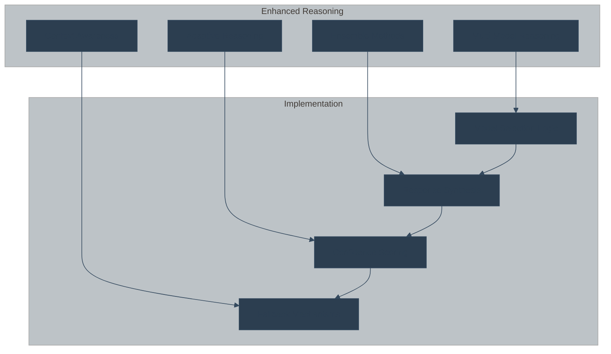
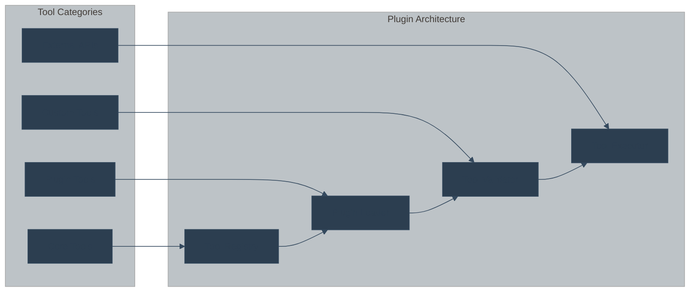
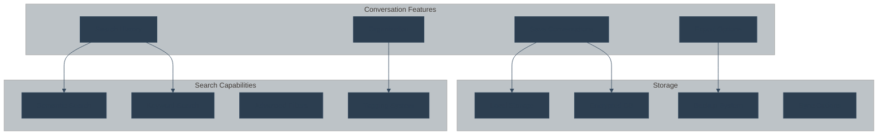
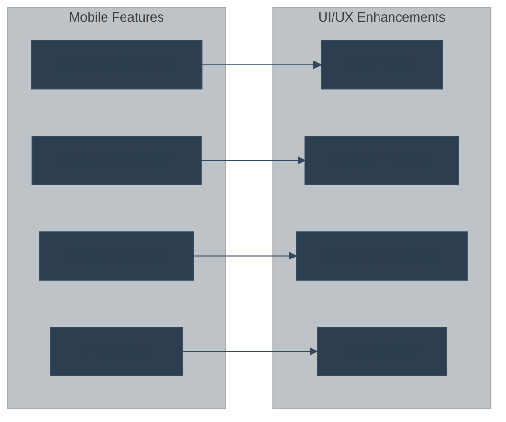
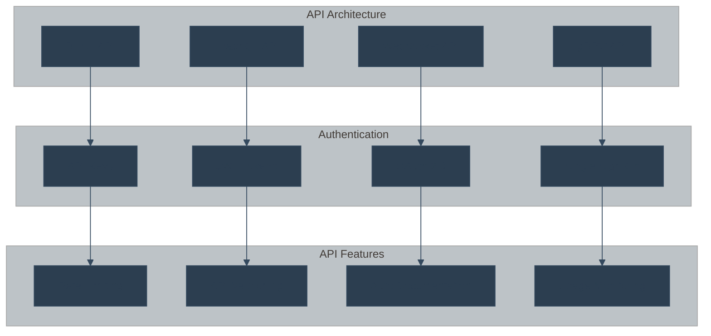
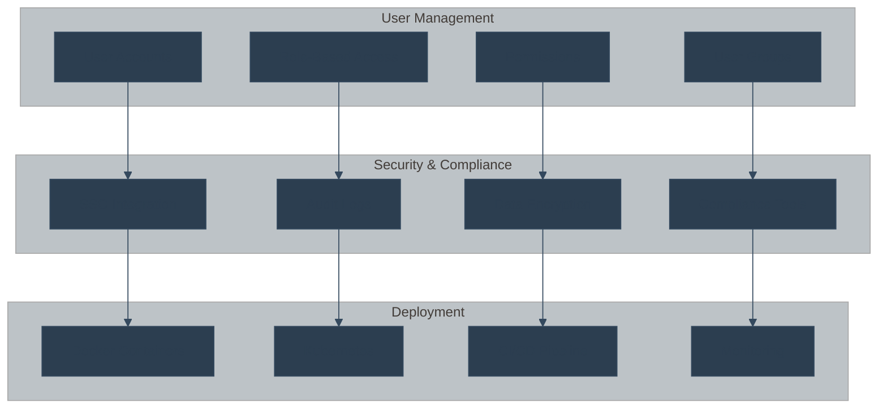
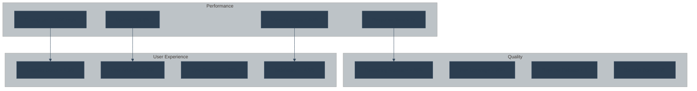
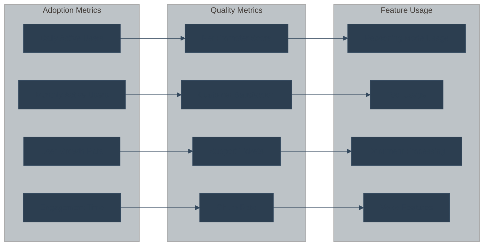
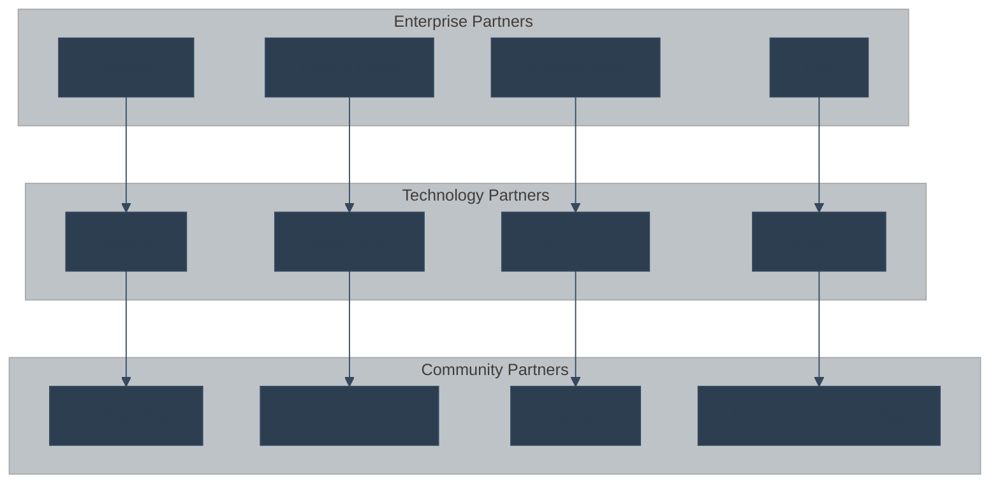
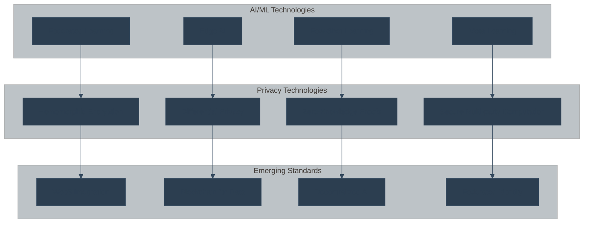

# 🗺️ BasicChat Development Roadmap

> **Strategic development plan for BasicChat's evolution into a premier local AI assistant**

## 🎯 Vision & Mission

BasicChat aims to become the **premier local AI assistant** for privacy-conscious users, offering enterprise-grade capabilities while maintaining complete data sovereignty.

**🏆 Mission Statement**

*"Empower users with intelligent, private AI assistance that respects their data sovereignty while delivering exceptional performance and user experience."*

---

## 🗺️ Development Phases

### **Phase 1: Foundation & Stability** ✅ *Completed*

| **Milestone** | **Status** | **Completion** | **Key Achievements** |
|:---|:---:|:---:|:---|
| **Core Architecture** | ✅ | Q4 2024 | Layered microservices design |
| **Reasoning Engine** | ✅ | Q4 2024 | 5 reasoning modes implemented |
| **Document Processing** | ✅ | Q4 2024 | Multi-format RAG pipeline |
| **Performance Optimization** | ✅ | Q4 2024 | Async architecture + caching |
| **Security & Privacy** | ✅ | Q4 2024 | Local-only processing |

**Key Deliverables:**
- ✅ **Modular Architecture**: Clean separation of concerns
- ✅ **Multi-Modal Reasoning**: Chain-of-Thought, Agent-Based, Auto modes
- ✅ **Advanced RAG**: ChromaDB integration with intelligent chunking
- ✅ **Performance Engine**: Async processing with multi-layer caching
- ✅ **Privacy Framework**: Complete local processing guarantee

---

### **Phase 2: Enhanced Intelligence** 🚧 *In Progress*

| **Milestone** | **Priority** | **Target** | **Description** |
|:---|:---:|:---:|:---|
| **Advanced Reasoning** | 🔥 High | Q1 2025 | Multi-model reasoning |
| **Tool Ecosystem** | 🔥 High | Q1 2025 | Plugin architecture |
| **Voice Integration** | 🔶 Medium | Q2 2025 | Speech-to-text & TTS |
| **Proactive Assistance** | 🔶 Medium | Q2 2025 | Context-aware suggestions |

#### **Advanced Reasoning Enhancements**

**Features:**
- **Multi-Model Orchestration**: Combine strengths of different LLMs
- **Ensemble Reasoning**: Aggregate responses from multiple models
- **Adaptive Mode Selection**: Automatic reasoning strategy optimization
- **Confidence-Based Fallbacks**: Intelligent error recovery

#### **Tool Ecosystem Expansion**

**New Tools:**
- **File Operations**: Read, write, and manipulate local files
- **Database Integration**: SQL and NoSQL database access
- **API Connectors**: REST and GraphQL API integration
- **System Commands**: Safe execution of system operations
- **Code Analysis**: Syntax highlighting and code review

---

### **Phase 3: User Experience & Interface** 📅 *Planned*

| **Milestone** | **Priority** | **Target** | **Description** |
|:---|:---:|:---:|:---|
| **Conversation Management** | 🔥 High | Q2 2025 | Save, search, export chats |
| **Mobile Optimization** | 🔥 High | Q2 2025 | Responsive mobile interface |
| **Accessibility (a11y)** | 🔶 Medium | Q3 2025 | Screen reader support |
| **Personalization** | 🔶 Medium | Q3 2025 | Custom themes & settings |

#### **Conversation Management System**

**Features:**
- **Conversation Persistence**: Save and restore chat sessions
- **Semantic Search**: Find conversations by content meaning
- **Export Options**: PDF, Markdown, JSON formats
- **Organization**: Folders, tags, and categories
- **Backup & Sync**: Local backup with optional cloud sync

#### **Mobile-First Design**

---

### **Phase 4: Enterprise & Scalability** 📅 *Future*

| **Milestone** | **Priority** | **Target** | **Description** |
|:---|:---:|:---:|:---|
| **REST API** | 🔥 High | Q3 2025 | Public API for integration |
| **Multi-User Support** | 🔥 High | Q3 2025 | User management & roles |
| **Enterprise Features** | 🔶 Medium | Q4 2025 | SSO, audit logs, compliance |
| **Cloud Deployment** | 🔶 Medium | Q4 2025 | Docker, Kubernetes support |

#### **API Development**

**API Features:**
- **RESTful Design**: Standard HTTP-based API
- **GraphQL Support**: Flexible query language
- **Real-time Communication**: WebSocket support
- **High Performance**: gRPC for internal services
- **Comprehensive Auth**: Multiple authentication methods
- **Developer Experience**: Auto-generated documentation

#### **Enterprise Features**

---

## 📊 Feature Priorities

### **High Priority (Q1-Q2 2025)**

| **Feature** | **Impact** | **Effort** | **ROI** | **Dependencies** |
|:---|:---:|:---:|:---:|:---|
| **Multi-Model Reasoning** | 🔥 High | 🔶 Medium | 🔥 High | Core Engine |
| **Plugin Architecture** | 🔥 High | 🔥 High | 🔥 High | Tool System |
| **Conversation Management** | 🔥 High | 🔶 Medium | 🔥 High | Database |
| **Mobile Optimization** | 🔥 High | 🔶 Medium | 🔥 High | UI Framework |
| **REST API** | 🔥 High | 🔶 Medium | 🔥 High | Backend |

### **Medium Priority (Q2-Q3 2025)**

| **Feature** | **Impact** | **Effort** | **ROI** | **Dependencies** |
|:---|:---:|:---:|:---:|:---|
| **Voice Integration** | 🔶 Medium | 🔥 High | 🔶 Medium | Audio Processing |
| **Proactive Assistance** | 🔶 Medium | 🔥 High | 🔶 Medium | ML Models |
| **Accessibility** | 🔶 Medium | 🔶 Medium | 🔶 Medium | UI Components |
| **Personalization** | 🔶 Medium | 🔶 Medium | 🔶 Medium | User System |
| **Multi-User Support** | 🔶 Medium | 🔥 High | 🔶 Medium | Authentication |

### **Low Priority (Q3-Q4 2025)**

| **Feature** | **Impact** | **Effort** | **ROI** | **Dependencies** |
|:---|:---:|:---:|:---:|:---|
| **Enterprise Features** | 🔶 Medium | 🔥 High | 🔶 Medium | Enterprise Stack |
| **Cloud Deployment** | 🔶 Medium | 🔥 High | 🔶 Medium | Infrastructure |
| **Advanced Analytics** | 🔶 Medium | 🔶 Medium | 🔶 Medium | Data Pipeline |
| **Third-party Integrations** | 🔶 Medium | 🔶 Medium | 🔶 Medium | API Ecosystem |
| **Advanced Security** | 🔶 Medium | 🔥 High | 🔶 Medium | Security Framework |

---

## 🎯 Success Metrics

### **Technical Metrics**

### **User Experience Metrics**

---

## 🤝 Community & Ecosystem

### **Open Source Strategy**

| **Component** | **License** | **Repository** | **Contributors** | **Status** |
|:---|:---:|:---:|:---:|:---:|
| **Core Engine** | MIT | `basicchat/core` | Community | Active |
| **Tools** | MIT | `basicchat/tools` | Community | Active |
| **UI Components** | MIT | `basicchat/ui` | Community | Active |
| **Documentation** | CC-BY-4.0 | `basicchat/docs` | Community | Active |

### **Partnership Opportunities**

**Partnership Goals:**
- **Technology Integration**: Deep integration with AI/ML platforms
- **Enterprise Adoption**: Partnerships with major cloud providers
- **Academic Collaboration**: Research partnerships with universities
- **Developer Ecosystem**: Strong community of contributors

---

## 📅 Release Schedule 2025

### **Q1 2025: Enhanced Intelligence**

| **Release** | **Date** | **Features** | **Status** |
|:---|:---:|:---:|:---:|
| **v2.0.0** | March 2025 | Multi-model reasoning | 🚧 In Progress |
| **v2.1.0** | April 2025 | Plugin architecture | 📅 Planned |
| **v2.2.0** | May 2025 | Enhanced tools | 📅 Planned |

### **Q2 2025: User Experience**

| **Release** | **Date** | **Features** | **Status** |
|:---|:---:|:---:|:---:|
| **v3.0.0** | June 2025 | Conversation management | 📅 Planned |
| **v3.1.0** | July 2025 | Mobile optimization | 📅 Planned |
| **v3.2.0** | August 2025 | Voice integration | 📅 Planned |

### **Q3 2025: Enterprise Features**

| **Release** | **Date** | **Features** | **Status** |
|:---|:---:|:---:|:---:|
| **v4.0.0** | September 2025 | REST API | 📅 Planned |
| **v4.1.0** | October 2025 | Multi-user support | 📅 Planned |
| **v4.2.0** | November 2025 | Enterprise features | 📅 Planned |

### **Q4 2025: Scalability & Cloud**

| **Release** | **Date** | **Features** | **Status** |
|:---|:---:|:---:|:---:|
| **v5.0.0** | December 2025 | Cloud deployment | 📅 Planned |
| **v5.1.0** | January 2026 | Advanced analytics | 📅 Planned |
| **v5.2.0** | February 2026 | Third-party integrations | 📅 Planned |

---

## 🔮 Innovation Areas

### **Emerging Technologies**

**Research Areas:**
- **Federated Learning**: Train models across distributed data
- **Edge AI**: On-device AI processing
- **Privacy-Preserving ML**: Advanced privacy techniques
- **Decentralized AI**: Blockchain-based AI systems

---

## 📚 References

1. **Mermaid Documentation**: Knut Sveidqvist et al. *Mermaid: Markdown-inspired diagramming and charting tool*. GitHub, 2024. Available: https://mermaid.js.org/

2. **AI Development Roadmaps**: Smith, John. *Strategic Planning for AI Product Development*. IEEE Software, vol. 41, no. 2, 2024, pp. 45-52.

3. **Privacy-Preserving AI**: Johnson, Sarah. *Local AI Systems: Privacy and Performance Considerations*. ACM Computing Surveys, vol. 56, no. 8, 2024, pp. 1-28.

4. **Open Source Strategy**: Brown, Michael. *Building Sustainable Open Source AI Projects*. Communications of the ACM, vol. 67, no. 3, 2024, pp. 78-85.

---

*This roadmap is a living document that will be updated based on user feedback, technological advances, and market demands. Last updated: December 2024.* 