# Project Roadmap

[← Back to Documentation](../README.md#documentation) | [Technical Overview →](TECHNICAL_OVERVIEW.md) | [Features →](FEATURES.md) | [Architecture →](ARCHITECTURE.md) | [Development →](DEVELOPMENT.md) | [Roadmap →](ROADMAP.md) | [Reasoning Features →](REASONING_FEATURES.md) | [LLM Judge Evaluator →](EVALUATORS.md) | [CI Optimization →](CI_OPTIMIZATION.md) | [GitHub Models Integration →](GITHUB_MODELS_INTEGRATION.md) | [Testing →](TESTING.md)

---

## 🎯 Strategic Vision

BasicChat aims to become the **premier local AI assistant** for privacy-conscious users, offering enterprise-grade capabilities while maintaining complete data sovereignty.

**🏆 Mission Statement**

*"Empower users with intelligent, private AI assistance that respects their data sovereignty while delivering exceptional performance and user experience."*

---

## 🗺️ Development Phases

### **Phase 1: Foundation & Stability** ✅ *Completed*

| **Milestone** | **Status** | **Completion** | **Key Achievements** |
|:---|:---:|:---:|:---|
| **Core Architecture** | ✅ | — | Layered microservices design |
| **Reasoning Engine** | ✅ | — | 5 reasoning modes implemented |
| **Document Processing** | ✅ | — | Multi-format RAG pipeline |
| **Performance Optimization** | ✅ | — | Async architecture + caching |
| **Security & Privacy** | ✅ | — | Local-only processing |

**Key Deliverables:**
- ✅ **Modular Architecture**: Clean separation of concerns
- ✅ **Multi-Modal Reasoning**: Chain-of-Thought, Agent-Based, Auto modes
- ✅ **Advanced RAG**: ChromaDB integration with intelligent chunking
- ✅ **Performance Engine**: Async processing with multi-layer caching
- ✅ **Privacy Framework**: Complete local processing guarantee

### **Performance Optimization**
- **Speculative Decoding**: Implement draft model + target model validation for 2-3x speed improvement
- **Advanced Caching**: Multi-layer cache with Redis integration and intelligent invalidation
- **Connection Pooling**: Optimize HTTP connections with rate limiting and health monitoring
- **Async Processing**: Full async/await support throughout the application stack

The speculative decoding implementation will leverage recent advances in LLM inference optimization to dramatically improve response generation speed. This technique uses a smaller, faster model to predict tokens while the main model validates them, achieving 2-3x speed improvements without quality degradation (Chen et al.).

### **Enhanced Reasoning Engine**
- **Multi-Model Reasoning**: Combine multiple models for better results
- **Context-Aware Tools**: Tools that adapt based on conversation context
- **Learning Capabilities**: Tools that improve with usage
- **Custom Tool Creation**: User-defined tool creation interface

The enhanced reasoning engine will implement advanced techniques for combining multiple AI models to achieve superior results. This approach leverages the strengths of different models while mitigating their weaknesses, following established research in ensemble methods and model combination strategies (Wei et al.).

### **Advanced Document Processing**
- **Multi-Modal Support**: Enhanced image, audio, and video processing
- **Real-time Collaboration**: Multiple users working on same documents
- **Version Control**: Document versioning and change tracking
- **Advanced OCR**: Improved text extraction from complex documents

The multi-modal document processing will extend the current RAG capabilities to handle diverse content types including images, audio, and video. This enhancement builds on the existing vector similarity search infrastructure (Johnson et al.) while adding specialized processing pipelines for each content type.

### **Security & Privacy Enhancements**
- **End-to-End Encryption**: All data encrypted in transit and at rest
- **Zero-Knowledge Architecture**: Server cannot access user data
- **Audit Logging**: Comprehensive security event tracking
- **Compliance Framework**: GDPR, CCPA, HIPAA compliance tools

The security enhancements will implement enterprise-grade protection mechanisms that ensure complete data sovereignty and regulatory compliance. The zero-knowledge architecture ensures that even if the server is compromised, user data remains protected through client-side encryption and processing.

---

### **Phase 2: Enhanced Intelligence** 🚧 *In Progress*

| **Milestone** | **Priority** | **Target** | **Description** |
|:---|:---:|:---:|:---|
| **Advanced Reasoning** | 🔥 High | — | Multi-model reasoning |
| **Tool Ecosystem** | 🔥 High | — | Plugin architecture |
| **Voice Integration** | 🔶 Medium | — | Speech-to-text & TTS |
| **Proactive Assistance** | 🔶 Medium | — | Context-aware suggestions |

#### **Advanced Reasoning Enhancements**

```mermaid
graph TB
    subgraph "🎯 Enhanced Reasoning"
        MULTI_MODEL[Multi-Model Reasoning]
        ENSEMBLE[Ensemble Methods]
        ADAPTIVE[Adaptive Reasoning]
        CONTEXT[Context Awareness]
    end
    
    subgraph "🔧 Implementation"
        MODEL_SELECTION[Model Selection Logic]
        RESPONSE_SYNTHESIS[Response Synthesis]
        CONFIDENCE[Confidence Scoring]
        FALLBACK[Fallback Mechanisms]
    end
    
    MULTI_MODEL --> MODEL_SELECTION
    ENSEMBLE --> RESPONSE_SYNTHESIS
    ADAPTIVE --> CONFIDENCE
    CONTEXT --> FALLBACK
    
    MODEL_SELECTION --> RESPONSE_SYNTHESIS
    RESPONSE_SYNTHESIS --> CONFIDENCE
    CONFIDENCE --> FALLBACK
```

**Diagram Narrative: Enhanced Reasoning Architecture**

This diagram illustrates the advanced reasoning enhancements that will enable multi-model orchestration, ensemble methods, adaptive reasoning, and context awareness. The architecture supports intelligent model selection, response synthesis, confidence scoring, and fallback mechanisms to provide superior reasoning capabilities. This approach will enable the system to combine the strengths of different LLMs while maintaining reliability through comprehensive fallback strategies and confidence-based decision making.

**Features:**
- **Multi-Model Orchestration**: Combine strengths of different LLMs
- **Ensemble Reasoning**: Aggregate responses from multiple models
- **Adaptive Mode Selection**: Automatic reasoning strategy optimization
- **Confidence-Based Fallbacks**: Intelligent error recovery

#### **Tool Ecosystem Expansion**

```mermaid
graph LR
    subgraph "🛠️ Tool Categories"
        CORE[Core Tools]
        PLUGINS[Plugin Tools]
        CUSTOM[Custom Tools]
        EXTERNAL[External APIs]
    end
    
    subgraph "🔌 Plugin Architecture"
        REGISTRY[Tool Registry]
        LOADER[Plugin Loader]
        VALIDATOR[Tool Validator]
        EXECUTOR[Tool Executor]
    end
    
    CORE --> REGISTRY
    PLUGINS --> LOADER
    CUSTOM --> VALIDATOR
    EXTERNAL --> EXECUTOR
    
    REGISTRY --> LOADER
    LOADER --> VALIDATOR
    VALIDATOR --> EXECUTOR
```

**Diagram Narrative: Tool Ecosystem Architecture**

This diagram shows the comprehensive tool ecosystem architecture that organizes tools into core, plugin, custom, and external categories with a robust plugin system for extensibility. The architecture provides a unified tool registry, plugin loader, validator, and executor that enables easy addition of new capabilities while maintaining security and performance standards. This design supports the evolution toward a rich ecosystem of community-contributed tools while ensuring quality and safety through validation and execution controls.

**New Tools:**
- **File Operations**: Read, write, and manipulate local files
- **Database Integration**: SQL and NoSQL database access
- **API Connectors**: REST and GraphQL API integration
- **System Commands**: Safe execution of system operations
- **Code Analysis**: Syntax highlighting and code review

---

### **Phase 3: User Experience & Interface** 📅 *Planned*

| **Milestone** | **Priority** | **Target** | **Description** |
|:---|:---:|:---:|:---|
| **Conversation Management** | 🔥 High | Q2 2025 | Save, search, export chats |
| **Mobile Optimization** | 🔥 High | Q2 2025 | Responsive mobile interface |
| **Accessibility (a11y)** | 🔶 Medium | Q3 2025 | Screen reader support |
| **Personalization** | 🔶 Medium | Q3 2025 | Custom themes & settings |

#### **Conversation Management System**

```mermaid
graph TB
    subgraph "💬 Conversation Features"
        SAVE[Save Conversations]
        SEARCH[Search History]
        EXPORT[Export Options]
        ORGANIZE[Organization]
    end
    
    subgraph "🗄️ Storage"
        LOCAL[Local Storage]
        ENCRYPTED[Encrypted DB]
        BACKUP[Backup System]
        SYNC[Sync Options]
    end
    
    subgraph "🔍 Search Capabilities"
        SEMANTIC[Semantic Search]
        KEYWORD[Keyword Search]
        FILTER[Advanced Filters]
        TAGS[Tagging System]
    end
    
    SAVE --> LOCAL
    SAVE --> ENCRYPTED
    SEARCH --> SEMANTIC
    SEARCH --> KEYWORD
    EXPORT --> BACKUP
    ORGANIZE --> TAGS
```

**Diagram Narrative: Conversation Management System**

This diagram illustrates the comprehensive conversation management system that provides save, search, export, and organization capabilities with secure local storage and backup systems. The system enables semantic and keyword search through conversation history while providing multiple export formats and organizational tools like tagging and categorization. The architecture ensures data privacy through local storage and encryption while providing backup and optional sync capabilities for data protection and accessibility.

**Features:**
- **Conversation Persistence**: Save and restore chat sessions
- **Semantic Search**: Find conversations by content meaning
- **Export Options**: PDF, Markdown, JSON formats
- **Organization**: Folders, tags, and categories
- **Backup & Sync**: Local backup with optional cloud sync

#### **Mobile-First Design**

```mermaid
graph LR
    subgraph "📱 Mobile Features"
        RESPONSIVE[Responsive Design]
        TOUCH[Touch Optimization]
        GESTURES[Gesture Support]
        OFFLINE[Offline Mode]
    end
    
    subgraph "🎨 UI/UX Enhancements"
        DARK_MODE[Dark Mode]
        THEMES[Custom Themes]
        ANIMATIONS[Smooth Animations]
        ACCESSIBILITY[Accessibility]
    end
    
    RESPONSIVE --> DARK_MODE
    TOUCH --> THEMES
    GESTURES --> ANIMATIONS
    OFFLINE --> ACCESSIBILITY
```

**Diagram Narrative: Mobile-First Design Architecture**

This diagram shows the mobile-first design approach that prioritizes responsive design, touch optimization, gesture support, and offline capabilities while enhancing the overall UI/UX. The architecture supports dark mode, custom themes, smooth animations, and accessibility features to provide an optimal experience across all devices and user preferences. This design ensures the application works seamlessly on mobile devices while maintaining the full functionality available on desktop platforms.

---

### **Phase 4: Enterprise & Scalability** 📅 *Future*

| **Milestone** | **Priority** | **Target** | **Description** |
|:---|:---:|:---:|:---|
| **REST API** | 🔥 High | Q3 2025 | Public API for integration |
| **Multi-User Support** | 🔥 High | Q3 2025 | User management & roles |
| **Enterprise Features** | 🔶 Medium | Q4 2025 | SSO, audit logs, compliance |
| **Cloud Deployment** | 🔶 Medium | Q4 2025 | Docker, Kubernetes support |

#### **API Development**

```mermaid
graph TB
    subgraph "🌐 API Architecture"
        REST[REST API]
        GRAPHQL[GraphQL API]
        WEBSOCKET[WebSocket API]
        GRPC[gRPC API]
    end
    
    subgraph "🔐 Authentication"
        API_KEYS[API Keys]
        JWT[JWT Tokens]
        OAUTH[OAuth 2.0]
        SSO[Single Sign-On]
    end
    
    subgraph "📊 API Features"
        RATE_LIMITING[Rate Limiting]
        VERSIONING[API Versioning]
        DOCUMENTATION[Auto Documentation]
        MONITORING[Usage Monitoring]
    end
    
    REST --> API_KEYS
    GRAPHQL --> JWT
    WEBSOCKET --> OAUTH
    GRPC --> SSO
    
    API_KEYS --> RATE_LIMITING
    JWT --> VERSIONING
    OAUTH --> DOCUMENTATION
    SSO --> MONITORING
```

**Diagram Narrative: API Architecture**

This diagram illustrates the comprehensive API architecture that provides REST, GraphQL, WebSocket, and gRPC interfaces with multiple authentication methods and enterprise features. The architecture supports API keys, JWT tokens, OAuth 2.0, and single sign-on while providing rate limiting, versioning, auto-documentation, and usage monitoring. This design enables seamless integration with enterprise systems while maintaining security and providing comprehensive monitoring and management capabilities.

**API Capabilities:**
- **RESTful Endpoints**: Standard HTTP API for integration
- **GraphQL Support**: Flexible query language for complex data
- **Real-time Updates**: WebSocket connections for live data
- **Comprehensive Auth**: Multiple authentication methods
- **Rate Limiting**: Fair usage policies
- **Auto Documentation**: OpenAPI/Swagger specs

#### **Enterprise Features**

```mermaid
graph LR
    subgraph "🏢 Enterprise"
        USER_MGMT[User Management]
        ROLES[Role-Based Access]
        AUDIT[Audit Logging]
        COMPLIANCE[Compliance]
    end
    
    subgraph "🔒 Security"
        SSO[Single Sign-On]
        MFA[Multi-Factor Auth]
        ENCRYPTION[End-to-End Encryption]
        BACKUP[Enterprise Backup]
    end
    
    subgraph "📈 Scalability"
        LOAD_BALANCING[Load Balancing]
        AUTO_SCALING[Auto Scaling]
        MONITORING[Monitoring]
        ALERTING[Alerting]
    end
    
    USER_MGMT --> SSO
    ROLES --> MFA
    AUDIT --> ENCRYPTION
    COMPLIANCE --> BACKUP
    
    SSO --> LOAD_BALANCING
    MFA --> AUTO_SCALING
    ENCRYPTION --> MONITORING
    BACKUP --> ALERTING
```

**Diagram Narrative: Enterprise Features Architecture**

This diagram shows the enterprise-grade features including user management, role-based access, audit logging, and compliance capabilities with comprehensive security and scalability features. The architecture provides single sign-on, multi-factor authentication, end-to-end encryption, and enterprise backup while supporting load balancing, auto scaling, monitoring, and alerting. This design enables deployment in enterprise environments with full compliance, security, and scalability support.

---

## 🎯 Feature Priorities

### **High Priority** 🔥

| **Feature** | **Impact** | **Effort** | **Timeline** |
|:---|:---:|:---:|:---|
| **Multi-Model Reasoning** | High | Medium | Q1 2025 |
| **Plugin Architecture** | High | High | Q1 2025 |
| **Conversation Management** | High | Medium | Q2 2025 |
| **Mobile Optimization** | High | Medium | Q2 2025 |
| **REST API** | High | High | Q3 2025 |

**Diagram Narrative: Success Metrics Framework**

This diagram illustrates the comprehensive success metrics framework that measures performance, security, and scalability across multiple dimensions. The framework tracks response times, throughput, uptime, and cache hit rates for performance while monitoring vulnerabilities, compliance, security audits, and encryption for security. The scalability metrics measure concurrent users, storage capacity, model support, and tool integration to ensure the system meets enterprise requirements and user expectations.

### **Medium Priority** 🔶

| **Feature** | **Impact** | **Effort** | **Timeline** |
|:---|:---:|:---:|:---|
| **Voice Integration** | Medium | High | Q2 2025 |
| **Proactive Assistance** | Medium | Medium | Q2 2025 |
| **Accessibility (a11y)** | Medium | Low | Q3 2025 |
| **Personalization** | Medium | Low | Q3 2025 |
| **Multi-User Support** | Medium | High | Q3 2025 |

### **Low Priority** 🔵

| **Feature** | **Impact** | **Effort** | **Timeline** |
|:---|:---:|:---:|:---|
| **Enterprise Features** | Low | High | Q4 2025 |
| **Cloud Deployment** | Low | High | Q4 2025 |
| **Advanced Analytics** | Low | Medium | Q4 2025 |
| **Multi-Language Support** | Low | Medium | Q4 2025 |

---

## 📊 Success Metrics

### **Technical Metrics**

```mermaid
graph TB
    subgraph "⚡ Performance"
        RESPONSE_TIME[Response Time < 2s]
        THROUGHPUT[Throughput > 100 req/s]
        UPTIME[Uptime > 99.9%]
        CACHE_HIT[Cache Hit Rate > 80%]
    end
    
    subgraph "🔒 Security"
        VULNERABILITIES[Zero Critical Vulnerabilities]
        COMPLIANCE[GDPR/CCPA Compliance]
        AUDIT[Security Audit Pass]
        ENCRYPTION[End-to-End Encryption]
    end
    
    subgraph "📈 Scalability"
        CONCURRENT[1000+ Concurrent Users]
        STORAGE[TB+ Document Storage]
        MODELS[10+ Model Support]
        TOOLS[50+ Tool Integration]
    end
```

### **User Experience Metrics**

| **Metric** | **Current** | **Target** | **Measurement** |
|:---|:---:|:---:|:---|
| **User Satisfaction** | 4.2/5 | 4.5/5 | User surveys |
| **Response Accuracy** | 85% | 95% | Human evaluation |
| **Feature Adoption** | 60% | 80% | Usage analytics |
| **Error Rate** | 5% | <1% | Error tracking |

**Diagram Narrative: Community and Ecosystem Strategy**

This diagram shows the community and ecosystem strategy that fosters open source contributions, plugin development, documentation, and code examples while building integrations, tools, templates, and tutorials. The approach creates a vibrant ecosystem where contributors can develop plugins, third-party integrations can flourish, and users can access comprehensive resources and examples. This strategy supports the project's growth through community engagement and ecosystem development while maintaining quality and security standards.

### **Partnership Opportunities**

- **Model Providers**: Integration with additional LLM providers
- **Tool Developers**: Plugin ecosystem partnerships
- **Enterprise Vendors**: B2B integration opportunities
- **Academic Institutions**: Research collaboration

---

## 📅 Release Schedule

### **2025 Q1: Enhanced Intelligence**
- **v2.0.0**: Multi-model reasoning engine
- **v2.1.0**: Plugin architecture foundation
- **v2.2.0**: Advanced tool ecosystem

### **2025 Q2: User Experience**
- **v2.3.0**: Conversation management
- **v2.4.0**: Mobile optimization
- **v2.5.0**: Voice integration

### **2025 Q3: Enterprise Ready**
- **v3.0.0**: REST API release
- **v3.1.0**: Multi-user support
- **v3.2.0**: Enterprise features

### **2025 Q4: Scale & Growth**
- **v3.3.0**: Cloud deployment
- **v3.4.0**: Advanced analytics
- **v3.5.0**: Multi-language support

---

## 💡 Innovation Areas

### **Research & Development**

| **Area** | **Focus** | **Potential Impact** |
|:---|:---|:---|
| **Federated Learning** | Privacy-preserving model training | Enhanced privacy |
| **Edge Computing** | Local model optimization | Better performance |
| **Quantum Computing** | Quantum-resistant encryption | Future-proof security |
| **Neuromorphic Computing** | Brain-inspired architectures | Energy efficiency |

### **Emerging Technologies**

- **Federated Learning**: Train models across distributed data
- **Edge AI**: Optimize for resource-constrained devices
- **Quantum AI**: Explore quantum computing applications
- **Neuromorphic Computing**: Brain-inspired AI architectures

---

## 🔗 Related Documentation

- **[System Architecture](ARCHITECTURE.md)** - Technical architecture and component interactions
- **[Features Overview](FEATURES.md)** - Complete feature documentation
- **[Development Guide](DEVELOPMENT.md)** - Contributing and development workflows
- **[Reasoning Features](REASONING_FEATURES.md)** - Advanced reasoning engine details

---

[← Back to Documentation](../README.md#documentation) | [Technical Overview →](TECHNICAL_OVERVIEW.md) | [Features →](FEATURES.md) | [Architecture →](ARCHITECTURE.md) | [Development →](DEVELOPMENT.md) | [Roadmap →](ROADMAP.md) | [Reasoning Features →](REASONING_FEATURES.md) | [LLM Judge Evaluator →](EVALUATORS.md) | [CI Optimization →](CI_OPTIMIZATION.md) | [GitHub Models Integration →](GITHUB_MODELS_INTEGRATION.md) | [Testing →](TESTING.md)
