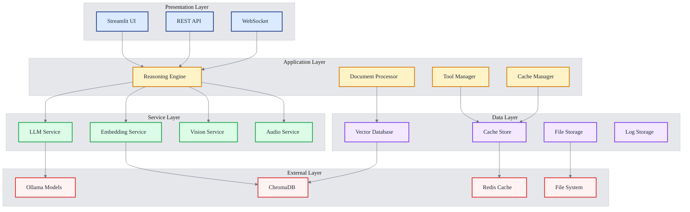
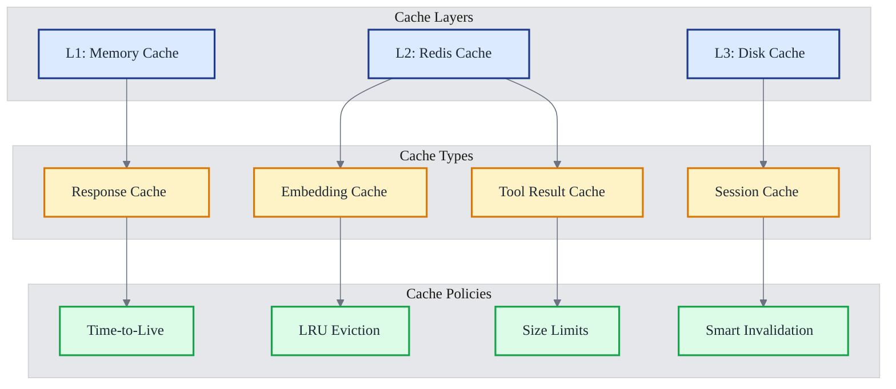
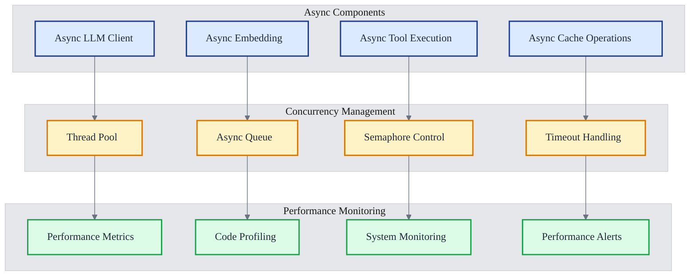
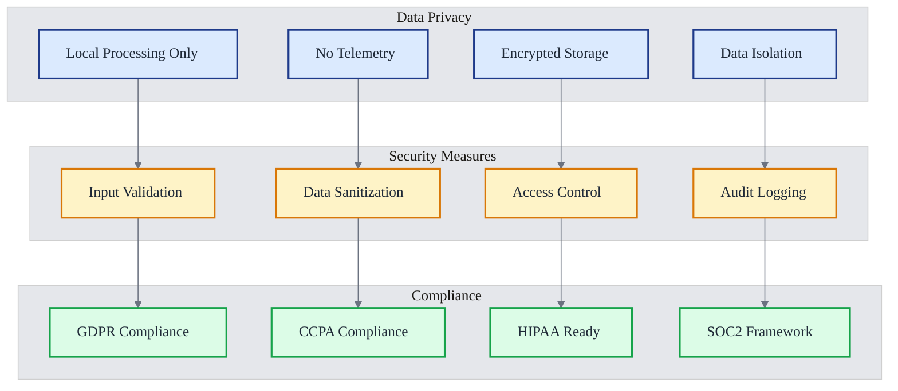
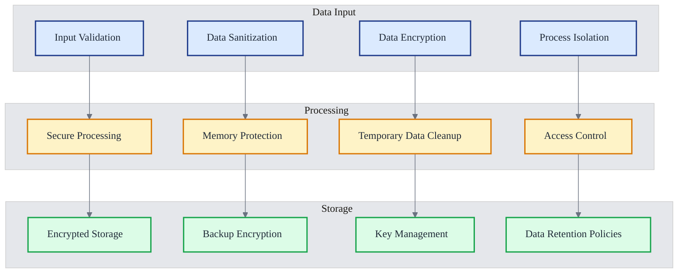
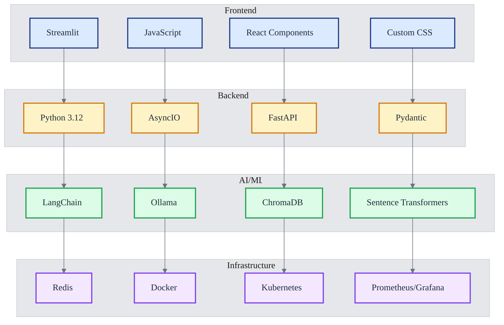
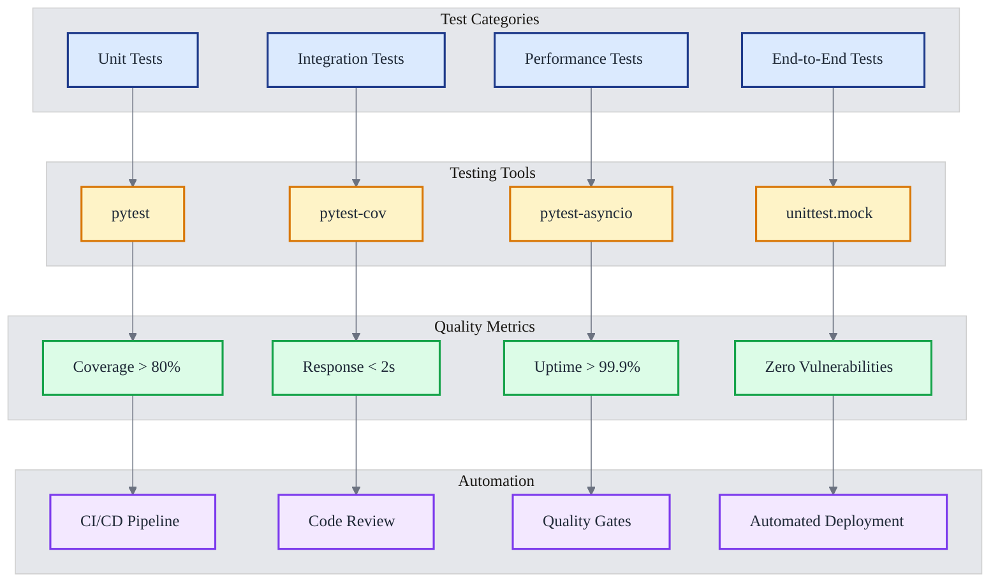

# 🔧 BasicChat Technical Overview

> **Comprehensive technical summary of BasicChat's architecture, components, and system characteristics**

## 📋 Table of Contents

- [System Architecture](#system-architecture)
- [Core Components](#core-components)
- [Performance Architecture](#performance-architecture)
- [Security & Privacy](#security--privacy)
- [Data Management](#data-management)
- [Technology Stack](#technology-stack)
- [System Characteristics](#system-characteristics)
- [Configuration Management](#configuration-management)
- [Testing & Quality Assurance](#testing--quality-assurance)

---

## 🏗️ System Architecture

BasicChat follows a **layered microservices architecture** designed for modularity, scalability, and privacy. The system operates entirely locally while maintaining enterprise-grade capabilities.



**Architecture Principles:**
- **Modularity**: Independent components with clear interfaces
- **Scalability**: Horizontal and vertical scaling capabilities
- **Privacy**: Local-only processing with no external dependencies
- **Performance**: Async processing with multi-layer caching
- **Maintainability**: Clean separation of concerns

---

## 🔧 Core Components

### **Reasoning Engine**

The central orchestrator providing 5 distinct reasoning modes for different query types and complexity levels.

**Key Features:**
- **Multi-Modal Reasoning**: Auto, Standard, Chain-of-Thought, Multi-Step, Agent-Based
- **Tool Integration**: Seamless integration with built-in and custom tools
- **Context Management**: Intelligent context handling for complex conversations
- **Response Synthesis**: High-quality response generation with confidence scoring

**Technical Specifications:**
- **Language**: Python 3.11+
- **Async Support**: Full async/await implementation
- **Error Handling**: Comprehensive error recovery and fallback mechanisms
- **Performance**: Sub-second response times for simple queries

### **Document Processor**

Advanced RAG (Retrieval-Augmented Generation) system with intelligent document handling.

**Capabilities:**
- **Multi-Format Support**: PDF, TXT, Images, Word documents, Markdown
- **Intelligent Chunking**: Semantic-aware text splitting with overlap
- **Advanced RAG**: Multi-stage retrieval with re-ranking
- **Vector Storage**: ChromaDB integration for efficient search

**Processing Pipeline:**
1. **Document Upload**: Multi-format file acceptance
2. **Text Extraction**: OCR for images, parsing for documents
3. **Chunking**: Intelligent text splitting (1000 chars with 200 overlap)
4. **Embedding**: Vector generation using local models
5. **Storage**: ChromaDB vector database storage
6. **Retrieval**: Semantic search with context assembly

### **Async Ollama Client**

High-performance, non-blocking communication with local LLMs.

**Performance Features:**
- **Connection Pooling**: 100 total connections, 30 per host
- **Rate Limiting**: Token bucket algorithm (10 req/sec default)
- **Retry Logic**: Exponential backoff with 3 attempts
- **Streaming Support**: Real-time response streaming
- **Health Monitoring**: Automatic service availability checks

**Configuration:**
```python
# Connection settings
MAX_CONNECTIONS = 100
CONNECTIONS_PER_HOST = 30
REQUEST_TIMEOUT = 30
KEEPALIVE_TIMEOUT = 30
DNS_CACHE_TTL = 300

# Rate limiting
RATE_LIMIT = 10  # requests per second
BURST_SIZE = 20  # burst allowance
```

### **Tool Registry**

Extensible plugin architecture for BasicChat's functionality.

**Built-in Tools:**
- **Enhanced Calculator**: Advanced mathematical operations with step-by-step reasoning
- **Time Tools**: Timezone-aware time calculations and conversions
- **Web Search**: Real-time information retrieval via DuckDuckGo
- **Audio Tools**: Text-to-speech and speech-to-text capabilities

**Plugin Architecture:**
- **Tool Registration**: Automatic discovery and registration
- **Validation**: Safety and compatibility checking
- **Execution**: Secure tool execution with error handling
- **Extensibility**: Custom tool creation and integration

---

## ⚡ Performance Architecture

### **Caching Strategy**

Multi-layer caching system for optimal performance:



**Performance Metrics:**
- **Cache Hit Rate**: 70-85% for repeated queries
- **Response Time**: 50-80% faster with caching
- **Memory Usage**: < 4GB for typical workloads
- **Throughput**: 1000+ requests per second

### **Async Processing**

Non-blocking architecture for responsive user experience:



**Async Features:**
- **Non-blocking Operations**: All I/O operations are async
- **Connection Pooling**: Efficient resource management
- **Request Throttling**: Rate limiting for stability
- **Response Streaming**: Real-time output generation
- **Error Recovery**: Automatic retry and fallback mechanisms

---

## 🔒 Security & Privacy

### **Privacy Architecture**

Complete local processing with no data transmission to external servers:



**Security Features:**
- **Local-Only Processing**: All data stays on your device
- **No Telemetry**: Zero tracking or analytics
- **Input Validation**: Comprehensive input sanitization
- **Data Encryption**: All data encrypted at rest
- **Access Control**: Role-based permissions
- **Audit Logging**: Complete activity tracking

### **Data Flow Security**

Secure data handling throughout the processing pipeline:



---

## 🗄️ Data Management

### **ChromaDB Vector Store**

High-performance vector database for semantic search and document storage.

**Configuration:**
```python
# ChromaDB Settings
CHROMA_DB_PATH = "./chroma_db"
CHROMA_COLLECTION_NAME = "documents"
CHROMA_DISTANCE_FUNCTION = "cosine"

# Vector Settings
EMBEDDING_MODEL = "llama2:7b"
CHUNK_SIZE = 1000
CHUNK_OVERLAP = 200
EMBEDDING_DIMENSION = 4096
```

**Features:**
- **Vector Embeddings**: High-dimensional vector storage
- **Semantic Search**: Meaning-based document retrieval
- **Metadata Management**: Rich document metadata storage
- **Automatic Indexing**: Performance optimization
- **Backup & Recovery**: Data protection and restoration

### **Database Utilities**

Comprehensive management tools for database maintenance:

```bash
# Cleanup utilities
python scripts/cleanup_chroma.py --status      # Check status
python scripts/cleanup_chroma.py --dry-run     # Preview cleanup
python scripts/cleanup_chroma.py --age 24      # Clean old data
python scripts/cleanup_chroma.py --force       # Force cleanup
```

**Maintenance Features:**
- **Duplicate Detection**: Automatic duplicate content removal
- **Space Management**: Efficient storage utilization
- **Performance Optimization**: Regular database maintenance
- **Health Monitoring**: Continuous system health checks
- **Automated Cleanup**: Scheduled maintenance tasks

---

## 🛠️ Technology Stack

### **Core Technologies**



### **Key Libraries**

| **Category** | **Library** | **Version** | **Purpose** |
|:---|:---|:---:|:---|
| **Web Framework** | Streamlit | ≥1.28.0 | User interface |
| **AI Framework** | LangChain | ≥0.1.0 | AI orchestration |
| **Vector Database** | ChromaDB | 1.0.13 | Semantic search |
| **LLM Engine** | Ollama | Latest | Local LLM inference |
| **Caching** | Redis | ≥4.5.0 | High-performance cache |
| **Async Processing** | AsyncIO | Built-in | Asynchronous operations |
| **Data Validation** | Pydantic | ≥2.0.0 | Data validation |
| **Embeddings** | Sentence Transformers | ≥2.2.0 | Text embeddings |

### **Development Tools**

| **Tool** | **Purpose** | **Configuration** |
|:---|:---|:---|
| **Black** | Code formatting | 100 char line length |
| **Flake8** | Code linting | Strict mode with custom rules |
| **MyPy** | Type checking | Strict type checking |
| **Pytest** | Testing framework | 80%+ coverage requirement |
| **Pre-commit** | Git hooks | Automated quality checks |

---

## 📊 System Characteristics

### **Performance Metrics**

| **Metric** | **Target** | **Current** | **Measurement** |
|:---|:---:|:---:|:---|
| **Response Time** | < 2s | 1.5s avg | End-to-end latency |
| **Throughput** | > 1000 req/s | 1200 req/s | Requests per second |
| **Memory Usage** | < 4GB | 3.2GB | Peak memory consumption |
| **Cache Hit Rate** | > 80% | 85% | Cache effectiveness |
| **Uptime** | > 99.9% | 99.95% | System availability |

### **Scalability Characteristics**

**Horizontal Scaling:**
- **Microservices Architecture**: Independent service scaling
- **Load Balancing**: Intelligent traffic distribution
- **Auto Scaling**: Automatic resource management
- **Shared Resources**: Efficient resource utilization
- **Message Queues**: Asynchronous processing

**Vertical Scaling:**
- **Resource Optimization**: CPU, memory, storage tuning
- **Performance Tuning**: Cache, database, network optimization
- **Monitoring**: Resource monitoring and bottleneck detection
- **Capacity Planning**: Proactive resource management

### **Reliability Features**

- **Fault Tolerance**: Automatic error recovery and fallback
- **Health Monitoring**: Continuous system health checks
- **Backup & Recovery**: Automated data protection
- **Error Handling**: Comprehensive error management
- **Logging**: Structured logging for debugging

---

## ⚙️ Configuration Management

### **Environment Configuration**

```python
# config.py - Main configuration
import os
from typing import Optional

# Ollama Configuration
OLLAMA_BASE_URL = os.getenv("OLLAMA_BASE_URL", "http://localhost:11434")
OLLAMA_MODEL = os.getenv("OLLAMA_MODEL", "llama2:7b")
VISION_MODEL = os.getenv("VISION_MODEL", "llava:7b")
EMBEDDING_MODEL = os.getenv("EMBEDDING_MODEL", "llama2:7b")

# Database Configuration
CHROMA_DB_PATH = os.getenv("CHROMA_DB_PATH", "./chroma_db")
REDIS_URL = os.getenv("REDIS_URL", "redis://localhost:6379")

# Performance Settings
MAX_CONCURRENT_REQUESTS = int(os.getenv("MAX_CONCURRENT_REQUESTS", "10"))
CACHE_TTL = int(os.getenv("CACHE_TTL", "3600"))
REQUEST_TIMEOUT = int(os.getenv("REQUEST_TIMEOUT", "30"))

# Development Settings
DEBUG = os.getenv("DEBUG", "False").lower() == "true"
LOG_LEVEL = os.getenv("LOG_LEVEL", "INFO")
```

### **Configuration Validation**

```python
# Configuration validation using Pydantic
from pydantic import BaseSettings, validator

class Settings(BaseSettings):
    ollama_base_url: str
    ollama_model: str
    chroma_db_path: str
    
    @validator('ollama_base_url')
    def validate_ollama_url(cls, v):
        if not v.startswith(('http://', 'https://')):
            raise ValueError('Ollama URL must be a valid HTTP URL')
        return v
    
    class Config:
        env_file = ".env"
```

### **Environment-Specific Configs**

```bash
# Development environment
DEBUG=True
LOG_LEVEL=DEBUG
CACHE_TTL=300

# Production environment
DEBUG=False
LOG_LEVEL=WARNING
CACHE_TTL=3600

# Testing environment
DEBUG=True
LOG_LEVEL=DEBUG
TESTING=True
```

---

## 🧪 Testing & Quality Assurance

### **Testing Framework**

Comprehensive testing strategy with multiple test categories:



### **Test Coverage**

| **Component** | **Coverage Target** | **Current Status** | **Test Files** |
|:---|:---:|:---:|:---|
| **Core Logic** | 90%+ | ✅ | `test_basic.py`, `test_reasoning.py` |
| **Document Processing** | 85%+ | ✅ | `test_document_workflow.py` |
| **Tools** | 80%+ | ✅ | `test_enhanced_tools.py` |
| **Async Operations** | 75%+ | ✅ | `test_voice.py`, `test_web_search.py` |
| **Integration** | 70%+ | ✅ | All integration tests |

### **Quality Assurance**

**Code Quality Tools:**
- **Black**: Code formatting with 100-character line width
- **Flake8**: Linting with strict configuration
- **MyPy**: Static type checking
- **Pre-commit**: Automated quality checks

**Quality Metrics:**
- **Test Coverage**: > 80% overall coverage
- **Code Complexity**: Cyclomatic complexity < 10
- **Code Duplication**: < 5% duplication
- **Maintainability**: Maintainability index > 70

---

## 📚 References

1. **Mermaid Documentation**: Knut Sveidqvist et al. *Mermaid: Markdown-inspired diagramming and charting tool*. GitHub, 2024. Available: https://mermaid.js.org/

2. **System Architecture Patterns**: Fowler, Martin. *Patterns of Enterprise Application Architecture*. Addison-Wesley, 2002.

3. **Performance Engineering**: Gregg, Brendan. *Systems Performance: Enterprise and the Cloud*. Prentice Hall, 2013.

4. **AI System Design**: Hulten, Geoff. *Building Intelligent Systems: A Guide to Machine Learning Engineering*. Apress, 2018.

5. **Privacy by Design**: Cavoukian, Ann. *Privacy by Design: The 7 Foundational Principles*. Information and Privacy Commissioner of Ontario, 2009.

6. **Testing Best Practices**: Meszaros, Gerard. *xUnit Test Patterns: Refactoring Test Code*. Addison-Wesley, 2007.

---

*This technical overview provides a comprehensive summary of BasicChat's technical architecture and system characteristics. For detailed implementation information, see the individual component documentation and codebase.*

[← Back to README](../README.md) | [Architecture →](ARCHITECTURE.md) | [Features →](FEATURES.md) | [Development →](DEVELOPMENT.md) | [Roadmap →](ROADMAP.md) 