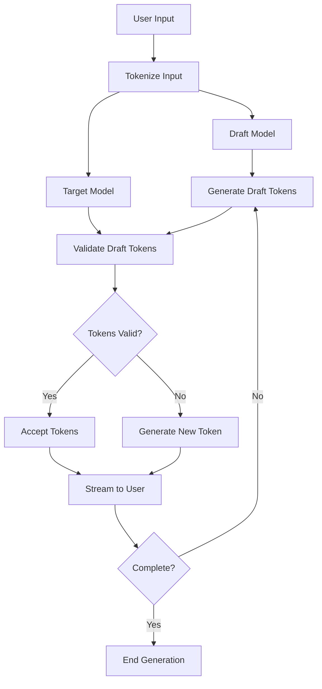

# Ticket #001: Implement Speculative Decoding

## 📋 **Overview**
Implement Speculative Decoding to significantly improve response generation speed by 2-3x while maintaining response quality. This feature will use a smaller, faster model to predict tokens while the main model validates them, dramatically reducing latency for user interactions.

## 🎯 **Business Value**
- **Performance**: 2-3x faster response generation
- **User Experience**: Reduced perceived latency, especially for long responses
- **Cost Efficiency**: Better resource utilization
- **Competitive Advantage**: Industry-leading response speeds

## 🔧 **Technical Specifications**

### **Core Requirements**
- **Draft Model**: Use a smaller, faster model (e.g., `tinyllama`, `phi-2`, or `qwen2.5-0.5b`)
- **Target Model**: Current primary model (e.g., `mistral`, `llama2`)
- **Token Prediction**: Draft model generates multiple tokens per step
- **Validation**: Target model validates and accepts/rejects draft tokens
- **Fallback**: Graceful degradation to standard generation if speculative decoding fails

### **Performance Targets**
- **Speed Improvement**: 2-3x faster than standard generation
- **Quality Maintenance**: No degradation in response quality
- **Acceptance Rate**: >70% token acceptance rate
- **Latency**: <500ms for first token, <100ms for subsequent tokens

### **Implementation Architecture**



## 🏗️ **Implementation Plan**

### **Phase 1: Core Infrastructure (Week 1)**
1. **Draft Model Integration**
   - Add draft model configuration to `config.py`
   - Implement draft model loading and initialization
   - Add draft model health checks
   - Create draft model fallback mechanisms

2. **Token Management System**
   - Implement token-level prediction and validation
   - Add token acceptance/rejection logic
   - Create token streaming interface
   - Add token-level error handling

### **Phase 2: Speculative Decoding Engine (Week 2)**
1. **Core Algorithm Implementation**
   - Implement speculative decoding algorithm
   - Add draft token generation (3-5 tokens per step)
   - Implement target model validation
   - Add acceptance rate tracking

2. **Async Integration**
   - Integrate with existing async Ollama client
   - Add concurrent draft and target model calls
   - Implement async token streaming
   - Add performance monitoring

### **Phase 3: UI Integration & Optimization (Week 3)**
1. **Streamlit Integration**
   - Add speculative decoding toggle in UI
   - Implement real-time performance metrics
   - Add draft model selection interface
   - Create performance comparison views

2. **Performance Optimization**
   - Optimize token generation pipeline
   - Add intelligent draft model selection
   - Implement adaptive acceptance thresholds
   - Add performance analytics

## 📁 **File Structure**

```
utils/
├── speculative_decoding.py      # Core speculative decoding engine
├── draft_models.py             # Draft model management
├── token_validator.py          # Token validation logic
└── performance_monitor.py      # Performance tracking

config.py                       # Add draft model configuration
app.py                          # Add UI controls
tests/
└── test_speculative_decoding.py # Comprehensive tests
```

## 🔧 **Technical Implementation Details**

### **Configuration Additions**
```python
# config.py additions
@dataclass
class SpeculativeConfig:
    enabled: bool = True
    draft_model: str = "tinyllama"
    max_draft_tokens: int = 5
    acceptance_threshold: float = 0.7
    fallback_enabled: bool = True
    performance_monitoring: bool = True
```

### **Core Classes**

#### **SpeculativeDecoder**
```python
class SpeculativeDecoder:
    def __init__(self, target_model: str, draft_model: str):
        self.target_model = target_model
        self.draft_model = draft_model
        self.performance_monitor = PerformanceMonitor()
    
    async def generate(self, prompt: str) -> AsyncGenerator[str, None]:
        """Generate response using speculative decoding"""
        # Implementation details...
    
    async def _generate_draft_tokens(self, context: str, max_tokens: int) -> List[str]:
        """Generate draft tokens using smaller model"""
        # Implementation details...
    
    async def _validate_tokens(self, context: str, draft_tokens: List[str]) -> ValidationResult:
        """Validate draft tokens using target model"""
        # Implementation details...
```

#### **PerformanceMonitor**
```python
class PerformanceMonitor:
    def __init__(self):
        self.metrics = {
            'acceptance_rate': 0.0,
            'speedup_factor': 1.0,
            'total_tokens': 0,
            'accepted_tokens': 0
        }
    
    def update_metrics(self, accepted: int, total: int, time_taken: float):
        """Update performance metrics"""
        # Implementation details...
```

## 🧪 **Testing Strategy**

### **Unit Tests**
- Draft model token generation
- Token validation logic
- Performance monitoring
- Configuration validation

### **Integration Tests**
- End-to-end speculative decoding
- Fallback mechanisms
- Async performance
- UI integration

### **Performance Tests**
- Speed comparison with standard generation
- Quality assessment
- Memory usage monitoring
- Stress testing with high load

## 📊 **Success Metrics**

### **Performance Metrics**
- **Speed Improvement**: >2x faster than standard generation
- **Acceptance Rate**: >70% token acceptance
- **Latency**: <500ms first token, <100ms subsequent
- **Memory Usage**: <20% increase over standard generation

### **Quality Metrics**
- **Response Quality**: No degradation in quality scores
- **User Satisfaction**: >4.5/5 rating for speed
- **Error Rate**: <1% speculative decoding failures
- **Fallback Success**: 100% successful fallback to standard generation

## 🚨 **Risk Mitigation**

### **Technical Risks**
- **Draft Model Quality**: Implement multiple draft model options
- **Performance Degradation**: Add comprehensive fallback mechanisms
- **Memory Usage**: Monitor and optimize memory consumption
- **Async Complexity**: Thorough testing of async interactions

### **Mitigation Strategies**
- **Gradual Rollout**: Enable for subset of users first
- **A/B Testing**: Compare performance with control group
- **Monitoring**: Real-time performance monitoring
- **Rollback Plan**: Quick disable mechanism if issues arise

## 📚 **Research & References**

### **Research Papers**
Chen, Charlie, et al. "Speculative Decoding: Accelerating LLM Inference via Speculative Sampling." *arXiv preprint arXiv:2302.01318*, 2023.

Cai, Tianle, et al. "Medusa: Simple LLM Inference Acceleration Framework with Multiple Decoding Heads." *arXiv preprint arXiv:2401.10774*, 2024.

Fu, Yichao, et al. "Lookahead Decoding: An LLM Inference Algorithm to Unify Efficiency and Quality." *arXiv preprint arXiv:2402.02030*, 2024.

### **Open Source Implementations**
vLLM Project. "vLLM: High-Performance LLM Inference and Serving." *GitHub*, 2024, https://github.com/vllm-project/vllm.

Hugging Face. "Transformers: State-of-the-art Machine Learning." *GitHub*, 2024, https://github.com/huggingface/transformers.

Ollama. "Local Large Language Model Server." *GitHub*, 2024, https://github.com/ollama/ollama.

### **Core Technologies**
Ollama. "Local Large Language Model Server." *Ollama.ai*, 2024, https://ollama.ai.

Streamlit. "Web Application Framework." *Streamlit.io*, 2024, https://streamlit.io.

LangChain. "LLM Application Framework." *LangChain.com*, 2024, https://langchain.com.

### **Development Resources**
Beazley, David M., and Brian K. Jones. *Python Cookbook*. 3rd ed., O'Reilly Media, 2013.

Martin, Robert C. *Clean Architecture: A Craftsman's Guide to Software Structure and Design*. Prentice Hall, 2017.

## 🎯 **Acceptance Criteria**

### **Functional Requirements**
- [ ] Speculative decoding works with all reasoning modes
- [ ] Draft model selection available in UI
- [ ] Performance metrics displayed in real-time
- [ ] Graceful fallback to standard generation
- [ ] No degradation in response quality

### **Performance Requirements**
- [ ] 2-3x speed improvement achieved
- [ ] >70% token acceptance rate
- [ ] <500ms first token latency
- [ ] <20% memory usage increase

### **Quality Requirements**
- [ ] All existing tests pass
- [ ] New tests achieve >90% coverage
- [ ] Documentation updated
- [ ] Performance benchmarks documented

## 📅 **Timeline**
- **Week 1**: Core infrastructure and draft model integration
- **Week 2**: Speculative decoding engine implementation
- **Week 3**: UI integration and optimization
- **Week 4**: Testing, documentation, and deployment

## 👥 **Team Requirements**
- **Backend Developer**: Core algorithm implementation
- **Frontend Developer**: UI integration
- **DevOps Engineer**: Performance monitoring setup
- **QA Engineer**: Comprehensive testing

## 💰 **Resource Requirements**
- **Additional Models**: Draft models (tinyllama, phi-2, etc.)
- **Infrastructure**: Additional compute for draft model inference
- **Monitoring**: Performance monitoring tools
- **Testing**: Load testing infrastructure

---

**Priority**: High  
**Effort**: 3-4 weeks  
**Dependencies**: None  
**Blockers**: None 
